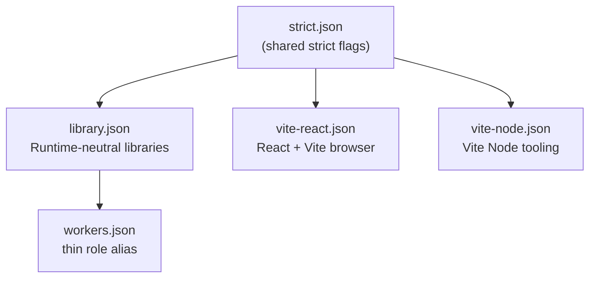

---
paths:
  - "packages/typescript-config/**"
  - "**/tsconfig*.json"
---

# TypeScript Config Presets

Shared presets live in `@repo/typescript-config`. Apps and libraries **extend** a runtime preset - never fork compiler options. The preset JSON is the source of truth for *which* options are set; read it. This file covers the parts the JSON cannot tell you: which flags change how you must write code, and why two tempting options are deliberately off.

## Preset inheritance



| Preset | For | Runtime shape |
|--------|-----|---------------|
| `strict.json` | never extended directly | shared strict core |
| `library.json` | Cross-runtime JIT libraries | `lib: es2023`, no DOM or Worker globals; `noEmit` + incremental `tsBuildInfoFile` |
| `workers.json` | Worker apps | thin role alias of `library.json` |
| `vite-react.json` | React SPAs | `lib` includes `DOM`, `types: ["vite/client"]`; `noEmit` |
| `vite-node.json` | Vite build-time config only | `types: ["node"]`, no DOM; `noEmit` |
| `tests.json` | **mixin**, appended after a runtime preset | no `lib`/`target`; tests tsbuildinfo path, `tests/` + `src/` include, exclude |

## Flags that change how you write code

`strict.json` is more than `strict: true`. These six will reject ordinary-looking code, so write to them from the start rather than fixing errors afterwards:

| Flag | What it forces |
|------|----------------|
| `exactOptionalPropertyTypes` | An optional prop may be **absent**, not explicitly `undefined`. `{ x: undefined }` is not assignable to `{ x?: string }` |
| `noUncheckedIndexedAccess` | Array and index-signature access yields `T \| undefined` - narrow before use |
| `noPropertyAccessFromIndexSignature` | Index-signature keys need **bracket** notation, not dot |
| `verbatimModuleSyntax` | Type-only imports must say `import type`, or they survive into JS |
| `erasableSyntaxOnly` | **No runtime TS constructs**: no `enum`, no namespaces, no parameter properties. This is why shared value sets are `as const` objects |
| `noImplicitOverride` | Subclass overrides must be marked `override` |

## Two deliberate omissions

- **No preset-level `types` for Workers.** Each Worker app sets `compilerOptions.types` to `["./worker-configuration.d.ts"]`, plus `"node"` when it uses `nodejs_compat`. Runtime types come from `wrangler types`, never from the shared preset. Add `@cloudflare/workers-types` only for a shared library with no `wrangler.jsonc`.
- **`isolatedDeclarations` is intentionally off.** Shared DTOs in `@repo/dtos-common` use schema-first inference (`z.infer<typeof Schema>`). Enabling it would demand a hand-written duplicate type on every exported Zod schema, contradicting [type-inference.md](../contracts/type-inference.md).

## Typecheck model (no project references)

Internal packages are **Just-in-Time**: `exports` point at source `.ts`. Typecheck is `tsc --noEmit` per package, orchestrated by Turborepo with a **transit node** so packages run in parallel while still invalidating when dependency source changes. Do **not** add TypeScript Project References, `composite`, or a root solution `tsconfig.json` - Turborepo owns the dependency graph.

React SPAs use a **split layout** (`tsconfig.json` extends `tsconfig.app.json`, plus `tsconfig.node.json` for Vite config) so browser `src/**` does not inherit Node globals from `vite.config.ts`. `check-types` runs both projects with `tsc --noEmit -p ...`.

Test suites are a **separate project** per package at `tests/tsconfig.json`, using array `extends`: the package's own base first, then `@repo/typescript-config/tests.json`. Keep that path and filename - TypeScript's editor lookup walks up for a file named exactly `tsconfig.json`, and each package's root config includes `src/**` only, so a root-level `tsconfig.test.json` would leave test files in no project (IDE breaks, `tsc -p` in CI still passes). `include` arrays replace rather than merge across `extends`, so a package adding roots (`.tsx`, `vitest.setup.ts`, `worker-configuration.d.ts`) respells the full list with `${configDir}` prefixes.

`worker-configuration.d.ts` is committed, so a fresh clone type-checks with no generate step. Re-run `pnpm types` and commit only after editing a `wrangler.jsonc`. Day-to-day CI uses `pnpm check-types`.

## Rules for editing presets

Changing a shared preset is a **monorepo-wide breaking change**.

1. **Extend, don't fork.** Always `"extends": "@repo/typescript-config/…"`. Never copy compiler options into an app.
2. **Override only what you must** - typically `compilerOptions.types` and `include`. Prefer package.json `"imports"` (`#/*`) over `compilerOptions.paths` for in-app absolute imports.
3. **Keep presets path-agnostic**: use `${configDir}`; never hardcode paths, and never add `paths` or `imports` to a shared preset.
4. **Keep runtime concerns in the runtime preset**: `jsx` and DOM `lib` belong in `vite-react.json`, never in `workers.json`.
5. **Declare `typescript` locally**: every package running `check-types` lists `"typescript": "catalog:"` in devDependencies.
6. **Verify repo-wide**: run `pnpm check-types` from the **repo root** and confirm every app still passes.

## Common mistakes

| Mistake | Correct approach |
|---------|-----------------|
| Copy-pasting `compilerOptions` from a preset into an app | Use `"extends"` and add only overrides |
| Enabling the `dom` lib in a Workers preset | Workers have no browser APIs |
| Adding `@types/node` to `workers.json` | Set per-app `types`; add `"node"` only with `nodejs_compat` |
| Putting `worker-configuration.d.ts` only in `include` | Also add it to `compilerOptions.types` |
| Setting `strict: false` to clear errors | Keep strict on; fix the types |
| Adding `paths` to a shared preset | Use package.json `"imports"` in the app; never put aliases in a shared preset |
| Adding `composite` / project `references` | Use `tsc --noEmit` + Turborepo transit; keep JIT source exports |

## In-app absolute imports

Prefer Node.js subpath imports in the **app's `package.json`** over TypeScript `compilerOptions.paths` ([Turborepo TypeScript guide](https://turborepo.dev/docs/guides/tools/typescript#use-nodejs-subpath-imports-instead-of-typescript-compiler-paths)):

```json
{
  "imports": {
    "#/*": [
      "./src/*",
      "./src/*.ts",
      "./src/*.tsx",
      "./src/*/index.ts",
      "./src/*/index.tsx"
    ]
  }
}
```

```ts
import { Button } from "#/components/ui/Button";
```

Vite resolves `package.json` `"imports"` natively - do not mirror aliases in `vite.config.ts`. Do not add `compilerOptions.paths` for the same map.

## Official documentation

- [TSConfig reference](https://www.typescriptlang.org/tsconfig)
- [Cloudflare Workers - TypeScript](https://developers.cloudflare.com/workers/languages/typescript/)
- [Vite - TypeScript](https://vitejs.dev/guide/features#typescript)
- [Turborepo TypeScript guide](https://turborepo.dev/docs/guides/tools/typescript)
