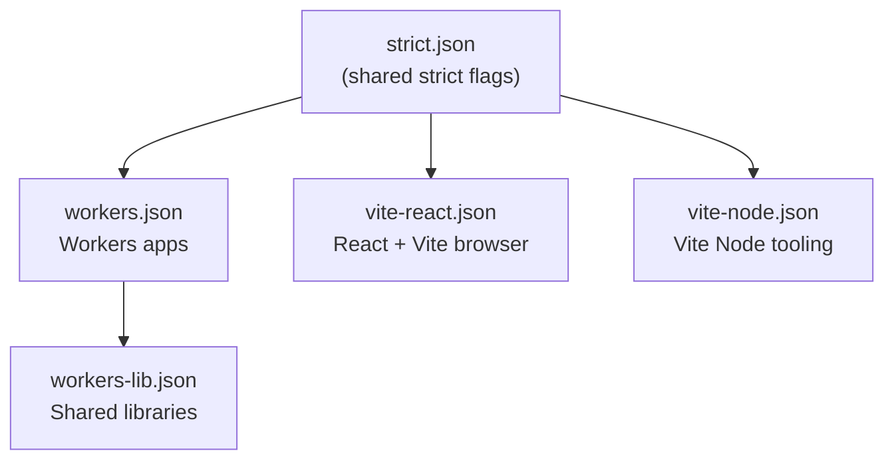

---
paths:
  - "packages/typescript-config/**"
  - "**/tsconfig*.json"
---

# TypeScript Config Presets

Shared presets live in `@repo/typescript-config`. Apps and libraries **extend** a runtime preset - never fork compiler options. The preset JSON is the source of truth for *which* options are set; read it. This file covers the parts the JSON cannot tell you: which flags change how you must write code, and why two tempting options are deliberately off.

## Preset inheritance



| Preset | For | Runtime shape |
|--------|-----|---------------|
| `strict.json` | never extended directly | shared strict core |
| `workers.json` | Worker apps | `lib: es2023`, **no DOM** |
| `workers-lib.json` | shared libs consumed by Workers | adds `declarationMap` + out-of-tree `tsBuildInfoFile` |
| `vite-react.json` | React SPAs | `lib` includes `DOM`, `types: ["vite/client"]` |
| `vite-node.json` | Vite build-time config only | `types: ["node"]`, no DOM |

## Flags that change how you write code

`strict.json` is more than `strict: true`. These six will reject ordinary-looking code, so write to them from the start rather than fixing errors afterwards:

| Flag | What it forces |
|------|----------------|
| `exactOptionalPropertyTypes` | An optional prop may be **absent**, not explicitly `undefined`. `{ x: undefined }` is not assignable to `{ x?: string }` |
| `noUncheckedIndexedAccess` | Array and index-signature access yields `T \| undefined` - narrow before use |
| `noPropertyAccessFromIndexSignature` | Index-signature keys need **bracket** notation, not dot |
| `verbatimModuleSyntax` | Type-only imports must say `import type`, or they survive into JS |
| `erasableSyntaxOnly` | **No runtime TS constructs**: no `enum`, no namespaces, no parameter properties. This is why shared value sets are `as const` objects |
| `noImplicitOverride` | Subclass overrides must be marked `override` |

## Two deliberate omissions

- **No preset-level `types` for Workers.** Each Worker app sets `compilerOptions.types` to `["./worker-configuration.d.ts"]`, plus `"node"` when it uses `nodejs_compat`. Runtime types come from `wrangler types`, never from the shared preset. Add `@cloudflare/workers-types` only for a shared library with no `wrangler.jsonc`.
- **`isolatedDeclarations` is intentionally off.** Shared DTOs in `@repo/dtos-common` use schema-first inference (`z.infer<typeof Schema>`). Enabling it would demand a hand-written duplicate type on every exported Zod schema, contradicting [type-inference.md](../contracts/type-inference.md).

React SPAs use a **split layout** (`tsconfig.json` + `tsconfig.app.json` + `tsconfig.node.json`) so browser `src/**` does not inherit Node globals from `vite.config.ts`.

## Root solution tsconfig

The repo root [`tsconfig.json`](../../../tsconfig.json) is a **solution config** with `references` to all packages, for IDE navigation and `pnpm check-types:solution` (`tsc -b`). Each referenced package sets `composite: true` via its preset and declares `references` to its workspace dependencies:

```
enums-common (leaf)  ←  dtos-common  ←  worker-api, front-app/tsconfig.app.json
```

`worker-configuration.d.ts` is committed, so this works on a fresh clone with no generate step. Re-run `make types` and commit only after editing a `wrangler.jsonc`. Day-to-day CI uses `make check-types`.

## Rules for editing presets

Changing a shared preset is a **monorepo-wide breaking change**.

1. **Extend, don't fork.** Always `"extends": "@repo/typescript-config/…"`. Never copy compiler options into an app.
2. **Override only what you must** - typically `compilerOptions.types`, `compilerOptions.paths`, and `include`.
3. **Keep presets path-agnostic**: use `${configDir}`; never hardcode paths, and never add `paths` to a shared preset.
4. **Keep runtime concerns in the runtime preset**: `jsx` and DOM `lib` belong in `vite-react.json`, never in `workers.json`.
5. **Declare `typescript` locally**: every package running `check-types` lists `"typescript": "catalog:"` in devDependencies.
6. **Verify repo-wide**: run `make check-types` from the **repo root** and confirm every app still passes.

## Common mistakes

| Mistake | Correct approach |
|---------|-----------------|
| Copy-pasting `compilerOptions` from a preset into an app | Use `"extends"` and add only overrides |
| Enabling the `dom` lib in a Workers preset | Workers have no browser APIs |
| Adding `@types/node` to `workers.json` | Set per-app `types`; add `"node"` only with `nodejs_compat` |
| Putting `worker-configuration.d.ts` only in `include` | Also add it to `compilerOptions.types` |
| Setting `strict: false` to clear errors | Keep strict on; fix the types |
| Adding `paths` to a shared preset | Add them in the app's own tsconfig |

## Path aliases

Configure `@/*` → `src/*` in the **app's own `tsconfig.json`**. TypeScript 5.0+ resolves `paths` relative to the tsconfig file, so `baseUrl` is optional:

```jsonc
{
  "extends": "@repo/typescript-config/vite-react.json",
  "compilerOptions": {
    "paths": { "@/*": ["./src/*"] }
  }
}
```

Mirror the alias in `vite.config.ts` so Vite resolves it at build time (see [vite-config.md](../frontend/vite-config.md)).

## Official documentation

- [TSConfig reference](https://www.typescriptlang.org/tsconfig)
- [Cloudflare Workers - TypeScript](https://developers.cloudflare.com/workers/languages/typescript/)
- [Vite - TypeScript](https://vitejs.dev/guide/features#typescript)
