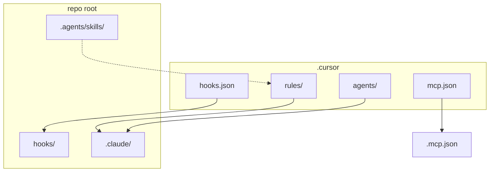

# Cursor project setup

Cursor-specific agent configuration. Shared hook **scripts** live in [`hooks/`](../hooks/) at the repo root.

## Layout

| Path | Purpose |
|------|---------|
| [`rules/`](rules/) | Recursive category tree of project rules (`.mdc`) - parallel to [`.claude/rules/`](../.claude/rules/) |
| [`hooks.json`](hooks.json) | Agent hook wiring → scripts under [`hooks/`](../hooks/) |
| [`agents/`](agents/) | Custom subagents (`ci-verifier`, `docs-researcher`, `test-runner`) |
| [`mcp.json`](mcp.json) | Project MCP servers (aligned with root [`.mcp.json`](../.mcp.json)) |

There is **no** `commands/` folder in this repo; invoke review workflows via skills under [`.agents/skills/review*`](../.agents/skills/).

## Global instructions

Cursor loads root and nested `AGENTS.md` files by directory. Rules under `rules/**` apply via `globs` or `alwaysApply` frontmatter. Hook authoring: [`hooks/AGENTS.md`](../hooks/AGENTS.md).

## Sync policy

When changing rules or subagents, keep Claude Code and Cursor in sync:

- `.cursor/rules/**/*.mdc` ↔ `.claude/rules/**/*.md` (same category and basename)
- `.cursor/agents/*.md` ↔ `.claude/agents/*.md`
- Hook scripts: edit only [`hooks/`](../hooks/) (see [`hooks/README.md`](../hooks/README.md))
- Skills: source of truth under [`.agents/skills/`](../.agents/skills/); `.claude/skills/<name>` are symlinks
- MCP: keep [`.cursor/mcp.json`](mcp.json) and [`.mcp.json`](../.mcp.json) server lists aligned

Full inventory: skill `monorepo-agent-setup`. Claude mirror: [`.claude/README.md`](../.claude/README.md).

## Hooks

Wiring in [`hooks.json`](hooks.json): `beforeShellExecution` (git guards, `failClosed`), `afterFileEdit` (format/lint), `sessionStart` (logging). Scripts: [`hooks/git/`](../hooks/git/), [`hooks/quality/`](../hooks/quality/), [`hooks/logging/`](../hooks/logging/). Debug: `hooks/logs/`.

## MCP

Project MCP is documentation-only: **cloudflare-docs** and **context7** (see [`mcp.json`](mcp.json)).

**Cloudflare login popups** usually come from the Cursor **Cloudflare marketplace plugin**, which registers account-scoped MCPs (bindings, builds, observability OAuth). For day-to-day work in this repo, keep that plugin disabled or turn off its account MCPs; rely on project `cloudflare-docs` only. Do not register Context7 twice (plugin + project).

## Related

- [`hooks/`](../hooks/)
- [`.agents/`](../.agents/)
- [`.claude/`](../.claude/)
