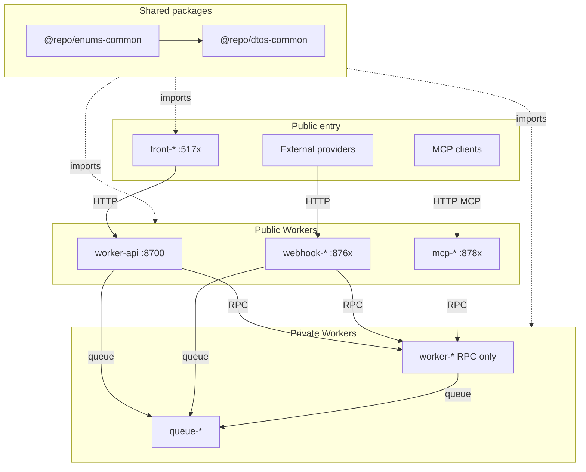

# Monorepo Agent Instructions

## Project Overview

A minimal, production-oriented monorepo starter built on **pnpm workspaces** with **Turborepo**, **Cloudflare Workers**, **Hono**, and a **React (Vite) frontend** styled with **Tailwind CSS v4**. `front-app` talks to `worker-api` over **HTTP**; service bindings are the preferred pattern for Worker-to-Worker communication when you add more Workers.

## Quick Start

```bash
make install    # dependencies + workspace links
make login      # Cloudflare (remote Worker features)
make prepare    # Husky pre-commit hooks
make dev        # all dev servers
```

After scaffolding a new worker under `apps/`, run `make install` before turbo commands.

## Architecture



| Package | Purpose |
|---------|---------|
| `@repo/dtos-common` | Shared Zod schemas - `src/api/*` (HTTP), `src/rpc/*`, `src/queue/*`, `src/webhook/*` |
| `@repo/enums-common` | Shared constrained string values (`as const` objects) across apps/packages |
| `@repo/typescript-config` | TypeScript presets for Workers and Vite React |

## Worker Prefixes

| Prefix | Example | Role | Production surface |
|--------|---------|------|--------------------|
| `worker-api` | `worker-api` | HTTP gateway (sticky name) | Public HTTP only |
| `worker-` | `worker-account` | Business logic | **RPC only** via service bindings |
| `queue-` | `queue-email` | Queue-only consumer | `queue()` handler; no public HTTP |
| `webhook-` | `webhook-example` | External webhook ingress | Public HTTP for provider callbacks |
| `mcp-` | `mcp-tools` | MCP server | Public HTTP MCP (SSE / streamable HTTP); tools call `worker-*` via RPC |
| `front-` | `front-app` | React SPA | Vite → gateway over HTTP only |

If a Worker is both RPC and a queue consumer, keep prefix **`worker-*`** (business range) and use the dual-handler layout. Use **`queue-*`** only for queue-only consumers.

## Where to Put Things

| Task | Location |
|------|---------|
| New API endpoint route | `apps/worker-api/src/routes/<feature>.ts` → mount in `src/index.ts` |
| Request/response Zod schemas (HTTP) | `packages/dtos-common/src/api/<feature>.ts` |
| Service-binding RPC schemas | `packages/dtos-common/src/rpc/<feature>.ts` |
| Queue message schemas | `packages/dtos-common/src/queue/<feature>.ts` |
| Webhook payload schemas | `packages/dtos-common/src/webhook/<feature>.ts` |
| Shared constrained value set | `packages/enums-common/src/index.ts` |
| Worker-local value set | `apps/<worker>/src/enums/` |
| DB schema / migrations / query helpers | `apps/<owner>/src/db/` (one owning Worker; never `packages/db-*`; no shared DB bindings) |
| Frontend API service | `apps/front-app/src/services/worker-api/<feature>.ts` |
| Frontend page | `apps/front-app/src/pages/` + `src/routes/` (TanStack file routes) |
| Reusable UI / hooks | `apps/front-app/src/components/ui/`, `src/hooks/` |
| Worker bindings / config | `apps/<worker>/wrangler.jsonc` |
| Local dev secrets | `apps/<worker>/.dev.vars` (from `.dev.vars.example`) |

Queue-only apps (`queue-*`) and dual-handler `worker-*` use: `handlers/request.ts`, `handlers/message.ts`, shared `services/`, minimal `index.ts`.

## Environment

Copy `.dev.vars.example` → `.dev.vars` per app before local runs. Secrets and wrangler vars: path-scoped rule `backend/workers-config`. Local ports when scaffolding: `backend/ports` (human tables in [README.md](README.md)).

## Make Commands (root)

| Command | Description |
|---------|-------------|
| `make install` | Install and link workspace packages |
| `make dev` | Start all dev servers |
| `make ci` | Lint + format + check-types (run before PRs) |
| `make check-types` | TypeScript across all packages |
| `make types` | Generate `worker-configuration.d.ts` in apps |
| `make build` / `make deploy` | Build or deploy via Turborepo |

### Scoping (pnpm / Turborepo)

Pass optional variables to any turbo-backed root target:

| Variable | Effect | Example |
|----------|--------|---------|
| `SCOPE` | `--filter=<package>` | `make dev SCOPE=worker-api` |
| `FILTER` | Raw turbo filter expression | `make build FILTER=...front-app...` |
| `AFFECTED` | `--affected` (changed packages vs base) | `make ci AFFECTED=1` |

## Agent tooling

Cursor / Claude dual-tree layout, sync policy, hooks, skills, and slash commands: skill `monorepo-agent-setup`. Quick Cursor index: [`.cursor/README.md`](.cursor/README.md).

## Agent Guides

| Focus | Guide | Claude entry |
|-------|-------|--------------|
| pnpm workspaces | [.agents/skills/pnpm/SKILL.md](.agents/skills/pnpm/SKILL.md) | [.claude/skills/pnpm/SKILL.md](.claude/skills/pnpm/SKILL.md) |
| React SPA | [apps/front-app/AGENTS.md](apps/front-app/AGENTS.md) | [apps/front-app/CLAUDE.md](apps/front-app/CLAUDE.md) |
| HTTP gateway | [apps/worker-api/AGENTS.md](apps/worker-api/AGENTS.md) | [apps/worker-api/CLAUDE.md](apps/worker-api/CLAUDE.md) |
| Zod DTOs | [packages/dtos-common/AGENTS.md](packages/dtos-common/AGENTS.md) | [packages/dtos-common/CLAUDE.md](packages/dtos-common/CLAUDE.md) |
| Shared value sets | [packages/enums-common/AGENTS.md](packages/enums-common/AGENTS.md) | [packages/enums-common/CLAUDE.md](packages/enums-common/CLAUDE.md) |
| TS presets | [packages/typescript-config/AGENTS.md](packages/typescript-config/AGENTS.md) | [packages/typescript-config/CLAUDE.md](packages/typescript-config/CLAUDE.md) |
| Agent hooks | [hooks/AGENTS.md](hooks/AGENTS.md) | [hooks/CLAUDE.md](hooks/CLAUDE.md) |

Extend this table when adding a new app or package with its own guide.

## Decision Checklist

1. Worker-to-Worker call? **Service binding RPC**, not HTTP (no extra request fee on Workers Standard).
2. DB access? Schema + binding in **one** owning `worker-*` / `queue-*` under `src/db/` — never `packages/db-*`, never the same DB binding on multiple apps. Other apps use **service-binding RPC** (or a queue).
3. Public HTTP only for gateway, webhooks, MCP, and frontends - not for business RPC or queue-only workers.

Shared DTO/enum ownership, naming, and code style are path-scoped under `.cursor/rules/` / `.claude/rules/` (`contracts`, `quality`).

## Contribution

- Run `make ci` before opening a PR.
- Update the relevant `AGENTS.md` when adding endpoints, bindings, env vars, or conventions.
- HTTP contracts live in `@repo/dtos-common`; update `worker-api` and `front-app` together.
