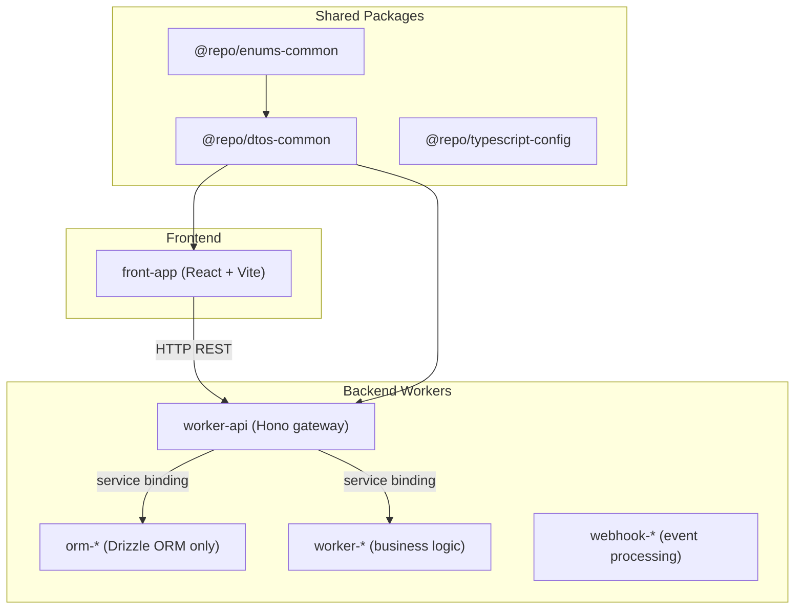

# Monorepo Agent Instructions

## Project Overview

A minimal, production-oriented monorepo starter built on **pnpm workspaces** with **Turborepo**, **Cloudflare Workers**, **Hono**, and a **React (Vite) frontend** styled with **Tailwind CSS v4**. `front-app` talks to `worker-api` over **HTTP**; service bindings are the preferred pattern for Worker-to-Worker communication when you add more Workers.

## Quick Start

```bash
make install    # dependencies + workspace links
make login      # Cloudflare (remote Worker features)
make prepare    # Husky pre-commit hooks
make dev        # all dev servers
```

Verify: `GET http://localhost:8725/api/v1/health` and `http://localhost:5174`.

After scaffolding a new worker under `apps/`, run `make install` before turbo commands.

Cursor Cloud Agents use [`.cursor/environment.json`](.cursor/environment.json): the idempotent update command installs the frozen lockfile, and ports 5174/8725 are exposed. Store credentials in Cursor Secrets, never in that file.

## Architecture



| Package | Purpose |
|---------|---------|
| `@repo/dtos-common` | Shared Zod schemas - `src/api/*` (HTTP), `src/rpc/*`, `src/queue/*`, `src/webhook/*` |
| `@repo/enums-common` | Shared constrained string values (`as const` objects) across apps/packages |
| `@repo/typescript-config` | TypeScript presets for Workers and Vite React |

## Worker Prefixes

| Prefix | Example | Role |
|--------|---------|------|
| `orm-` | `orm-account` | Drizzle schema + migrations only |
| `worker-` | `worker-crawling` | Business logic; calls ORM via bindings |
| `webhook-` | `webhook-clerk` | External webhook processing |
| `front-` | `front-app` | React SPA; HTTP to backend only |

## Where to Put Things

| Task | Location |
|------|---------|
| New API endpoint route | `apps/worker-api/src/routes/<feature>.ts` → mount in `src/index.ts` |
| Request/response Zod schemas (HTTP) | `packages/dtos-common/src/api/<feature>.ts` |
| Service-binding RPC schemas | `packages/dtos-common/src/rpc/<feature>.ts` |
| Queue message schemas | `packages/dtos-common/src/queue/<feature>.ts` |
| Webhook payload schemas | `packages/dtos-common/src/webhook/<feature>.ts` |
| Shared constrained value set | `packages/enums-common/src/index.ts` |
| Worker-local value set | `apps/<worker>/src/enums/` |
| Frontend API service | `apps/front-app/src/services/worker-api/<feature>.ts` |
| Frontend page | `apps/front-app/src/pages/` + `src/routes/` (TanStack file routes) |
| Reusable UI / hooks | `apps/front-app/src/components/ui/`, `src/hooks/` |
| Worker bindings / config | `apps/<worker>/wrangler.jsonc` |
| Local dev secrets | `apps/<worker>/.dev.vars` (from `.dev.vars.example`) |

Queue-consuming workers use a dual-handler layout: `handlers/request.ts`, `handlers/message.ts`, shared `services/`, minimal `index.ts`.

## Port Allocation

| Service | Dev port | Config |
|---------|----------|--------|
| `worker-api` | **8725** | `apps/worker-api/wrangler.jsonc` |
| `front-app` | **5174** | Vite / `package.json` |

Reserved ranges: ORM 8700–8710, app workers 8720–8729, webhooks 8760–8769, frontends 5170–5179.

## Environment

Copy `.dev.vars.example` → `.dev.vars` per app before local runs. Never commit `.dev.vars` or real secrets - update `.dev.vars.example` when adding keys.

## Service Bindings

Worker-to-Worker calls use bindings in `wrangler.jsonc` (`services` array) and `env.BINDING` - zero latency, no public URL. **Do not** use bindings from `front-app`.

## Wrangler environments

| Environment | Deploy | Config block |
|-------------|--------|--------------|
| Local dev | `wrangler dev` | Root-level `vars`, `dev` |
| Staging | `wrangler deploy --env staging` | `env.staging` |
| Production | `wrangler deploy --env production` | `env.production` |

After any `wrangler.jsonc` edit: `make types` then `make check-types`.

## Contract Change Workflow

1. Edit schemas in `packages/dtos-common/src/<layer>/` (`api`, `rpc`, `queue`, or `webhook`).
2. Update `worker-api` route validation.
3. Update `front-app` parsing / forms.
4. Run `make check-types`.

Prefer **additive** changes. For breaking changes, version the route (e.g. `/api/v2/`) and migrate deliberately.

## Code Quality

Lint and format: `.oxlintrc.json` and `.oxfmtrc.json` at repo root (`make ci`). File-specific guidance lives in mirrored rule trees: [`.claude/rules/`](.claude/rules/) and [`.cursor/rules/`](.cursor/rules/). Unconditional guardrails: [`.claude/rules/core/guardrails.md`](.claude/rules/core/guardrails.md) and [`.cursor/rules/core/guardrails.mdc`](.cursor/rules/core/guardrails.mdc).

TypeScript presets: see [packages/typescript-config/AGENTS.md](packages/typescript-config/AGENTS.md) - apps **extend** a preset; do not fork compiler options.

## Make Commands (root)

| Command | Description |
|---------|-------------|
| `make install` | Install and link workspace packages |
| `make dev` | Start all dev servers |
| `make ci` | Lint + format + check-types (run before PRs) |
| `make check-types` | TypeScript across all packages |
| `make types` | Generate `worker-configuration.d.ts` in apps |
| `make build` / `make deploy` | Build or deploy via Turborepo |
| `make format` / `make lint` | Fix formatting / lint issues |
| `make ai-config-check` | Validate Cursor/Claude parity and hook behavior |

### Scoping (pnpm / Turborepo)

Pass optional variables to any turbo-backed root target:

| Variable | Effect | Example |
|----------|--------|---------|
| `SCOPE` | `--filter=<package>` | `make dev SCOPE=worker-api` |
| `FILTER` | Raw turbo filter expression | `make build FILTER=...front-app...` |
| `AFFECTED` | `--affected` (changed packages vs base) | `make ci AFFECTED=1` |

CI uses `make ci AFFECTED=1` and `make build AFFECTED=1`.

### Per-package commands

Each app/package has a minimal `Makefile` that includes [`make/app.mk`](make/app.mk) - targets are auto-scoped to that workspace package (resolved from `package.json` `name`):

```bash
cd apps/worker-api && make dev    # turbo run dev --filter=worker-api
cd packages/dtos-common && make ci  # turbo run lint format check-types --filter=@repo/dtos-common
```

Per-app command tables: see each app's `AGENTS.md`.

## Memory Layout (Claude Code + Cursor)

| Layer | Claude Code | Cursor |
|-------|-------------|--------|
| Global instructions | [CLAUDE.md](CLAUDE.md) (imports this file) | [AGENTS.md](AGENTS.md) (workspace rules) |
| Path-scoped rules | [`.claude/rules/`](.claude/rules/) (`*.md`) | [`.cursor/rules/`](.cursor/rules/) (`*.mdc`) |
| Hooks | [`.claude/settings.json`](.claude/settings.json) | [`.cursor/hooks.json`](.cursor/hooks.json) |
| Hook scripts (shared) | [`hooks/`](hooks/) | [`hooks/`](hooks/) |
| Subagents | [`.claude/agents/`](.claude/agents/) | [`.cursor/agents/`](.cursor/agents/) |
| Slash commands | - | [`.cursor/commands/`](.cursor/commands/) |
| Deep skills | [`.claude/skills/`](.claude/skills/) | [`.agents/skills/`](.agents/skills/) |
| Nested app guides | `CLAUDE.md` per app/package | `AGENTS.md` per app/package |

- Claude Code: nested `CLAUDE.md` in apps/packages load on demand; debug instruction loading with `tail -f hooks/logs/instructions-loaded.log`.
- Cursor: root and nested `AGENTS.md` files apply by directory; path-scoped `.mdc` rules attach by glob. Debug hook activity in **Customize → Hooks**.
- Both rule engines recurse through category subfolders (`core`, `frontend`, `backend`, `contracts`, `quality`). Folder names organize rules but do not scope them; Cursor uses `globs` / `alwaysApply`, while Claude Code uses `paths` / no `paths`.
- **Keeping Claude + Cursor in sync:** when you edit a path-scoped rule or subagent, update the same relative file in the other tree (`.claude/rules/**/*.md` ↔ `.cursor/rules/**/*.mdc`, `.claude/agents/*.md` ↔ `.cursor/agents/*.md`). Hook scripts are canonical in [`hooks/`](hooks/); both tools reference that directory via their config files.
- **Vite 8 config:** [`.claude/rules/frontend/vite-config.md`](.claude/rules/frontend/vite-config.md) ↔ [`.cursor/rules/frontend/vite-config.mdc`](.cursor/rules/frontend/vite-config.mdc) - scoped to `apps/front-*/vite.config.ts` only.

See [`.cursor/README.md`](.cursor/README.md) for a quick index of the Cursor setup.

## Agent Guides

| Focus | Guide | Claude entry |
|-------|-------|--------------|
| pnpm workspaces | [.agents/skills/pnpm/SKILL.md](.agents/skills/pnpm/SKILL.md) | [.claude/skills/pnpm/SKILL.md](.claude/skills/pnpm/SKILL.md) |
| React SPA | [apps/front-app/AGENTS.md](apps/front-app/AGENTS.md) | [apps/front-app/CLAUDE.md](apps/front-app/CLAUDE.md) |
| HTTP gateway | [apps/worker-api/AGENTS.md](apps/worker-api/AGENTS.md) | [apps/worker-api/CLAUDE.md](apps/worker-api/CLAUDE.md) |
| Zod DTOs | [packages/dtos-common/AGENTS.md](packages/dtos-common/AGENTS.md) | [packages/dtos-common/CLAUDE.md](packages/dtos-common/CLAUDE.md) |
| Shared value sets | [packages/enums-common/AGENTS.md](packages/enums-common/AGENTS.md) | [packages/enums-common/CLAUDE.md](packages/enums-common/CLAUDE.md) |
| TS presets | [packages/typescript-config/AGENTS.md](packages/typescript-config/AGENTS.md) | [packages/typescript-config/CLAUDE.md](packages/typescript-config/CLAUDE.md) |
| Agent hooks | [hooks/AGENTS.md](hooks/AGENTS.md) | [hooks/CLAUDE.md](hooks/CLAUDE.md) |

Extend this table when adding a new app or package with its own guide.

## Decision Checklist

1. Schema already in `@repo/dtos-common`? Import it - don't redefine.
2. Constrained value already in `@repo/enums-common`? Import it - don't duplicate literals.
3. Worker-to-Worker call? Service binding, not HTTP.
4. Filename follows kebab-case? (PascalCase only for React `.tsx` components in `front-app`.)
5. Worker function under 100 lines? Extract helpers if not.
6. All imports used? oxlint errors on unused vars.

## Contribution

- Run `make ci` before opening a PR.
- Update the relevant `AGENTS.md` when adding endpoints, bindings, env vars, or conventions.
- HTTP contracts live in `@repo/dtos-common`; update `worker-api` and `front-app` together.
- Never commit secrets or real environment values.
