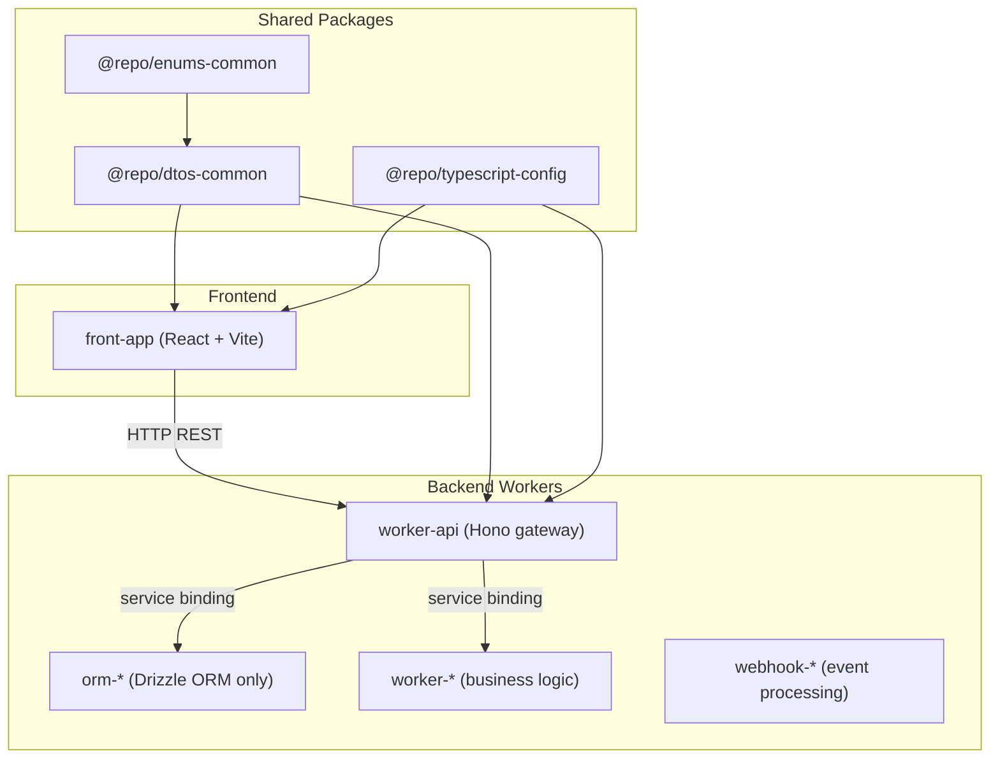
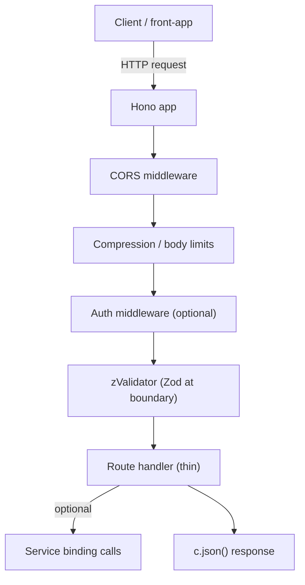
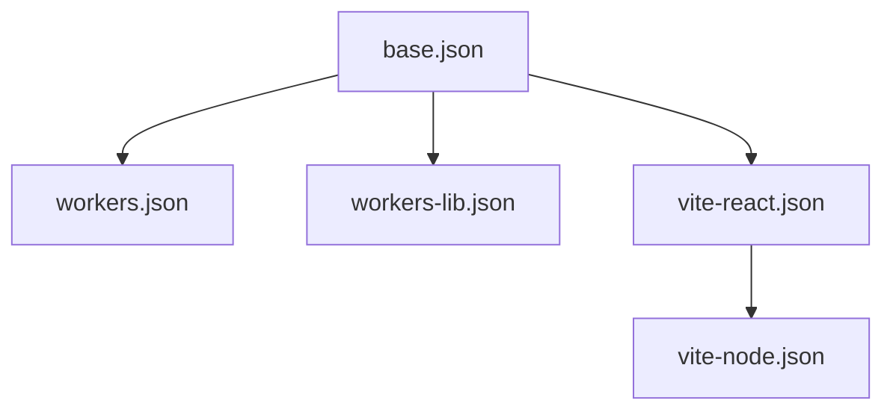
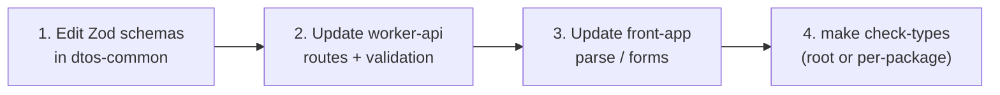

# Monorepo Agent Instructions

## Project Overview

A minimal, production-oriented monorepo starter built on **pnpm workspaces** with **Turborepo**, **Cloudflare Workers**, **Hono**, and a **React (Vite) frontend** styled with **Tailwind CSS v4**. `front-app` talks to `worker-api` over **HTTP**; service bindings are the preferred pattern for Worker-to-Worker communication when you add more Workers.

## Monorepo Architecture

### Structure Overview

```
monorepo/
├── apps/                    # Individual Cloudflare Workers and Applications
│   ├── worker-api/          # REST API gateway (Hono, port 8725)
│   └── front-app/           # React SPA deployed on Cloudflare Workers (port 5174)
├── packages/                # Shared packages
│   ├── dtos-common/         # Shared DTOs and Zod validation schemas
│   ├── enums-common/        # Shared enumerations and constants
│   └── typescript-config/   # Shared TypeScript configuration presets
├── make/                    # Makefile includes
├── biome.json               # Monorepo-wide formatter and linter config
├── package.json             # Root package configuration
├── pnpm-workspace.yaml      # Workspace configuration
├── turbo.json               # Turborepo pipeline configuration
└── tsconfig.json            # Root TypeScript configuration
```

### Architecture Components



### Workspace Dependencies

The monorepo uses `@repo/*` packages for shared functionality:

| Package | Purpose |
|---------|---------|
| `@repo/dtos-common` | Shared DTOs and Zod validation schemas; HTTP API schemas under `src/api/*` |
| `@repo/enums-common` | Shared enumerations and constants used across apps/packages |
| `@repo/typescript-config` | TypeScript configuration presets shared across the workspace |

## Quick Start & Verification

### Initial Setup

```bash
git clone <repository-url>
cd monorepo

make install          # Install all dependencies and link workspace packages
make login            # Login to Cloudflare (required for remote Worker features)
make prepare          # Install Husky pre-commit hooks
```

### First-Run Verification

1. Start all dev servers:
   ```bash
   make dev
   ```
2. Verify the API is running:
   ```
   GET http://localhost:8725/api/v1/health
   ```
3. Open the frontend:
   ```
   http://localhost:5174
   ```

### Adding a New Worker

```bash
# After scaffolding a new worker under apps/
make install          # Re-link workspace packages before running turbo commands
```

## Naming Conventions

### Code Naming Standards

| Kind | Convention | Examples |
|------|-----------|---------|
| Variables | `camelCase` | `userName`, `accountId`, `hostnameList` |
| Functions | `camelCase` | `getAccount()`, `processRequest()`, `validateHostname()` |
| Constants | `CONSTANT_CASE` | `MAX_RETRIES`, `DEFAULT_TIMEOUT`, `API_BASE_URL` |
| React components | `PascalCase` | `UserCard`, `HealthStatus`, `ApiProvider` |
| TypeScript types / interfaces | `PascalCase` | `UserConfig`, `ApiResponse` |
| Enum names | `PascalCase` | `ContentEncoding`, `SitemapType`, `ProcessingStatus` |
| Enum members | `CONSTANT_CASE` | `ContentEncoding.GZIP`, `ProcessingStatus.COMPLETED` |

### File Naming Standards (enforced by Biome)

| Location | Rule | Examples |
|----------|------|---------|
| All Workers, packages, `src/**/*.ts` | `kebab-case` | `health-check.ts`, `request-handler.ts` |
| `front-app/src/**/*.tsx` | `PascalCase` or `kebab-case` | `UserCard.tsx`, `api-provider.tsx` |
| `front-app/src/**/*.ts` | `kebab-case` | `fetch-api.ts`, `env.ts` |

> Biome enforces these rules as errors via `useFilenamingConvention`. Files that violate will fail CI.

### Database Naming

| Kind | Convention | Examples |
|------|-----------|---------|
| Tables | `snake_case`, **plural** | `accounts`, `hostnames`, `schema_main_types` |
| Columns | `snake_case`, **singular** | `id`, `account_id`, `created_at` |
| Foreign keys | `snake_case`, `{table_singular}_id` | `account_id`, `hostname_id` |

```typescript
// ✅ Correct
const accountsTable = pgTable("accounts", {
  id: text("id").primaryKey(),
  account_id: text("account_id").notNull(),
  created_at: timestamp("created_at").defaultNow(),
});

// ❌ Incorrect - table should be plural, column should be singular
const accountTable = pgTable("account", {
  hostname_ids: serial("hostname_ids"),
});
```

### Enum Naming

```typescript
// ✅ Correct - PascalCase name, CONSTANT_CASE members
export enum ContentEncoding {
  GZIP = "gzip",
  BROTLI = "br",
  DEFLATE = "deflate",
}

// ❌ Incorrect
export enum contentEncoding { gzip = "gzip" }
```

## Worker Prefixes

| Purpose | Prefix | Example | Description |
|---------|--------|---------|-------------|
| ORM Services | `orm-` | `orm-account` | Database schema and migrations ONLY — no business logic |
| Business Logic | `worker-` | `worker-crawling` | Business logic; calls ORM workers via service bindings |
| Webhook Services | `webhook-` | `webhook-clerk` | Webhook event processing from external services |
| Frontend Applications | `front-` | `front-app` | React SPA deployed on Cloudflare Workers |

### Key Distinctions

- **`orm-*`**: Drizzle ORM schemas and migrations only. No business logic, no HTTP routing.
- **`worker-*`**: Implement business logic; call `orm-*` workers via service bindings for data.
- **`webhook-*`**: Handle external webhook events; do not expose general REST APIs.
- **`front-*`**: React + Vite applications. Communicate with backend over HTTP, never via service bindings.

## DTO Naming Conventions

All Zod schemas and inferred types in DTO files must follow strict naming conventions.

### Zod Schema Naming

All Zod schemas **MUST** be suffixed with:
- `Schema` — general data structures (e.g. `ExampleSchema`)
- `RequestSchema` — request validation (e.g. `ExampleRequestSchema`)
- `ResponseSchema` — response validation (e.g. `ExampleResponseSchema`)

### Inferred Type Naming

Inferred types **MUST**:
- Use the same name as the schema **without** the `Schema` suffix
- **Never** use a `Type` suffix (`ExampleRequestType` is forbidden)
- Be declared via `z.infer<typeof ...Schema>` grouped **at the end of the file**, not interleaved with schema definitions

```typescript
// ✅ Correct — schemas first, then all inferred types at the bottom
export const ExampleRequestSchema = z.object({ ... });
export const ExampleResponseSchema = z.object({ ... });
export const ExampleSchema = z.object({ ... });

export type ExampleRequest = z.infer<typeof ExampleRequestSchema>;
export type ExampleResponse = z.infer<typeof ExampleResponseSchema>;
export type Example = z.infer<typeof ExampleSchema>;

// ❌ Incorrect
export const ExampleRequest = z.object({ ... });       // missing Schema suffix
export type ExampleRequestType = z.infer<typeof ...>;  // forbidden Type suffix
export type ExampleReq = z.infer<typeof ...>;          // name doesn't match schema
```

This naming convention:
1. **Prevents naming conflicts** - Schemas and types can coexist with clear distinction
2. **Improves code clarity** - Developers can immediately identify schemas vs types
3. **Enables better IDE support** - Clear separation between validation (schema) and usage (type)
4. **Maintains consistency** - All DTOs follow the same pattern across the codebase

### Where to Place Things

| Task | Location |
|------|---------|
| New API endpoint route | `apps/worker-api/src/routes/<feature>.ts` |
| Request/response Zod schemas | `packages/dtos-common/src/api/<feature>.ts` |
| Shared enum values | `packages/enums-common/src/index.ts` |
| Worker-specific enums/constants | `apps/<worker>/src/enums/` |
| Shared TypeScript error classes | `packages/errors-common/` *(when created)* |
| Worker-specific error classes | `apps/<worker>/src/errors/` |
| Frontend API service calls | `apps/front-app/src/services/workerApi/<feature>.ts` |
| Frontend route-level pages | `apps/front-app/src/routes/` (lazy-loaded from `App.tsx`) |
| Reusable UI primitives | `apps/front-app/src/components/ui/` |
| Reusable React hooks | `apps/front-app/src/hooks/` |
| Worker config / bindings | `apps/<worker>/wrangler.jsonc` |
| Local dev environment variables | `apps/<worker>/.dev.vars` (copy from `.dev.vars.example`) |

### Handler Decomposition Pattern

Workers that implement queue consumption follow a dual-handler architecture:

```
src/
├── handlers/
│   ├── request.ts    # HTTP request processing (dev/testing)
│   └── message.ts    # Queue message consumption (production)
├── services/         # Shared business logic
└── index.ts          # Minimal delegation entry point
```

Benefits:
- **Separation of Concerns**: each handler focuses on a single request type
- **Testability**: handlers can be unit tested independently
- **Reusability**: shared services eliminate duplication
- **Maintainability**: business logic centralized in services

### Request Lifecycle (worker-api)



## Biome Formatting and Linting Rules

These are the **exact rules enforced by `biome.json`** at the root. All generated code must comply or it will fail `make ci`.

### Linter Rules (enforced as errors unless noted)

| Rule | Level | Requirement |
|------|-------|-------------|
| `useFilenamingConvention` | error | Files must follow the naming table above |
| `useBlockStatements` | error | Always use `{}` blocks in `if`/`else`/`for`/etc. — no single-line unbraced |
| `noParameterProperties` | error | No TypeScript constructor parameter shorthand (`constructor(private foo: string)`) |
| `noExcessiveLinesPerFunction` | error | Max **100 lines** per function (blank lines excluded); not enforced in `front-app` |
| `noUnusedVariables` | error | All declared variables must be used |
| `noUnusedImports` | error | All imports must be used |
| `noArrayIndexKey` | error | Never use array index as a React key |
| `noExplicitAny` | **warn** | Avoid `any`; use proper types or `unknown` |

## TypeScript Configuration

### Available Presets

| Preset | Use for |
|--------|---------|
| `base.json` | Foundation; extended by other presets — do not use directly in apps |
| `workers.json` | Cloudflare Workers apps (e.g. `worker-api`) |
| `workers-lib.json` | Shared libraries targeting the Workers runtime |
| `vite-react.json` | React + Vite apps (e.g. `front-app`) |
| `vite-node.json` | Node-oriented Vite projects |

### Inheritance



### Usage

```jsonc
// apps/worker-api/tsconfig.json
{ "extends": "@repo/typescript-config/workers.json" }

// apps/front-app/tsconfig.json
{ "extends": "@repo/typescript-config/vite-react.json" }

// packages/dtos-common/tsconfig.json
{ "extends": "@repo/typescript-config/workers-lib.json" }
```

- **Extend, don't fork**: apps must `"extends"` the preset; do not copy/paste compiler options.
- **Path aliases** (`@/* → src/*`): configure in the **app** `tsconfig` if needed; keep presets path-agnostic.
- Changing a shared preset is a **monorepo-wide breaking change** — run `make check-types` across all apps before merging.

## Port Allocation

| Service | Config file | Dev port |
|---------|------------|---------|
| `worker-api` | `apps/worker-api/wrangler.jsonc` | **8725** |
| `front-app` | `apps/front-app/package.json` (Vite) | **5174** |

### Port Ranges (reserved for local development)

| Range | Purpose |
|-------|---------|
| 8700–8710 | Core ORM and database services |
| 8720–8729 | Application workers (business logic) |
| 8760–8769 | External integrations and webhooks |
| 5170–5179 | Frontend applications (Vite dev servers) |

- Workers: configure in `wrangler.jsonc` → `dev.port`
- Frontends: configure in the Vite config or `package.json` dev script

## Environment Configuration

### Development

- Copy `.dev.vars.example` → `.dev.vars` in each app before running locally.
- Variables in `.dev.vars` are **never committed** — add new keys to `.dev.vars.example` with empty/placeholder values.

## Service Bindings

Service bindings allow Workers to call each other **directly on the same thread** — zero latency, no public URLs, no extra Cloudflare cost.

### When to use

- Worker-to-Worker communication (e.g. `worker-api` → `example`)
- **Do not** use service bindings from `front-app` — it communicates over HTTP only.

### wrangler.jsonc configuration

```jsonc
{
  "services": [
    {
      "binding": "EXAMPLE_SERVICE",
      "service": "example"
    }
  ]
}
```

### RPC invocation

```typescript
// In an example worker
export default {
  async fetch(request: Request, env: Env) {
    const result = await env.EXAMPLE_SERVICE.getExample(exampleId);
    return new Response(JSON.stringify(result));
  },
};
```

## Shared Packages (`@repo/*`)

### Adding a Shared Package to a Worker/App

1. Add to the consumer's `package.json`:
   ```json
   {
     "dependencies": {
       "@repo/dtos-common": "workspace:*",
       "@repo/enums-common": "workspace:*"
     }
   }
   ```
2. Run `make install` to re-link workspace packages.
3. Import and use:
   ```typescript
   import { Subject } from "@repo/enums-common";
   import { AddHostnameRequestSchema } from "@repo/dtos-common/api";
   ```

### Package Responsibilities

| Package | Add here when… |
|---------|---------------|
| `@repo/dtos-common` | Creating or modifying an HTTP request/response schema shared between `worker-api` and `front-app` |
| `@repo/enums-common` | A string/numeric enum is used in **more than one** app or package |
| `@repo/typescript-config` | Changing shared compiler options that apply to all Workers or all React apps |

> Do not redefine the same Zod schema or enum value in an app if it is already (or should be) in a shared package.

## Contract Change Workflow

When an HTTP API contract changes, all three layers must be updated in one PR:



1. Change or add schemas in `packages/dtos-common/src/api/`.
2. Update `worker-api` to validate the new shapes.
3. Update `front-app` to parse/validate the new shapes.
4. Run `make check-types` to confirm no type regressions.

**Compatibility rules:**
- Prefer **additive** changes — new optional fields, new endpoints.
- For breaking changes, introduce a new route/version and migrate consumers deliberately; avoid silent breaking edits.

## Make Commands

### Root-Level Commands

| Command | Description |
|---------|-------------|
| `install` | Initialize the project and install all dependencies |
| `install-frozen` | Install with frozen lockfile (CI) |
| `login` | Login to Cloudflare using the project's wrangler version |
| `update` | Update dependencies to their latest versions |
| `check` | Full Biome check (lint + format) |
| `deploy` | Deploy all apps/workers via Turborepo |
| `build` | Build all packages and apps via Turborepo |
| `format` | Format the codebase using Biome |
| `lint` | Lint the codebase using Biome |
| `dev` | Start all dev servers via Turborepo |
| `preview` | Preview production builds locally via Turborepo |
| `types` | Generate `worker-configuration.d.ts` files recursively |
| `check-types` | Check TypeScript types across all workers and packages |
| `ci` | Run full CI checks (format + lint + check) |
| `prepare` | Install or reinstall Husky git hooks |
| `husky-status` | Show Husky hooks status |

### Per-Worker Commands (each `apps/<worker>/Makefile`)

| Command | Description |
|---------|-------------|
| `make dev` | Run development server |
| `make format` | Format worker code |
| `make lint` | Lint worker code |
| `make test` | Run test suite |
| `make types` | Generate `worker-configuration.d.ts` |
| `make check-types` | Check TypeScript types |
| `make deploy` | Deploy to Cloudflare Workers |
| `make check` | Full Biome check on this worker |
| `make ci` | Run CI checks (check + lint + format) |

## Development Workflows

### Running a Single Worker

```bash
# From the worker directory
cd apps/worker-name
make dev

# From repo root with turbo filter
pnpm turbo dev --filter=worker-name
```

### Deploying

```bash
# Deploy everything
make deploy

# Deploy a specific worker
cd apps/worker-name
make deploy
```

### Git Hooks (Husky)

The pre-commit hook automatically formats staged files using Biome via `git-format-staged`:

1. Run `make prepare` after `make install` to install hooks.
2. On each commit, Biome formats staged files transparently.
3. Use `make husky-status` to verify hooks are correctly installed.

## Best Practices

### Architecture

- Keep `orm-*` workers schema-only — no business logic.
- Use **service bindings** for inter-worker communication; never call internal workers over public HTTP.
- Keep route handlers **thin**: validate at the boundary, delegate IO to service bindings or service modules.
- Follow the **dual-handler pattern** for queue-consuming workers.

### Code Quality

- Use **strict TypeScript** everywhere; no `any` (linter warns).
- Validate all external input with **Zod schemas** at the service boundary.
- Functions must be **100 lines or fewer** (Biome error in Workers).
- Always use **block statements** (`{}`), never single-line `if`.
- Never use **array index** as a React `key`.
- Remove **unused imports and variables** before committing (linter error).
- No TypeScript **constructor parameter properties**.
- Run `make ci` (format + lint + typecheck) before every PR.

### Data and Contracts

- **Single source of truth**: HTTP JSON shapes live in `@repo/dtos-common`; never duplicate in apps.
- Enum values shared across packages belong in `@repo/enums-common`.
- Prefer **string enums** for values that cross the HTTP boundary — avoid numeric enums in APIs.
- Prefer **additive schema changes**; version routes for breaking changes.

## AI Agent Workflow Hints

Use this table to immediately find the right location for any task without searching.

| Task | Go to |
|------|-------|
| Add a new API endpoint | `apps/worker-api/src/routes/` → mount in `src/index.ts` |
| Define request/response schema | `packages/dtos-common/src/api/<feature>.ts` |
| Add a shared enum | `packages/enums-common/src/index.ts` |
| Add a worker-local enum | `apps/<worker>/src/enums/` |
| Call another worker | Add service binding in `wrangler.jsonc`; call via `env.<BINDING>` |
| Add a frontend page | `apps/front-app/src/routes/` + register in `App.tsx` |
| Add a typed API call from frontend | `apps/front-app/src/services/workerApi/<feature>.ts` |
| Add a reusable React component | `apps/front-app/src/components/ui/` |
| Add a reusable hook | `apps/front-app/src/hooks/` |
| Change API base URL in frontend | `apps/front-app/src/config/env.ts` (`VITE_WORKER_API_BASE_URL`) |
| Add middleware to API | `apps/worker-api/src/index.ts` (before route mounts) |
| Change shared TS compiler options | `packages/typescript-config/<preset>.json` |
| Add a new Worker app | Scaffold under `apps/`, then run `make install` |
| Check/fix linting | `make lint` or `make ci` from root |
| Generate Worker types | `make types` from root or `make types` in the worker |

### Decision Checklist Before Writing Code

1. **Does this schema already exist in `@repo/dtos-common`?** If yes, import it; don't redefine.
2. **Does this enum exist in `@repo/enums-common`?** If yes, import it; don't duplicate string literals.
3. **Is this a Worker-to-Worker call?** Use a service binding, not HTTP.
4. **Does this file name follow the kebab-case rule?** (PascalCase only for React `.tsx` components.)
5. **Is the function under 100 lines?** If not, extract helpers or services.
6. **Are all imports used?** Biome will error on unused imports.

## Agent Guides and Official Documentation

Monorepo-wide rules stay in this file. Framework- and package-specific guidance lives in each area's `AGENTS.md`:

| Focus | Agent guide | Upstream docs |
|-------|-------------|--------------|
| React SPA | [apps/front-app/AGENTS.md](apps/front-app/AGENTS.md) | [react.dev](https://react.dev/learn) |
| HTTP gateway (Hono) | [apps/worker-api/AGENTS.md](apps/worker-api/AGENTS.md) | [Hono](https://hono.dev/docs), [Cloudflare Workers](https://developers.cloudflare.com/workers/) |
| Zod DTOs | [packages/dtos-common/AGENTS.md](packages/dtos-common/AGENTS.md) | [Zod](https://zod.dev) |
| Shared enums | [packages/enums-common/AGENTS.md](packages/enums-common/AGENTS.md) | [TypeScript enums](https://www.typescriptlang.org/docs/handbook/enums.html) |
| TS presets | [packages/typescript-config/AGENTS.md](packages/typescript-config/AGENTS.md) | [TSConfig reference](https://www.typescriptlang.org/tsconfig) |

When you add a new app or shared package with its own `AGENTS.md`, extend this table in the same PR.

## Contribution Guidelines

- Follow all naming and coding conventions in this file.
- Ensure changes pass `make ci` (format + lint + typecheck) before opening a PR.
- Update the relevant `AGENTS.md` (this file and/or the app/package file) when adding endpoints, middleware, bindings, env vars, or new conventions.
- Keep HTTP contracts in `@repo/dtos-common`; update `worker-api` and `front-app` in the same PR.
- Use structured errors (`CoreError` / `HTTPException`) consistently.
- Never commit secrets or real environment values.

*This file is the central reference for AI agents working in this monorepo. For app- and package-specific implementation details, use the **Agent Guides** table above.*
