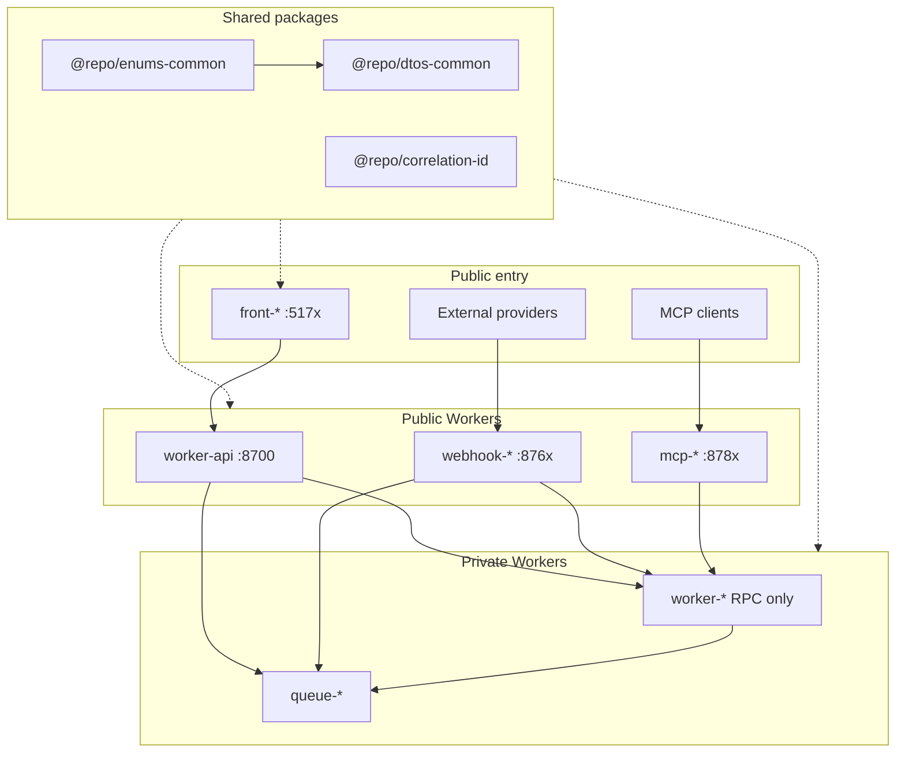

# Monorepo Agent Instructions

## Project Overview

A minimal, production-oriented monorepo starter built on **pnpm workspaces** with **Turborepo**, **Cloudflare Workers**, **Hono**, and a **React (Vite) frontend** styled with **Tailwind CSS v4**. `front-app` talks to `worker-api` over **HTTP**; service bindings are the preferred pattern for Worker-to-Worker communication when you add more Workers.

## Quick Start

```bash
pnpm install    # dependencies + workspace links
pnpm login      # Cloudflare (remote Worker features)
pnpm prepare    # Husky pre-commit hooks
pnpm dev        # all dev servers
```

After scaffolding a new worker under `apps/`, run `pnpm install` before turbo commands.

## Architecture


```mermaid
flowchart TB
  subgraph entry [Public entry]
    direction LR
    Front["front-* :517x"]
    Ext["External providers"]
    McpClients["MCP clients"]
  end

  subgraph publicWorkers [Public Workers]
    direction LR
    Gateway["worker-api :8700"]
    Webhook["webhook-* :876x"]
    Mcp["mcp-* :878x"]
  end

  subgraph privateWorkers [Private Workers]
    direction LR
    Biz["worker-* RPC only"]
    Queue["queue-*"]
  end

  subgraph shared [Shared packages]
    direction LR
    Enums["@repo/enums-common"]
    DTOs["@repo/dtos-common"]
    Corr["@repo/correlation-id"]
    Enums --> DTOs
  end

  Front --> Gateway
  Ext --> Webhook
  McpClients --> Mcp

  Gateway --> Biz
  Webhook --> Biz
  Mcp --> Biz

  Gateway --> Queue
  Webhook --> Queue
  Biz --> Queue

  shared -.-> Front
  shared -.-> publicWorkers
  shared -.-> privateWorkers
```

## Worker Prefixes

| Prefix | Example | Role | Production surface |
|--------|---------|------|--------------------|
| `worker-api` | `worker-api` | HTTP gateway (sticky name) | Public HTTP only |
| `worker-` | `worker-account` | Business logic | **RPC only** via service bindings |
| `queue-` | `queue-email` | Queue-only consumer | `queue()` handler; no public HTTP |
| `webhook-` | `webhook-example` | External webhook ingress | Public HTTP for provider callbacks |
| `mcp-` | `mcp-tools` | MCP server | Public HTTP MCP (SSE / streamable HTTP); tools call `worker-*` via RPC |
| `front-` | `front-app` | React SPA | Vite → gateway over HTTP only |

If a Worker is both RPC and a queue consumer, keep prefix **`worker-*`** (business range) and use the dual-handler layout. Use **`queue-*`** only for queue-only consumers.

## Where to Put Things

Root map for cross-cutting placement. App-local detail: `apps/*/AGENTS.md` and `packages/*/AGENTS.md`.

| Task | Location |
|------|---------|
| HTTP route | `apps/worker-api/src/routes/<feature>.ts` → mount in `src/index.ts` |
| Zod schemas | `packages/dtos-common/src/{api,rpc,queue,webhook}/` |
| Shared enums | `packages/enums-common`; worker-local under `apps/<worker>/src/enums/` |
| Opaque correlation ids | `packages/correlation-id` (`X-Request-Id`); SPA session wrapper in `front-app` |
| DB schema / migrations | `apps/<owner>/src/db/` (one owner; never `packages/db-*`) |
| Frontend feature | `apps/front-app/src/{pages,routes,services,hooks,components}/` |
| Bindings / secrets | `apps/<worker>/wrangler.jsonc`; `.dev.vars` from `.dev.vars.example` |
| Tests (unit) | `apps/<app>/tests/` + `@repo/vitest-config` (Node) or `@repo/vitest-config/workers` (Cloudflare Vitest pool) |
| Tests (multi-Worker integration) | Wrangler `createTestHarness()` from a Node Vitest suite - only after a second Worker + service binding exists; see [`packages/vitest-config/AGENTS.md`](packages/vitest-config/AGENTS.md) |

Queue-only / dual-handler workers: `handlers/request.ts`, `handlers/message.ts`, shared `services/`, minimal `index.ts`.

### Worker testing split (Cloudflare)

Align with [Cloudflare Workers testing](https://developers.cloudflare.com/workers/testing/):

| Layer | Tool | When |
|-------|------|------|
| **Unit** (handlers, helpers, single-Worker routes) | `@cloudflare/vitest-pool-workers` via `defineWorkersConfig` - tests run inside workerd; prefer `exports.default.fetch` / `env` from `cloudflare:workers` | Default for every `worker-*` / `queue-*` / `webhook-*` / `mcp-*` app today |
| **Integration** (gateway to business Worker, production builds, binding overrides) | Wrangler [`createTestHarness()`](https://developers.cloudflare.com/workers/testing/test-harness/) from Node Vitest | When the first `worker-*` is bound to `worker-api` (or a fixture pair). Do **not** replace the Vitest pool with the harness for single-Worker route suites |

`front-*` stays on Node Vitest. Do not put the Workers pool on the SPA, and do not merge the SPA and gateway into one Vite/`auxiliaryWorkers` app (SPA to gateway is **HTTP only**).

## Environment

Use Node 24 and the exact pnpm version pinned in root `package.json`. Copy `.dev.vars.example` → `.dev.vars` per app before local runs. Agent worktrees do not copy real env files; provision isolated credentials explicitly in each worktree. Secrets and wrangler vars: path-scoped rule `backend/workers-config`. Local ports when scaffolding: `backend/ports` (human tables in [README.md](README.md)).

## Root Scripts (pnpm)

`pnpm run` lists every root script. Non-obvious ones:

| Command | Description |
|---------|-------------|
| `pnpm run ci` | Full-repo local PR gate (no `--affected`); CI uses `--affected` for check-types/test/build |
| `pnpm lint:agent` | Lint with `--format=agent` - one machine-readable line per diagnostic, no auto-fix |
| `pnpm types` | Regenerate `worker-configuration.d.ts` (**commit the result**) |
| `pnpm types:check` | Verify committed Worker types match `wrangler.jsonc` (inside `pnpm run ci`) |
| `pnpm boundaries` | Package dependency tags vs `turbo.json` (inside `pnpm run ci`) |

### Scoping

Turbo filters apply to `check-types`, `test`, `build`, `dev`, `deploy`, `preview`, `types` (`--filter=<pkg>`, `--filter=...pkg...`, `--affected`). Prefer scoped turbo while iterating; use `pnpm run ci` as the local PR gate (full graph). **GitHub CI only** for `--affected`.

**Lint and format are not turbo-backed.** OXC runs as a single pass from the repo root: oxlint resolves `settings.better-tailwindcss.entryPoint` against process CWD, so per-package `oxlint .` silently breaks Tailwind context rules and re-spawns `tsgolint` per package. Narrow with a path: `pnpm --filter=front-app run lint`. Never `cd` into a package to lint. `pnpm boundaries` is a CLI command, not a package task.

## Agent tooling

Cursor / Claude dual-tree layout, sync policy, hooks, skills, and MCP: skill `monorepo-agent-setup`. Hook scripts: [hooks/AGENTS.md](hooks/AGENTS.md). Nested `AGENTS.md` + `CLAUDE.md` live under each `apps/*`, `packages/*`, and `hooks/` - give new packages the same pair.

### Subagent roster

Three read-only agents - `verifier`, `bundle-analyzer`, `docs-researcher`. Descriptions load from `.claude/agents/*.md`; do not restate them here. Add more under `.claude/agents/` / `.cursor/agents/` when new surfaces land (see `monorepo-agent-setup`).

### When to delegate

| Reach for | When |
|-----------|------|
| **Main thread** | Iterative work; phases sharing context; a small targeted change; latency-sensitive work. |
| **Plan mode** | Uncertain approach, or multi-file change. Skip if the diff fits one sentence. |
| **Skill** | Reusable procedure in current context - `/review-*`, `/git-commit`. |
| **Subagent** | Output you will never re-read; tool restriction the main thread cannot express; fresh context so the reviewer is not the author. |
| **Never a subagent** | Trivial or strictly sequential step, or shared mutable state with the main thread. |

Easy to get wrong:

- **`tools` is the only real least-privilege gate.** Parent `acceptEdits` overrides subagent `permissionMode`. Omit `Edit`/`Write`/`Bash` for read-only; do not rely on the mode.
- **`Explore` and `Plan` do not load `CLAUDE.md` or `.claude/rules/`.** Restate binding constraints in the delegation prompt for those two.
- **Agents never write scratch files into the working tree.** Findings come back in the reply.

## Enforced Boundaries

`pnpm boundaries` (in `pnpm run ci`) fails on tag violations. Rules live in root `turbo.json` `boundaries.tags`; each package declares tags in its `turbo.json`.

- **Nothing may import an `app`.** Worker-to-Worker: service-binding RPC in `wrangler.jsonc`, never a package import.
- New app/package needs `turbo.json` with `"extends": ["//"]` and a `tags` entry (`app`, `contracts`, `contracts-base`, `lib`, or `config`).

Detail: `.claude/rules/core/boundaries.md` / `.cursor/rules/core/boundaries.mdc` when editing `turbo.json`.

## Decision Checklist

1. Worker-to-Worker call? **Service binding RPC**, not HTTP.
2. DB access? Schema + binding in **one** owning `worker-*` / `queue-*` under `src/db/` - never `packages/db-*`, never the same DB binding on multiple apps. Others use RPC or a queue.
3. Public HTTP only for gateway, webhooks, MCP, and frontends - not for business RPC or queue-only workers.
4. SPA to API? Keep `front-*` on `@cloudflare/vite-plugin` + assets `wrangler.jsonc`, and `worker-api` on Wrangler. Never co-locate the gateway as a Vite `auxiliaryWorkers` entry or put API routes in the assets Worker (Cloudflare SPA+API-in-one-Worker tutorial is an anti-pattern for this monorepo).
5. Cross-Worker tests? Keep per-app Vitest pool suites; add `createTestHarness` only for multi-Worker production-build integration (see testing split above).

Shared DTO/enum ownership, naming, and code style are path-scoped under `.cursor/rules/` / `.claude/rules/` (`contracts`, `quality`).

## Contribution

- Run `pnpm run ci` before opening a PR.
- Update the relevant `AGENTS.md` when adding endpoints, bindings, env vars, or conventions.
- HTTP contracts live in `@repo/dtos-common`; update `worker-api` and `front-app` together.
- Continuous deployment: after green CI on `main`, [`.github/workflows/cd.yml`](.github/workflows/cd.yml) is designed to run `wrangler versions upload` then `wrangler versions deploy <id>@100%` for `worker-api` and `front-app`. **CD is paused** until production GitHub Environment secrets are configured; the deploy job condition is hard-disabled (leading `false` short-circuit) - re-enable by removing that guard (leave tip-check / upload / promote as-is).
