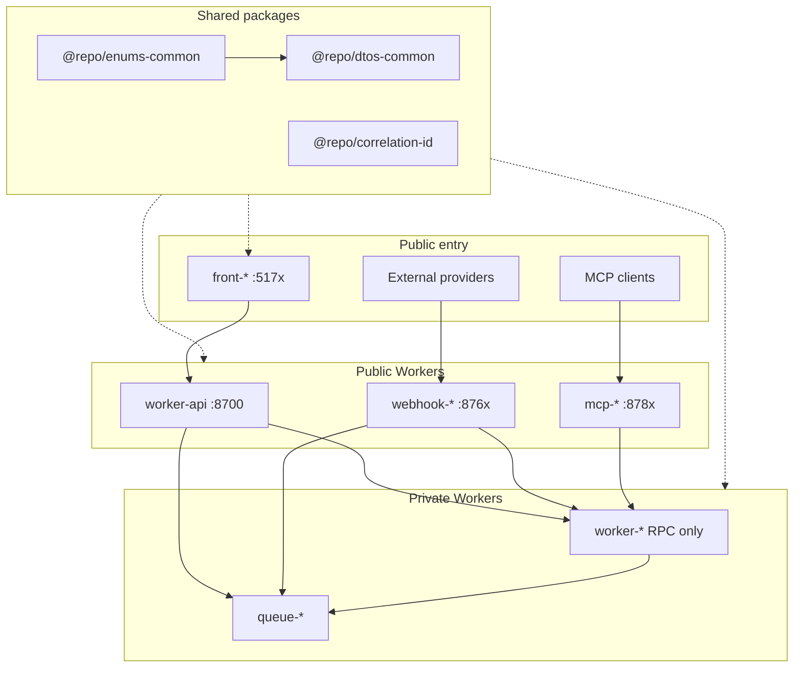

# Monorepo Agent Instructions

## Project Overview

A minimal, production-oriented monorepo starter built on **pnpm workspaces** with **Turborepo**, **Cloudflare Workers**, **Hono**, and a **React (Vite) frontend** styled with **Tailwind CSS v4**. `front-app` talks to `worker-api` over **HTTP**; service bindings are the preferred pattern for Worker-to-Worker communication when you add more Workers.

## Quick Start

```bash
pnpm install    # dependencies + workspace links
pnpm login      # Cloudflare (remote Worker features)
pnpm prepare    # Vite+ pre-commit hooks
pnpm dev        # all dev servers
```

After scaffolding a new worker under `apps/`, give it a `monorepo.deployOrder` in its `package.json` (lower promotes first; gateways before the SPAs that call them) and run `pnpm install` before turbo commands. Nothing else lists apps: the changeset group, the root `--filter='./apps/*'` scripts, and CD all discover them.

## Architecture


```mermaid
flowchart TB
  subgraph entry [Public entry]
    direction LR
    Front["front-* :517x"]
    Ext["External providers"]
    McpClients["MCP clients"]
  end

  subgraph publicWorkers [Public Workers]
    direction LR
    Gateway["worker-api :8700"]
    Webhook["webhook-* :876x"]
    Mcp["mcp-* :878x"]
  end

  subgraph privateWorkers [Private Workers]
    direction LR
    Biz["worker-* RPC only"]
    Queue["queue-*"]
  end

  subgraph shared [Shared packages]
    direction LR
    Enums["@repo/enums-common"]
    DTOs["@repo/dtos-common"]
    Corr["@repo/correlation-id"]
    Enums --> DTOs
  end

  Front --> Gateway
  Ext --> Webhook
  McpClients --> Mcp

  Gateway --> Biz
  Webhook --> Biz
  Mcp --> Biz

  Gateway --> Queue
  Webhook --> Queue
  Biz --> Queue

  shared -.-> Front
  shared -.-> publicWorkers
  shared -.-> privateWorkers
```

## Worker Prefixes

| Prefix | Example | Role | Production surface |
|--------|---------|------|--------------------|
| `worker-api` | `worker-api` | HTTP gateway (sticky name) | Public HTTP only |
| `worker-` | `worker-account` | Business logic | **RPC only** via service bindings |
| `queue-` | `queue-email` | Queue-only consumer | `queue()` handler; no public HTTP |
| `webhook-` | `webhook-example` | External webhook ingress | Public HTTP for provider callbacks |
| `mcp-` | `mcp-tools` | MCP server | Public HTTP MCP (SSE / streamable HTTP); tools call `worker-*` via RPC |
| `front-` | `front-app` | React SPA | Vite → gateway over HTTP only |

If a Worker is both RPC and a queue consumer, keep prefix **`worker-*`** (business range) and use the dual-handler layout. Use **`queue-*`** only for queue-only consumers.

## Where to Put Things

Root map for cross-cutting placement. App-local detail: `apps/*/AGENTS.md` and `packages/*/AGENTS.md`.

| Task | Location |
|------|---------|
| HTTP route | `apps/worker-api/src/routes/<feature>.ts` → mount in `src/index.ts` |
| Zod schemas | `packages/dtos-common/src/{api,rpc,queue,webhook}/` |
| Shared enums | `packages/enums-common`; worker-local under `apps/<worker>/src/enums/` |
| Opaque correlation ids | `packages/correlation-id` (`X-Request-Id`); SPA session wrapper in `front-app` |
| DB schema / migrations | `apps/<owner>/src/db/` (one owner; never `packages/db-*`) |
| Frontend feature | `apps/front-app/src/{pages,routes,services,hooks,components}/` |
| Bindings / secrets | `apps/<worker>/wrangler.jsonc`; `.dev.vars` from `.dev.vars.example` |
| Tests (unit) | `apps/<app>/tests/` + `@repo/vitest-config` (Node) or `@repo/vitest-config/workers` (Cloudflare Vitest pool) |
| Tests (multi-Worker integration) | Wrangler `createTestHarness()` from a Node Vitest suite - only after a second Worker + service binding exists; see [`packages/vitest-config/AGENTS.md`](packages/vitest-config/AGENTS.md) |

Queue-only / dual-handler workers: `handlers/request.ts`, `handlers/message.ts`, shared `services/`, minimal `index.ts`.

### Worker testing split (Cloudflare)

Align with [Cloudflare Workers testing](https://developers.cloudflare.com/workers/testing/):

| Layer | Tool | When |
|-------|------|------|
| **Unit** (handlers, helpers, single-Worker routes) | `@cloudflare/vitest-plugin` via `defineWorkersConfig` - tests run inside workerd; prefer `exports.default.fetch` / `env` from `cloudflare:workers` | Default for every `worker-*` / `queue-*` / `webhook-*` / `mcp-*` app today |
| **Integration** (gateway to business Worker, production builds, binding overrides) | Wrangler [`createTestHarness()`](https://developers.cloudflare.com/workers/testing/test-harness/) from Node Vitest | When the first `worker-*` is bound to `worker-api` (or a fixture pair). Do **not** replace the Vitest pool with the harness for single-Worker route suites |

`front-*` stays on Node Vitest. Do not put the Workers pool on the SPA, and do not merge the SPA and gateway into one Vite/`auxiliaryWorkers` app (SPA to gateway is **HTTP only**).

## Environment

Use Node 24 and the exact pnpm version pinned in root `package.json`. Copy `.dev.vars.example` → `.dev.vars` per app before local runs. Agent worktrees do not copy real env files; provision isolated credentials explicitly in each worktree. Secrets and wrangler vars: path-scoped rule `backend/workers-config`. Local ports when scaffolding: `backend/ports` (human tables in [README.md](README.md)).

## Root Scripts (pnpm)

`pnpm run` lists every root script. Non-obvious ones:

| Command | Description |
|---------|-------------|
| `pnpm run ci` | Full-repo local PR gate (no `--affected`); one `turbo run check-types test build`; CI uses `--affected` for that phase |
| `pnpm lint:agent` | Lint with `--format=agent` - one machine-readable line per diagnostic, no auto-fix |
| `pnpm lint:ci` | Lint pinned to `--format=github` (PR annotations); used by `.github/workflows/ci.yml` |
| `pnpm types` | Regenerate `worker-configuration.d.ts` (**commit the result**) |
| `pnpm types:check` | Verify committed Worker types match `wrangler.jsonc` (inside `pnpm run ci`) |
| `pnpm boundaries` | Package dependency tags vs `turbo.json` (inside `pnpm run ci`) |
| `pnpm knip` | Unused files, exports, and dependencies across workspaces (root `knip.jsonc`; inside `pnpm run ci`) |
| `pnpm knip:production` | Knip `--production --strict`: shipped-code-only pass + workspace isolation (inside `pnpm run ci`) |
| `pnpm knip:agent` | Knip with `--reporter symbols` - one machine-readable line per unused symbol, for agents |
| `pnpm deps:check` | syncpack lint - third-party deps must use `catalog:` specifiers; internal `@repo/**` links must use `workspace:*`; peer ranges exempt (inside `pnpm run ci`) |
| `pnpm deps:fix` | Autofix syncpack findings (`syncpack fix`); `pnpm deps:format --check` verifies `package.json` field ordering in CI, run `pnpm deps:format` to normalize |
| `pnpm changeset` | Add a changeset (version intent + changelog entry) for the current PR - required when touching deployable apps |
| `pnpm release:status` | Read-only release state: pending changesets and the next versions (`changeset status --verbose`) - deliberately **not** in `pnpm run ci`, it exits 1 when changed packages lack a changeset |

**Dependency workflow:** add every new third-party dependency to the pnpm catalog in `pnpm-workspace.yaml` and reference it as `"catalog:"` (one-offs outside the catalog install fine via `catalogMode: prefer` but fail `syncpack lint`). Internal packages always use `"workspace:*"`. Run `pnpm deps:fix` when lint flags version drift, and keep `package.json` field ordering normalized with `pnpm deps:format`.

### Releases

[Changesets](https://changesets.dev) drives versioning for the deployable apps (same pattern as Vite, Astro, and cloudflare/workers-sdk). One shared release version: every app under `apps/` is one `fixed` group in `.changeset/config.json` - written as the glob `[["*"]]`, which matches every unscoped package name and so never an `@repo/*` package - so they always bump together, which is what makes a single `vX.Y.Z` tag a valid release coordinate. **Nothing is published to npm** - every workspace is `private: true`; a release is a git tag plus a Cloudflare Workers promote.

```text
PR ──► CI (pull_request, --affected) + advisory changeset-status comment

merge to main ──► Release workflow
  gate         ALWAYS: calls ci.yml on the merge commit (full graph)
  select-mode  pending changesets? → "chore: release" PR (versions + CHANGELOGs)   [END]
               none?               → tag vX.Y.Z (needs gate) → newly created?
                                       → CD (called directly, not tag-triggered):
                                         wrangler versions upload --tag X.Y.Z
                                         → promote @100% → smoke → GitHub Release
```

Rules:

- **Every PR that changes a deployable app ships a changeset** (`pnpm changeset`; pick patch/minor/major). Non-blocking reminder via the Changesets PR status comment; use `pnpm changeset --empty` for no-release changes. Docs/tests/tooling-only PRs do not need one.
- **Merging the `chore: release` PR is the release act**: it lands the bumps on `main`, where `gate` validates the commit and only then is tag `vX.Y.Z` cut and handed to CD. Do not push `v*` tags by hand.
- **The release PR branch is force-pushed, not accumulated.** Every push to `main` resets `changeset-release/main` from the tip, re-runs `changeset version`, and force-pushes one commit - so it always reflects all of `main` plus all pending changesets, and manual edits to that branch are discarded. Corrections go in a new changeset on `main`.
- **CD is never tag-triggered.** Tags created with `GITHUB_TOKEN` do not start workflow runs, so `release.yml` calls `cd.yml` directly. Adding a `push: tags:` trigger back is dead code.
- **The tag is the idempotency key.** Re-running `Release` on an already-tagged commit reports `created=false` and skips the deploy; redeploy on purpose with CD's `workflow_dispatch` + tag input.
- **Runtime versions**: `/api/v1/health` returns `{ status, version }` (semver from `package.json`, inlined at build); `front-app` renders it in the root footer; `X-Worker-Version-Id` stays the opaque wrangler version id.
- **Rollback**: `pnpm --filter=<app> exec wrangler rollback --env production`; redeploy any prior release with CD's `workflow_dispatch` + tag input.
- **Prerequisites (one-time repo setting)**: enable *Actions → General → Allow GitHub Actions to create and approve pull requests*. CI skips `changeset-release/**` head branches by job condition and `gate` validates the release commit after merge, so a required check reports skipped rather than red - but note that a `pull_request` run on a bot-authored branch is created in the `action_required` state, so it still needs one "Approve and run" click unless you exempt the branch in branch protection.
- CD remains paused by the repository variable `CD_ENABLED`, checked by `release.yml`'s `deploy` job; set it to `true` alongside the production GitHub Environment secrets (see [Contribution](#contribution)). It is gated at the caller on purpose - a job skipped inside a `workflow_call` target reports success, which would leave a green Release with the tag cut and nothing shipped.

Depth: `.claude/rules/ops/release.md` / `.cursor/rules/ops/release.mdc`; contributor-facing walkthrough in [`.changeset/README.md`](.changeset/README.md).

### Scoping

Turbo filters apply to `check-types`, `test`, `build`, `dev`, `deploy`, `preview`, `types` (`--filter=<pkg>`, `--filter=...pkg...`, `--affected`). Prefer scoped turbo while iterating; use `pnpm run ci` as the local PR gate (full graph). **GitHub CI only** for `--affected`.

**Lint and format are not turbo-backed.** OXC runs as a single pass from the repo root: oxlint resolves `settings.better-tailwindcss.entryPoint` against process CWD, so per-package `oxlint .` silently breaks Tailwind context rules and re-spawns `tsgolint` per package. Narrow with a path: `pnpm --filter=front-app run lint`. Never `cd` into a package to lint. `pnpm boundaries` is a CLI command, not a package task.

**Agent lint contract** (mirrors [OXC coding agents](https://oxc.rs/docs/guide/usage/coding-agents.html)): iterate with `pnpm lint:fix`, then finish every code change with `pnpm lint:agent` and read only that output - it is the machine-readable `--format=agent` form (`file:line:col: severity plugin(rule): message help:`). The human/CI format (`pnpm lint:check`) renders TTY-dependent code frames; do not parse it. Inline suppressions: `oxlint-disable*` directives only - see `.claude/rules/quality/code-style.md`. Type checking stays with tsc via `turbo run check-types`; oxlint's experimental `options.typeCheck` is deliberately not used (it would lose Turbo per-package caching and `--affected`).

**Knip policy** (root `knip.jsonc`, kept comment-free): both the default pass and `pnpm knip:production` must stay green. Never blanket-`ignore`; prefer scoped patterns (`ignoreIssues`, production-only suffixes like `"dep!"` / `"!tests/**!"`) or JSDoc `@internal` on test-only exports. Auto-fix unused dependencies and pnpm catalog entries with `knip --fix --fix-type dependencies,catalog`. Test-only exports carry an explicit `@internal` tag rather than relying on tests to keep them "used". Per-override rationale: `.claude/rules/quality/knip.md` / `.cursor/rules/quality/knip.mdc`.

### Verifying a change (agents)

| Goal | Command |
|------|---------|
| One workspace's tests | `pnpm turbo run test --filter=<ws>` - a cache hit replays the stored log; add `--force` for a fresh execution |
| One test file | `pnpm --filter=<ws> exec vitest run tests/<path>.test.ts` |
| Full gate | `pnpm run ci` (includes `turbo run check-types test build`) |
| worker-api smoke | background `pnpm --filter=worker-api dev`, then `curl -sf http://localhost:8700/api/v1/health` (expect `{ status, version }` JSON), then stop the dev process |
| front-app smoke | background `pnpm --filter=front-app dev`, then `curl -sf http://localhost:5174/` and check the HTML contains `id="root"`, then stop |

Run dev servers through the harness's background-task mechanism (never a bare `&` you cannot reap) and always stop them when done. Both smoke checks work inside the Claude Code sandbox - localhost binding and curl are permitted.

## Agent tooling

Cursor / Claude dual-tree layout, sync policy, hooks, skills, and MCP: skill `monorepo-agent-setup`. Hook scripts: [hooks/AGENTS.md](hooks/AGENTS.md). Nested `AGENTS.md` + `CLAUDE.md` live under each `apps/*`, `packages/*`, and `hooks/` - give new packages the same pair. Turbo graph primitives (`turbo query`) and signed-remote-cache provisioning are path-scoped in `core/turborepo`.

### Subagent roster

Three read-only agents - `verifier`, `bundle-analyzer`, `docs-researcher`. Descriptions load from `.claude/agents/*.md`; do not restate them here. Add more under `.claude/agents/` / `.cursor/agents/` when new surfaces land (see `monorepo-agent-setup`).

### Dependency-scoped stack reviews

Beyond the dimension reviews (`/review-*`), one human-only `/review-<dep>` command exists per dev dependency (`review-claude-code`, `review-cursor`, `review-vite`, `review-oxc`, `review-typescript`, `review-turborepo`, `review-pnpm`, `review-wrangler`, `review-hono`, `review-tailwind`, `review-vitest`, `review-tanstack-router`, `review-tanstack-query`, `review-react`, `review-zod`, `review-knip`, `review-syncpack`). Run them periodically to verify each tool's config still follows current best practices: every skill mandates ground-truth retrieval (Context7 MCP → official docs) before suggesting changes and outputs a Critical / Improvements / Optional plan.

### When to delegate

| Reach for | When |
|-----------|------|
| **Main thread** | Iterative work; phases sharing context; a small targeted change; latency-sensitive work. |
| **Plan mode** | Uncertain approach, or multi-file change. Skip if the diff fits one sentence. |
| **Skill** | Reusable procedure in current context - `/review-*`, `/git-commit`. |
| **Subagent** | Output you will never re-read; tool restriction the main thread cannot express; fresh context so the reviewer is not the author. |
| **Never a subagent** | Trivial or strictly sequential step, or shared mutable state with the main thread. |

Easy to get wrong:

- **`tools` is the only real least-privilege gate.** Parent `acceptEdits` overrides subagent `permissionMode`. Omit `Edit`/`Write`/`Bash` for read-only; do not rely on the mode.
- **`Explore` and `Plan` do not load `CLAUDE.md` or `.claude/rules/`.** Restate binding constraints in the delegation prompt for those two.
- **Agents never write scratch files into the working tree.** Findings come back in the reply.

## Enforced Boundaries

`pnpm boundaries` (in `pnpm run ci`) fails on tag violations. Rules live in root `turbo.json` `boundaries.tags`; each package declares tags in its `turbo.json`.

- **Nothing may import an `app`.** Worker-to-Worker: service-binding RPC in `wrangler.jsonc`, never a package import.
- New app/package needs `turbo.json` with `"extends": ["//"]` and a `tags` entry (`app`, `contracts`, `contracts-base`, `lib`, or `config`).

Detail: `.claude/rules/core/boundaries.md` / `.cursor/rules/core/boundaries.mdc` when editing `turbo.json`.

## Decision Checklist

1. Worker-to-Worker call? **Service binding RPC**, not HTTP.
2. DB access? Schema + binding in **one** owning `worker-*` / `queue-*` under `src/db/` - never `packages/db-*`, never the same DB binding on multiple apps. Others use RPC or a queue.
3. Public HTTP only for gateway, webhooks, MCP, and frontends - not for business RPC or queue-only workers.
4. SPA to API? Keep `front-*` on `@cloudflare/vite-plugin` + assets `wrangler.jsonc`, and `worker-api` on Wrangler. Never co-locate the gateway as a Vite `auxiliaryWorkers` entry or put API routes in the assets Worker (Cloudflare SPA+API-in-one-Worker tutorial is an anti-pattern for this monorepo).
5. Cross-Worker tests? Keep per-app Vitest pool suites; add `createTestHarness` only for multi-Worker production-build integration (see testing split above).

Shared DTO/enum ownership, naming, and code style are path-scoped under `.cursor/rules/` / `.claude/rules/` (`contracts`, `quality`).

## Contribution

- Run `pnpm run ci` before opening a PR.
- Update the relevant `AGENTS.md` when adding endpoints, bindings, env vars, or conventions.
- HTTP contracts live in `@repo/dtos-common`; update `worker-api` and `front-app` together.
- Continuous deployment: [`.github/workflows/cd.yml`](.github/workflows/cd.yml) is called by `release.yml` once a release tag is cut, and runs `wrangler versions upload` then `wrangler versions deploy <id>@100%` for every app discovered under `apps/`, in `monorepo.deployOrder`. **CD is paused** until production GitHub Environment secrets are configured; set the repository variable `CD_ENABLED` to `true` to arm it and leave upload / promote as-is.
