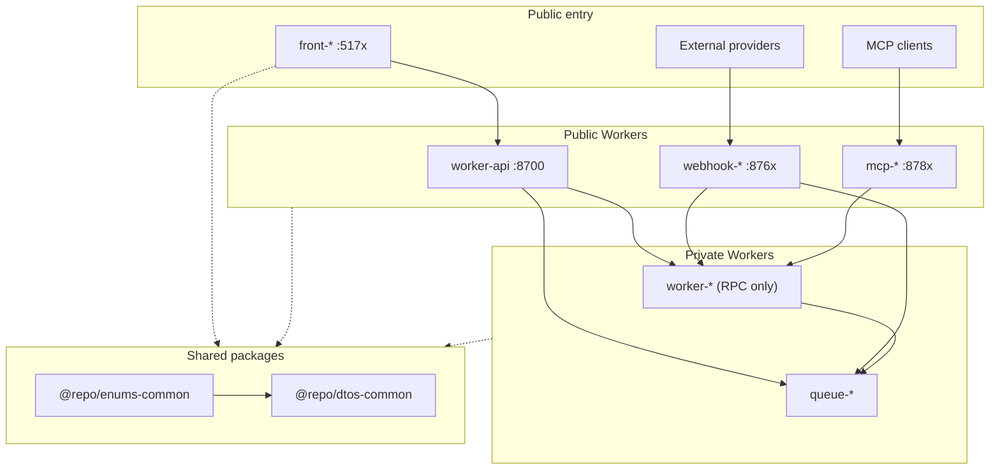
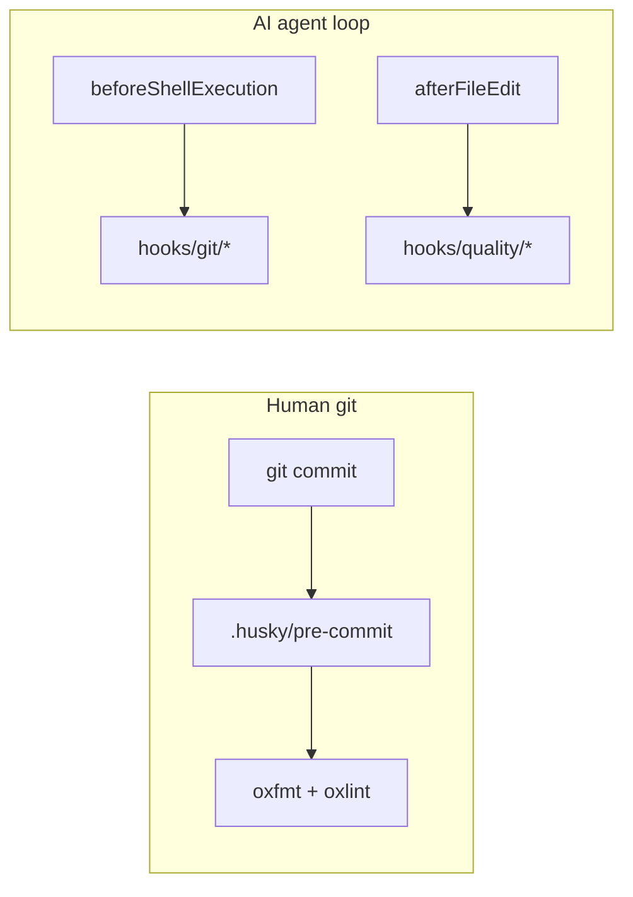

<p align="center">
  <a href="https://github.com/louisbrulenaudet/monorepo-template">
    
  </a>
</p>


# Monorepo starter based on pnpm with Cloudflare, Hono, React, Vite and Tailwind 🚚⛅

[](https://oxc.rs/)
[](https://www.typescriptlang.org/)
[](https://developers.cloudflare.com/)
[](https://pnpm.io/)
[](https://turbo.build/repo/docs)

A minimal, production-oriented monorepo starter built on pnpm workspaces with Turborepo, Cloudflare Workers, Hono, React (Vite), **Tailwind CSS v4**, and **TanStack Router/Query**. AI-ready, designed for edge deployment, and structured for production projects that scale.

## Architecture Overview

### Monorepo Structure

Starter apps today (`worker-api`, `front-app`). Prefixes below describe how the repo grows.

```
monorepo/
├── apps/                    # Workers and frontends
│   ├── worker-api/          # REST API gateway
│   └── front-app/           # React SPA (Vite + TanStack)
├── packages/                # Shared @repo/* packages
│   ├── dtos-common/         # Zod wire contracts (api / rpc / queue / webhook)
│   ├── enums-common/        # Shared constrained string values (`as const`)
│   └── typescript-config/   # TypeScript configuration presets
├── make/                    # Shared Makefile fragments (see make/README.md)
├── hooks/                   # AI agent hooks (not Husky - see hooks/README.md)
├── package.json             # Root package configuration
├── pnpm-workspace.yaml      # Workspace configuration
├── turbo.json               # Turborepo configuration
└── tsconfig.json            # Root TypeScript configuration
```

### Architecture Components

The monorepo is organized into two main categories: **Backend Services** and **Frontend Applications**, plus **Shared Packages** for common functionality.



#### Backend Services

Cloudflare Workers are organized by runtime role:

- **`worker-api`** - Public HTTP gateway (Hono): CORS, validation, routing; coordinates internal Workers via RPC.
- **`worker-*`** - Business logic over **service-binding RPC** only (no public routes in production). May own Drizzle schema under `src/db/` and that database’s binding (exclusive owner).
- **`queue-*`** - Queue-only consumers (`queue()` handler). Messages can be produced by `worker-api`, `worker-*`, or `webhook-*`. Use dual-handler layout when a local HTTP debug path is useful.
- **`webhook-*`** - Public HTTP ingress for external provider callbacks; forward work via RPC or queues.
- **`mcp-*`** - Public HTTP MCP servers; thin tools that call `worker-*` over RPC.

Do **not** create shared `packages/db-*` schema packages. Put Drizzle schema under the owning app’s `src/db/` and keep **one DB binding owner**. Other apps reach that data via **service-binding RPC** (or a queue) - do not attach the same DB binding to multiple apps.

#### Frontend Applications

- **`front-app`** - React SPA (Vite 8, Tailwind v4, TanStack Router/Query) deployed on Cloudflare Workers. Talks to `worker-api` over HTTP only - never via service bindings.

### Where to put things

| Task | Location |
|------|----------|
| New API route | `apps/worker-api/src/routes/<feature>.ts` → mount in `src/index.ts` |
| HTTP Zod schemas | `packages/dtos-common/src/api/<feature>.ts` |
| RPC / queue / webhook schemas | `packages/dtos-common/src/<layer>/<feature>.ts` (layer: `rpc`, `queue`, or `webhook`) |
| Shared string value set | `packages/enums-common/src/` |
| Worker-local value set | `apps/<worker>/src/enums/` |
| DB schema (one owner) | `apps/<owner>/src/db/` - never `packages/db-*` |
| Frontend API client | `apps/front-app/src/services/worker-api/<feature>.ts` |
| Frontend page + route | `apps/front-app/src/pages/` + `src/routes/` |
| Local Worker secrets | `apps/<worker>/.dev.vars` (from `.dev.vars.example`) |
| Frontend env | `apps/front-app/.env.local` (from `.env.example`) |

## Getting Started

### Prerequisites

- **Node.js** 22+ (see root `package.json` `engines`); we recommend [fnm](https://github.com/Schniz/fnm) for version management
- **pnpm** via the root `packageManager` field (Corepack recommended)
- **Cloudflare account** only if you need `make login` / deploy / remote Worker features

### Install and prepare

```sh
make install
make login     # optional - Cloudflare auth for remote Wrangler features
make prepare   # Husky pre-commit hooks
```

Copy env templates before the first run:

- Workers: `apps/<worker>/.dev.vars.example` → `.dev.vars`
- Frontend: `apps/front-app/.env.example` → `.env.local`

Notes:
- Prefer `make install` over raw `pnpm install` so workspace links stay consistent.
- This repo pins `pnpm` via `packageManager` in the root `package.json`.

### First successful run (verify locally)

1. Start all dev servers from the repo root:
   ```sh
   make dev
   ```
2. Verify the API: `GET` `http://localhost:8700/api/v1/health`
3. Open the frontend: `http://localhost:5174`

Focused work on one package: `make dev SCOPE=worker-api` (see [Scoping](#scoping-pnpm--turborepo)).

## Make Commands

| Command         | Description                                         |
|-----------------|-----------------------------------------------------|
| install         | Install and link workspace packages                 |
| install-frozen  | Install with frozen lockfile (CI)                   |
| login           | Login to Cloudflare (repo-pinned Wrangler)          |
| update          | Update dependencies to latest (rewrites pnpm catalog) |
| check           | Lint + format check (no typecheck)                  |
| ci              | Lint + format + check-types (local PR gate)         |
| deploy          | Deploy all apps/workers (via Turborepo)             |
| build           | Build all packages and apps (via Turborepo)         |
| format          | Auto-fix formatting with oxfmt                    |
| lint            | Auto-fix lint issues with oxlint                  |
| dev             | Start all dev servers (via Turborepo)               |
| preview         | Preview production builds locally (via Turborepo)   |
| types           | Generate `worker-configuration.d.ts` in apps        |
| check-types     | TypeScript across all workers and packages          |
| prepare         | Install or reinstall Husky git hooks                |
| husky-status    | Show Husky hooks status                             |
| skills-update   | Refresh locked agent skills (see make/README.md)    |

### Scoping (pnpm / Turborepo)

Optional variables on any turbo-backed root target (`dev`, `build`, `ci`, …):

| Variable | Effect | Example |
|----------|--------|---------|
| `SCOPE` | `--filter=<package>` | `make dev SCOPE=worker-api` |
| `FILTER` | Raw turbo filter expression | `make build FILTER=...front-app...` |
| `AFFECTED` | Only changed packages vs base | `make ci AFFECTED=1` |

## Development ports

Mnemonic: **87xx = Workers** (gateway → business → queue → webhook → MCP → reserve). Frontends use Vite’s **51xx / 41xx**.

| Role | Prefix | Local HTTP ports |
|------|--------|------------------|
| HTTP gateway | `worker-api` | **8700–8709** |
| Business worker (RPC) | `worker-*` | **8710–8739** |
| Queue-only consumer | `queue-*` | **8740–8759** |
| Webhook ingress | `webhook-*` | **8760–8779** |
| MCP server | `mcp-*` | **8780–8789** |
| Growth reserve | - | **8790–8799** |
| Frontend (Vite) | `front-*` | **5170–5199** (dev), **4170–4199** (preview) |

### Assigned registry

| Service | Path | Dev | Preview |
|---------|------|----:|--------:|
| worker-api | `apps/worker-api/wrangler.jsonc` | **8700** | - |
| front-app | `apps/front-app/vite.config.ts` | **5174** | **4174** |

Notes:
- Workers: set `dev.port` in `wrangler.jsonc` and `monorepo.devPort` in `package.json`. Use `inspector_port: 0`.
- Frontends: set Vite `server.port` / `preview.port` with `strictPort: true`.
- Assign the next free port in the role’s range. RPC and queue-only apps still get a local port for standalone `wrangler dev`, but have no public URL in production.
- Prefer multi-config local runs when testing bindings (first `-c` is HTTP-primary).

## 1. Create a New Cloudflare Worker

### App Naming Nomenclature

| Purpose | Prefix | Example |
|---------|--------|---------|
| HTTP gateway | `worker-api` (sticky) | `worker-api` |
| Business logic (RPC) | `worker-` | `worker-account` |
| Queue-only consumer | `queue-` | `queue-email` |
| Webhook ingress | `webhook-` | `webhook-example` |
| MCP server | `mcp-` | `mcp-tools` |
| Frontend application | `front-` | `front-app` |

### Key Distinctions

- **Gateway (`worker-api`):** Public HTTP only; validates requests and calls `worker-*` over RPC.
- **Business Workers (`worker-*`):** RPC-only in production (`WorkerEntrypoint`); may own Drizzle schema under `src/db/` and that database’s binding (exclusive). If they also consume queues, keep this prefix and use the dual-handler layout.
- **Queue-only (`queue-*`):** `queue()` consumers with no public HTTP in production; may own schema when they are the sole writer for that data.
- **Webhook Workers (`webhook-*`):** Public HTTP for external callbacks; forward via RPC or queues.
- **MCP Servers (`mcp-*`):** Public HTTP MCP transport; thin tools that call `worker-*` over RPC - never rotate long-lived credentials on this surface.
- **Frontends (`front-*`):** React + Vite; HTTP to the gateway only - never service bindings.
- **Do not** create shared `packages/db-*` schema packages.

### Scaffold checklist (copy from an existing app)

There is no generator CLI. Copy the closest sibling under `apps/` and wire it into the monorepo:

1. **Copy** `apps/worker-api` (or another closest match) to `apps/<prefix-name>` (e.g. `apps/worker-account`).
2. **Rename** `package.json` `name`, `wrangler.jsonc` `name`, and any display strings.
3. **Assign ports** from the [Development ports](#development-ports) registry - set `dev.port` / `inspector_port: 0` in `wrangler.jsonc` and `monorepo.devPort` in `package.json`.
4. **Keep** the 4-line `Makefile` that includes `make/app.mk` (see [make/README.md](make/README.md)).
5. **Extend** `@repo/typescript-config/workers.json` (or the matching preset); add `.dev.vars.example`.
6. **Install and typegen:**
   ```sh
   make install
   make types
   ```

Copy wrangler patterns (`compatibility_flags`, `observability`, `env.staging` / `env.production`) from the existing app - see [`.cursor/rules/backend/workers-config.mdc`](.cursor/rules/backend/workers-config.mdc).

## 2. Develop a Specific Worker

Prefer scoped make from the repo root:

```sh
make dev SCOPE=worker-name
```

Or use the worker's Makefile:

```sh
cd apps/worker-name
make dev
```

- This runs the `dev` script defined in `apps/worker-name/package.json`
- Open the port shown in your terminal (for example, http://localhost:8721)
- Each worker Makefile exposes `make dev`, `make format`, `make lint`, `make types`, `make check-types`, `make deploy`

### Testing Service Bindings Between Workers

Prefer a single multi-config `wrangler dev` (first `-c` is HTTP-primary):

```sh
wrangler dev -c apps/worker-api/wrangler.jsonc -c apps/worker-account/wrangler.jsonc
```

Or run each Worker in its own terminal (`cd apps/worker-account && make dev`, then `cd apps/worker-api && make dev`) and confirm service bindings show as connected in the wrangler output.

### Dual-Handler Pattern

Use this layout for **`queue-*`** apps and for **`worker-*`** apps that also consume queues:

```
src/
├── handlers/
│   ├── request.ts    # Optional HTTP (local debug only)
│   └── message.ts    # Queue message consumption
├── services/         # Shared business logic
└── index.ts         # Minimal delegation entry point
```

- **`queue-*`:** queue-only in production (no public HTTP).
- **`worker-*` with queues:** keep the business prefix; expose RPC and optionally dual-handler HTTP for local testing.

## 3. Environment Configuration

Each worker uses environment-specific configuration. Frontends use Vite env files (see [apps/front-app/README.md](apps/front-app/README.md)).

### Development Environment
- **Workers:** `.dev.vars` (from `.dev.vars.example`) for local secrets and overrides
- **Frontend:** `.env.local` (from `.env.example`) - only `VITE_*` keys reach the browser

### Staging/Production Environments
- **Configuration:** `env.staging` and `env.production` blocks in `wrangler.jsonc`
- **Deploy:** `wrangler deploy --env staging` or `--env production`
- **Service Bindings:** Connected to deployed workers

### Environment Variables Example

```jsonc
// In wrangler.jsonc
{
  "$schema": "../../node_modules/wrangler/config-schema.json",
  "name": "my-worker",
  "compatibility_date": "2026-07-08",
  "compatibility_flags": ["nodejs_compat"],
  "vars": {
    "ENVIRONMENT": "dev"
  },
  "env": {
    "staging": {
      "vars": { "ENVIRONMENT": "staging" },
      "observability": { "enabled": true, "traces": { "enabled": true } }
    },
    "production": {
      "vars": { "ENVIRONMENT": "production" },
      "observability": { "enabled": true, "traces": { "enabled": true } }
      // "routes": [{ "pattern": "api.example.com", "custom_domain": true }]
    }
  }
}
```

### Multi-worker local dev

When service bindings connect Workers, run each in a separate terminal, or use multiple `-c` flags (first config is HTTP-primary):

```sh
wrangler dev -c apps/worker-api/wrangler.jsonc -c apps/worker-example/wrangler.jsonc
```
### Service Binding Configuration

```jsonc
{
  "services": [
    {
      "binding": "WORKER_API",
      "service": "worker-api"
    }
  ]
}
```

## 4. Deploy Your Workers

- **Deploy all workers:**
  ```sh
  make deploy
  ```

- **Deploy a specific worker:**
  ```sh
  make deploy SCOPE=worker-name
  # or: cd apps/worker-name && make deploy
  ```

## Best Practices

### Architecture Best Practices

- **Colocate schema under the owning Worker’s `src/db/`:** never a shared `packages/db-*` package; never share the same DB binding across apps - other apps use RPC (or a queue)
- **Implement dual-handler pattern:** For queue consumers, separate message handling from optional local HTTP debug handlers
- **Use service bindings (RPC):** For inter-worker communication instead of HTTP calls
- **Maintain clear separation of concerns:** Each Worker has a specific runtime role (gateway, business, queue, webhook, MCP, frontend)

### Development Best Practices

- **Always run `make install`** after adding workers or dependencies
- **Use `make dev SCOPE=<package>`** for focused development on one app (plain `make dev` starts everything)
- **Follow naming conventions:** `worker-*`, `queue-*`, `webhook-*`, `mcp-*`, `front-*`
- **Use appropriate port ranges:** see [Development ports](#development-ports)
- **Test service bindings:** Verify connections between workers before deployment

### Code Quality Best Practices

- **Use strict TypeScript everywhere:** Enforce type safety across all workers
- **Validate all data with Zod schemas:** Shared contracts live in `@repo/dtos-common`
- **Return explicit HTTP status codes** and typed JSON errors at the gateway boundary
- **Follow OXC formatting standards:** Consistent code style across the monorepo (oxfmt + oxlint)
- **Use shared packages:** Leverage `@repo/*` packages for wire contracts and configs
- **Run `make ci` before opening a PR** (see [Contribution](#contribution))

### Service Communication

Workers communicate via service bindings:

```typescript
// Call a business Worker over RPC
const result = await env.ACCOUNT_SERVICE.getAccount(userId);

// Call another business Worker
const completion = await env.WORKER_GENAI.completion(request);
```
## Git Hooks

This repo has **two** hook systems. They do not replace each other:

| System | When it runs | Docs |
|--------|--------------|------|
| **Husky** (`.husky/`) | Human `git commit` | This section |
| **Agent hooks** (`hooks/`) | Cursor / Claude Code tool loop | [hooks/README.md](hooks/README.md) |



### Husky pre-commit

[Husky](https://typicode.github.io/husky/) formats staged files with oxfmt (`git-format-staged`) and runs the repository-wide oxlint safe fixer before each commit.

```sh
make prepare       # install / reinstall hooks
make husky-status  # verify hooks are executable
```

## Contribution

- Run **`make ci`** before opening a PR (lint + format + check-types). GitHub CI also runs an affected build.
- Wire-format changes: update `@repo/dtos-common` and every producer/consumer in the **same PR** (HTTP → `worker-api` + `front-app`).
- When you add endpoints, bindings, or env vars, update the relevant app/package **README** and **AGENTS.md**.

## AI agent instructions

- **[AGENTS.md](AGENTS.md)** - cross-tool project conventions and Cursor's root instructions.
- **[CLAUDE.md](CLAUDE.md)** - Claude Code entry point; imports `AGENTS.md` per [Claude memory docs](https://code.claude.com/docs/en/memory).
- **Per-app/package** - each workspace has matching `AGENTS.md` and `CLAUDE.md`.
- **[hooks/README.md](hooks/README.md)** - shared agent hook scripts (not Husky).
- **Rules** - mirrored trees under `.cursor/rules/**/*.mdc` and `.claude/rules/**/*.md`.
- **Skills** - source of truth under `.agents/skills/` (see skill `monorepo-agent-setup`).
- **Security** - `.cursorignore` reduces model context but is not an access-control boundary.

## Shared Packages (`@repo/*`)

Local packages under `packages/`. Each package has its own README.

### Available Shared Packages

- **`@repo/dtos-common`** - Zod wire contracts via subpaths: `/api`, `/rpc`, `/queue`, `/webhook`
- **`@repo/enums-common`** - Shared constrained string values (`as const` objects)
- **`@repo/typescript-config`** - TypeScript presets (`strict.json`, `workers.json`, `workers-lib.json`, `vite-react.json`, `vite-node.json`)

### Benefits of Shared Packages
- **Code sharing:** Eliminate duplication across workers
- **Consistency:** Centralized configurations and utilities
- **Easy updates:** Update once, propagate to all workers
- **Type safety:** Shared TypeScript configurations ensure consistency

### How to Use Shared Packages

1. **Add to your worker's `package.json`:**
   ```json
   "dependencies": {
     "@repo/dtos-common": "workspace:*",
     "@repo/enums-common": "workspace:*",
     "@repo/typescript-config": "workspace:*"
   }
   ```

2. **Import and use in your code:**
   ```typescript
   import { HttpMethod } from "@repo/enums-common";
   import { HealthResponseSchema } from "@repo/dtos-common/api";
   ```

3. **Development workflow:**
   - Changes in shared packages are reflected immediately in workers
   - Run `make install` after adding new shared package dependencies

### More Information
- [pnpm workspace protocol docs](https://pnpm.io/workspaces#workspace-protocol)
- [Turborepo monorepo docs](https://turbo.build/repo/docs)

## Service Bindings

Service bindings allow Workers to communicate directly with each other without going through publicly accessible URLs. They provide the separation of concerns that microservice architectures offer, without configuration pain, performance overhead, or the need to learn RPC protocols.

### Key Benefits

- **Zero overhead:** Workers run on the same thread, providing zero latency
- **Not just HTTP:** Direct method calls between Workers using JavaScript functions
- **No additional costs:** Service bindings don't increase Cloudflare pricing
- **Secure communication:** No public URLs required

### Configuration

Add service bindings to your worker's `wrangler.jsonc`:

```jsonc
{
  "services": [
    {
      "binding": "BUSINESS_LOGIC_SERVICE",
      "service": "worker-name"
    }
  ]
}
```

### RPC Method Invocation

RPC requires the **callee** to extend `WorkerEntrypoint` and expose public methods. The **caller** gets typed `env.BINDING.method()` stubs from `wrangler types` when you pass every bound Worker's config (see [Workers RPC - TypeScript](https://developers.cloudflare.com/workers/runtime-apis/rpc/typescript/)).

**Callee** (`worker-name`):

```typescript
import { WorkerEntrypoint } from "cloudflare:workers";

export default class extends WorkerEntrypoint {
  async fetch() {
    return new Response("ok");
  }
  doSomething(input: string) {
    return { input, ok: true };
  }
}
```

**Caller** (e.g. `worker-api`):

```typescript
export default {
  async fetch(_request: Request, env: Env): Promise<Response> {
    const result = await env.BUSINESS_LOGIC_SERVICE.doSomething("payload");
    return Response.json(result);
  },
} satisfies ExportedHandler<Env>;
```

Regenerate types on the caller after adding bindings:

```bash
wrangler types -c ./wrangler.jsonc -c ../worker-name/wrangler.jsonc
```
