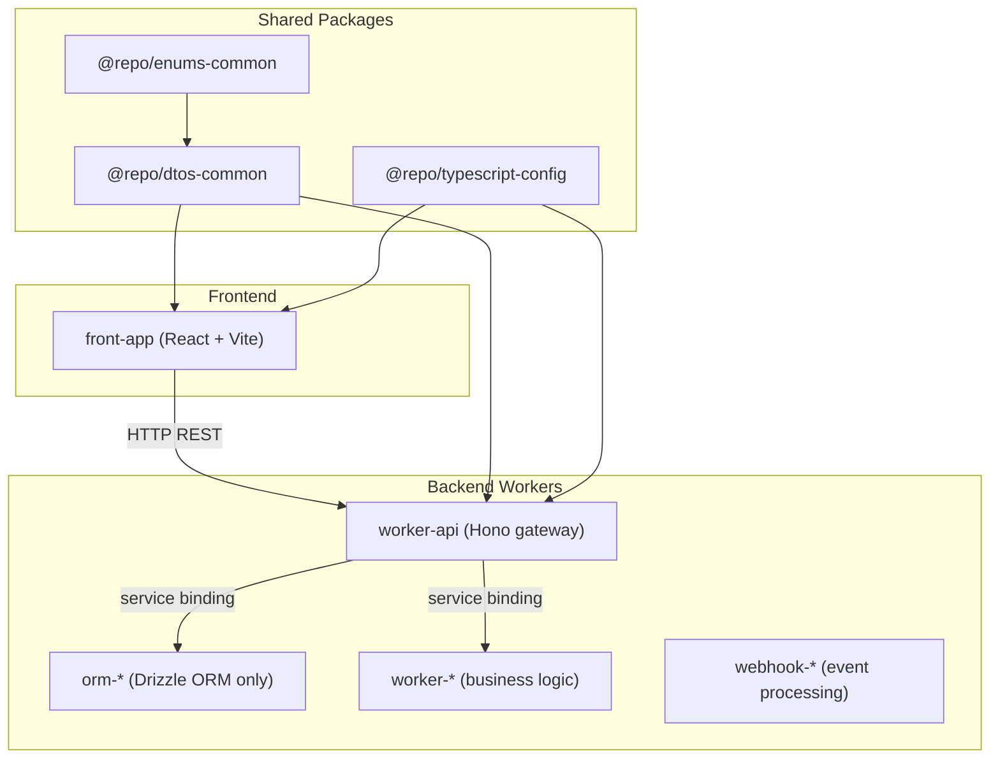

# Monorepo starter based on pnpm with Cloudflare, Hono, React, Vite and Tailwind 🚚⛅

[](https://biomejs.dev/)
[](https://www.typescriptlang.org/)
[](https://developers.cloudflare.com/)
[](https://pnpm.io/)
[](https://turbo.build/repo/docs)

A minimal, production-oriented monorepo starter built on pnpm workspaces with Turborepo, Cloudflare Workers, Hono, React, Vite, and Tailwind. It supports a service-oriented backend architecture (Workers can communicate via service bindings) alongside frontend applications that call backend services over HTTP.

## Architecture Overview

### Monorepo Structure

```
monorepo/
├── apps/                    # Individual Cloudflare Workers and Applications
│   ├── worker-api/          # REST API gateway
│   └── front-app/           # React-based frontend application
├── packages/                # Shared packages
│   ├── dtos-common/         # Shared data transfer objects
│   ├── enums-common/        # Shared enumerations
│   └── typescript-config/   # TypeScript configurations
├── make/                    # Makefile includes
├── package.json             # Root package configuration
├── pnpm-workspace.yaml      # Workspace configuration
├── turbo.json               # Turborepo configuration
└── tsconfig.json            # Root TypeScript configuration
```

### Architecture Components

The monorepo is organized into two main categories: **Backend Services** and **Frontend Applications**, plus **Shared Packages** for common functionality.



#### Backend Services

The backend consists of Cloudflare Workers organized by responsibility:

**API Gateway**
- **`worker-api`** - REST API gateway built with Hono and Cloudflare Workers (CORS, compression, body limits, secure headers, request validation, error handling, etc.)

#### Frontend Applications

The frontend provides user interfaces built with React and deployed on Cloudflare Workers:

**Frontend Application**
- **`front-app`** - React-based frontend application built with Vite 8 and deployed on Cloudflare Workers (static asset serving, code splitting, lazy loading, etc.). Communicates with backend services via REST APIs.

## Getting Started

**After cloning this repository, always run:**
```sh
pnpm install
```
Or using make shortcut commands:
```sh
make install
make login  # Login to Cloudflare (required for workers with remote resources)
```
This will install all dependencies (including Turbo) and link your workspace packages. You must do this before running any Turbo commands or developing any app or worker.

Notes:
- If you plan to use Wrangler features that require Cloudflare auth (e.g. deploying, or any Worker dev flow that touches remote resources), log in using the repo-pinned Wrangler version via `make login`.
- This repo pins `pnpm` via `packageManager` in the root `package.json`. Use that version (or newer compatible) to avoid workspace resolution differences.

**Then set up git hooks:**
```sh
make prepare
```
This installs Husky git hooks to ensure code quality standards are enforced on commit. See the [Git Hooks](#git-hooks) section for more details.

### First successful run (verify locally)

1. Start dev servers from the repo root:
   ```sh
   make dev
   ```
2. Verify the API is running:
   - `GET` `http://localhost:8725/api/v1/health`
3. Open the frontend dev server:
   - `http://localhost:5174`

## Make Commands

| Command         | Description                                         |
|-----------------|-----------------------------------------------------|
| install         | Initialize the project and install dependencies      |
| install-frozen  | Install dependencies with frozen lockfile (CI)      |
| login           | Login to Cloudflare using the project's wrangler version |
| update          | Update dependencies to their latest versions        |
| check           | Check the codebase for issues                       |
| deploy          | Deploy all apps/workers (via Turborepo)             |
| build           | Build all packages and apps (via Turborepo)         |
| format          | Format the codebase using Biome                     |
| lint            | Lint the codebase using Biome                       |
| dev             | Start dev servers (via Turborepo)                   |
| preview         | Preview production builds locally (via Turborepo)    |
| types           | Generate worker-configuration.d.ts files recursively |
| check-types     | Check TypeScript types across all workers and packages |
| ci              | Run CI checks (format/lint/check)                   |
| prepare         | Install or reinstall Husky git hooks                |
| husky-status    | Show Husky hooks status                             |

## Development ports

| Service | Path | port |
|---|---|---:|
| worker-api | `apps/worker-api/wrangler.jsonc` | 8725 |
| front-app | `apps/front-app/package.json` (Vite dev) | 5174 |

Notes:
- These are development ports defined in each app's `dev` block in `wrangler.jsonc` (for workers) or Vite configuration (for frontend apps).
- The repository reserves the 8700–8799 range for local development ports to keep services grouped and avoid accidental collisions with common system ports.
Rule of thumb:
- **Workers**: `wrangler.jsonc` → `dev.port`
- **Frontend**: Vite dev server port (typically in `package.json` scripts / Vite config)
Port convention:
- 8700–8710: core ORMs and database services
- 8720–8729: application workers (business logic)
- 8760–8769: external integrations and webhooks
- 5170–5179: frontend applications (Vite dev servers)

## 1. Create a New Cloudflare Worker

### App Naming Nomenclature

| Purpose                | Prefix   | Example Name           |
|------------------------|----------|------------------------|
| ORM (database access)  | orm-     | orm-account           |
| Business logic worker  | worker-  | worker-crawling       |
| Webhook worker         | webhook- | webhook-clerk         |
| Frontend application   | front-   | front-app             |

### Key Distinctions

- **ORM Workers (`orm-*`):** Handle ONLY database schemas, migrations, and SQL operations using Drizzle ORM. No business logic.
- **Business Logic Workers (`worker-*`):** Implement business logic, call ORM workers via service bindings for data operations.
- **Webhook Workers (`webhook-*`):** Handle webhook events from external services.
- **Frontend Applications (`front-*`):** React-based applications using Vite for development and Cloudflare Workers for edge deployment. They communicate with backend workers via REST APIs, not service bindings.

**After creating a new worker, always run:**
```sh
make install
```

This will install all dependencies (including Turbo) and link your workspace packages. You need to do this before running any Turbo commands or developing your new worker.

Both commands will scaffold a new Worker project in `apps/worker-name` with all the recommended flags for this monorepo.

## 3. Develop a Specific Worker

To start development for a specific Worker, use the worker's Makefile:

```sh
cd apps/worker-name
make dev
```

Or use Turbo's filter flag from the root directory:

```sh
pnpm turbo dev --filter=worker-name
```

- This runs the `dev` script defined in `apps/worker-name/package.json`
- You can open the port shown in your terminal (for example, http://localhost:8721) to view your Worker locally
- Each worker has its own Makefile with commands like: `make dev`, `make format`, `make lint`, `make types`, `make check-types`, `make deploy`

### Testing Service Bindings Between Workers

1. **Start the target worker (e.g., ORM service):**
   ```bash
   cd apps/orm-account
   make dev
   ```

2. **Start the calling worker in another terminal:**
   ```bash
   cd apps/worker-api
   make dev
   ```

3. **Verify bindings:** Check that service bindings show as "connected" in the wrangler output

### Dual-Handler Pattern

Workers that implement queue consumption follow a dual-handler architecture:

```
src/
├── handlers/
│   ├── request.ts    # HTTP request processing (dev/testing)
│   └── message.ts    # Queue message consumption (production)
├── services/         # Shared business logic
└── index.ts         # Minimal delegation entry point
```

This pattern provides:
- **Separation of Concerns:** Each handler focuses on specific request types
- **Code Reusability:** Shared services eliminate duplication
- **Testability:** Handlers can be unit tested independently
- **Maintainability:** Business logic centralized in services

## 4. Environment Configuration

Each worker uses environment-specific configuration:

### Development Environment
- **Configuration:** `.dev.vars` files for local environment variables

### Staging/Production Environments
- **Configuration:** Environment variables defined in `wrangler.jsonc`
- **Service Bindings:** Connected to deployed workers

### Environment Variables Example

```jsonc
// In wrangler.jsonc
{
  "name": "my-worker",
  "vars": {
    "ENVIRONMENT": "dev"
  },
  "env": {
    "production": {
      "vars": {
        "ENVIRONMENT": "production"
      }
    }
  }
}
```

### Service Binding Configuration

```jsonc
{
  "services": [
    {
      "binding": "WORKER_API",
      "service": "worker-api"
    }
  ]
}
```

## 5. Deploy Your Workers

- **Deploy all workers:**
  ```sh
  make deploy
  ```

- **Deploy a specific worker:**
  ```sh
  cd apps/worker-name
  make deploy
  ```

## Best Practices

### Architecture Best Practices

- **Keep ORM workers schema-only:** No business logic, only database schemas, migrations, and SQL operations
- **Implement dual-handler pattern:** For queue-consuming workers, separate HTTP and message handlers
- **Use service bindings:** For inter-worker communication instead of HTTP calls
- **Maintain clear separation of concerns:** Each worker has a specific responsibility

### Development Best Practices

- **Always run `make install`** after adding workers or dependencies
- **Use `make dev`** for focused development on specific workers
- **Follow naming conventions:** `orm-*` for data layer, `worker-*` for business logic
- **Use appropriate port ranges:** 8700-8710 for ORMs, 8720-8729 for workers, 8760-8769 for integrations
- **Test service bindings:** Verify connections between workers before deployment

### Code Quality Best Practices

- **Use strict TypeScript everywhere:** Enforce type safety across all workers
- **Validate all data with Zod schemas:** Ensure data integrity and type safety
- **Implement comprehensive error handling:** Use CoreError-based system for structured error management
- **Follow Biome formatting standards:** Consistent code style across the monorepo
- **Use shared packages:** Leverage `@repo/*` packages for common functionality

### Service Communication

Workers communicate via service bindings:

```typescript
// Call ORM service
const result = await env.ACCOUNT_SERVICE.getAccount(userId);

// Call AI service
const completion = await env.WORKER_GENAI.completion(request);
```

## Git Hooks

This repository uses [Husky](https://typicode.github.io/husky/) to automate git hooks and ensure code quality standards are enforced before commits.

### Pre-commit Hook

The pre-commit hook automatically formats staged files using Biome before each commit. This ensures consistent code formatting across the repository without requiring manual intervention.

The hook uses `git-format-staged` to only format files that are staged for commit, making the process fast and efficient.

### Setup

After cloning the repository or when working with a fresh checkout, run:

```sh
make prepare
```

This installs or reinstalls the Husky git hooks, ensuring they are properly configured in your local repository.

### Verify Hooks

To check the status of your Husky hooks and see which hooks are available, run:

```sh
make husky-status
```

This will display all configured hooks and verify they are executable.

### How It Works

1. **On commit:** Before a commit is finalized, Husky runs the pre-commit hook
2. **Auto-formatting:** The hook formats all staged files using Biome
3. **Automatic:** If formatting makes changes, the commit continues with the formatted files
4. **No interruption:** The process is transparent and doesn't require additional steps

This ensures that all committed code follows the project's formatting standards automatically.

## Shared Packages (`@repo/*`)

The monorepo uses `@repo/*` packages for shared functionality across workers. These are **local packages** that live inside the `packages/` directory and provide common utilities, configurations, and data structures.

### Available Shared Packages

- **`@repo/dtos-common`** - Shared data transfer objects and Zod validation schemas
- **`@repo/enums-common`** - Shared enumerations and constants (error codes, status enumerations, GenAI-specific enums)
- **`@repo/typescript-config`** - TypeScript configuration presets (base, workers, workers-lib)

### Benefits of Shared Packages
- **Code sharing:** Eliminate duplication across workers
- **Consistency:** Centralized configurations and utilities
- **Easy updates:** Update once, propagate to all workers
- **Type safety:** Shared TypeScript configurations ensure consistency

### How to Use Shared Packages

1. **Add to your worker's `package.json`:**
   ```json
   "dependencies": {
     "@repo/dtos-common": "workspace:*",
     "@repo/enums-common": "workspace:*",
     "@repo/typescript-config": "workspace:*"
   }
   ```

2. **Import and use in your code:**
   ```typescript
   import { Subject } from "@repo/enums-common";
   import { BaseRequestSchema } from "@repo/dtos-common/api";
   ```

3. **Development workflow:**
   - Changes in shared packages are reflected immediately in workers
   - Run `make install` after adding new shared package dependencies

### More Information
- [pnpm workspace protocol docs](https://pnpm.io/workspaces#workspace-protocol)
- [Turborepo monorepo docs](https://turbo.build/repo/docs)

## Service Bindings

Service bindings allow Workers to communicate directly with each other without going through publicly accessible URLs. They provide the separation of concerns that microservice architectures offer, without configuration pain, performance overhead, or the need to learn RPC protocols.

### Key Benefits

- **Zero overhead:** Workers run on the same thread, providing zero latency
- **Not just HTTP:** Direct method calls between Workers using JavaScript functions
- **No additional costs:** Service bindings don't increase Cloudflare pricing
- **Secure communication:** No public URLs required

### Configuration

Add service bindings to your worker's `wrangler.jsonc`:

```jsonc
{
  "services": [
    {
      "binding": "BUSINESS_LOGIC_SERVICE",
      "service": "worker-name"
    }
  ]
}
```

### RPC Method Invocation

Workers can call methods directly on other workers:

```typescript
// In a business logic worker
export default {
  async fetch(request: Request, env: Env) {
    // Call ORM service directly
    const result = await env.BUSINESS_LOGIC_SERVICE.doSomething(request);

    return new Response(JSON.stringify(result));
  }
}
```
