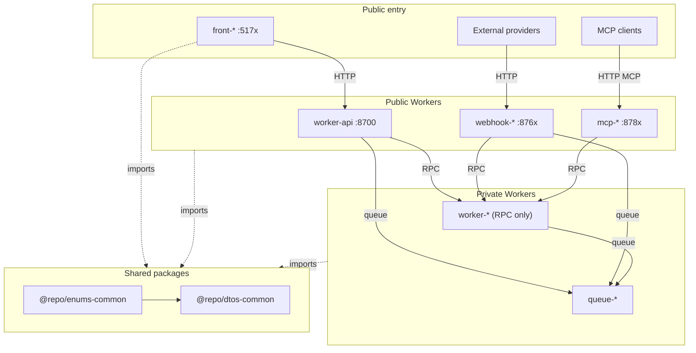

# Monorepo starter based on pnpm with Cloudflare, Hono, React, Vite and Tailwind 🚚⛅

[](https://oxc.rs/)
[](https://www.typescriptlang.org/)
[](https://developers.cloudflare.com/)
[](https://pnpm.io/)
[](https://turbo.build/repo/docs)

A minimal, production-oriented monorepo starter built on pnpm workspaces with Turborepo, Cloudflare Workers, Hono, React, Vite, and Tailwind. Frontends and webhooks talk to the public HTTP gateway; Worker-to-Worker calls use service-binding RPC (no extra request fee on Workers Standard).

## Architecture Overview

### Monorepo Structure

```
monorepo/
├── apps/                    # Individual Cloudflare Workers and Applications
│   ├── worker-api/          # REST API gateway
│   └── front-app/           # React-based frontend application
├── packages/                # Shared packages
│   ├── dtos-common/         # Shared data transfer objects
│   ├── enums-common/        # Shared constrained string values (`as const`)
│   └── typescript-config/   # TypeScript configurations
├── make/                    # Makefile includes
├── package.json             # Root package configuration
├── pnpm-workspace.yaml      # Workspace configuration
├── turbo.json               # Turborepo configuration
└── tsconfig.json            # Root TypeScript configuration
```

### Architecture Components

The monorepo is organized into two main categories: **Backend Services** and **Frontend Applications**, plus **Shared Packages** for common functionality.



#### Backend Services

Cloudflare Workers are organized by runtime role:

- **`worker-api`** - Public HTTP gateway (Hono): CORS, validation, routing; coordinates internal Workers via RPC.
- **`worker-*`** - Business logic over **service-binding RPC** only (no public routes in production). May own Drizzle schema under `src/db/` and that database’s binding (exclusive owner).
- **`queue-*`** - Queue-only consumers (`queue()` handler). Messages can be produced by `worker-api`, `worker-*`, or `webhook-*`. Use dual-handler layout when a local HTTP debug path is useful.
- **`webhook-*`** - Public HTTP ingress for external provider callbacks; forward work via RPC or queues.
- **`mcp-*`** - Public HTTP MCP servers; thin tools that call `worker-*` over RPC.

Do **not** create shared `packages/db-*` schema packages. Put Drizzle schema under the owning app’s `src/db/` and keep **one DB binding owner**. Other apps reach that data via **service-binding RPC** (or a queue) — do not attach the same DB binding to multiple apps.

#### Frontend Applications

- **`front-app`** - React SPA (Vite 8) deployed on Cloudflare Workers. Talks to `worker-api` over HTTP only - never via service bindings.

## Getting Started

**After cloning this repository, always run:**
```sh
pnpm install
```
Or using make shortcut commands:
```sh
make install
make login  # Login to Cloudflare (required for workers with remote resources)
```
This will install all dependencies (including Turbo) and link your workspace packages. You must do this before running any Turbo commands or developing any app or worker.

Notes:
- If you plan to use Wrangler features that require Cloudflare auth (e.g. deploying, or any Worker dev flow that touches remote resources), log in using the repo-pinned Wrangler version via `make login`.
- This repo pins `pnpm` via `packageManager` in the root `package.json`. Use that version (or newer compatible) to avoid workspace resolution differences.

**Then set up git hooks:**
```sh
make prepare
```
This installs Husky git hooks to ensure code quality standards are enforced on commit. See the [Git Hooks](#git-hooks) section for more details.

### First successful run (verify locally)

1. Start dev servers from the repo root:
   ```sh
   make dev
   ```
2. Verify the API is running:
   - `GET` `http://localhost:8700/api/v1/health`
3. Open the frontend dev server:
   - `http://localhost:5174`

## Make Commands

| Command         | Description                                         |
|-----------------|-----------------------------------------------------|
| install         | Initialize the project and install dependencies      |
| install-frozen  | Install dependencies with frozen lockfile (CI)      |
| login           | Login to Cloudflare using the project's wrangler version |
| update          | Update dependencies to their latest versions        |
| check           | Check the codebase for issues                       |
| deploy          | Deploy all apps/workers (via Turborepo)             |
| build           | Build all packages and apps (via Turborepo)         |
| format          | Format the codebase using oxfmt                     |
| lint            | Lint the codebase using oxlint                      |
| dev             | Start dev servers (via Turborepo)                   |
| preview         | Preview production builds locally (via Turborepo)    |
| types           | Generate worker-configuration.d.ts files recursively |
| check-types     | Check TypeScript types across all workers and packages |
| ci              | Run CI checks (format/lint/check)                   |
| prepare         | Install or reinstall Husky git hooks                |
| husky-status    | Show Husky hooks status                             |

## Development ports

Mnemonic: **87xx = Workers** (gateway → business → queue → webhook → MCP → reserve). Frontends use Vite’s **51xx / 41xx**.

| Role | Prefix | Local HTTP ports |
|------|--------|------------------|
| HTTP gateway | `worker-api` | **8700–8709** |
| Business worker (RPC) | `worker-*` | **8710–8739** |
| Queue-only consumer | `queue-*` | **8740–8759** |
| Webhook ingress | `webhook-*` | **8760–8779** |
| MCP server | `mcp-*` | **8780–8789** |
| Growth reserve | - | **8790–8799** |
| Frontend (Vite) | `front-*` | **5170–5199** (dev), **4170–4199** (preview) |

### Assigned registry

| Service | Path | Dev | Preview |
|---------|------|----:|--------:|
| worker-api | `apps/worker-api/wrangler.jsonc` | **8700** | - |
| front-app | `apps/front-app/vite.config.ts` | **5174** | **4174** |

Notes:
- Workers: set `dev.port` in `wrangler.jsonc` and `monorepo.devPort` in `package.json`. Use `inspector_port: 0`.
- Frontends: set Vite `server.port` / `preview.port` with `strictPort: true`.
- Assign the next free port in the role’s range. RPC and queue-only apps still get a local port for standalone `wrangler dev`, but have no public URL in production.
- Prefer multi-config local runs when testing bindings (first `-c` is HTTP-primary).

## 1. Create a New Cloudflare Worker

### App Naming Nomenclature

| Purpose | Prefix | Example |
|---------|--------|---------|
| HTTP gateway | `worker-api` (sticky) | `worker-api` |
| Business logic (RPC) | `worker-` | `worker-account` |
| Queue-only consumer | `queue-` | `queue-email` |
| Webhook ingress | `webhook-` | `webhook-example` |
| MCP server | `mcp-` | `mcp-tools` |
| Frontend application | `front-` | `front-app` |

### Key Distinctions

- **Gateway (`worker-api`):** Public HTTP only; validates requests and calls `worker-*` over RPC.
- **Business Workers (`worker-*`):** RPC-only in production (`WorkerEntrypoint`); may own Drizzle schema under `src/db/` and that database’s binding (exclusive). If they also consume queues, keep this prefix and use the dual-handler layout.
- **Queue-only (`queue-*`):** `queue()` consumers with no public HTTP in production; may own schema when they are the sole writer for that data.
- **Webhook Workers (`webhook-*`):** Public HTTP for external callbacks; forward via RPC or queues.
- **MCP Servers (`mcp-*`):** Public HTTP MCP transport; thin tools that call `worker-*` over RPC - never rotate long-lived credentials on this surface.
- **Frontends (`front-*`):** React + Vite; HTTP to the gateway only - never service bindings.
- **Do not** create shared `packages/db-*` schema packages.

**After creating a new worker, always run:**
```sh
make install
```

This will install all dependencies (including Turbo) and link your workspace packages. You need to do this before running any Turbo commands or developing your new worker.

Both commands will scaffold a new Worker project in `apps/worker-name` with all the recommended flags for this monorepo.

## 3. Develop a Specific Worker

To start development for a specific Worker, use the worker's Makefile:

```sh
cd apps/worker-name
make dev
```

Or use Turbo's filter flag from the root directory:

```sh
pnpm turbo dev --filter=worker-name
```

- This runs the `dev` script defined in `apps/worker-name/package.json`
- You can open the port shown in your terminal (for example, http://localhost:8721) to view your Worker locally
- Each worker has its own Makefile with commands like: `make dev`, `make format`, `make lint`, `make types`, `make check-types`, `make deploy`

### Testing Service Bindings Between Workers

Prefer a single multi-config `wrangler dev` (first `-c` is HTTP-primary):

```sh
wrangler dev -c apps/worker-api/wrangler.jsonc -c apps/worker-account/wrangler.jsonc
```

Or run each Worker in its own terminal (`cd apps/worker-account && make dev`, then `cd apps/worker-api && make dev`) and confirm service bindings show as connected in the wrangler output.

### Dual-Handler Pattern

Use this layout for **`queue-*`** apps and for **`worker-*`** apps that also consume queues:

```
src/
├── handlers/
│   ├── request.ts    # Optional HTTP (local debug only)
│   └── message.ts    # Queue message consumption
├── services/         # Shared business logic
└── index.ts         # Minimal delegation entry point
```

- **`queue-*`:** queue-only in production (no public HTTP).
- **`worker-*` with queues:** keep the business prefix; expose RPC and optionally dual-handler HTTP for local testing.
## 4. Environment Configuration

Each worker uses environment-specific configuration:

### Development Environment
- **Configuration:** `.dev.vars` files for local environment variables

### Staging/Production Environments
- **Configuration:** `env.staging` and `env.production` blocks in `wrangler.jsonc`
- **Deploy:** `wrangler deploy --env staging` or `--env production`
- **Service Bindings:** Connected to deployed workers

### Environment Variables Example

```jsonc
// In wrangler.jsonc
{
  "$schema": "../../node_modules/wrangler/config-schema.json",
  "name": "my-worker",
  "compatibility_date": "2026-07-08",
  "compatibility_flags": ["nodejs_compat"],
  "vars": {
    "ENVIRONMENT": "dev"
  },
  "env": {
    "staging": {
      "vars": { "ENVIRONMENT": "staging" },
      "observability": { "enabled": true, "traces": { "enabled": true } }
    },
    "production": {
      "vars": { "ENVIRONMENT": "production" },
      "observability": { "enabled": true, "traces": { "enabled": true } }
      // "routes": [{ "pattern": "api.example.com", "custom_domain": true }]
    }
  }
}
```

### Multi-worker local dev

When service bindings connect Workers, run each in a separate terminal, or use multiple `-c` flags (first config is HTTP-primary):

```sh
wrangler dev -c apps/worker-api/wrangler.jsonc -c apps/worker-example/wrangler.jsonc
```
### Service Binding Configuration

```jsonc
{
  "services": [
    {
      "binding": "WORKER_API",
      "service": "worker-api"
    }
  ]
}
```

## 5. Deploy Your Workers

- **Deploy all workers:**
  ```sh
  make deploy
  ```

- **Deploy a specific worker:**
  ```sh
  cd apps/worker-name
  make deploy
  ```

## Best Practices

### Architecture Best Practices

- **Colocate schema under the owning Worker’s `src/db/`:** never a shared `packages/db-*` package; never share the same DB binding across apps — other apps use RPC (or a queue)
- **Implement dual-handler pattern:** For queue consumers, separate message handling from optional local HTTP debug handlers
- **Use service bindings (RPC):** For inter-worker communication instead of HTTP calls
- **Maintain clear separation of concerns:** Each Worker has a specific runtime role (gateway, business, queue, webhook, MCP, frontend)

### Development Best Practices

- **Always run `make install`** after adding workers or dependencies
- **Use `make dev`** for focused development on specific workers
- **Follow naming conventions:** `worker-*`, `queue-*`, `webhook-*`, `mcp-*`, `front-*`
- **Use appropriate port ranges:** see [Development ports](#development-ports)
- **Test service bindings:** Verify connections between workers before deployment

### Code Quality Best Practices

- **Use strict TypeScript everywhere:** Enforce type safety across all workers
- **Validate all data with Zod schemas:** Ensure data integrity and type safety
- **Implement comprehensive error handling:** Use CoreError-based system for structured error management
- **Follow OXC formatting standards:** Consistent code style across the monorepo (oxfmt + oxlint)
- **Use shared packages:** Leverage `@repo/*` packages for wire contracts and configs

### Service Communication

Workers communicate via service bindings:

```typescript
// Call a business Worker over RPC
const result = await env.ACCOUNT_SERVICE.getAccount(userId);

// Call another business Worker
const completion = await env.WORKER_GENAI.completion(request);
```
## Git Hooks

This repository uses [Husky](https://typicode.github.io/husky/) to automate git hooks and ensure code quality standards are enforced before commits.

### Pre-commit Hook

The pre-commit hook automatically formats staged files using oxfmt and runs the repository-wide oxlint safe fixer before each commit. This ensures consistent code formatting and catches lint issues before CI.

The hook uses `git-format-staged` so formatting touches only staged files. The lint fixer checks the full repository.

### Setup

After cloning the repository or when working with a fresh checkout, run:

```sh
make prepare
```

This installs or reinstalls the Husky git hooks, ensuring they are properly configured in your local repository.

### Verify Hooks

To check the status of your Husky hooks and see which hooks are available, run:

```sh
make husky-status
```

This will display all configured hooks and verify they are executable.

### How It Works

1. **On commit:** Before a commit is finalized, Husky runs the pre-commit hook
2. **Auto-formatting:** The hook formats staged files using oxfmt
3. **Linting:** The hook runs the repository-wide oxlint safe fixer
4. **No interruption:** The process is transparent and doesn't require additional steps

This ensures that all committed code follows the project's formatting standards automatically.

## AI agent instructions

- **[AGENTS.md](AGENTS.md)** - cross-tool project conventions and Cursor's root instructions.
- **[CLAUDE.md](CLAUDE.md)** - Claude Code entry point; imports `AGENTS.md` per [Claude memory docs](https://code.claude.com/docs/en/memory).
- **Per-app/package** - each workspace has matching `AGENTS.md` and `CLAUDE.md`; both tools apply nested instructions by directory.
- **Rules** - mirrored category trees under `.cursor/rules/**/*.mdc` and `.claude/rules/**/*.md`. Categories organize rules; frontmatter (`globs`/`alwaysApply` for Cursor, `paths` for Claude Code) controls scope.
- **Security** - `.cursorignore` reduces model context but is not an access-control boundary; permissions, sandboxing, hooks, and filesystem controls enforce sensitive operations.

## Shared Packages (`@repo/*`)

The monorepo uses `@repo/*` packages for shared functionality across workers. These are **local packages** that live inside the `packages/` directory and provide common utilities, configurations, and data structures.

### Available Shared Packages

- **`@repo/dtos-common`** - Shared data transfer objects and Zod validation schemas
- **`@repo/enums-common`** - Shared constrained string values (`as const` objects) for HTTP methods, statuses, headers, etc.
- **`@repo/typescript-config`** - TypeScript configuration presets (`strict.json`, `workers.json`, `workers-lib.json`, `vite-react.json`, `vite-node.json`)

### Benefits of Shared Packages
- **Code sharing:** Eliminate duplication across workers
- **Consistency:** Centralized configurations and utilities
- **Easy updates:** Update once, propagate to all workers
- **Type safety:** Shared TypeScript configurations ensure consistency

### How to Use Shared Packages

1. **Add to your worker's `package.json`:**
   ```json
   "dependencies": {
     "@repo/dtos-common": "workspace:*",
     "@repo/enums-common": "workspace:*",
     "@repo/typescript-config": "workspace:*"
   }
   ```

2. **Import and use in your code:**
   ```typescript
   import { HttpMethod } from "@repo/enums-common";
   import { HealthResponseSchema } from "@repo/dtos-common/api";
   ```

3. **Development workflow:**
   - Changes in shared packages are reflected immediately in workers
   - Run `make install` after adding new shared package dependencies

### More Information
- [pnpm workspace protocol docs](https://pnpm.io/workspaces#workspace-protocol)
- [Turborepo monorepo docs](https://turbo.build/repo/docs)

## Service Bindings

Service bindings allow Workers to communicate directly with each other without going through publicly accessible URLs. They provide the separation of concerns that microservice architectures offer, without configuration pain, performance overhead, or the need to learn RPC protocols.

### Key Benefits

- **Zero overhead:** Workers run on the same thread, providing zero latency
- **Not just HTTP:** Direct method calls between Workers using JavaScript functions
- **No additional costs:** Service bindings don't increase Cloudflare pricing
- **Secure communication:** No public URLs required

### Configuration

Add service bindings to your worker's `wrangler.jsonc`:

```jsonc
{
  "services": [
    {
      "binding": "BUSINESS_LOGIC_SERVICE",
      "service": "worker-name"
    }
  ]
}
```

### RPC Method Invocation

RPC requires the **callee** to extend `WorkerEntrypoint` and expose public methods. The **caller** gets typed `env.BINDING.method()` stubs from `wrangler types` when you pass every bound Worker's config (see [Workers RPC - TypeScript](https://developers.cloudflare.com/workers/runtime-apis/rpc/typescript/)).

**Callee** (`worker-name`):

```typescript
import { WorkerEntrypoint } from "cloudflare:workers";

export default class extends WorkerEntrypoint {
  async fetch() {
    return new Response("ok");
  }
  doSomething(input: string) {
    return { input, ok: true };
  }
}
```

**Caller** (e.g. `worker-api`):

```typescript
export default {
  async fetch(_request: Request, env: Env): Promise<Response> {
    const result = await env.BUSINESS_LOGIC_SERVICE.doSomething("payload");
    return Response.json(result);
  },
} satisfies ExportedHandler<Env>;
```

Regenerate types on the caller after adding bindings:

```bash
wrangler types -c ./wrangler.jsonc -c ../worker-name/wrangler.jsonc
```
