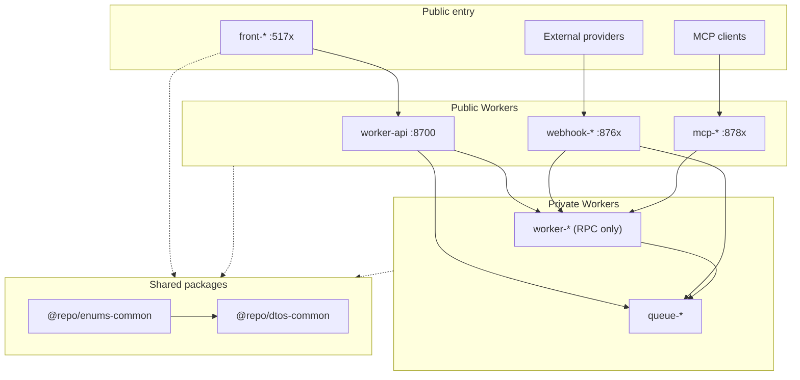
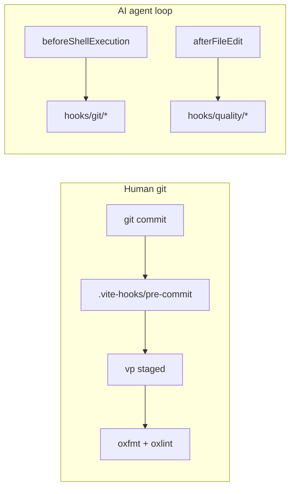

<p align="center">
  <a href="https://github.com/louisbrulenaudet/monorepo-template">
    
  </a>
</p>


# Monorepo starter based on pnpm with Cloudflare, Hono, React, Vite and Tailwind 🚚⛅

[](https://oxc.rs/)
[](https://www.typescriptlang.org/)
[](https://developers.cloudflare.com/)
[](https://pnpm.io/)
[](https://turbo.build/repo/docs)

A minimal, production-oriented monorepo starter built on pnpm workspaces with Turborepo, Cloudflare Workers, Hono, React (Vite), **Tailwind CSS v4**, and **TanStack Router/Query**. AI-ready, designed for edge deployment, and structured for production projects that scale.

## Architecture Overview

### Monorepo Structure

Starter apps today (`worker-api`, `front-app`). Prefixes below describe how the repo grows.

```
monorepo/
├── apps/                    # Workers and frontends
│   ├── worker-api/          # REST API gateway
│   └── front-app/           # React SPA (Vite + TanStack)
├── packages/                # Shared @repo/* packages
│   ├── correlation-id/      # Opaque X-Request-Id helpers
│   ├── dtos-common/         # Zod wire contracts (api live; rpc/queue/webhook scaffold)
│   ├── enums-common/        # Shared constrained string values (`as const`)
│   ├── typescript-config/   # TypeScript configuration presets
│   └── vitest-config/       # Shared Vitest factories (Node + Workers pool)
├── hooks/                   # AI agent hooks (not Vite+ git hooks - see hooks/README.md)
├── package.json             # Root package configuration
├── pnpm-workspace.yaml      # Workspace configuration
└── turbo.json               # Turborepo configuration
```

### Architecture Components

The monorepo is organized into two main categories: **Backend Services** and **Frontend Applications**, plus **Shared Packages** for common functionality.


```mermaid
flowchart TB
  subgraph entry [Public entry]
    direction LR
    Front["front-* :517x"]
    Ext["External providers"]
    McpClients["MCP clients"]
  end

  subgraph publicWorkers [Public Workers]
    direction LR
    Gateway["worker-api :8700"]
    Webhook["webhook-* :876x"]
    Mcp["mcp-* :878x"]
  end

  subgraph privateWorkers [Private Workers]
    direction LR
    Biz["worker-* (RPC only)"]
    Queue["queue-*"]
  end

  subgraph shared [Shared packages]
    direction LR
    Enums["@repo/enums-common"]
    DTOs["@repo/dtos-common"]
    Enums --> DTOs
  end

  Front --> Gateway
  Ext --> Webhook
  McpClients --> Mcp

  Gateway --> Biz
  Webhook --> Biz
  Mcp --> Biz

  Gateway --> Queue
  Webhook --> Queue
  Biz --> Queue

  Front -.-> shared
  publicWorkers -.-> shared
  privateWorkers -.-> shared
```

#### Backend Services

Cloudflare Workers are organized by runtime role:

- **`worker-api`** - Public HTTP gateway (Hono): CORS, validation, routing; coordinates internal Workers via RPC.
- **`worker-*`** - Business logic over **service-binding RPC** only (no public routes in production). May own Drizzle schema under `src/db/` and that database’s binding (exclusive owner).
- **`queue-*`** - Queue-only consumers (`queue()` handler). Messages can be produced by `worker-api`, `worker-*`, or `webhook-*`. Use dual-handler layout when a local HTTP debug path is useful.
- **`webhook-*`** - Public HTTP ingress for external provider callbacks; forward work via RPC or queues.
- **`mcp-*`** - Public HTTP MCP servers; thin tools that call `worker-*` over RPC.

Do **not** create shared `packages/db-*` schema packages. Put Drizzle schema under the owning app’s `src/db/` and keep **one DB binding owner**. Other apps reach that data via **service-binding RPC** (or a queue) - do not attach the same DB binding to multiple apps.

#### Frontend Applications

- **`front-app`** - React SPA (Vite 8, Tailwind v4, TanStack Router/Query) deployed on Cloudflare Workers. Talks to `worker-api` over HTTP only - never via service bindings.

### Where to put things

| Task | Location |
|------|----------|
| New API route | `apps/worker-api/src/routes/<feature>.ts` → mount in `src/index.ts` |
| HTTP Zod schemas | `packages/dtos-common/src/api/<feature>.ts` |
| RPC / queue / webhook schemas | `packages/dtos-common/src/<layer>/<feature>.ts` (layer: `rpc`, `queue`, or `webhook`) |
| Shared string value set | `packages/enums-common/src/` |
| Worker-local value set | `apps/<worker>/src/enums/` |
| DB schema (one owner) | `apps/<owner>/src/db/` - never `packages/db-*` |
| Frontend API client | `apps/front-app/src/services/worker-api/<feature>.ts` |
| Frontend page + route | `apps/front-app/src/pages/` + `src/routes/` |
| Local Worker secrets | `apps/<worker>/.dev.vars` (from `.dev.vars.example`) |
| Frontend env | `apps/front-app/.env.local` (from `.env.example`) |

## Getting Started

### Prerequisites

- **Node.js** 24 (see `.nvmrc` and root `package.json` `engines`); we recommend [fnm](https://github.com/Schniz/fnm) for version management
- **pnpm** via the root `packageManager` field (Corepack recommended)
- **Cloudflare account** only if you need `pnpm login` / deploy / remote Worker features

### Install and prepare

```sh
pnpm install
pnpm login     # optional - Cloudflare auth for remote Wrangler features
pnpm prepare   # Vite+ pre-commit hooks
```

No type-generation step: `worker-configuration.d.ts` is **committed**, per Cloudflare's recommendation, so a fresh clone lints and type-checks immediately. After editing a Worker's `wrangler.jsonc`, run `pnpm types` and commit the regenerated file - `pnpm run ci` runs `pnpm types:check` (`wrangler types --check`), which fails if it has drifted. `wrangler types` runs entirely locally: no Cloudflare auth or network.

Copy env templates before the first run:

- Workers: `apps/<worker>/.dev.vars.example` → `.dev.vars`
- Frontend: `apps/front-app/.env.example` → `.env.local`

Agent worktrees do not copy real env files. Provision isolated development credentials explicitly in each worktree when runtime access is required.

Notes:
- Use `pnpm install` from the repo root so workspace links stay consistent.
- This repo pins `pnpm` via `packageManager` in the root `package.json`.

### First successful run (verify locally)

1. Start all dev servers from the repo root:
   ```sh
   pnpm dev
   ```
2. Verify the API: `GET` `http://localhost:8700/api/v1/health`
3. Open the frontend: `http://localhost:5174`
4. Reveal the Vite DevTools dock with **Shift+Alt+D**. Its Rolldown panel stays
   empty until a build has run: `pnpm turbo run build --filter=front-app`.

Focused work on one package: `pnpm turbo run dev --filter=worker-api` (see [Scoping](#scoping-pnpm--turborepo)).

## Root Scripts (pnpm)

| Command | Description |
|---------|-------------|
| `pnpm install` | Install and link workspace packages |
| `pnpm install --frozen-lockfile` | Install with frozen lockfile (CI) |
| `pnpm login` | Login to Cloudflare (repo-pinned Wrangler) |
| `pnpm update` | Update dependencies to latest (rewrites pnpm catalog) |
| `pnpm check` | Lint + format check (no typecheck) |
| `pnpm run ci` | Full-repo local PR gate: boundaries, lint:check, format:check, types:check, one `turbo run check-types test build`, audit (GitHub CI uses `--affected` for the turbo phase) |
| `pnpm test` | Vitest via `turbo run test` (per-app; Node or Cloudflare pool) |
| `pnpm test:watch` | Vitest watch via `turbo run test:watch` (humans; persistent, uncached) |
| `pnpm boundaries` | Check package dependency tags against `turbo.json` |
| `pnpm changeset` | Record a release intent for the current PR (interactive) |
| `pnpm release:status` | Read-only: pending changesets and the next versions |
| `pnpm deploy` | Deploy all apps/workers (via Turborepo) |
| `pnpm build` | Build all packages and apps (via Turborepo) |
| `pnpm format:fix` | Auto-fix formatting with oxfmt |
| `pnpm lint:fix` | Auto-fix lint issues with oxlint |
| `pnpm lint:agent` | Lint with machine-readable `--format=agent` output (no auto-fix) |
| `pnpm dev` | Start all dev servers (via Turborepo) |
| `pnpm preview` | Build and preview `front-app` locally (via Turborepo) |
| `pnpm types` | Regenerate `worker-configuration.d.ts` (commit it) |
| `pnpm types:check` | Verify committed Worker types match `wrangler.jsonc` |
| `pnpm check-types` | TypeScript across all workers and packages |
| `pnpm prepare` | Install or reinstall Vite+ git hooks (`vp config`) |
| `pnpm skills-update` | Refresh locked agent skills (see AGENTS.md) |

### Scoping (pnpm / Turborepo)

Pass turbo flags on turbo-backed tasks (`dev`, `build`, `check-types`, `test`, `test:watch`, `deploy`):

| Flag | Effect | Example |
|------|--------|---------|
| `--filter=<package>` | One package | `pnpm turbo run dev --filter=worker-api` |
| `--filter=...pkg...` | Package + dependents/deps | `pnpm turbo run build --filter=...front-app...` |
| `--affected` | Only changed packages vs base | `pnpm turbo run build --affected` |

Local `pnpm run ci` is full-repo (no `--affected`). GitHub CI runs `check-types`, `test`, and `build` with `--affected`, and always verifies app `types:check`.

## Development ports

Mnemonic: **87xx = Workers** (gateway → business → queue → webhook → MCP → reserve). Frontends use Vite’s **51xx / 41xx**.

| Role | Prefix | Local HTTP ports |
|------|--------|------------------|
| HTTP gateway | `worker-api` | **8700–8709** |
| Business worker (RPC) | `worker-*` | **8710–8739** |
| Queue-only consumer | `queue-*` | **8740–8759** |
| Webhook ingress | `webhook-*` | **8760–8779** |
| MCP server | `mcp-*` | **8780–8789** |
| Growth reserve | - | **8790–8799** |
| Frontend (Vite) | `front-*` | **5170–5199** (dev), **4170–4199** (preview) |

### Assigned registry

| Service | Path | Dev | Preview |
|---------|------|----:|--------:|
| worker-api | `apps/worker-api/wrangler.jsonc` | **8700** | - |
| front-app | `apps/front-app/vite.config.ts` | **5174** | **4174** |

Notes:
- Workers: set `dev.port` in `wrangler.jsonc` and `monorepo.devPort` in `package.json`. Use `inspector_port: 0`.
- Frontends: set Vite `server.port` / `preview.port` with `strictPort: true`.
- Assign the next free port in the role’s range. RPC and queue-only apps still get a local port for standalone `wrangler dev`, but have no public URL in production.
- Prefer multi-config local runs when testing bindings (first `-c` is HTTP-primary).

## 1. Create a New Cloudflare Worker

### App Naming Nomenclature

| Purpose | Prefix | Example |
|---------|--------|---------|
| HTTP gateway | `worker-api` (sticky) | `worker-api` |
| Business logic (RPC) | `worker-` | `worker-account` |
| Queue-only consumer | `queue-` | `queue-email` |
| Webhook ingress | `webhook-` | `webhook-example` |
| MCP server | `mcp-` | `mcp-tools` |
| Frontend application | `front-` | `front-app` |

### Key Distinctions

- **Gateway (`worker-api`):** Public HTTP only; validates requests and calls `worker-*` over RPC.
- **Business Workers (`worker-*`):** RPC-only in production (`WorkerEntrypoint`); may own Drizzle schema under `src/db/` and that database’s binding (exclusive). If they also consume queues, keep this prefix and use the dual-handler layout.
- **Queue-only (`queue-*`):** `queue()` consumers with no public HTTP in production; may own schema when they are the sole writer for that data.
- **Webhook Workers (`webhook-*`):** Public HTTP for external callbacks; forward via RPC or queues.
- **MCP Servers (`mcp-*`):** Public HTTP MCP transport; thin tools that call `worker-*` over RPC - never rotate long-lived credentials on this surface.
- **Frontends (`front-*`):** React + Vite; HTTP to the gateway only - never service bindings.
- **Do not** create shared `packages/db-*` schema packages.

### Scaffold checklist (copy from an existing app)

There is no generator CLI. Copy the closest sibling under `apps/` and wire it into the monorepo:

1. **Copy** `apps/worker-api` (or another closest match) to `apps/<prefix-name>` (e.g. `apps/worker-account`).
2. **Rename** `package.json` `name`, `wrangler.jsonc` `name`, and any display strings.
3. **Assign ports** from the [Development ports](#development-ports) registry - set `dev.port` / `inspector_port: 0` in `wrangler.jsonc` and `monorepo.devPort` in `package.json`.
4. **Add** `package.json` scripts (`dev`, `deploy`, `check-types`, `types`, `types:check`, lint/format via `pnpm -w exec` from repo root) and a `turbo.json` with tags (see [AGENTS.md](AGENTS.md)).
5. **Extend** `@repo/typescript-config/workers.json` (or the matching preset); add `.dev.vars.example`.
6. **Install and typegen** (commit the generated `worker-configuration.d.ts` with the new Worker):
   ```sh
   pnpm install
   pnpm types
   ```

Copy wrangler patterns (`compatibility_date`, `observability`, `env.staging` / `env.production`) from the existing app - see [`.cursor/rules/backend/workers-config.mdc`](.cursor/rules/backend/workers-config.mdc).

## 2. Develop a Specific Worker

Prefer a filtered turbo task from the repo root:

```sh
pnpm turbo run dev --filter=worker-name
```

Or run the package script directly:

```sh
cd apps/worker-name
pnpm dev
```

- This runs the `dev` script defined in `apps/worker-name/package.json`
- Open the port shown in your terminal (for example, http://localhost:8721)
- Each worker exposes `pnpm dev`, `pnpm format:fix`, `pnpm lint:fix`, `pnpm types`, `pnpm check-types`, `pnpm deploy`

### Testing Service Bindings Between Workers

Prefer a single multi-config `wrangler dev` (first `-c` is HTTP-primary):

```sh
wrangler dev -c apps/worker-api/wrangler.jsonc -c apps/worker-account/wrangler.jsonc
```

Or run each Worker in its own terminal (`cd apps/worker-account && pnpm dev`, then `cd apps/worker-api && pnpm dev`) and confirm service bindings show as connected in the wrangler output.

### Dual-Handler Pattern

Use this layout for **`queue-*`** apps and for **`worker-*`** apps that also consume queues:

```
src/
├── handlers/
│   ├── request.ts    # Optional HTTP (local debug only)
│   └── message.ts    # Queue message consumption
├── services/         # Shared business logic
└── index.ts         # Minimal delegation entry point
```

- **`queue-*`:** queue-only in production (no public HTTP).
- **`worker-*` with queues:** keep the business prefix; expose RPC and optionally dual-handler HTTP for local testing.

## 3. Environment Configuration

Each worker uses environment-specific configuration. Frontends use Vite env files (see [apps/front-app/README.md](apps/front-app/README.md)).

### Development Environment
- **Workers:** `.dev.vars` (from `.dev.vars.example`) for local secrets and overrides
- **Frontend:** `.env.local` (from `.env.example`) - only `VITE_*` keys reach the browser

### Staging/Production Environments
- **Configuration:** `env.staging` and `env.production` blocks in `wrangler.jsonc`
- **Deploy:** `wrangler deploy --env staging` or `--env production`
- **Service Bindings:** Connected to deployed workers

### Environment Variables Example

```jsonc
// In wrangler.jsonc
{
  "$schema": "../../node_modules/wrangler/config-schema.json",
  "name": "my-worker",
  "compatibility_date": "2026-08-11",
  "vars": {
    "ENVIRONMENT": "dev"
  },
  "env": {
    "staging": {
      "vars": { "ENVIRONMENT": "staging" },
      "observability": { "enabled": true, "traces": { "enabled": true } }
    },
    "production": {
      "vars": { "ENVIRONMENT": "production" },
      "observability": { "enabled": true, "traces": { "enabled": true } }
      // "routes": [{ "pattern": "api.example.com", "custom_domain": true }]
    }
  }
}
```

### Multi-worker local dev

When service bindings connect Workers, run each in a separate terminal, or use multiple `-c` flags (first config is HTTP-primary):

```sh
wrangler dev -c apps/worker-api/wrangler.jsonc -c apps/worker-example/wrangler.jsonc
```
### Service Binding Configuration

```jsonc
{
  "services": [
    {
      "binding": "WORKER_API",
      "service": "worker-api"
    }
  ]
}
```

## 4. Release and Deploy Your Workers

### Releases

Versioning is [Changesets](https://changesets.dev). `front-app` and `worker-api` are a `fixed` group, so they always share one version - which is what makes a single `vX.Y.Z` tag a valid release coordinate. **Nothing is published to npm**: every workspace is `private: true`. A release is a git tag plus a Cloudflare Workers promote.

```text
PR ──► CI (--affected) + advisory "does this need a changeset?" comment

merge to main ──► Release workflow
  gate         ALWAYS: runs CI on the merge commit, full graph
  select-mode  changesets pending? → open/update the "chore: release" PR   [END]
               none?               → tag vX.Y.Z (after gate) → newly created?
                                       → CD: versions upload --tag X.Y.Z
                                         → promote @100% → smoke → GitHub Release
```

Day to day:

1. Add `pnpm changeset` to any PR that changes `apps/*` or a shared contract package. Use `pnpm changeset --empty` when a change to a deployable should not ship a release.
2. Check what is queued at any time with `pnpm release:status`.
3. **Merging the `chore: release` PR is the release act.** It lands the version bumps and CHANGELOGs on `main`; `gate` validates that commit; then the tag is cut and CD runs.

> [!IMPORTANT]
> Do not push commits to `changeset-release/main`. That branch is reset from the `main` tip and force-pushed on every push to `main`, so edits are discarded. Corrections belong in a new changeset on `main`.

Contributor walkthrough: [`.changeset/README.md`](.changeset/README.md). Pipeline invariants: [`.claude/rules/ops/release.md`](.claude/rules/ops/release.md).

### Deploys

[`.github/workflows/cd.yml`](.github/workflows/cd.yml) is **called by the Release workflow** once a tag is cut - it is not tag-triggered, because tags created with `GITHUB_TOKEN` do not start workflow runs. It runs, against the tagged commit, in the `production` GitHub Environment:

1. `wrangler versions upload --env production` (with `--strict`, commit `--tag` / `--message`)
2. `wrangler versions deploy <version-id>@100% --yes --env production`
3. `curl` the `/api/v1/health` smoke check, then create the GitHub Release

for `worker-api` and `front-app`. Uploads run in parallel; promotes stay sequential (`worker-api` first) so a partial production state is attributable.

> [!NOTE]
> **CD is paused** until production Environment secrets are configured. Set the repository variable `CD_ENABLED` to `true` in the same act as adding them. Until then, use the local helpers below.

Recovering from a failed release (full table in [`.claude/rules/ops/release.md`](.claude/rules/ops/release.md)):

| Fails | Do this |
| --- | --- |
| `gate` is red | Fix on a PR. No tag and no deploy happened. |
| Tag already exists | Nothing to do - the deploy is skipped by design, not failing. |
| Upload / promote / smoke | The tag stands. Re-run CD via `workflow_dispatch` with the tag, or `pnpm --filter=<app> exec wrangler rollback --env production`. |

**GitHub secrets / variables** (repo-level or on the `production` environment):

| Name | Kind | Purpose |
| --- | --- | --- |
| `CLOUDFLARE_API_TOKEN` | secret | Wrangler auth |
| `CLOUDFLARE_ACCOUNT_ID` | secret | Target account |
| `VITE_API_BASE_URL` | variable | Production API origin baked into `front-app` |
| `CD_ENABLED` | variable | Must be `true` for `release.yml` to call CD; unset leaves the deploy job skipped |

**API token permissions** (scoped token; do not use a global API key):

| Permission | When |
| --- | --- |
| Account → Workers Scripts Edit | Required |
| Account → Account Settings Read | Typical for Wrangler |
| Zone → Workers Routes Edit | Only if using zone routes |
| Account → Secrets Store Edit | Only if binding Secrets Store |

Actual production Worker names: `worker-api-production`, `front-app-production`.

Local helpers:

```sh
# One-shot upload + 100% (same effect as CD, coupled)
pnpm --filter=worker-api run deploy
pnpm --filter=front-app run deploy

# Or split steps
pnpm --filter=worker-api run upload
pnpm --filter=worker-api run promote
```

## Best Practices

### Architecture Best Practices

- **Colocate schema under the owning Worker’s `src/db/`:** never a shared `packages/db-*` package; never share the same DB binding across apps - other apps use RPC (or a queue)
- **Implement dual-handler pattern:** For queue consumers, separate message handling from optional local HTTP debug handlers
- **Use service bindings (RPC):** For inter-worker communication instead of HTTP calls
- **Maintain clear separation of concerns:** Each Worker has a specific runtime role (gateway, business, queue, webhook, MCP, frontend)

### Development Best Practices

- **Always run `pnpm install`** after adding workers or dependencies
- **Use `pnpm turbo run dev --filter=<package>`** for focused development on one app (plain `pnpm dev` starts everything)
- **Follow naming conventions:** `worker-*`, `queue-*`, `webhook-*`, `mcp-*`, `front-*`
- **Use appropriate port ranges:** see [Development ports](#development-ports)
- **Test service bindings:** Verify connections between workers before deployment

### Code Quality Best Practices

- **Use strict TypeScript everywhere:** Enforce type safety across all workers
- **Validate all data with Zod schemas:** Shared contracts live in `@repo/dtos-common`
- **Return explicit HTTP status codes** and typed JSON errors at the gateway boundary
- **Follow OXC formatting standards:** Consistent code style across the monorepo (oxfmt + oxlint)
- **Use shared packages:** Leverage `@repo/*` packages for wire contracts and configs
- **Run `pnpm run ci` before opening a PR** (see [Contribution](#contribution))

### Service Communication

Workers communicate via service bindings:

```typescript
// Call a business Worker over RPC
const result = await env.ACCOUNT_SERVICE.getAccount(userId);

// Call another business Worker
const completion = await env.WORKER_GENAI.completion(request);
```
## Git Hooks

This repo has **two** hook systems. They do not replace each other:

| System | When it runs | Docs |
|--------|--------------|------|
| **Vite+** (`.vite-hooks/`) | Human `git commit` | This section |
| **Agent hooks** (`hooks/`) | Cursor / Claude Code tool loop | [hooks/README.md](hooks/README.md) |


```mermaid
flowchart LR
  subgraph human [Human git]
    Commit["git commit"] --> ViteHooks[".vite-hooks/pre-commit"]
    ViteHooks --> Staged["vp staged"] --> Oxc["oxfmt + oxlint"]
  end
  subgraph agent [AI agent loop]
    Shell["beforeShellExecution"] --> GitHooks["hooks/git/*"]
    Edit["afterFileEdit"] --> Quality["hooks/quality/*"]
  end
```

### Vite+ pre-commit

[Vite+](https://viteplus.dev/guide/commit-hooks) provides the hook dispatcher (`vp config`, run by `pnpm prepare`) and `vp staged`, which applies oxfmt and oxlint safe fixes to staged files, preserving unrelated working-tree edits. Commands live in the `staged` block of the root [`vite.config.ts`](vite.config.ts).

```sh
pnpm prepare       # install / reinstall hooks (runs vp config)
vp hooks status    # verify dispatcher is active
VP_GIT_HOOKS=0 git commit -m "..."  # bypass hooks for one commit
```

## Contribution

- Run **`pnpm run ci`** before opening a PR (boundaries, lint, format, types:check, one `turbo run check-types test build`, audit). GitHub CI mirrors those gates and uses `--affected` for the turbo phase.
- Wire-format changes: update `@repo/dtos-common` and every producer/consumer in the **same PR** (HTTP → `worker-api` + `front-app`).
- When you add endpoints, bindings, or env vars, update the relevant app/package **README** and **AGENTS.md**.

## AI agent instructions

> [!IMPORTANT]
> **Start Claude Code from the repository root.** `CLAUDE.md` files are inherited from parent directories, but `.claude/settings.json` is **not** - [it loads only from the directory you start in](https://code.claude.com/docs/en/large-codebases). A session started in `apps/worker-api/` still loads every instruction file, but none of the permission denies, hooks, or sandbox config in the root `.claude/settings.json`. The session looks correctly configured while the enforcement layer is absent. For package-scoped work, start at the root and use `pnpm turbo run <task> --filter=<package>` instead.

- **[AGENTS.md](AGENTS.md)** - cross-tool project conventions and Cursor's root instructions.
- **[CLAUDE.md](CLAUDE.md)** - Claude Code entry point; imports `AGENTS.md` per [Claude memory docs](https://code.claude.com/docs/en/memory).
- **Per-app/package** - each workspace has matching `AGENTS.md` and `CLAUDE.md`.
- **[hooks/README.md](hooks/README.md)** - shared agent hook scripts (not Vite+ git hooks).
- **Rules** - mirrored trees under `.cursor/rules/**/*.mdc` and `.claude/rules/**/*.md`.
- **Skills** - source of truth under `.agents/skills/` (see skill `monorepo-agent-setup`). Sparse worktrees include `.agents` so mirrored skill links resolve.
- **Versioned Turbo docs** - use `pnpm turbo docs task-caching` to query documentation matching the installed CLI.
- **Security** - `.cursorignore` reduces model context but is not an access-control boundary.

## Shared Packages (`@repo/*`)

Local packages under `packages/`. Each package has its own README.

### Available Shared Packages

- **`@repo/correlation-id`** - Opaque `X-Request-Id` helpers (SPA session wrapper stays in `front-app`)
- **`@repo/dtos-common`** - Zod Mini wire contracts. Public export today: `/api`. Scaffold dirs exist for `/rpc`, `/queue`, `/webhook` - add `package.json` `exports` with the first schema in each layer
- **`@repo/enums-common`** - Shared constrained string values (`as const` objects)
- **`@repo/typescript-config`** - TypeScript presets (`strict.json`, `library.json`, `workers.json`, `vite-react.json`, `vite-node.json`)
- **`@repo/vitest-config`** - Shared Vitest factories (`defineNodeConfig`, `defineWorkersConfig`)

### Benefits of Shared Packages
- **Code sharing:** Eliminate duplication across workers
- **Consistency:** Centralized configurations and utilities
- **Easy updates:** Update once, propagate to all workers
- **Type safety:** Shared TypeScript configurations ensure consistency

### How to Use Shared Packages

1. **Add to your worker's `package.json`:**
   ```json
   "dependencies": {
     "@repo/dtos-common": "workspace:*",
     "@repo/enums-common": "workspace:*",
     "@repo/typescript-config": "workspace:*"
   }
   ```

2. **Import and use in your code:**
   ```typescript
   import { HttpMethod } from "@repo/enums-common";
   import { HealthResponseSchema } from "@repo/dtos-common/api";
   ```

3. **Development workflow:**
   - Changes in shared packages are reflected immediately in workers
   - Run `pnpm install` after adding new shared package dependencies

### More Information
- [pnpm workspace protocol docs](https://pnpm.io/workspaces#workspace-protocol)
- [Turborepo monorepo docs](https://turbo.build/repo/docs)

## Service Bindings

Service bindings allow Workers to communicate directly with each other without going through publicly accessible URLs. They provide the separation of concerns that microservice architectures offer, without configuration pain, performance overhead, or the need to learn RPC protocols.

### Key Benefits

- **Zero overhead:** Workers run on the same thread, providing zero latency
- **Not just HTTP:** Direct method calls between Workers using JavaScript functions
- **No additional costs:** Service bindings don't increase Cloudflare pricing
- **Secure communication:** No public URLs required

### Configuration

Add service bindings to your worker's `wrangler.jsonc`:

```jsonc
{
  "services": [
    {
      "binding": "BUSINESS_LOGIC_SERVICE",
      "service": "worker-name"
    }
  ]
}
```

### RPC Method Invocation

RPC requires the **callee** to extend `WorkerEntrypoint` and expose public methods. The **caller** gets typed `env.BINDING.method()` stubs from `wrangler types` when you pass every bound Worker's config (see [Workers RPC - TypeScript](https://developers.cloudflare.com/workers/runtime-apis/rpc/typescript/)).

**Callee** (`worker-name`):

```typescript
import { WorkerEntrypoint } from "cloudflare:workers";

export default class extends WorkerEntrypoint {
  async fetch() {
    return new Response("ok");
  }
  doSomething(input: string) {
    return { input, ok: true };
  }
}
```

**Caller** (e.g. `worker-api`):

```typescript
export default {
  async fetch(_request: Request, env: Env): Promise<Response> {
    const result = await env.BUSINESS_LOGIC_SERVICE.doSomething("payload");
    return Response.json(result);
  },
} satisfies ExportedHandler<Env>;
```

Regenerate types on the caller after adding bindings:

```bash
wrangler types -c ./wrangler.jsonc -c ../worker-name/wrangler.jsonc
```
