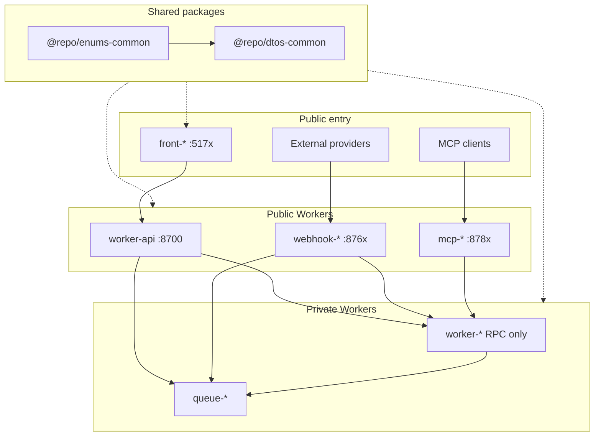

# Monorepo starter based on pnpm with Cloudflare, Hono, React, Vite and Tailwind 🚚⛅

[](https://oxc.rs/)
[](https://www.typescriptlang.org/)
[](https://developers.cloudflare.com/)
[](https://pnpm.io/)
[](https://turborepo.dev/docs)

A minimal, production-oriented monorepo starter built on pnpm workspaces with Turborepo, Cloudflare Workers, Hono, React (Vite), **Tailwind CSS v4**, and **TanStack Router/Query**. It ships two apps - [`worker-api`](apps/worker-api/README.md), a Hono HTTP gateway, and [`front-app`](apps/front-app/README.md), a React SPA that calls it over HTTP - plus the shared packages, CI/CD, and agent tooling to grow into more Workers.

## Architecture


```mermaid
flowchart TB
  subgraph entry [Public entry]
    direction LR
    Front["front-* :517x"]
    Ext["External providers"]
    McpClients["MCP clients"]
  end

  subgraph publicWorkers [Public Workers]
    direction LR
    Gateway["worker-api :8700"]
    Webhook["webhook-* :876x"]
    Mcp["mcp-* :878x"]
  end

  subgraph privateWorkers [Private Workers]
    direction LR
    Biz["worker-* RPC only"]
    Queue["queue-*"]
  end

  subgraph shared [Shared packages]
    direction LR
    Enums["@repo/enums-common"]
    DTOs["@repo/dtos-common"]
    Enums --> DTOs
  end

  Front --> Gateway
  Ext --> Webhook
  McpClients --> Mcp

  Gateway --> Biz
  Webhook --> Biz
  Mcp --> Biz

  Gateway --> Queue
  Webhook --> Queue
  Biz --> Queue

  shared -.-> Front
  shared -.-> publicWorkers
  shared -.-> privateWorkers
```

A Worker's name prefix states its role (`worker-api`, `worker-*`, `queue-*`, `webhook-*`, `mcp-*`, `front-*`); the full table is in [AGENTS.md](AGENTS.md). Browsers reach the gateway over HTTP only, Workers call each other through service-binding RPC, and every database has exactly one owning Worker.

```
.
├── apps/            # Deployable Workers and SPAs
├── packages/        # Shared @repo/* libraries and config presets
├── hooks/           # Agent hook scripts for Cursor and Claude Code
├── .changeset/      # Pending release notes
├── .agents/         # Agent skills (source of truth)
├── .claude/         # Claude Code rules, agents, settings
├── .cursor/         # Cursor mirror of the same rules and agents
└── .github/         # CI, release, CD, and Preview workflows
```

| Shared package                                                    | Purpose                                                                                                         |
| ----------------------------------------------------------------- | --------------------------------------------------------------------------------------------------------------- |
| [`@repo/dtos-common`](packages/dtos-common/README.md)             | Zod Mini wire contracts, one subpath per boundary (`/api` today)                                                |
| [`@repo/enums-common`](packages/enums-common/README.md)           | Shared constrained string values as `as const` objects                                                          |
| [`@repo/hono-middleware`](packages/hono-middleware/README.md)     | Hono middlewares shared by the public-HTTP Workers: request id, Sentry, secure headers, JSON errors, validation |
| [`@repo/typescript-config`](packages/typescript-config/README.md) | TypeScript presets for Workers, React/Vite, and libraries                                                       |
| [`@repo/vitest-config`](packages/vitest-config/README.md)         | Vitest factories for Node and the Cloudflare Workers pool                                                       |

## Getting started

### Prerequisites

- **Node.js 24** (≥ 24.11; `.nvmrc` pins the exact version) - [fnm](https://github.com/Schniz/fnm) is a good version manager
- **pnpm** 11 or later on `PATH`: it switches itself to the version pinned in root `package.json` `devEngines.packageManager` (Corepack reads only the legacy `packageManager` field, so it no longer applies)
- **Cloudflare account** only for `pnpm run login`, deploys, and remote Worker features

### Install

```sh
pnpm install   # dependencies + workspace links - always from the repo root
pnpm exec cf cli telemetry disable # once per machine; replaces Wrangler's send_metrics: false
pnpm run login # optional - cf auth login, for deploys and remote resources (bare pnpm login is the npm-registry builtin)
pnpm prepare   # Vite+ pre-commit hook
```

Each app's Cloudflare config is a typed `cloudflare.config.ts`, run by the `cf` CLI (beta). `pnpm types` generates the `Env` types of every app with a `types` script (`worker-api` today) into its gitignored `.cloudflare/types/index.d.ts`; `pnpm check-types` runs it first, and `cf dev` / `cf build` refresh it. Run it once after install so the editor sees `Env`, and again after editing a `cloudflare.config.ts`.

No env file is needed for a first run. A Worker app takes local secrets from a gitignored `.env` or the shell, never a `.dev.vars`: `SENTRY_DSN=<dsn>` in `apps/worker-api/.env`, or `SENTRY_DSN=<dsn> pnpm dev`, turns on the gateway's Sentry, which stays off when unset. Frontend overrides go in `apps/front-app/.env`, copied from `.env.example`. Every `.env*` file there holds public `VITE_*` values only, and the agent sandbox, which cannot read them, runs the app with `SKIP_ENV_FILES=1` so the Cloudflare Vite plugin skips them instead of aborting.

### First run

1. `pnpm dev` starts every dev server (`cf dev`, which runs Vite with the Cloudflare plugin for both apps).
2. `http://localhost:8700/api/v1/health` answers `{ "status": "ok", "version": "0.0.0" }`.
3. `http://localhost:5174` serves the SPA; its Stack check card shows the API status, version, latency, and request id.
4. **Shift+Alt+D** reveals the Vite DevTools dock. Its Rolldown panel stays empty until the analyze build has run: `VITE_API_BASE_URL=http://localhost:8700 pnpm --filter=front-app run analyze`.

Work on one app with `pnpm turbo run dev --filter=worker-api`. `pnpm run` lists every root script; `pnpm run check` is the seconds-long static check and `pnpm run ci` the full local PR gate. Every PR also gets a non-blocking **Code quality** comment listing the unused code (Knip) and duplicated code (jscpd) it adds or resolves; `pnpm knip` and `pnpm jscpd` show the whole repo locally.

### Git hooks

`pnpm prepare` installs the [Vite+](https://viteplus.dev/guide/commit-hooks) pre-commit hook (`.vite-hooks/pre-commit`). It runs `vp staged --fail-on-changes` - oxfmt and oxlint safe fixes on staged files only, configured in the `staged` block of the root [`vite.config.ts`](vite.config.ts). When a fix changes a file, the commit stops and leaves the fix unstaged: review it, `git add` it, and commit again; the `lint-staged automatic backup` entry it leaves in `git stash list` can be dropped once the commit succeeds. `vp hooks status` checks that the dispatcher is active, and `VP_GIT_HOOKS=0 git commit …` skips it for one commit. The agent hooks in [`hooks/`](hooks/README.md) are a separate system that never runs on a human commit.

## Development ports

Workers use **87xx** by role: gateway 8700-8709, business 8710-8739, queue 8740-8759, webhook 8760-8779, MCP 8780-8789. Frontends use **5170-5199** for Vite dev and **4170-4199** for preview; today `worker-api` runs on 8700 and `front-app` on 5174 (preview 4174). The assigned registry and the local-dev rules live in [`.claude/rules/backend/ports.md`](.claude/rules/backend/ports.md).

## Create a new Worker

There is no generator: copy the closest sibling under `apps/`, its `cloudflare.config.ts` and `vite.config.ts` included, and wire it in. Never run `cf init`, `cf dev`, or `cf build` in the new directory before its `cloudflare.config.ts` exists: `cf` autoconfiguration rewrites the project.

1. **Name** it with the prefix for its role (table in [AGENTS.md](AGENTS.md)), e.g. `apps/worker-account`, and rename `name` in `package.json` and in each deployment of `cloudflare.config.ts` (the bare name for development, `-staging` / `-production` for the deployed Workers).
2. **Port**: take the next free port in the role's range - `server.port` in `vite.config.ts` and `monorepo.devPort` in `package.json`.
3. **Release wiring** in the `package.json` `monorepo` block: `deployOrder` (lower promotes first - gateways before the SPAs that call them) and `healthPath` (the public path CD probes, or `null` when the app has no public HTTP surface). CD discovers apps from `apps/*` and fails closed when either is missing.
4. **Turbo**: a package `turbo.json` with `"extends": ["//"]` and `"tags": ["app"]`, which `pnpm boundaries` checks.
5. **Bindings and secrets**: in `env` of `cloudflare.config.ts` - `bindings.secret()` for a secret, with a `bindings.text()` fake in the `test` mode. Keep the same `env` keys in every mode: `Env` is inferred from the whole config.
6. **Install and typegen**: `pnpm install`, then `pnpm types`.

Service bindings and RPC typing: [`.claude/rules/backend/workers-config.md`](.claude/rules/backend/workers-config.md). Queue consumers use the dual-handler layout in [AGENTS.md](AGENTS.md).

## Releases and deploys

Versioning is [Changesets](https://changesets.dev). Every app under `apps/` shares one version, a release is a `vX.Y.Z` git tag plus a Cloudflare Workers promote, and nothing is published to npm. Add a changeset naming the affected apps to any PR that changes what an app ships (`pnpm changeset`; `pnpm release:check` gates it in CI), check what is queued with `pnpm release:status`, and release by merging the `chore: release` PR. Contributor walkthrough: [`.changeset/README.md`](.changeset/README.md); pipeline invariants and recovery: [`.claude/rules/ops/release.md`](.claude/rules/ops/release.md).

### Continuous deployment

[`cd.yml`](.github/workflows/cd.yml) uploads a version of every app (`cf workers versions create`), promotes each to 100% in `monorepo.deployOrder` (`cf workers deployments create`), smokes the gateway, and creates the GitHub Release. The production Workers are `worker-api-production` and `front-app-production`. Pipeline detail: [`.claude/rules/ops/cd.md`](.claude/rules/ops/cd.md).

> [!NOTE]
> **CD is paused** until the `production` GitHub Environment holds the values below. Set the repository variable `CD_ENABLED` to `true` in the same act as adding them.

| Name                    | Kind     | Purpose                                                                                                                                                                            |
| ----------------------- | -------- | ---------------------------------------------------------------------------------------------------------------------------------------------------------------------------------- |
| `CLOUDFLARE_API_TOKEN`  | secret   | `cf` auth - a scoped token, never a global API key                                                                                                                                 |
| `CLOUDFLARE_ACCOUNT_ID` | secret   | Target account                                                                                                                                                                     |
| `VITE_API_BASE_URL`     | variable | Production API origin baked into `front-app`                                                                                                                                       |
| `VITE_SENTRY_DSN`       | variable | Optional public `front-app` Sentry DSN, also used by Preview builds; empty disables Sentry                                                                                         |
| `SENTRY_ORG`            | variable | Optional; arms the CD steps that upload each app's source maps to the Sentry project named like the app, then mark its release deployed (auto-resolving `Fixes <SHORT-ID>` issues) |
| `SENTRY_AUTH_TOKEN`     | secret   | Sentry org auth token for those steps (scoped to the steps, never the build)                                                                                                       |
| `CD_ENABLED`            | variable | Must be `true` for `release.yml` to call CD                                                                                                                                        |

Token permissions: Account → Workers Scripts Edit (required) and Account Settings Read (typical for `cf` and Wrangler); Zone → Workers Routes Edit only with zone routes; Account → Secrets Store Edit only when binding Secrets Store.

Before the first production deploy:

- Set `SENTRY_DSN` once per deployed Worker: `pnpm exec wrangler secret put SENTRY_DSN --name worker-api-<staging|production>`, or pass `--secrets-file <path>` to `cf deploy` / `cf workers versions create`, keeping that file outside the checkout (e.g. under `$TMPDIR`) and deleting it after use. `worker-api` declares it with `bindings.secret()`; Previews bind it as an empty text value, so Sentry stays off there. Wrangler signs in separately from `pnpm run login` (`cf auth login`): run `pnpm exec wrangler login` first, or export `CLOUDFLARE_API_TOKEN` / `CLOUDFLARE_ACCOUNT_ID`.
- Set `corsOrigins` in the `production` deployment of [`apps/worker-api/cloudflare.config.ts`](apps/worker-api/cloudflare.config.ts) (the `CORS_ORIGINS` binding). It ships empty, which fails closed (`/api/*` answers 503 and the CD smoke fails), and text bindings ship inside the uploaded version, so fixing it takes a new release rather than a CD re-run.

After the first production deploy, run `pnpm --filter=<app> exec cf workers triggers deploy --mode production` once per app, and again after changing `previewUrls`, `workersDev`, routes, custom domains, or crons in its `cloudflare.config.ts`: CD's versions and deployments apply no triggers.

To ship by hand: `pnpm turbo run deploy --filter=<app> --force` (or `pnpm run deploy` for every app) builds, type-checks, uploads, and moves 100% of traffic in one step (`cf deploy --prebuilt --mode production`); `pnpm turbo run upload --filter=<app> --force` (or `pnpm run upload`) only uploads a version. `--force` skips Turbo cache reads, so a hand ship never uses a Build Output restored from the remote cache, which same-repo PR runs can write. Promote an uploaded version, or roll back to an earlier one (`pnpm --filter=<app> exec cf workers deployments list --worker <app>-production` shows the previous version ids), with `pnpm --filter=<app> exec cf workers deployments create --worker <app>-production --strategy percentage --versions '[{"version_id":"<id>","percentage":100}]'`.

### Branch Previews

[Worker Previews](https://developers.cloudflare.com/workers/previews/) give a branch an isolated, production-like copy of each Worker with its own URL, logs, and traces. `pnpm preview:deploy` builds each app as a Preview under `--mode production`, deploys it with `cf previews deploy` under a name derived from the branch (`PREVIEW_NAME=demo` overrides), and smokes it; `pnpm preview:delete` removes it with `wrangler preview delete`, which `cf` lacks (same separate Wrangler sign-in). [`preview.yml`](.github/workflows/preview.yml) does the same for every same-repo PR and deletes it when the PR closes.

> [!NOTE]
> **Previews are paused** until the repository variable `PREVIEWS_ENABLED` is `true`. First do the once-per-account setup in [`.claude/rules/ops/previews.md`](.claude/rules/ops/previews.md) - apply `previewUrls` once per app (`pnpm --filter=<app> exec cf workers triggers deploy --mode production`), set `corsOrigins` in the `PREVIEW` deployment of `apps/worker-api/cloudflare.config.ts`, and put Cloudflare Access on the `front-app` Preview URLs, which are public by default. Then create a `preview` GitHub Environment holding `CLOUDFLARE_API_TOKEN` and `CLOUDFLARE_ACCOUNT_ID` (same permissions as CD), plus the optional `CF_ACCESS_CLIENT_ID` / `CF_ACCESS_CLIENT_SECRET` of an Access service token included in a Service Auth policy, so the smoke probe passes Access.

## Agent tooling

[AGENTS.md](AGENTS.md) is the entry point for coding agents - Cursor reads it directly, Claude Code through [CLAUDE.md](CLAUDE.md). Every app, package, and `hooks/` carries its own `AGENTS.md` and `CLAUDE.md` pair, and path-scoped rules are mirrored under `.claude/rules/` and `.cursor/rules/`.

> [!IMPORTANT]
> **Start Claude Code from the repository root.** `.claude/settings.json` - permission denies, hooks, sandbox - [loads only from the directory a session starts in](https://code.claude.com/docs/en/large-codebases), so a session started in `apps/worker-api/` reads every instruction file but runs without the enforcement layer. For package-scoped work, start at the root and filter: `pnpm turbo run <task> --filter=<package>`.

- **Domain reviews** - human-only `/review [domains] [focus]`: bare `/review` (or `/review all`) runs every domain - `architecture`, `ci`, `code-quality`, `configuration`, `performance`, `security`, `seo`, `simplicity`, `tests`, `ui` - and `/review security` or `/review security,ci apps/worker-api` runs only those; the focus is a path, a workspace, `diff` (changes against `main`), or free text. It runs one read-only `reviewer` subagent per domain in parallel, verifies every finding against the cited line, and replies with a single plan whose items carry IDs (`C1`, `I2`, `H1`...) you can answer with `fix C1, I2` or `accept O1`. It writes no files. A new domain is one file: `.agents/skills/review/domains/<id>.md`.
- **Stack reviews** - human-only `/review-stack <selector> [focus]`: a dep (`oxc`, `sentry`, `cf`...), a family (`frontend`, `workers`, `toolchain`, `tanstack`, `observability`, `agents`), `all`, or `changed` (deps touched since the last release), comma-separated to combine - e.g. `/review-stack oxc`, `/review-stack tanstack caching`, `/review-stack changed`. Bare `/review-stack` lists every dep. It retrieves ground truth first (the installed documentation MCP collector, then the official docs), runs one subagent per dep in parallel, verifies every cited finding, and replies with a single plan whose items carry IDs (`C1`, `I2`...) you can answer with `fix C1, I2` or `accept O1`. It writes no files. A new tool is one file: `.agents/skills/review-stack/deps/<id>.md`.
- **Hooks** - the agent guard, format, and lint hooks: [hooks/README.md](hooks/README.md).
- **`.cursorignore`** trims what the model sees; it is not an access-control boundary.

## Contribution

- Run `pnpm run ci` before opening a PR; GitHub CI runs the same gates.
- Add a changeset (`pnpm changeset`) naming the affected apps to every PR that changes what an app ships, including through a shared package or a runtime dependency bump.
- Wire-format changes update `@repo/dtos-common` and every producer and consumer in the same PR.

Licensed under the [Apache License 2.0](LICENSE).
