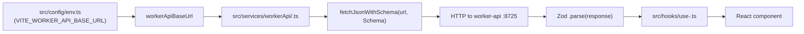

# Front App Agent Instructions

## Project Overview

`front-app` is the **React SPA** for the monorepo. It is built with **Vite**, styled with **Tailwind CSS v4**, and deployed as **static assets + SPA routing** on **Cloudflare Workers** via Wrangler. In both development and production it communicates with **`worker-api` exclusively over HTTP** — no service bindings.

- **Dev server**: `http://localhost:5174`
- **API dependency**: `worker-api` at `http://localhost:8725` in dev (configured in `src/config/env.ts`)

## Tech Stack

| Tool | Role |
|------|------|
| React 19 + TypeScript (strict) | UI framework and language |
| Vite + `@cloudflare/vite-plugin` | Dev server and build tool |
| Tailwind CSS v4 (Vite plugin) | Utility-first styling |
| React Router 7+ | Client-side routing |
| Zod + `@repo/dtos-common` | Response parsing and validation |
| `fetchJsonWithSchema` | Typed HTTP utility (timeouts, deduplication) |
| Biome | Formatter and linter |
| pnpm + Makefile | Package manager and task automation |
| Cloudflare Workers (Wrangler) | Static asset serving + SPA edge deployment |

## Project Structure

```
apps/front-app/
├── src/
│   ├── routes/
│   │   └── HomePage.tsx              # Route-level page (PascalCase)
│   ├── components/
│   │   ├── ui/
│   │   │   ├── Button.tsx            # Reusable primitive
│   │   │   └── Card.tsx
│   │   └── feedback/
│   │       ├── ApiHealthIndicator.tsx
│   │       └── StatusDot.tsx
│   ├── services/
│   │   └── workerApi/
│   │       ├── health.ts             # Typed calls for each API area
│   │       └── index.ts              # Re-exports
│   ├── hooks/
│   │   └── use-api-health.ts         # Data-fetching hooks
│   ├── utils/
│   │   ├── fetch-api.ts              # fetchJsonWithSchema utility
│   │   └── api-health-dot.ts
│   ├── config/
│   │   └── env.ts                    # VITE_WORKER_API_BASE_URL + dev default
│   ├── enums/
│   │   ├── api-health-status.ts      # Frontend-only enums
│   │   └── index.ts
│   ├── App.tsx                       # Route registry + lazy imports
│   ├── main.tsx                      # React entry point
│   ├── App.css
│   └── index.css
├── vite.config.ts                    # Vite config + Cloudflare plugin
├── wrangler.jsonc                    # Deploy config + SPA routing
├── tsconfig.json                     # Extends @repo/typescript-config/vite-react.json
├── Makefile
├── package.json
└── .env.example                      # Template for local env overrides
```

### Where to Change Things

| Task | Location |
|------|---------|
| Add a new page/screen | `src/routes/<PageName>.tsx` (PascalCase) + register lazy route in `App.tsx` |
| Add a typed API call | `src/services/workerApi/<feature>.ts` using `fetchJsonWithSchema` |
| Add a reusable UI component | `src/components/ui/<ComponentName>.tsx` |
| Add a data-fetching hook | `src/hooks/use-<feature>.ts` |
| Change the API base URL | `src/config/env.ts` (`VITE_WORKER_API_BASE_URL`); production builds: `.env.production` from [`.env.production.example`](.env.production.example) |
| Add a frontend-only enum | `src/enums/<feature>.ts` + export from `src/enums/index.ts` |
| Add a shared enum | `packages/enums-common/src/index.ts` |
| Modify SPA routing behavior | `wrangler.jsonc` |
| Modify Vite build config | `vite.config.ts` |

## Integration Flow (front-app → worker-api)



**Never** hardcode `http://localhost:8725` outside `src/config/env.ts`. All API base URL usage must go through `workerApiBaseUrl`.

## Environment Configuration

| Variable | Purpose |
|---------|---------|
| `VITE_WORKER_API_BASE_URL` | Base URL for `worker-api`; defaults to `http://localhost:8725` in dev if unset |

```bash
# Copy for local overrides
cp .env.example .env.local

# Production build / deploy (not loaded by vite dev)
cp .env.production.example .env.production
```

**Important**: `VITE_*` variables are **inlined at build time** by Vite. Changing the API URL requires a rebuild and redeploy — it is not a runtime config.

## Local Development

```bash
# From repo root (starts both front-app and worker-api)
make dev

# From apps/front-app only
make dev    # Vite dev server on http://localhost:5174
```

Ensure `worker-api` is running on port 8725 when you need live API data.

## File Naming (enforced by Biome)

| File type | Convention |
|-----------|-----------|
| `src/**/*.tsx` components | `PascalCase` or `kebab-case` (e.g. `Button.tsx`, `api-health-dot.tsx`) |
| `src/**/*.ts` utilities/hooks/services | `kebab-case` (e.g. `fetch-api.ts`, `use-api-health.ts`) |

Biome enforces these as errors — violating them will fail `make ci`.

## Coding Conventions

| Convention | Rule |
|-----------|------|
| Variables and functions | `camelCase` |
| Constants | `CONSTANT_CASE` |
| React components | `PascalCase` |
| TypeScript types / interfaces | `PascalCase` |
| Enum names | `PascalCase`; members `CONSTANT_CASE` |
| Indent | 2 spaces |
| Line width | 80 characters |
| Quotes | double |
| Semicolons | always |
| Trailing commas | always |
| Block statements | always use `{}` |
| Array index as React key | never (Biome error) |
| Unused imports/variables | not allowed (Biome error) |
| `any` type | avoid (Biome warning) |

## React Patterns

### Thinking in React

- Shape the UI as a **component hierarchy**. Ship a static, props-driven version first, then add state only for facts that change through interaction.
- Keep state **minimal and DRY**: compute derived values (filtered lists, counts, labels) during render instead of storing redundant state.
- Put state at the **lowest common parent** of every component that needs it. Pass values down, updates up via callbacks.

### Effects and Events

- `useEffect` is for **synchronizing with external systems** (browser APIs, subscriptions). Do not use it to map props → state, respond to clicks, or derive values.
- **User-driven** side effects belong in **event handlers**. Avoid chains of Effects that only bounce state between variables.
- **Pure derivations** happen during render. Use `useMemo` only for measurably expensive pure work. React Compiler is **not enabled** — do not assume automatic memoization.
- To reset local state when entity identity changes (e.g. different user), prefer `key={id}` on the component over `useEffect + setState`.
- When fetching inside an Effect, add **cleanup** to ignore stale responses on rapid input changes (race conditions).
- Prefer `useSyncExternalStore` over manual `useEffect + addEventListener` for external mutable stores.

### State Management Rules

- Own fetches and shared state near routes or hooks (`src/services/workerApi/*`, `src/hooks/`).
- Do not update parent state from a child via Effect when lifting state or passing props is clearer.
- Avoid re-render churn: keep derived state minimal; use stable callback references where it matters.

## Adding a Feature (Workflow)

1. **Update the contract** — add/edit schemas in `packages/dtos-common/src/api/<feature>.ts`.
2. **Add the worker-api route** — implement the endpoint in `apps/worker-api/src/routes/<feature>.ts`.
3. **Add the service module** — create `src/services/workerApi/<feature>.ts` calling `fetchJsonWithSchema` with the response schema.
4. **Add the hook** — create `src/hooks/use-<feature>.ts` wrapping the service call with loading/error state.
5. **Add the route/component** — create `src/routes/<FeaturePage>.tsx` and register a lazy route in `App.tsx`.
6. **Run checks** — `make ci` (format + lint + typecheck).

## fetchJsonWithSchema Pattern

All HTTP calls to `worker-api` must use `fetchJsonWithSchema` from `src/utils/fetch-api.ts`:

```typescript
import { fetchJsonWithSchema } from "@/utils/fetch-api";
import { HealthResponseSchema } from "@repo/dtos-common/api";

export async function getHealth() {
  return fetchJsonWithSchema(
    `${workerApiBaseUrl}/api/v1/health`,
    HealthResponseSchema,
  );
}
```

- Handles timeouts and GET request deduplication.
- Parses and validates the response with the provided Zod schema.
- Throws a typed error on validation failure — handle in the calling hook or component.

## Lazy-Loading Routes

Register new page routes as lazy imports in `App.tsx` to keep the initial bundle small:

```typescript
const HomePage = lazy(() => import("./routes/HomePage"));

// Inside the router
<Route path="/" element={<Suspense fallback={<Spinner />}><HomePage /></Suspense>} />
```

## Best Practices

- **Never duplicate Zod schemas** for HTTP contracts — import from `@repo/dtos-common` only.
- **Never hardcode API origins** outside `src/config/env.ts`.
- **Always use `fetchJsonWithSchema`** for typed, validated responses.
- **Lazy-load all route-level pages** to keep the initial bundle small.
- **Handle loading and error states** explicitly in hooks/components — no silent failures.
- **Shared enums** belong in `@repo/enums-common`; keep frontend-only enums in `src/enums/`.
- **React Compiler is intentionally not enabled** — do not enable without team agreement.

## Common Commands

| Command | Description |
|---------|-------------|
| `make dev` | Vite dev server on port 5174 |
| `make build` | Production build |
| `make preview` | Preview production build locally |
| `make deploy` | Deploy to Cloudflare Workers |
| `make format` | Format with Biome |
| `make lint` | Lint with Biome |
| `make check` | Full Biome check |
| `make check-types` | TypeScript typecheck |
| `make types` | Generate Wrangler worker types |
| `make ci` | Full CI: check + lint + format |

## Official Documentation

- [React documentation](https://react.dev/learn)
- [Thinking in React](https://react.dev/learn/thinking-in-react)
- [You Might Not Need an Effect](https://react.dev/learn/you-might-not-need-an-effect)
- [Vite](https://vitejs.dev/)
- [React Router](https://reactrouter.com/)
- [Tailwind CSS v4](https://tailwindcss.com/docs)
- [Cloudflare Workers — Static Assets](https://developers.cloudflare.com/workers/static-assets/)

## Contribution

- Follow this file and the root [`AGENTS.md`](../../AGENTS.md).
- Keep **HTTP contracts** in `@repo/dtos-common`; update `worker-api` and `front-app` in the same PR when payloads change.
- Update `README.md` or this file when changing ports, env vars, or deployment steps.
- Ensure `make ci` passes before opening a PR.
