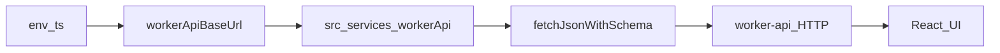

# front-app

[](https://biomejs.dev/)
[](https://www.typescriptlang.org/)
[](https://react.dev/)
[](https://vite.dev/)
[](https://tailwindcss.com/)
[](https://developers.cloudflare.com/workers/)

React SPA for the monorepo, built with Vite and deployed on Cloudflare Workers (static assets + SPA routing). In development and production, it calls `worker-api` over HTTP.

## Architecture Overview

### Project Structure

```
apps/front-app/
├── src/
│   ├── components/
│   │   ├── feedback/              # API health indicator UI (example)
│   │   └── ui/                    # Small reusable UI primitives
│   ├── config/
│   │   └── env.ts                 # Environment + defaults (API base URL)
│   ├── enums/                     # Frontend enums
│   ├── hooks/                     # React hooks
│   ├── routes/                    # Route-level components (lazy loaded)
│   ├── services/
│   │   └── workerApi/             # Typed HTTP calls to worker-api
│   ├── utils/                     # Shared utilities (fetch wrapper, helpers)
│   ├── App.tsx                    # Root component (lazy route loading)
│   ├── main.tsx                   # React entry
│   └── index.css                  # Tailwind entry + global styles
├── public/                        # Static assets (including Cloudflare headers)
├── index.html
├── vite.config.ts                 # Vite + Cloudflare Workers plugin config
├── wrangler.jsonc                 # Cloudflare Workers deploy config (assets + SPA)
├── tsconfig.json
├── Makefile
└── README.md
```

### Deployment model (high level)

- **Dev**: Vite dev server on port **5174**
- **Build**: Vite bundles assets
- **Deploy**: Wrangler deploys the worker + static assets as a single Cloudflare Workers app (SPA mode configured in `wrangler.jsonc`)

### Architecture (diagram)



More detail for agents: [AGENTS.md](AGENTS.md).

### Tech Stack

- **Framework**: React 19 + TypeScript
- **Build tool**: Vite (with `@cloudflare/vite-plugin`)
- **Runtime**: Cloudflare Workers (static assets + SPA routing)
- **Styling**: Tailwind CSS v4 (via Vite plugin)
- **API integration**: `fetchJsonWithSchema` wrapper + shared Zod schemas from `@repo/dtos-common`
- **Formatting/Linting**: Biome
- **Package manager**: pnpm

## Prerequisites

- Node.js 18+ (see root `package.json` `engines`)
- pnpm (repo pins `pnpm` in root `package.json` `packageManager`)
- Cloudflare account + Wrangler login (only needed for deployment)

## Getting Started

From the monorepo root:

```sh
make install
make prepare
make dev
```

Local URLs:
- Frontend dev server: `http://localhost:5174`
- API dependency: `http://localhost:8725` (see `apps/worker-api`)

## Make Commands

From this app directory (`apps/front-app/`):

| Command | Description |
|---------|-------------|
| `make install` | Install dependencies for this app |
| `make dev` | Start Vite dev server (port 5174) |
| `make preview` | Build + preview locally |
| `make build` | Build for production |
| `make deploy` | Build + deploy to Cloudflare Workers |
| `make format` | Format codebase using Biome |
| `make lint` | Lint codebase using Biome |
| `make check` | Run full Biome check (format + lint) |
| `make check-types` | Typecheck |
| `make types` | Generate Wrangler types |
| `make update` | Update dependencies |
| `make ci` | Run CI checks (check + lint + format) |

## Development Ports

| Service | Path | Port |
|---------|------|-----:|
| Vite dev server | `vite.config.ts` (`server.port`) | 5174 |
| Vite preview | `vite.config.ts` (`preview.port`) | 4174 |
| Worker API (dependency) | `apps/worker-api/wrangler.jsonc` (`dev.port`) | 8725 |

## Environment Configuration

### Environment Variables

The app calls `worker-api` using a base URL from `import.meta.env.VITE_WORKER_API_BASE_URL`. In development it defaults to `http://localhost:8725` when unset (see `src/config/env.ts`).

| Goal | File |
|------|------|
| Local dev overrides | Copy [`.env.example`](.env.example) to `.env` or `.env.local` |
| Production build / deploy | Copy [`.env.production.example`](.env.production.example) to `.env.production` |

Vite loads `.env.production` only for `vite build` (not for `vite dev`), so you can keep a stable API URL for deploys without changing dev defaults.

Examples:
- **Development** (default): leave unset → `http://localhost:8725`
- **Production**: set `VITE_WORKER_API_BASE_URL` in `.env.production` to your deployed `worker-api` origin before `make build` or `make deploy`

Deploy only the frontend from the monorepo root: `pnpm turbo run deploy --filter=front-app`.

Important: `VITE_*` variables are inlined during build. Changing `VITE_WORKER_API_BASE_URL` requires rebuilding/redeploying the frontend assets.

## Development

### Local Development

From `apps/front-app/`:

```sh
make dev
```

### Building

```sh
make build
```

### Preview (production build)

```sh
make preview
```

## Deployment

From `apps/front-app/`:

```sh
make deploy
```

This runs a production build and deploys using Wrangler (`wrangler deploy`).

## React Compiler

The React Compiler is not enabled here because of its impact on dev & build performance. To add it, see [this documentation](https://react.dev/learn/react-compiler/installation).
