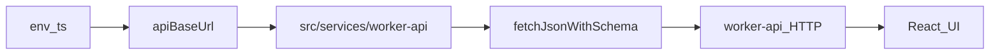

# front-app

[](https://oxc.rs/)
[](https://www.typescriptlang.org/)
[](https://react.dev/)
[](https://vite.dev/)
[](https://tailwindcss.com/)
[](https://developers.cloudflare.com/workers/)

React SPA for the monorepo, built with Vite and deployed on Cloudflare Workers (static assets + SPA routing). In development and production, it calls `worker-api` over HTTP.

## Architecture Overview

### Project Structure

```
apps/front-app/
├── src/
│   ├── components/
│   │   ├── feedback/              # API health indicator UI (example)
│   │   └── ui/                    # Small reusable UI primitives
│   ├── config/
│   │   └── env.ts                 # Environment + defaults (API base URL)
│   ├── enums/                     # Frontend enums
│   ├── hooks/                     # React hooks
│   ├── routes/                    # TanStack file routes (loaders, guards)
│   ├── pages/                     # Page UI (imported by *.lazy.tsx)
│   ├── routeTree.gen.ts           # Generated route tree (commit this file)
│   ├── router.tsx                 # TanStack Router instance
│   ├── services/
│   │   └── worker-api/            # Typed HTTP calls to worker-api
│   ├── utils/                     # Shared utilities (fetch wrapper, helpers)
│   ├── main.tsx                   # React entry (RouterProvider)
│   └── index.css                  # Tailwind entry + global styles
├── tests/                         # Vitest suites mirroring src/ (Node)
├── public/                        # Static assets
├── index.html
├── vitest.config.ts               # defineNodeConfig from @repo/vitest-config
├── vite.config.ts                 # Vite + TanStack Router + Cloudflare plugin
├── wrangler.jsonc                 # Cloudflare Workers deploy config (assets + SPA)
├── .env.production.example        # Production env template
├── tsconfig.json
├── tests/tsconfig.json            # Included in check-types
└── README.md
```

### Deployment model (high level)

- **Dev**: Vite dev server on port **5174**
- **Build**: Vite bundles assets
- **Deploy**: Wrangler deploys the worker + static assets as a single Cloudflare Workers app (SPA mode configured in `wrangler.jsonc`)

### Architecture (diagram)


```mermaid
flowchart LR
  Env[env_ts] --> BaseUrl[apiBaseUrl]
  BaseUrl --> Services[src/services/worker-api]
  Services --> Fetch[fetchJsonWithSchema]
  Fetch --> API[worker-api_HTTP]
  API --> UI[React_UI]
```

More detail for agents: [AGENTS.md](AGENTS.md).

### Tech Stack

- **Framework**: React 19 + TypeScript
- **Routing**: TanStack Router (file-based, auto code splitting)
- **Data fetching**: TanStack Query
- **Build tool**: Vite (with `@cloudflare/vite-plugin`, React Compiler)
- **Runtime**: Cloudflare Workers (static assets + SPA routing)
- **Styling**: Tailwind CSS v4 (via Vite plugin)
- **API integration**: `fetchJsonWithSchema` wrapper + shared Zod schemas from `@repo/dtos-common`
- **Tests**: Vitest 4 (Node) via `@repo/vitest-config` / `defineNodeConfig`
- **Formatting/Linting**: OXC (oxfmt / oxlint)
- **Package manager**: pnpm

## Prerequisites

- Node.js **22+** (see root `package.json` `engines`)
- pnpm (repo pins `pnpm` in root `package.json` `packageManager`)
- Cloudflare account + Wrangler login (only needed for deployment)

## Getting Started

From the monorepo root:

```sh
pnpm install
pnpm prepare
cp apps/front-app/.env.example apps/front-app/.env.local   # optional overrides
pnpm dev
```

Local URLs:
- Frontend dev server: `http://localhost:5174`
- API dependency: `http://localhost:8700` (see `apps/worker-api`)

### Path aliases

In-app absolute imports use package.json `"imports"` (`#/*` → `./src/*`). Example: `import { fetchJsonWithSchema } from "#/utils/fetch-api"`. Do not invent `@/` aliases.

## Commands

Run orchestration from the repository root, or use `pnpm -w` from this directory. Raw package scripts bypass Turbo dependencies.

| Command | Description |
|---------|-------------|
| `pnpm -w install` | Install and link the workspace |
| `pnpm -w turbo run dev --filter=front-app` | Start Vite plus the gateway |
| `pnpm -w turbo run test --filter=front-app` | Vitest (Node, `vitest run`) |
| `pnpm -w turbo run test:watch --filter=front-app` | Vitest watch (humans) |
| `pnpm -w preview` | Build and preview through Turborepo |
| `pnpm -w build` | Typecheck and build production output |
| `pnpm -w turbo run deploy --filter=front-app` | Build and deploy this app |
| `pnpm -w format:fix` | Format the repository with OXC |
| `pnpm -w lint:fix` | Apply repository-wide lint fixes |
| `pnpm -w check` | Run repository lint and format checks |
| `pnpm -w check-types` | Verify generated routes and typecheck |
| `pnpm -w types` | Generate committed Wrangler types |
| `pnpm -w update` | Update workspace dependencies |
| `pnpm -w run ci` | Full repository PR gate |
| `pnpm run analyze` | Raw app-only bundle visualization (`dist/stats.html`) |

## Development Ports

| Service | Path | Port |
|---------|------|-----:|
| Vite dev server | `vite.config.ts` (`server.port`) | 5174 |
| Vite preview | `vite.config.ts` (`preview.port`) | 4174 |
| Worker API (dependency) | `apps/worker-api/wrangler.jsonc` (`dev.port`) | 8700 |

## Environment Configuration

### Environment Variables

The app calls `worker-api` using a base URL from `import.meta.env.VITE_API_BASE_URL`. In development it defaults to `http://localhost:8700` when unset (see `src/config/env.ts`). Always read the API origin from `src/config/env.ts` - never hardcode it elsewhere.

| Goal | File |
|------|------|
| Local dev overrides | Copy [`.env.example`](.env.example) to **`.env.local`** (or `.env`) |
| Production build / deploy | Copy [`.env.production.example`](.env.production.example) to `.env.production` |

Vite loads `.env.production` only for `vite build` (not for `vite dev`), so you can keep a stable API URL for deploys without changing dev defaults.

Examples:
- **Development** (default): leave unset → `http://localhost:8700`
- **Production**: set `VITE_API_BASE_URL` in `.env.production` to your deployed `worker-api` origin before `pnpm -w build` or a filtered Turbo deploy
- **CI validation**: `pnpm -w run ci` supplies a non-deployed validation origin so a clean clone can run the full gate without production credentials

Deploy only the frontend from the monorepo root: `pnpm turbo run deploy --filter=front-app`.

Important: `VITE_*` variables are inlined during build. Changing `VITE_API_BASE_URL` requires rebuilding/redeploying the frontend assets.

Production builds also generate `dist/_headers` with cache and security headers (CSP includes the API origin from `VITE_API_BASE_URL`).

## Development

### Local Development

From the repository root (or with `pnpm -w` from this directory):

```sh
pnpm -w turbo run dev --filter=front-app
```

### Building

```sh
pnpm -w build
```

### Preview (production build)

```sh
pnpm -w preview
```

## Deployment

From the repository root:

```sh
pnpm turbo run deploy --filter=front-app
```

This runs a production build and deploys using Wrangler (`wrangler deploy`).

## Bundle analysis

```sh
pnpm analyze
```

Opens `dist/stats.html` after a production build (set `ANALYZE=true` via the script).
