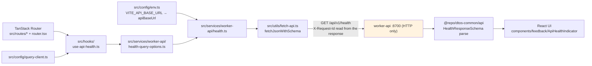

# front-app

React 19 SPA built with Vite, Tailwind CSS v4, and TanStack Router/Query, deployed as static assets with SPA routing on Cloudflare Workers. It talks to [`worker-api`](../worker-api/README.md) over HTTP only - never through service bindings.

## Run it

```sh
pnpm turbo run dev --filter=front-app   # Vite on http://localhost:5174, plus the gateway on :8700
```

Run commands from the repository root, or with `pnpm -w` from this directory: raw package scripts bypass Turbo's dependency graph. Build, preview, deploy, test, and bundle-analysis commands are listed in [AGENTS.md](AGENTS.md).

## How a request flows

The shipped health check shows the chain every feature follows:


```mermaid
flowchart LR
  Router["TanStack Router<br/>src/routes/* + router.tsx"] --> Hooks["src/hooks/<br/>use-api-health.ts"]
  QueryClient["src/config/query-client.ts"] --> Hooks
  Env["src/config/env.ts<br/>VITE_API_BASE_URL → apiBaseUrl"] --> Svc
  Hooks --> QO["src/services/worker-api/<br/>health-query-options.ts"]
  QO --> Svc["src/services/worker-api/health.ts"]
  Svc --> Fetch["src/utils/fetch-api.ts<br/>fetchJsonWithSchema"]
  Fetch -- "GET /api/v1/health<br/>X-Request-Id read from the response" --> API["worker-api :8700 (HTTP only)"]
  API --> Parse["@repo/dtos-common/api<br/>HealthResponseSchema parse"]
  Parse --> UI["React UI<br/>components/feedback/ApiHealthIndicator"]

  style API fill:#fff3e0
```

## Environment

`VITE_API_BASE_URL` is the gateway origin. Left unset in development it defaults to `http://localhost:8700` (`src/config/env.ts`).

| Goal | File |
|------|------|
| Local dev overrides | Copy [`.env.example`](.env.example) to `.env` |
| Production build / deploy | Copy [`.env.production.example`](.env.production.example) to `.env.production` |

The agent sandbox cannot read the `.env*` files here, and the Cloudflare Vite plugin aborts on an env file it cannot read, so the sandbox sets `SKIP_ENV_FILES=1` and `vite.config.ts` skips them: sandboxed dev runs on the `src/config/env.ts` defaults. Vite loads `.env.production` only for a production build (`cf build`), never under `cf dev`, so a deploy origin does not change dev defaults. `VITE_*` values are inlined into the public bundle at build time: changing one means rebuilding and redeploying, and none may hold a secret.

A production build fails without `VITE_API_BASE_URL`, because it also generates `_headers` in the client output (`.cloudflare/output/v0/workers/default/assets/`) - cache and security headers whose CSP `connect-src` names the API origin, plus the Sentry ingest origin when `VITE_SENTRY_DSN` is set. `pnpm run ci` supplies a non-deployed validation origin, so a clean clone runs the full gate without production values.

Agent and contributor detail: [AGENTS.md](AGENTS.md).
