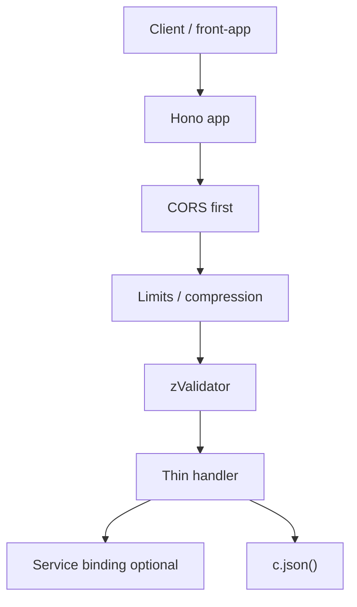

# Worker API Agent Instructions

## Overview

`worker-api` is the **public HTTP gateway**: **Cloudflare Workers** + **Hono**, port **8725** in dev. Entry point for `front-app` (HTTP) and coordinator for internal Workers (service bindings).

Starter surface: `GET /api/v1/health`. Hono patterns load from `.claude/rules/hono-gateway.md` when editing `src/**`.

## Structure

```
apps/worker-api/src/
├── routes/<feature>.ts   # One route module per feature
├── enums/              # Worker-local value sets (`as const`)
└── index.ts            # Middleware stack + route mounts
```

## Where to Change Things

| Task | Location |
|------|---------|
| New endpoint | `src/routes/<feature>.ts` → mount in `src/index.ts` |
| Middleware | `src/index.ts` (before route mounts) |
| Shared schema | `packages/dtos-common/src/api/<feature>.ts` |
| Worker-local value set | `src/enums/` |
| Service binding | `wrangler.jsonc` → `services` |
| Secrets | `.dev.vars` (dev); document in `.dev.vars.example` |

## Local Development

```bash
make dev                              # repo root
pnpm turbo dev --filter=worker-api   # this worker only
```

Verify: `GET http://localhost:8725/api/v1/health`

## Request Lifecycle



## Middleware Order (`src/index.ts`)

1. CORS (first - preflight before auth).
2. Secure headers (production).
3. Compression / body limits.
4. Pretty JSON (dev only).

## Validation Example

```typescript
import { zValidator } from "@hono/zod-validator";
import { AddItemRequestSchema } from "@repo/dtos-common/api";

app.post(
  "/items",
  zValidator("json", AddItemRequestSchema),
  async (c) => {
    const data = c.req.valid("json");
    return c.json({ ok: true, id: data.id });
  },
);
```

Import schemas from `@repo/dtos-common/api` - never redefine wire shapes locally.

## Adding an Endpoint

1. Contract in `packages/dtos-common/src/api/<feature>.ts`.
2. Route `src/routes/<feature>.ts` with `zValidator` on every input.
3. Mount in `src/index.ts`.
4. Business logic in a service module or via `env.BINDING`.
5. Update `.dev.vars.example` for new secrets.
6. `make ci`.

## Service Bindings

Worker-to-Worker only (never from `front-app`). Configure in `wrangler.jsonc` → `services`; call via `env.BINDING.method()` in a route handler or service module. RPC typing (`WorkerEntrypoint`, multi `-c` `wrangler types`) → [`.cursor/rules/workers-config.mdc`](../../.cursor/rules/workers-config.mdc) (RPC section). Run `make types` after adding bindings.

Workers Cache policy: see path-scoped rule [`.claude/rules/workers-cache.md`](../../.claude/rules/workers-cache.md) (loads when editing this app).

## Best Practices

- Validate at the boundary; keep handlers thin.
- Appropriate HTTP status codes (`400`, `401`, `403`, `404`, `500`).
- Never commit secrets; RESTful plural resource paths.
- Contract changes need `dtos-common` + `front-app` in the same PR.

## Commands

| Command | Description |
|---------|-------------|
| `make dev` | Dev server on :8725 |
| `make types` | Regenerate `worker-configuration.d.ts` |
| `make deploy` | Deploy to Cloudflare |
| `make ci` | Lint + format + check-types |

## Contribution

Follow this file and root [AGENTS.md](../../AGENTS.md). Update `README.md` when adding endpoints, middleware, or bindings. Run `make ci` before merging.
