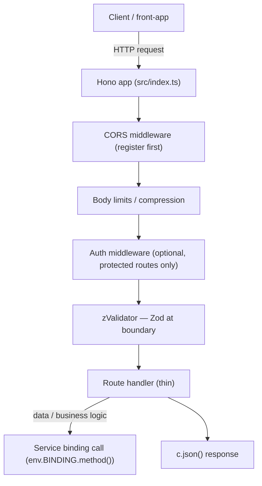

# Worker API Agent Instructions

## Project Overview

`worker-api` is the **public HTTP gateway** for the monorepo. It runs on **Cloudflare Workers**, implemented with **Hono**, and serves on **port 8725** in development. It is the sole backend entry point for `front-app` (called over HTTP) and the coordinator for internal Workers (called via service bindings).

This is a template/starter: the checked-in surface is intentionally minimal (`GET /api/v1/health`). Extend it by adding routes, shared DTOs, service bindings, and auth.

## Project Structure

```
apps/worker-api/
├── src/
│   ├── routes/
│   │   └── health.ts          # Health check route
│   ├── enums/
│   │   └── index.ts           # Worker-local enums
│   └── index.ts               # App entry: middleware stack + route mounts
├── biome.json                 # Biome overrides (inherits root)
├── tsconfig.json              # Extends @repo/typescript-config/workers.json
├── wrangler.jsonc             # Cloudflare Workers config (port, bindings, vars)
├── Makefile                   # CLI shortcuts
├── package.json
├── .dev.vars.example          # Template for local secrets (never commit .dev.vars)
└── README.md
```

### Where to Change Things

| Task | Location |
|------|---------|
| Add a new endpoint | `src/routes/<feature>.ts` → mount in `src/index.ts` |
| Add middleware (CORS, auth, logging) | `src/index.ts` (before route mounts) |
| Add shared request/response schema | `packages/dtos-common/src/api/<feature>.ts` |
| Add worker-local enum or constant | `src/enums/index.ts` |
| Add shared enum | `packages/enums-common/src/index.ts` |
| Add worker-specific error class | `src/errors/<error-name>.ts` |
| Configure a service binding | `wrangler.jsonc` → `services` array |
| Add/change environment variables | `.dev.vars` (dev) or `wrangler.jsonc` `env` blocks (staging/prod) |

## Local Development

```bash
# From repo root
make dev                              # starts all services via Turborepo
pnpm turbo dev --filter=worker-api   # start only this worker

# From this directory
make dev
```

**Port**: `8725`
**Quick verify**: `GET http://localhost:8725/api/v1/health`

## Request Lifecycle



## Middleware Stack

Register in this order in `src/index.ts`:

1. **CORS** — must be first so preflight `OPTIONS` requests are handled before any auth or route logic.
2. **Secure headers** — add in production for `X-Content-Type-Options`, `X-Frame-Options`, etc.
3. **Compression / body limits** — response compression and 3 MB body limit.
4. **Pretty JSON** — development only; disable in production.

## Request Validation with Zod

Always validate at the route boundary using `@hono/zod-validator`. Import schemas from `@repo/dtos-common/api` — never define local Zod schemas for shared endpoints.

### Validation Targets

| Target | Validator call |
|--------|---------------|
| JSON body | `zValidator("json", Schema)` |
| Path params | `zValidator("param", Schema)` |
| Query string | `zValidator("query", Schema)` |

### Example

```typescript
import { zValidator } from "@hono/zod-validator";
import { AddItemRequestSchema } from "@repo/dtos-common/api";

app.post(
  "/items",
  zValidator("json", AddItemRequestSchema),
  async (c) => {
    const data = c.req.valid("json"); // fully typed
    return c.json({ ok: true, id: data.id });
  },
);
```

## Adding a New Endpoint (Agent Workflow)

1. **Define the contract** — add `<feature>RequestSchema` / `<feature>ResponseSchema` to `packages/dtos-common/src/api/<feature>.ts` and export from `src/api/index.ts`.
2. **Create the route** — `src/routes/<feature>.ts`, use `zValidator` on every input target.
3. **Mount the route** — import and register in `src/index.ts` under the appropriate base path.
4. **Create a service for the business logic** — add to `apps/<worker>/src/services/<feature>.ts` or add a service binding to `wrangler.jsonc` and call via `env.BINDING.method()`.
5. **Update `.dev.vars.example`** — document any new secrets with empty/placeholder values.
6. **Run checks** — `make ci` (format + lint + typecheck).

## Service Bindings

Service bindings allow `worker-api` to call other Workers **directly on the same thread** — zero latency, no public URLs.

### Configuration (`wrangler.jsonc`)

```jsonc
{
  "services": [
    {
      "binding": "EXAMPLE_SERVICE",
      "service": "example"
    }
  ]
}
```

### Usage in a Route Handler

```typescript
// env.EXAMPLE_SERVICE is fully typed via worker-configuration.d.ts
const example = await env.EXAMPLE_SERVICE.getExample(exampleId);
```

### Local Testing

Start the bound worker first, then this worker:

```bash
# Terminal 1
cd apps/example && make dev

# Terminal 2
cd apps/worker-api && make dev
```

Verify bindings show as "connected" in the wrangler output.

> Run `make types` to regenerate `worker-configuration.d.ts` after adding new bindings.

## Coding Conventions

These conventions are **enforced by Biome** — violating them will fail `make ci`.

| Convention | Rule |
|-----------|------|
| File names | `kebab-case` (e.g. `health-check.ts`, `auth-middleware.ts`) |
| Variables and functions | `camelCase` |
| Constants | `CONSTANT_CASE` |
| Enum names | `PascalCase` |
| Enum members | `CONSTANT_CASE` |
| Block statements | always use `{}` (no single-line `if`) |
| Functions | max 100 lines (blank lines excluded) |

### Workers Runtime Rules

- **No global mutable state for per-request data.** Each Worker invocation is isolated. Use Hono context (`c.get` / `c.set`) for request-scoped values.
- **No floating promises.** Always `await` async operations or return them; unhandled rejections are silent in Workers.
- **No `setInterval` / long-lived timers** — Workers have CPU time limits.
- For **streams**, **WebSockets**, or **subrequests**, follow the Cloudflare Workers runtime constraints.

## Common commands

| Command | Description |
|---------|-------------|
| `make dev` | Development server on port 8725 |
| `make format` | Format with Biome |
| `make lint` | Lint with Biome |
| `make check` | Full Biome check (lint + format) |
| `make check-types` | TypeScript typecheck |
| `make types` | Regenerate `worker-configuration.d.ts` |
| `make deploy` | Deploy to Cloudflare Workers |
| `make ci` | Full CI: check + lint + format |

## Best Practices

- **Always import shared API schemas** from `@repo/dtos-common/api` — never redefine wire shapes locally.
- **Validate at the boundary** with `zValidator`; never trust unvalidated input inside handlers.
- **Keep handlers thin**: validate → call service binding or module → return `c.json()`. No business logic in route files.
- **Use appropriate HTTP status codes**: `400` validation errors, `401` unauthenticated, `403` forbidden, `404` not found, `500` internal.
- **CORS**: tune allowed origins for production; register CORS middleware before everything else.
- **Never commit secrets**: use `.dev.vars.example` as the canonical list of required secrets.
- **Follow RESTful naming**: plural nouns for resources (`/items`, `/accounts`), HTTP verbs for actions.

## Official Documentation

- [Hono documentation](https://hono.dev/docs)
- [Cloudflare Workers](https://developers.cloudflare.com/workers/)
- [`@hono/zod-validator`](https://github.com/honojs/middleware/tree/main/packages/zod-validator)
- [Wrangler CLI](https://developers.cloudflare.com/workers/wrangler/)

## Contribution

- Follow the conventions in this file and the root [`AGENTS.md`](../../AGENTS.md).
- When changing **routing or middleware** guidance, keep it aligned with Hono and Cloudflare Workers docs.
- Update this file and/or `README.md` when you add endpoints, middleware, bindings, or variables.
- Ensure `make ci` passes before opening a PR.
- Schema / contract changes must also update `packages/dtos-common` and `apps/front-app` in the same PR.
