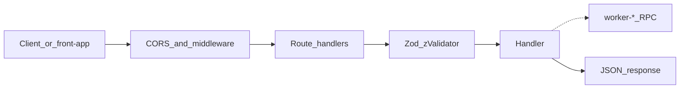

# worker-api

[](https://www.typescriptlang.org/)
[](https://hono.dev/)
[](https://github.com/colinhacks/zod)
[](https://developers.cloudflare.com/workers/)

Public HTTP API gateway for the monorepo. `front-app` and external clients call this Worker over HTTP; business Workers join later via service-binding RPC.

## Current configuration (checked-in starter)

The checked-in [wrangler.jsonc](wrangler.jsonc) defines the Worker name, dev port **8700**, and a minimal set of `vars` (e.g. `ENVIRONMENT`).

What you can run today:
- Health endpoint at `GET /api/v1/health`
- CORS allows any origin by default. To restrict browsers to specific origins, set the `CORS_ORIGINS` var (comma-separated list, e.g. `http://localhost:5174,https://app.example.com`) in `wrangler.jsonc` or `.dev.vars`.

What you can add as you grow the repo:
- Auth / session middleware
- **Service bindings** to `worker-*` (configure under `services` in `wrangler.jsonc`)

## Purpose

`worker-api` is the public-facing HTTP gateway: validate requests with shared Zod schemas, apply CORS and security middleware, and return typed JSON. The starter ships a health check with open CORS; authentication and RPC bindings are extension points, not current defaults.

## Tech Stack

- **Language:** TypeScript (strict mode, ESNext)
- **Framework:** Hono (for Cloudflare Workers)
- **Validation:** Zod schemas from `@repo/dtos-common/api`
- **Middleware:** CORS, compression, body limits, secure headers
- **Runtime:** Cloudflare Workers
- **Formatting/Linting:** OXC (oxfmt / oxlint)
- **Package Manager:** pnpm

## Project Structure

```
apps/worker-api/
├── src/
│   ├── routes/           # One route module per feature
│   │   └── health.ts
│   ├── enums/            # Worker-local value sets (`as const`)
│   └── index.ts          # Middleware stack + route mounts
├── wrangler.jsonc
├── .dev.vars.example
├── Makefile
└── README.md
```

## Request path



## Development Ports

| Service | Path | Port |
|---------|------|-----:|
| worker-api (this app) | `wrangler.jsonc` (`dev.port`) | **8700** |
| front-app (caller) | `apps/front-app/vite.config.ts` | 5174 |

## Setup & Development

### Prerequisites

1. **Install dependencies** (from the monorepo root):
   ```bash
   make install
   ```

2. **Configure environment (optional):**
   Copy `.dev.vars.example` to `.dev.vars`. The current code does not require secrets; if you add any, document keys in `.dev.vars.example` and set real values in `.dev.vars` (never commit secrets).

3. **Start development server**:
   - From the monorepo root: `make dev` (all apps) or `make dev SCOPE=worker-api`
   - From this app folder: `make dev`
   ```bash
   make dev
   ```

The Worker will be available at `http://localhost:8700`

### Verify it works

```bash
curl -s "http://localhost:8700/api/v1/health"
```

Expected response:
```json
{ "status": "ok" }
```

### Adding an endpoint

1. Contract in `packages/dtos-common/src/api/<feature>.ts` (export from `api/index.ts`).
2. Route module `src/routes/<feature>.ts` with `zValidator` on every input.
3. Mount the route in `src/index.ts`.
4. Call business logic locally or via `env.BINDING` once a service binding exists.
5. Update `.dev.vars.example` for any new secrets.
6. Run `make ci`.

### Available Commands

| Command | Description |
|---------|-------------|
| `make install` | Install dependencies for this app |
| `make dev` | Start Wrangler dev server (port 8700) |
| `make deploy` | Deploy to Cloudflare Workers |
| `make format` | Format via Turborepo (`format:fix` per package) |
| `make lint` | Lint via Turborepo (`lint:fix` per package) |
| `make check` | Lint + format check via Turborepo |
| `make check-types` | Typecheck |
| `make types` | Generate Wrangler types (run after binding changes) |
| `make update` | Update dependencies |
| `make ci` | Full CI via Turborepo: lint + format + check-types |

## Deployment

```bash
make deploy                 # from this directory
make deploy SCOPE=worker-api  # from repo root
```

## Request Validation with Zod

All HTTP DTOs live in `@repo/dtos-common/api` so the frontend and gateway stay aligned:

```typescript
import { HealthResponseSchema } from "@repo/dtos-common/api";

health.get("/", (c) => {
  const response = { status: "ok" };
  HealthResponseSchema.parse(response);
  return c.json(response);
});
```

Worker-local constrained strings belong in `src/enums/`. Promote to `@repo/enums-common` when a second app needs them.

## Development Guidelines

- Use strict TypeScript with proper type annotations
- Validate all requests/responses with Zod schemas using `zValidator`
- Keep handlers thin; put business logic behind services or RPC
- Follow RESTful API design principles
- Run `make ci` before opening a PR
