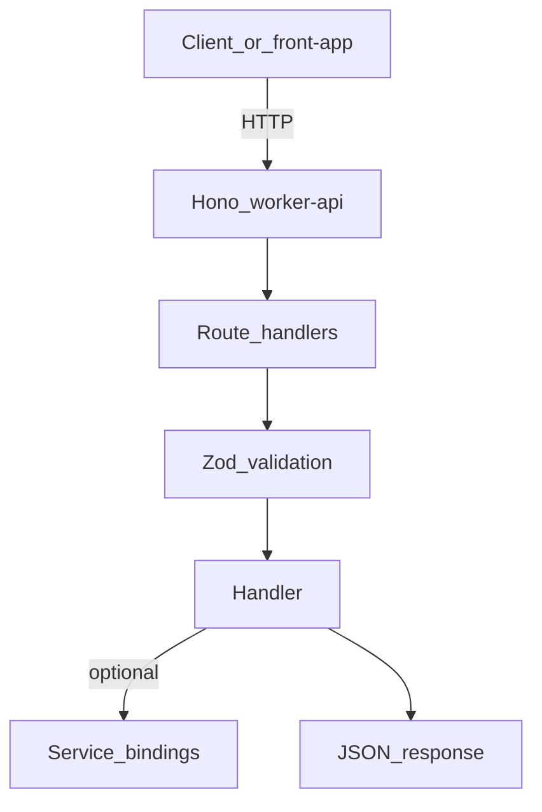

# worker-api

[](https://www.typescriptlang.org/)
[](https://hono.dev/)
[](https://github.com/colinhacks/zod)
[](https://developers.cloudflare.com/workers/)

A REST API gateway providing secure HTTP endpoints for frontend applications and external clients.

## Current configuration (checked-in starter)

The checked-in [wrangler.jsonc](wrangler.jsonc) defines the Worker name, dev port **8725**, and a minimal set of `vars` (e.g. `ENVIRONMENT`).

What you can run today:
- Health endpoint at `GET /api/v1/health`
- CORS allows any origin by default. To restrict browsers to specific origins, set the `CORS_ORIGINS` var (comma-separated list, e.g. `http://localhost:5174,https://app.example.com`) in `wrangler.jsonc` or `.dev.vars`.

What you can add as you grow the repo:
- **Service bindings** to other Workers (configure under `services` in `wrangler.jsonc`)
- Authentication/authorization layers (e.g. Clerk or any other provider)

## Purpose

The worker-api serves as the public-facing HTTP API gateway for monorepo. It provides secure, authenticated endpoints for business logic operations. Built on Cloudflare Workers with Hono framework, it ensures type-safe API interactions while maintaining high performance and security standards.

## Tech Stack

- **Language:** TypeScript (strict mode, ESNext)
- **Framework:** Hono (for Cloudflare Workers)
- **Validation:** Zod schemas for request/response validation
- **Middleware:** CORS, compression, body limits, secure headers
- **Runtime:** Cloudflare Workers
- **Service bindings:** BUSINESS_LOGIC_SERVICE — add under `services` in `wrangler.jsonc` when integrating
- **Formatting/Linting:** Biome (spaces, double quotes, recommended rules)
- **Build Tools:** tsx, Wrangler
- **Package Manager:** pnpm

## Setup & Development

### Prerequisites

1. **Install dependencies** (from the monorepo root):
   ```bash
   make install
   ```

2. **Configure environment (optional):**
   Copy `.dev.vars.example` to `.dev.vars`. The current code does not require secrets; if you add any, document keys in `.dev.vars.example` and set real values in `.dev.vars` (never commit secrets).

3. **Start development server**:
   - From the monorepo root: `make dev` (starts all `dev` tasks via Turborepo), or `pnpm turbo dev --filter=worker-api`
   - From this app folder: `make dev` (runs only `worker-api`)
   ```bash
   make dev
   ```

The Worker will be available at `http://localhost:8725`

### Verify it works

```bash
curl -s "http://localhost:8725/api/v1/health"
```

Expected response:
```json
{ "status": "ok" }
```

### Available Commands

| Command | Description |
|---------|-------------|
| `make install` | Install dependencies for this app |
| `make dev` | Start Wrangler dev server (port 8725) |
| `make deploy` | Deploy to Cloudflare Workers |
| `make format` | Format codebase using Biome |
| `make lint` | Lint codebase using Biome |
| `make check` | Run full Biome check (format + lint) |
| `make check-types` | Typecheck |
| `make types` | Generate Wrangler types |
| `make update` | Update dependencies |
| `make ci` | Run CI checks (check + lint + format) |

## Deployment

### Deployment (from this app directory)

```bash
make deploy
```

### Deployment (from the monorepo root)

```bash
make deploy
```

## Architecture

The worker follows a modular architecture with:

- **Route Handlers** - Organized by feature (health check)
- **DTOs** - Type-safe request/response validation with Zod
- **Middleware Stack** - Security, performance, and error handling
- **Service Bindings** - Integration with backend microservices

### Architecture (diagram)



Agent-focused detail: [AGENTS.md](AGENTS.md).

## Request Validation with Zod

The API uses `@hono/zod-validator` middleware for type-safe request validation. All API DTOs are shared from `@repo/dtos-common/api` to ensure consistent validation between frontend and backend.

### Shared API DTOs

The API uses shared DTOs from `@repo/dtos-common/api`:

```typescript
import { HealthResponseSchema } from "@repo/dtos-common/api";

health.get("/", (c) => {
  const response = { status: "ok" };
  HealthResponseSchema.parse(response);
  return c.json(response);
});
```

## Development Guidelines

- Use strict TypeScript with proper type annotations
- Validate all requests/responses with Zod schemas using `zValidator` middleware
- Implement proper error handling with HTTP status codes
- Follow RESTful API design principles
- Use Makefile commands for consistency
- Run lint and format before committing changes
