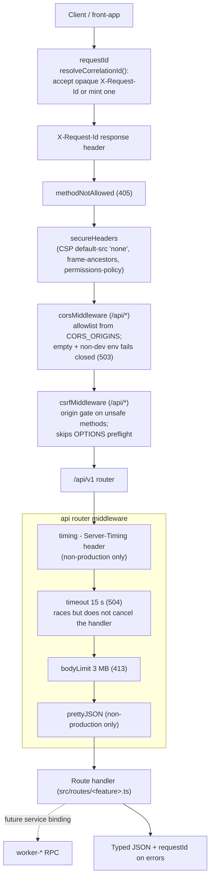

# worker-api

[](https://www.typescriptlang.org/)
[](https://hono.dev/)
[](https://github.com/colinhacks/zod)
[](https://developers.cloudflare.com/workers/)

Public HTTP API gateway for the monorepo. `front-app` and external clients call this Worker over HTTP; business Workers join later via service-binding RPC.

## Current configuration (checked-in starter)

The checked-in [wrangler.jsonc](wrangler.jsonc) defines the Worker name, dev port **8700**, and a minimal set of `vars` (e.g. `ENVIRONMENT`, local `CORS_ORIGINS`).

What you can run today:
- Health endpoint at `GET /api/v1/health` (returns release semver in `version`; `X-Worker-Version-Id` header carries the opaque wrangler version id)
- Every response carries an `X-Request-Id` header, and error responses return `{ error, requestId }`. Per-request access logging comes from native Workers observability; failures log structured JSON with the request id for correlation.
- Local/dev `CORS_ORIGINS` is `http://localhost:5174` (and exposes `X-Request-Id`). Staging/production **require** a comma-separated allowlist in `wrangler.jsonc` `vars` (e.g. `https://app.example.com`); an empty value fails closed with `503` on `/api/*` (no permissive `*`).
- A 15 s request timeout returns `504`, and a `Server-Timing` header is added in non-production for local profiling.

What you can add as you grow the repo:
- Auth / session middleware
- **Service bindings** to `worker-*` (configure under `services` in `wrangler.jsonc`)
- **Rate limiting** on abuse-prone routes (Cloudflare Workers Rate Limiting binding and/or WAF rules) before shipping public writes

## Purpose

`worker-api` is the public-facing HTTP gateway: validate requests with shared Zod schemas, apply CORS and security middleware, and return typed JSON. The starter ships a health check with a local CORS allowlist; authentication and RPC bindings are extension points, not current defaults.

## Tech Stack

- **Language:** TypeScript (strict mode, ESNext)
- **Framework:** Hono (for Cloudflare Workers)
- **Validation:** Zod Mini schemas from `@repo/dtos-common/api`
- **Middleware:** request id, secure headers, CORS, CSRF, timeout, body limits, timing + pretty JSON (dev)
- **Runtime:** Cloudflare Workers
- **Tests:** Vitest 4 + `@cloudflare/vitest-plugin` via `@repo/vitest-config/workers`
- **Formatting/Linting:** OXC (oxfmt / oxlint)
- **Package Manager:** pnpm

## Project Structure

```
apps/worker-api/
├── src/
│   ├── middlewares/        # Env-dependent Hono middleware wrappers
│   │   ├── cors.ts
│   │   ├── cors-origins.ts # CORS_ORIGINS allowlist parsing (fail-closed)
│   │   └── csrf.ts         # Origin / Sec-Fetch-Site gate on unsafe methods
│   ├── routes/             # One route module per feature (created per feature)
│   │   └── health.ts
│   └── index.ts            # Middleware stack + route mounts
├── tests/                  # Vitest (Cloudflare pool / workerd)
│   ├── env.d.ts
│   └── tsconfig.json
├── vitest.config.mts       # defineWorkersConfig from @repo/vitest-config/workers
├── wrangler.jsonc
├── worker-configuration.d.ts
├── .dev.vars.example
└── README.md
```

`src/enums/` is created on first use when a worker-local `as const` value set is needed; promote shared value sets to `@repo/enums-common`.

## Request path

Middleware runs top-down exactly as registered in `src/index.ts`; the `/api/v1` router applies its own stack before mounting feature routes.


```mermaid
flowchart TB
  Client["Client / front-app"] --> ReqId["requestId<br/>resolveCorrelationId():<br/>accept opaque X-Request-Id or mint one"]
  ReqId --> SetHeader["X-Request-Id response header"]
  SetHeader --> NotAllowed["methodNotAllowed (405)"]
  NotAllowed --> SecureHeaders["secureHeaders<br/>(CSP default-src 'none', frame-ancestors, permissions-policy)"]
  SecureHeaders --> Cors["corsMiddleware (/api/*)<br/>allowlist from CORS_ORIGINS;<br/>empty + non-dev env fails closed (503)"]
  Cors --> Csrf["csrfMiddleware (/api/*)<br/>origin gate on unsafe methods;<br/>skips OPTIONS preflight"]
  Csrf --> Api["/api/v1 router"]

  subgraph apiStack ["api router middleware"]
    direction TB
    Timing["timing - Server-Timing header<br/>(non-production only)"] --> Timeout["timeout 15 s (504)<br/>races but does not cancel the handler"]
    Timeout --> BodyLimit["bodyLimit 3 MB (413)"]
    BodyLimit --> Pretty["prettyJSON (non-production only)"]
  end

  Api --> Timing
  Pretty --> Routes["Route handler (src/routes/&lt;feature&gt;.ts)"]
  Routes -.->|"future service binding"| Rpc["worker-* RPC"]
  Routes --> Json["Typed JSON + requestId on errors"]
```

Notes:
- The timeout races the handler without cancelling it and cannot wrap streaming responses.
- `ENVIRONMENT === "production"` skips both `timing` and `prettyJSON`.
- Errors flow through `app.onError`: `HTTPException` messages pass through; unexpected errors log structured JSON with the request id and return a generic `"Internal server error"`.

## Development Ports

| Service | Path | Port |
|---------|------|-----:|
| worker-api (this app) | `wrangler.jsonc` (`dev.port`) | **8700** |
| front-app (caller) | `apps/front-app/vite.config.ts` | 5174 |

## Setup & Development

### Prerequisites

1. **Install dependencies** (from the monorepo root):
   ```bash
   pnpm install
   ```

2. **Configure environment (optional):**
   Copy `.dev.vars.example` to `.dev.vars`. The current code does not require secrets; if you add any, document keys in `.dev.vars.example` and set real values in `.dev.vars` (never commit secrets).

3. **Start development server**:
   - All apps: `pnpm dev` from the monorepo root
   - Worker only: `pnpm -w turbo run dev --filter=worker-api`
   ```bash
   pnpm -w turbo run dev --filter=worker-api
   ```

The Worker will be available at `http://localhost:8700`

### Verify it works

```bash
curl -s "http://localhost:8700/api/v1/health"
```

Expected response:
```json
{ "status": "ok", "version": "0.0.0" }
```

### Adding an endpoint

1. Contract in `packages/dtos-common/src/api/<feature>.ts` (export from `api/index.ts`).
2. Route module `src/routes/<feature>.ts` with `zValidator` on every input.
3. Mount the route in `src/index.ts`.
4. Call business logic locally or via `env.BINDING` once a service binding exists.
5. Update `.dev.vars.example` for any new secrets.
6. Run `pnpm run ci`.

### Available Commands

Run orchestration from the repository root, or use `pnpm -w` here. Raw package scripts bypass Turbo dependencies.

| Command | Description |
|---------|-------------|
| `pnpm -w install` | Install and link the workspace |
| `pnpm -w turbo run dev --filter=worker-api` | Start Wrangler on port 8700 |
| `pnpm -w turbo run test --filter=worker-api` | Vitest (Workers pool, `vitest run`) |
| `pnpm -w turbo run test:watch --filter=worker-api` | Vitest watch (humans) |
| `pnpm -w turbo run build --filter=worker-api` | Typecheck and dry-run the production bundle |
| `pnpm -w turbo run deploy --filter=worker-api` | Typecheck and deploy this Worker |
| `pnpm -w format:fix` | Format the repository with OXC |
| `pnpm -w lint:fix` | Apply repository-wide lint fixes |
| `pnpm -w check` | Run repository lint and format checks |
| `pnpm -w check-types` | Typecheck the workspace |
| `pnpm -w types` | Generate committed Wrangler types after binding changes |
| `pnpm -w update` | Update workspace dependencies |
| `pnpm -w run ci` | Full repository PR gate |

## Deployment

```bash
pnpm -w turbo run deploy --filter=worker-api
```

## Request Validation with Zod

All HTTP DTOs live in `@repo/dtos-common/api` (Zod Mini) so the frontend and gateway stay aligned. Validate inputs with `zValidator` at the route boundary. For constant probe bodies such as health, assert the shared schema in Vitest instead of re-parsing on every request:

```typescript
import { HealthResponseSchema } from "@repo/dtos-common/api";

// Contract check lives in tests/routes/health.test.ts
const body: unknown = await response.json();
expect(HealthResponseSchema.parse(body)).toEqual({ status: "ok" });
```

Worker-local constrained strings belong in `src/enums/`. Promote to `@repo/enums-common` when a second app needs them.

## Testing

Suites live under `tests/` and run inside workerd via `@cloudflare/vitest-plugin`. Prefer `import { env, exports } from "cloudflare:workers"` for integration checks. Config: `vitest.config.mts` → `defineWorkersConfig` from `@repo/vitest-config/workers`.

```bash
pnpm -w turbo run test --filter=worker-api
```

## Development Guidelines

- Use strict TypeScript with proper type annotations
- Validate all requests/responses with Zod schemas using `zValidator`
- Keep handlers thin; put business logic behind services or RPC
- Follow RESTful API design principles
- Run `pnpm run ci` before opening a PR
