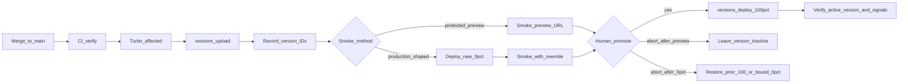
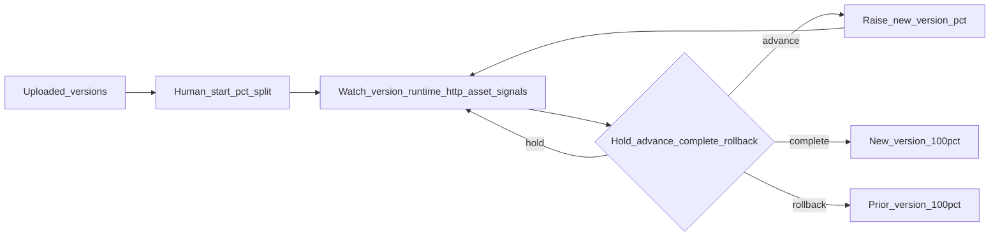

# Stage 1–2 Continuous Delivery Design

> Implementable design for continuous **delivery of versions** (Stage 1) and **progressive exposure** (Stage 2) for `worker-api` and `front-app`. Bound by [cd-operating-model.md](./cd-operating-model.md). Architecture rationale: [continuous-deployment-workers.md](./continuous-deployment-workers.md).

**Audience:** On-call engineers during a bad deploy and implementers of Stage 1 CI/upload/promote.

**Hard distinction:** Cloudflare **Worker version / gradual deployment / version affinity / rollback** control which **binary** serves traffic. **Flagship** controls which **behavior** runs inside already-deployed code. Never conflate them.

**Privileged data (standing):** Client/matter identifiers and privileged content must not appear in logs, trace attributes, metric dimensions, error bodies, cache/affinity keys, URL paths/query strings, smoke data, screenshots, or Flagship contexts. Correlate with opaque request IDs only.

---

## Assumptions and current blockers

| Topic | Decision |
|-------|----------|
| Promote authority | Deployable **owner or on-call delegate** (single human). The role is decided; named people/rota and contract owners are not yet recorded and block Stage 1 exit. |
| Staging | **Real habit, not a hard CI gate.** Prefer staging or versioned preview smoke before production promote; hotfixes may skip staging with a documented reason. |
| Upload trigger | Target state: merge/`push` to **`main`** after verify CI green → **affected-only** version upload. PRs stay verify-only. The repository has no upload job today. |
| Orchestration | **GitHub Actions + Turbo `--affected`**. Workers Builds is not the monorepo brain. |
| Production env | Wrangler **`production`** env. The actual Worker resources are currently `worker-api-production` and `front-app-production`; records and commands use the actual name. |
| Preview URLs | `front-app` explicitly disables them. `worker-api` leaves both `workers_dev` and `preview_urls` unset; current documented defaults enable both. Before production uploads, explicitly disable preview URLs or verify Cloudflare Access protection. Enabled previews are public and have no Workers Logs, `wrangler tail`, or Logpush. |
| Shared contracts | When Turbo marks both apps affected, upload both from the same commit. Promotions are ordered per Worker and independently verified; Cloudflare provides no multi-Worker transaction. |
| Stage 2 SPA gate | Blocked today: `front-app` is assets-only on `workers.dev`, where Transform Rules are unavailable. A zone route/custom domain plus first-request affinity must exist before a SPA split. |

---

## Responsibilities (who does what)

| Actor | Stage 1 | Stage 2 |
|-------|---------|---------|
| **CI (GitHub Actions + Turbo)** | Verify; compute affected range; build; upload; publish commit, actual Worker name, version ID, and protected preview URL when used. Never creates a traffic-serving deployment. | Same upload path. Does **not** advance percentages. |
| **Human (owner / on-call)** | Recheck active deployment; smoke; classify; promote to 100% or abort; verify; rollback. | Start/hold/advance/complete/rollback a split; continuously watch required signals; use Flagship only when wired and proven. |
| **Cloudflare platform** | Immutable versions and per-Worker deployments; public preview URLs when enabled; rollback among the 100 most recently published versions, subject to constraints. | At most two versions in one deployment; per-request percentage routing; affinity and overrides; version attribution through supported telemetry. |

---

## A. Stage 1 — Upload ≠ promote

Goal: every eligible merge produces an immutable Worker **version outside the active deployment**. A human decides whether to create a production deployment. “Uploaded” does not mean “deployed at 0%.”

### Stage 1 flow

### Trigger

| Event | Action |
|-------|--------|
| `pull_request` | Verify only (existing CI). No production upload. |
| `push` / merge to `main` (after verify green) | Affected-only **version upload** for deployables that would rebuild for `build`. |
| Manual / hotfix | Same upload path; promote may skip staging with documented reason (operating-model emergency class). |

**Deployables today:** `worker-api`, `front-app`. Workspace packages (`@repo/dtos-common`, `@repo/enums-common`) are **inputs**, not uploadable artifacts—they ship inside consumer versions.

**Affected honesty:** Record the base/head range. If Turbo cannot resolve it or widens to everything, stop or explicitly upload both; never silently narrow. If an app would rebuild, upload a new version. If not, do not upload a decorative version.

**Bootstrap exception:** this recurring flow assumes the Worker has been published before. Cloudflare requires the first upload of a new Worker to use `wrangler deploy`; `versions upload` fails for a first publish. Bootstrap before production routes/domains or user traffic are attached.

### Artifact: what a “version” is

| App | Immutable version contains | Notes |
|-----|----------------------------|-------|
| `worker-api` | Worker script + version-specific bindings and compatibility settings for production | Hono gateway; no static asset tree as primary payload. |
| `front-app` | **Production-environment Vite output** as Workers static assets plus version-specific settings | Content-hashed JS/CSS filenames; `VITE_API_BASE_URL` is frozen into the build. |

A version is **not** an npm package version. Deployments can select only the 100 most recent uploaded versions; rollback can select the 100 most recently published versions.

Routes, domains, and cron triggers are not applied by `versions upload`. Connected resource state, secret contents, and future KV/R2/DO/D1/Queue data are not rewound by rollback. A rollback may be blocked if a referenced resource no longer exists or a Durable Object lifecycle change intervened.

### Smoke strategy

| Method | When | Mechanism |
|--------|------|-----------|
| **Protected preview** | After upload, when Access is configured | Versioned preview URL. It tests the version but not zone-level performance/security controls, and preview invocations have no Workers Logs, `wrangler tail`, or Logpush. |
| **Trusted production-shaped smoke** | When zone behavior must be exercised | Put the new version in the active deployment at 0%, then use `Cloudflare-Workers-Version-Overrides` through an access-controlled smoke path. |
| Staging env | Habit for non-trivial / non-hotfix | Promote or upload against Wrangler `staging` before production promote—useful, not a CI hard gate. |

Preview URLs are not isolated staging: a preview of a production-environment version uses that version’s production bindings/settings and is publicly reachable unless Access protects it. Never send real client/matter traffic or credentials merely because the hostname says “preview.”

Version overrides are not an authorization mechanism. They apply only while the version is one of the active deployment’s two versions; an invalid or not-yet-propagated override falls back to normal percentage routing. The trusted zone boundary must block or remove `Cloudflare-Workers-Version-Overrides` from untrusted requests for the entire lifetime of every two-version deployment, including a 0% smoke state and every non-zero ramp step. Otherwise a caller who learns a version ID can bypass percentage containment. The smoke runner must verify the served version before accepting any response, wait/retry the documented short propagation window, and abort rather than test an unverified version.

**Smoke proves:** the selected version responds; `GET /api/v1/health` succeeds for `worker-api`; `front-app` index HTML and every referenced critical JS/CSS asset load. For paired changes, confirm the SPA artifact’s baked `VITE_API_BASE_URL` targets the intended API resource and test against the compatible API version.

**Smoke cannot prove:** real traffic mix, full zone behavior from preview, end-to-end telemetry, SPA↔API skew under a split, or product correctness on privileged paths. Use synthetic data and rollout-only opaque IDs; never put client/matter identifiers in URLs, logs, traces, cache/affinity keys, errors, or Flagship context.

### Pre-promote record

Before any deployment mutation, the operator records:

1. Commit SHA, change class, affected base/head, actual production Worker name, new version ID, and previous active deployment/version.
2. For a shared-wire change, both uploaded version IDs and the contract evidence. A missing pair blocks all traffic movement.
3. Smoke method and result, including the served version. Preview success alone does not prove production zone controls.
4. The exact next state: Stage 1 new 100%; Stage 2 old/new percentages. Re-read the active deployment immediately before applying it and abort if another operator or process changed it.

### Promote authority

- **Who:** deployable owner or on-call delegate.
- **Concurrency:** one named operator and one in-flight deployment change per Worker. A changed active deployment invalidates the plan and requires re-evaluation.
- **How:** Cloudflare dashboard “Promote” or Wrangler `versions deploy` → **100%** in Stage 1, using the actual `<name>-production` resource.
- **Dual-control:** not required for Stage 1–2.
- **Staging:** preferred before production for non-trivial changes; optional for documented hotfixes.
- **Completion:** not complete until the active deployment reports the expected version and production probes/signals are healthy. Cloudflare documents global availability of override changes within up to a couple of seconds, not a zero-time cross-Worker cutover.

Change-class gates from the operating model still apply: bindings, compatibility settings, triggers, connected resources, secret contents, and future storage migrations are not “routine” promotes.

For a coordinated HTTP change, Cloudflare cannot promote both Workers atomically:

- **Additive support:** deploy `worker-api` support to 100%, verify compatibility with the old SPA, then deploy/ramp `front-app`.
- **Removal:** deploy the SPA that no longer uses the shape, retain the old API through the measured open-client retirement window, then remove the API shape in a later compatible change.
- **Independent change:** mutate only the affected Worker. Do not co-ramp both merely because they share a release window.

### Failure modes

| Failure | Effect | Action |
|---------|--------|--------|
| CI verify red | No upload | Fix on branch; do not promote anything from that SHA. |
| Upload fail | Zero or one inactive versions may exist | Do not promote a required pair. Fix the failed upload, then verify both versions have the same commit/build provenance; do not re-upload the successful immutable version without cause. |
| Smoke fail before 0% deployment | Version exists outside active deployment | Do not promote. Leave it idle and upload a fixed version. |
| Smoke fail after 0% deployment | New version is active at 0%; normal traffic remains on old 100%, but overrides can select new | Restore the prior single-version deployment or leave 0% only for a bounded investigation; restrict the override path. |
| Abort after protected preview | Prior single-version deployment remains active | Record why; the uploaded version stays inactive. |
| Abort after a 0% deployment | Old version still receives normal traffic at 100%, but the new version remains in the active two-version deployment and overrides can select it | Restore the prior single-version deployment, or authorize a bounded 0% investigation with override-header controls. Never call this version idle. |
| Partial multi-app promote | One Worker changed; no automatic undo | Stop further changes. If the state is contract-compatible, hold and repair the missing step; otherwise use the compatibility matrix to roll back the changed side or complete the safe counterpart. Never assume joint rollback. |
| Wrong version or concurrent change detected | Planned previous/new pair is no longer active | Hold. Re-read deployment history and either restore the known-good version or build a new plan from current state. |

### Rollback in Stage 1

| Situation | Version rollback enough? |
|-----------|--------------------------|
| Regressed compute/UI; no schema/storage change | **Yes** — promote prior version to 100% (`wrangler rollback` / dashboard). |
| Bad feature path inside an otherwise healthy new binary (once Flagship exists) | Prefer **Flagship disable**; rollback secondary. |
| Irreversible storage / message schema migration | **No** — forward-fix / restore. (Products not in use yet; document so drills stay honest.) |
| Account-level DNS / routes / unbound config / secret **contents** wrong outside the version | **No** — fix that surface; Worker rollback alone may not undo it. |
| Binding deleted/modified so platform refuses rollback | **No** — platform blocks unsafe rollbacks (e.g. missing KV/R2/queue binding targets; DO class lifecycle gaps). |

Rollback creates a new single-version deployment at 100%, replacing both sides of a split. Before rollback, verify the target is among the 100 most recently published versions, its resource assumptions still hold, and it remains compatible with the other live app. After rollback, verify the active deployment and production probes; the command returning successfully is not incident closure. It does not rewind data or external control-plane state.

### Definition of Done — Stage 1

- [ ] CI remains the merge gate (boundaries, lint, format, affected typecheck/build).
- [ ] On `main`, affected deployables get **`versions upload` without automatic 100% traffic**; practiced until boring on a non-critical path.
- [ ] Preview smoke is Access-protected, or a trusted 0%-override path verifies the served version. Public production-bound previews are not accepted.
- [ ] Staging or preview habit used before production promote for non-hotfix changes.
- [ ] **Rollback drill** completed; time-to-mitigate measured; “what rollback does not undo” understood.
- [ ] Named owners for `worker-api`, `front-app`, and shared contracts (`@repo/dtos-common` / `@repo/enums-common`).
- [ ] Shared HTTP changes have contract-test or equivalent producer/consumer evidence; types alone are insufficient.
- [ ] Package scripts / CI conceptually split **upload** vs **promote**; `wrangler deploy` (upload+100%) is not the Stage 1 default path for `main`.

Exit criteria align with operating-model **Stage 0 → 1**.

---

## B. Stage 2 — Progressive exposure

Goal: a human can split one Worker’s traffic between exactly two versions and advance only with verified affinity and version-aware signals. The Stage 1 upload path is unchanged. There is no atomic cross-Worker ramp.

### Entry gate

Do not create a non-zero production split until all are true:

- Stage 1 is complete and a rollback drill has passed.
- The actual old/new version IDs and prior active deployment are recorded.
- Runtime failures, application HTTP 5xx, measured performance, and `front-app` asset 404s are visible with sufficient version attribution.
- End-to-end request correlation uses opaque IDs only.
- For `front-app`, a zone route/custom domain and an affinity key present on the first HTML request and all assets have been tested. The current assets-only `workers.dev` posture does not pass this gate.
- The operator declares the percentage, minimum bake time, minimum useful sample, and rollback threshold. Low traffic or delayed metrics means hold, not advance.

### Stage 2 flow

### Ramp philosophy

| Deployable | Ramp | Affinity |
|------------|------|----------|
| `worker-api` | Select steps from traffic volume and risk; there is no universal 10→50→100 ladder. Immediate 100% is Stage 1 behavior and requires a recorded reason when Stage 2 would otherwise apply. | Optional for request-independent APIs; it does not solve SPA↔API generation skew. |
| `front-app` | Select steps only after first-request affinity and asset-404 telemetry pass the entry gate. | **Mandatory** whenever traffic is split. |

Percentages are independent per-request probabilities. Without affinity, repeated requests can reach different versions; percentages do not guarantee exact sample sizes, cohort membership, geography, or ordering. One active deployment can contain only the old and new version. Finish or roll back the current split before introducing a third version.

Do not ramp both apps concurrently by default. Complete and verify additive API support before exposing the dependent SPA. Concurrent independent ramps are allowed only when the operator records that neither change shares a wire or diagnostic dependency.

### Version affinity for `front-app` (mandatory on splits)

Without affinity, each request is independently routed by percentage. Vite content-hashed assets then fail as: HTML from version A references `index-a1b2c3d4.js`, browser fetch lands on version B → **404** → broken page.

**Requirement:** overwrite `Cloudflare-Workers-Version-Key` at a trusted zone boundary using a dedicated random rollout cookie/value. Do not reuse an auth/session secret or any user/client/matter identifier. The key contributes to infrastructure cache partitioning. Cloudflare hashes it; operators do not choose the mapped version. As percentages rise, keys already on the new version stay there.

The key must exist before the first HTML request. Cloudflare documents that a cookie created by the first response cannot affect that first random assignment; treating response-created affinity as complete protection overclaims the platform. Transform Rules require a route on a controlled zone and are unavailable for `workers.dev`.

Affinity pins **within** `front-app` only. It does **not** lock `front-app` and `worker-api` to the same generation.

### SPA ↔ API skew controls

| Control | Rule |
|---------|------|
| Compatibility window | HTTP DTOs in `@repo/dtos-common`: expand/contract; **N and N+1 must coexist** during independent ramps. |
| Promote order (additive) | Deploy **API support to 100% and verify the old SPA**, then ramp the dependent SPA. |
| Promote order (removal) | Ramp SPA removal to 100%, retain API compatibility through a measured open-client retirement window, then remove API shape in a later change. |
| Same-PR discipline | Additive wire changes that need consumer updates land in the **same PR**; still yield multiple uploadable versions. |
| Do not ship together | Breaking removals with consumers still live; binding topology with “routine” UI; anything labeled migration as a silent co-ramp. |
| Rollback | Check compatibility with the other live app before one-sided rollback; Cloudflare provides no joint rollback. |

### Signals — hold / advance / complete / roll back

Tied to the operating-model observability bar (also Stage 2 practice for **manual** gradual promotes):

| Signal | Use |
|--------|-----|
| Version-attributed invocation failures / exceptions | New version worse → **hold** or **rollback**. |
| Application HTTP 5xx by version | Required because a successful invocation can still return an application error. |
| Version-attributed wall/CPU time or instrumented response latency | Hold on sustained regression; name the metric accurately. Cloudflare wall time is not final-byte latency. |
| `front-app` asset 404 by version | Affinity/skew signal → hold; verify first-request affinity; usually roll back the SPA split. |
| Opaque request ID correlation `front-app` → `worker-api` | Debug without privileged identifiers; currently an unmet repository prerequisite. |

**Internal objectives, not Cloudflare guarantees:** time-to-detect ≤ **5 minutes** after a ramp step; time-to-mitigate ≤ **15 minutes**. If current metrics lag or the sample is insufficient to evaluate the objective, hold.

| Decision | When |
|----------|------|
| **Advance** | Minimum bake and sample met; all required new-vs-old signals healthy; no contract alarm. Create a replacement deployment with a higher new-version percentage. |
| **Hold** | Make no control-plane change. Use for ambiguous/delayed signals, insufficient sample, or a counterpart not ready. “Pause” is not a separate platform action. |
| **Complete** | Create a single-version deployment at new 100% only after the final gate passes. |
| **Rollback** | Create a single-version deployment selecting the known-good prior version at 100%; verify active state and probes. |

CI green never authorizes skipping these signals on a gradual path.

### Where Flagship sits in Stage 2

| Lever | Controls | Sticky how | Use for |
|-------|----------|------------|---------|
| Workers gradual deployment | Which **Worker version** serves the request | Version affinity header | Blast radius of **code** just shipped |
| Flagship % / targeting | Which **behavior/config** runs inside deployed code | Consistent hash on a stable, **non-privileged** attribute | Feature exposure & **kill-switch** without redeploy |

- Flagship is not wired and is not a Stage 2 prerequisite or guaranteed mitigation.
- If adopted, evaluate on **`worker-api` Flagship binding** (edge-local; no app-managed token). `front-app` learns via API/bootstrap payload.
- **Do not** ship Cloudflare API tokens in a browser OpenFeature client provider (docs: not recommended for public apps).
- Typed methods use a safe call-site fallback for known failures; unexpected runtime failures can throw and must be caught into the same safe behavior. A disabled flag serves its configured default variant.
- Flag targeting and rollout context uses a dedicated opaque rollout key and only necessary non-privileged attributes—never user/client/matter identifiers or content.
- Flag changes can take up to 30 seconds to propagate globally. Confirm the safe variant before declaring mitigation; if severity cannot tolerate that window, use the binary rollback path.
- SPA bootstrap decisions are advisory and require a documented bounded lifetime plus refresh path; an already-open client must not retain risky behavior indefinitely after a kill. Authorization and other privileged operations evaluate and enforce the safe decision server-side on every request, never from a cached browser flag alone.
- Flagship disable ≠ schema safety for future queues/DO/DB.
- Do not ramp the Worker percentage and Flagship percentage for the same risky path simultaneously.

Until Flagship is wired, incomplete features stay off by code path or do not merge—do not invent a second SPA flag SaaS.

### Manual vs later Stage 3 (name only)

| Remains manual in Stage 2 | May automate later (Stage 3+) — do not design here |
|---------------------------|-----------------------------------------------------|
| Start / advance / hold / complete percentage | Metric-gated auto-ramp policies |
| Rollback / Flagship kill | Auto-pause robots |
| Change-class “is this routine?” judgment | Policy engine for routine vs migration |
| Coordinated multi-app promote windows | Richer multi-Worker order playbooks |

---

## C. Runbooks

### Common first actions

1. Name one incident operator; stop other deploy/promote jobs and do not create another deployment while state is being reconstructed.
2. Record the actual Worker name, active deployment, both version IDs/percentages, last known-good version, commit SHA, change class, and whether the other app changed.
3. Hold: make no percentage change until the relevant runbook identifies a safe next state.
4. Use only opaque request IDs and synthetic probes. Do not put client/matter data in URLs, logs, traces, metric dimensions, cache/affinity keys, errors, screenshots, or Flagship context.

### Bad error-rate after promote

1. Compare new vs old **application HTTP 5xx** and invocation failures; do not infer application health from invocation outcome alone.
2. If both versions degraded equally, follow the non-deploy incident path below.
3. If a Flagship-controlled path alone regressed and Flagship is wired, disable it and observe for up to the documented 30-second propagation window. Confirm the safe variant; do not assume save equals global effect.
4. Otherwise, if old code is compatible with current app/data state, roll back the Worker to prior 100%.
5. If rollback is unsafe or blocked, upload and promote a versioned forward fix through the same controls. Never patch production outside the version model.

### Asset 404 spike during `front-app` ramp

1. Treat as **affinity or asset skew** until proven otherwise.
2. **Hold** immediately.
3. Verify the trusted boundary overwrites `Cloudflare-Workers-Version-Key` and that the dedicated rollout key was present on the first HTML request and every asset request.
4. If affinity is missing/broken or 404s continue, roll back `front-app` to prior version 100% and verify all index-referenced assets.
5. Do not “fix” by redeploying API first—this is an SPA binary-split symptom.

### Suspected contract skew (SPA ↔ API)

1. Hold both apps and record the actual versions/percentages plus the SPA’s baked API origin.
2. Check whether an additive/removal landed without an expand window and whether already-open SPA clients still use the old shape.
3. For additive changes, prefer completing compatible API support before any SPA advance. For removals, restore API compatibility; do not assume 100% new SPA traffic retired open tabs.
4. If one app was promoted accidentally, choose the next state from the compatibility matrix—repair forward when current state is safe, otherwise roll back the changed side.
5. Flag off risky paths only if Flagship covers them and the safe variant is verified.
6. Debugging: opaque request IDs only—no matter/client IDs in logs or traces.

### Latency or resource regression without errors

1. Confirm what the chart measures. Worker wall time includes I/O and `waitUntil`; CPU time is not response latency; request duration has product/config limitations.
2. Compare the same metric and sample window between versions. If the sample is too small or recent data is delayed, hold.
3. If only the new version regresses beyond the declared threshold, roll back. If both versions regress, investigate the platform/upstream before changing deployment.

### Global spike with no version differential

1. Hold the ramp; do not blame the new version solely because a deployment is in progress.
2. Check Cloudflare status, upstream dependencies, traffic/security events, and both app resources using non-privileged aggregate signals.
3. Roll back only if evidence links the new binary to the failure. Otherwise preserve the split while mitigating the actual dependency, or return to the last known-good single version if reducing variables is worth the cutover risk.

### Wrong version, concurrent change, or stale operator state

1. Stop all deployment actors and re-read the current active deployment/history.
2. If the unexpected version is harmful and the prior version remains compatible, roll back to prior 100%.
3. If it is healthy, do not overwrite it reflexively; rebuild the plan from current state and re-run smoke/compatibility checks.
4. Record the concurrency failure. One operator and one in-flight deployment per Worker remain mandatory.

### Rollback blocked or ineffective

1. Capture the platform error without secret values or privileged request data.
2. Check for missing/modified bindings, deleted R2/KV/Queue targets, Durable Object lifecycle changes, external routes/DNS/secrets, or incompatible data.
3. Restore the external resource only through its own approved change control when safe; otherwise upload a compatible forward-fix version.
4. If the command succeeded but probes remain bad, verify the active deployment/version and whether the fault lives outside versioned state.
5. Escalate; repeated rollback attempts do not repair external state.

### Partial multi-app promote

1. Hold both apps and record which independent deployment changed.
2. If the new state is backward compatible, keep the safe side stable and complete the missing ordered step after smoke.
3. If incompatible, restore the last compatible pair using additive-API-first/removal-API-last ordering. There is no atomic pair rollback.
4. Do not upload replacement versions solely to make IDs look paired; provenance and compatibility, not adjacency, matter.

### Incident closure

Mitigation is complete only when the expected deployment is active, production probes and relevant version/application signals are healthy, and any Flagship safe variant has propagated. Record UTC times, versions, percentages, decision/lever, TTD/TTM, residual external state, and follow-up owner—without privileged identifiers.

### Mitigation precedence (decision table)

| Situation | Prefer first | Then |
|-----------|--------------|------|
| New feature/path causing errors; new version otherwise healthy | **Flagship kill-switch / disable**, only if wired; verify propagation | Version rollback if flag absent, delayed, or insufficient |
| Regressed correct old behavior; no schema/storage change | **Worker version rollback** | Forward-fix if rollback blocked |
| Bad / irreversible storage or message schema migration | **Forward-fix** (or product restore) | Not blind Worker rollback |
| Partial multi-app incompatible ramp | Hold; align versions in compatibility order; flag off if proven | Rollback the offending side |
| SPA asset 404s during split | Hold; verify first-request affinity; **SPA version rollback** | Re-ramp only with affinity proven |
| CI/upload/smoke failure | Do not promote | Re-upload after fix |

---

## D. Out of scope until later

- Queue / Durable Object / KV / R2 / D1 migration CD playbooks
- Auto-100% traffic on every merge
- Flagship browser evaluate tokens / client provider in `front-app`
- Workers Builds as primary monorepo orchestrator
- Dual-control promote gates
- Full Stage 3 auto-ramp / change-class automation design
- Multi-Worker service-binding RPC order playbooks as the default path
- Scheduled release trains; regional rollouts as primary CD lever
- Routine always-deploy-all (explicit widening on uncertain/shared impact remains allowed)

---

## E. Implementation handoff — Stage 1 only

Ordered conceptual work packages only—this document does not provide YAML, Wrangler configuration, or application code:

1. **Bootstrap inventory** — Confirm both `<name>-production` Workers already exist. A first publish uses the bootstrap deploy path before production routes/domains or user traffic are attached; only recurring releases use `versions upload`.
2. **Protected smoke path** — Keep preview URLs disabled unless Cloudflare Access protects them. When enabled, account for their missing logs and zone controls. Define the trusted 0%-override alternative and served-version verification.
3. **Scripts split** — Per-app conceptual paths: **upload** (`versions upload` for the production environment) vs **promote** (`versions deploy`). Stop treating `wrangler deploy` (upload+immediate 100%) as the recurring Stage 1 `main` path.
4. **Build provenance** — Build `front-app` for the production Cloudflare/Vite environment, record `VITE_API_BASE_URL`, commit SHA, affected base/head, actual Worker name, and returned version ID.
5. **CI upload job** — On `main` after verify: compute affected build graph → build → upload → publish non-secret release evidence. **No deployment mutation.**
6. **Credential boundary** — Use a narrowly scoped Cloudflare token and account ID; never commit or log them. Cloudflare documents a generic `Workers Scripts Write` permission, not an upload-only permission. Treat the CI principal as technically capable of production deployment until a narrower permission is documented and verified. Workflow separation alone is not a security boundary: enforce promotion through a separately protected approval/broker boundary that CI cannot invoke, or explicitly accept and monitor CI as a production deployment principal.
7. **Smoke + contract checklist** — Probe only `GET /api/v1/health` and the SPA index/referenced assets with synthetic data. Add producer/consumer contract evidence for shared wire changes and verify the SPA’s baked API origin.
8. **Owners + drill** — Name deployable/contract owners and rota; execute one rollback drill including blocked-rollback and partial-pair decisions.
9. **Docs pointers** — Link AGENTS/README or deploy notes to this design and operating model.

### Do not build in Stage 1

- Gradual percentage automation or metric-gated advance
- Version affinity Transform Rules (Stage 2)
- Flagship wiring as a required production gate
- Workers Builds replacing GitHub Actions + Turbo
- Routine always-deploy-all
- Dual-control approval gates
- Queue/DO/storage migration playbooks
- Browser Flagship tokens
- Auto-100% on merge

---

## References

- Binding decisions: [cd-operating-model.md](./cd-operating-model.md)
- Architecture assessment: [continuous-deployment-workers.md](./continuous-deployment-workers.md)
- Implementation evidence and research procedure: [cd-stage1-2-implementation-evidence.md](./cd-stage1-2-implementation-evidence.md)
- [Versions & deployments](https://developers.cloudflare.com/workers/versions-and-deployments/)
- [Deployment management](https://developers.cloudflare.com/workers/versions-and-deployments/deployment-management/)
- [Preview URLs](https://developers.cloudflare.com/workers/versions-and-deployments/preview-urls/)
- [Version overrides](https://developers.cloudflare.com/workers/versions-and-deployments/version-overrides/)
- [Gradual deployments](https://developers.cloudflare.com/workers/versions-and-deployments/gradual-deployments/)
- [Version affinity](https://developers.cloudflare.com/workers/versions-and-deployments/gradual-deployments/version-affinity/)
- [Rollbacks](https://developers.cloudflare.com/workers/versions-and-deployments/rollbacks/)
- [Wrangler environments](https://developers.cloudflare.com/workers/wrangler/environments/)
- [Workers metrics and analytics](https://developers.cloudflare.com/workers/observability/metrics-and-analytics/)
- [Workers cache keys](https://developers.cloudflare.com/workers/cache/cache-keys/)
- [Workers CI/CD](https://developers.cloudflare.com/workers/ci-cd/)
- [Flagship](https://developers.cloudflare.com/flagship/)
- [Flagship concepts](https://developers.cloudflare.com/flagship/concepts/)
- [Flagship binding methods](https://developers.cloudflare.com/flagship/binding/methods/)
- [Flagship best practices](https://developers.cloudflare.com/flagship/best-practices/)
- [Flagship client SDK warning](https://developers.cloudflare.com/flagship/sdk/client-provider/)
