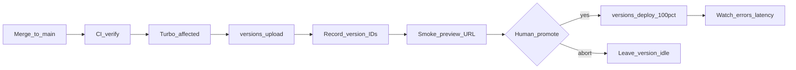
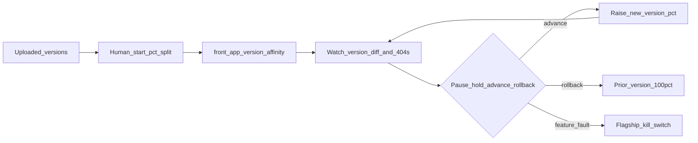

# Stage 1–2 Continuous Delivery Design

> Implementable design for continuous **delivery of versions** (Stage 1) and **progressive exposure** (Stage 2) for `worker-api` and `front-app`. Bound by [cd-operating-model.md](./cd-operating-model.md). Architecture rationale: [continuous-deployment-workers.md](./continuous-deployment-workers.md).

**Audience:** On-call engineers during a bad deploy; Chat C implementers of Stage 1 CI/upload/promote.

**Hard distinction:** Cloudflare **Worker version / gradual deployment / version affinity / rollback** control which **binary** serves traffic. **Flagship** controls which **behavior** runs inside already-deployed code. Never conflate them.

**Privileged data (standing):** Client/matter identifiers must not appear in log lines, trace attributes, error bodies, cache keys, URL paths/query strings, or Flagship targeting contexts. Correlate with opaque request IDs only.

---

## Assumptions (locked)

| Topic | Decision |
|-------|----------|
| Promote authority | Deployable **owner or on-call delegate** (single human). **No dual-control** for Stage 1–2 on this thin surface. |
| Staging | **Real habit, not a hard CI gate.** Prefer staging or versioned preview smoke before production promote; hotfixes may skip staging with a documented reason. |
| Upload trigger | Merge/`push` to **`main`** after verify CI green → **affected-only** version upload. PRs stay verify-only. |
| Orchestration | **GitHub Actions + Turbo `--affected`**. Workers Builds is not the monorepo brain. |
| Production env | Wrangler **`production`** env for uploaded/promoted versions. |
| Preview URLs | Stage 1 requires them enabled for smoke (`front-app` today has `preview_urls: false`). |
| Shared contracts | When Turbo marks both apps affected (typical `@repo/dtos-common` / enums change), upload **both** and promote as **one window**. |

---

## Responsibilities (who does what)

| Actor | Stage 1 | Stage 2 |
|-------|---------|---------|
| **CI (GitHub Actions + Turbo)** | Verify; build affected; `versions upload`; publish version IDs + preview URLs. Never moves production traffic. | Same upload path. Does **not** advance percentage ramps. |
| **Human (owner / on-call)** | Smoke; classify change; promote to 100% (or abort); rollback. | Start/hold/advance/rollback gradual splits; watch version-diff and asset 404s; Flagship kill-switch when applicable. |
| **Cloudflare platform** | Immutable versions; preview URLs; deployments; rollback to last 100 versions. | Gradual % splits; version affinity; version overrides; per-version metrics; Flagship evaluation (once wired). |

---

## A. Stage 1 — Upload ≠ promote

Goal: every eligible merge produces an immutable Worker **version** with **0% automatic traffic**. A human decides when that version serves production.

### Stage 1 flow

### Trigger

| Event | Action |
|-------|--------|
| `pull_request` | Verify only (existing CI). No production upload. |
| `push` / merge to `main` (after verify green) | Affected-only **version upload** for deployables that would rebuild for `build` / `deploy`. |
| Manual / hotfix | Same upload path; promote may skip staging with documented reason (operating-model emergency class). |

**Deployables today:** `worker-api`, `front-app`. Workspace packages (`@repo/dtos-common`, `@repo/enums-common`) are **inputs**, not uploadable artifacts—they ship inside consumer versions.

**Affected honesty:** If Turbo would rebuild the app, upload a new version. If not, do not upload a decorative version. Never “always deploy all.”

### Artifact: what a “version” is

| App | Immutable version contains | Notes |
|-----|----------------------------|-------|
| `worker-api` | Worker script + Wrangler bindings/config/compat for that env | Hono gateway; no static asset tree as primary payload. |
| `front-app` | Worker + **Vite build output** as Workers static assets (`assets.directory`) | Content-hashed JS/CSS filenames; SPA `not_found_handling`. |

A version is **not** an npm package version. Last **100** versions remain eligible for deploy/rollback (platform limit).

Binding *configuration* is versioned with the Worker. **Data** in future KV/R2/DO/D1/Queues is not. Rollback of code does not rewind storage.

### Smoke strategy

| Method | When | Mechanism |
|--------|------|-----------|
| **Primary** | After every upload | **Versioned preview URL** (`<version-prefix>-<worker>.<subdomain>.workers.dev`). Requires preview URLs enabled. |
| **Optional production-shaped** | Before a cautious promote | Put new version in the **active deployment at 0%**, then hit production hostname with `Cloudflare-Workers-Version-Overrides` (override applies only if the version is in the current deployment). |
| Staging env | Habit for non-trivial / non-hotfix | Promote or upload against Wrangler `staging` before production promote—useful, not a CI hard gate. |

**Smoke proves:** process boots; `worker-api` health/ready succeeds; `front-app` shell (index HTML + critical assets) loads; no obvious 5xx on the smoke paths.

**Smoke cannot prove:** real traffic mix; SPA↔API skew under a gradual split; product correctness on privileged paths (use opaque/synthetic IDs only—never real matter/client identifiers in smoke URLs, logs, or flag context).

### Promote authority

- **Who:** deployable owner or on-call delegate.
- **How:** Cloudflare dashboard “Promote” or Wrangler `versions deploy` → **100%** in Stage 1.
- **Dual-control:** not required for Stage 1–2.
- **Staging:** preferred before production for non-trivial changes; optional for documented hotfixes.

Change-class gates from the operating model still apply: binding topology / secrets shape / future storage migrations are not “routine” promotes.

### Failure modes

| Failure | Effect | Action |
|---------|--------|--------|
| CI verify red | No upload | Fix on branch; do not promote anything from that SHA. |
| Upload fail (one or both apps) | No new eligible version | Fix credentials/config/build; re-run upload. Do not promote a half-pair when both were required. |
| Smoke fail | Version exists at 0% traffic | Do not promote. Leave idle or roll forward with a fixed upload. |
| Promote abort (human stops) | Prior version remains 100% | Record why; idle new version is fine. |
| Partial multi-app success (e.g. `worker-api` uploaded, `front-app` failed) when both required | Incompatible promote window risk | **Promote neither.** Fix and re-upload both; then one promote window. |

### Rollback in Stage 1

| Situation | Version rollback enough? |
|-----------|--------------------------|
| Regressed compute/UI; no schema/storage change | **Yes** — promote prior version to 100% (`wrangler rollback` / dashboard). |
| Bad feature path inside an otherwise healthy new binary (once Flagship exists) | Prefer **Flagship disable**; rollback secondary. |
| Irreversible storage / message schema migration | **No** — forward-fix / restore. (Products not in use yet; document so drills stay honest.) |
| Account-level DNS / routes / unbound config / secret **contents** wrong outside the version | **No** — fix that surface; Worker rollback alone may not undo it. |
| Binding deleted/modified so platform refuses rollback | **No** — platform blocks unsafe rollbacks (e.g. missing KV/R2/queue binding targets; DO class lifecycle gaps). |

Rollback creates a new deployment selecting a prior version. It does not rewind data.

### Definition of Done — Stage 1

- [ ] CI remains the merge gate (boundaries, lint, format, affected typecheck/build).
- [ ] On `main`, affected deployables get **`versions upload` without automatic 100% traffic**; practiced until boring on a non-critical path.
- [ ] Preview URLs enabled; smoke habit uses preview URL (and optionally 0% + override).
- [ ] Staging or preview habit used before production promote for non-hotfix changes.
- [ ] **Rollback drill** completed; time-to-mitigate measured; “what rollback does not undo” understood.
- [ ] Named owners for `worker-api`, `front-app`, and shared contracts (`@repo/dtos-common` / `@repo/enums-common`).
- [ ] Package scripts / CI conceptually split **upload** vs **promote**; `wrangler deploy` (upload+100%) is not the Stage 1 default path for `main`.

Exit criteria align with operating-model **Stage 0 → 1**.

---

## B. Stage 2 — Progressive exposure

Goal: production promotes can **split traffic** between two versions; humans advance using version-diff signals. Upload path stays Stage 1.

### Stage 2 flow

### Ramp philosophy

| Deployable | Ramp | Affinity |
|------------|------|----------|
| `worker-api` | Short percentage ladder for non-trivial changes (e.g. 10 → 50 → 100). Immediate 100% only for trivial/hotfix when delay risk exceeds cutover risk (document the skip). | Nice-to-have for sticky debugging; **not mandatory** for pure JSON API responses. |
| `front-app` | Same ladder bias for non-trivial UI/asset changes. | **Mandatory** whenever traffic is split. |

Regional geography is not a primary lever.

### Version affinity for `front-app` (mandatory on splits)

Without affinity, each request is independently routed by percentage. Vite content-hashed assets then fail as: HTML from version A references `index-a1b2c3d4.js`, browser fetch lands on version B → **404** → broken page.

**Requirement:** set `Cloudflare-Workers-Version-Key` on inbound requests to `front-app` (preferred: zone **Transform Rule** from a stable session/cookie value that is **not** a client/matter identifier). Platform hashes the key; you do not pick which version a key maps to. As percentages rise, keys already on the new version stay there.

Affinity pins **within** `front-app` only. It does **not** lock `front-app` and `worker-api` to the same generation.

### SPA ↔ API skew controls

| Control | Rule |
|---------|------|
| Compatibility window | HTTP DTOs in `@repo/dtos-common`: expand/contract; **N and N+1 must coexist** during independent ramps. |
| Promote order (additive) | Upload/promote **API support first**, then SPA that depends on it. |
| Promote order (removal) | Migrate/remove SPA usage first, then remove API shape. |
| Same-PR discipline | Additive wire changes that need consumer updates land in the **same PR**; still yield multiple uploadable versions. |
| Do not ship together | Breaking removals with consumers still live; binding topology with “routine” UI; anything labeled migration as a silent co-ramp. |

### Signals — pause / hold / advance / roll back

Tied to the operating-model observability bar (also Stage 2 practice for **manual** gradual promotes):

| Signal | Use |
|--------|-----|
| Version-diff **error / exception** rate | New version worse → **pause** or **rollback**. |
| Version-diff **latency** (at least p95) | Sustained regression → **hold**; do not advance. |
| `front-app` **asset 404** rate | Classic affinity/skew → **pause**; verify affinity; often **rollback** the SPA split. |
| Opaque **request ID** correlation `front-app` → `worker-api` | Debug without privileged identifiers. |

**Targets:** time-to-detect ≤ **5 minutes** after a ramp step; time-to-mitigate ≤ **15 minutes**.

| Decision | When |
|----------|------|
| **Advance** | Version-diff healthy for the bake window; no asset-404 spike; no known contract alarm. |
| **Hold** | Ambiguous signal; waiting for bake; coordinated second app not ready. |
| **Pause** (keep current split) | Investigating; do not raise %. |
| **Rollback** (prior version 100%) | Confirmed binary regression or SPA 404 skew; see runbooks. |

CI green never authorizes skipping these signals on a gradual path.

### Where Flagship sits in Stage 2

| Lever | Controls | Sticky how | Use for |
|-------|----------|------------|---------|
| Workers gradual deployment | Which **Worker version** serves the request | Version affinity header | Blast radius of **code** just shipped |
| Flagship % / targeting | Which **behavior/config** runs inside deployed code | Consistent hash on a stable, **non-privileged** attribute | Feature exposure & **kill-switch** without redeploy |

- Evaluate on **`worker-api` Flagship binding** (edge-local; no app-managed token). `front-app` learns via API/bootstrap payload.
- **Do not** ship Cloudflare API tokens in a browser OpenFeature client provider (docs: not recommended for public apps).
- Every evaluation supplies a **safe default**; failure → safe-off.
- Flag targeting context: no matter/client identifiers.
- Flagship disable ≠ schema safety for future queues/DO/DB.

Until Flagship is wired, incomplete features stay off by code path or do not merge—do not invent a second SPA flag SaaS.

### Manual vs later Stage 3 (name only)

| Remains manual in Stage 2 | May automate later (Stage 3+) — do not design here |
|---------------------------|-----------------------------------------------------|
| Start / advance / pause percentage | Metric-gated auto-ramp policies |
| Rollback / Flagship kill | Auto-pause robots |
| Change-class “is this routine?” judgment | Policy engine for routine vs migration |
| Coordinated multi-app promote windows | Richer multi-Worker order playbooks |

---

## C. Runbooks

### Bad error-rate after promote

1. Confirm version-diff (new vs old), not only global spike.
2. If new feature/path only → **Flagship disable** (if wired); else disable by config/code forward-fix.
3. If regressed correct old behavior, no storage/schema change → **Worker version rollback** to prior 100%.
4. If irreversible migration suspected → **forward-fix**; do not blind-rollback.
5. Mitigate within 15 minutes; leave a short note (what signal, which lever).

### Asset 404 spike during `front-app` ramp

1. Treat as **affinity or asset skew** until proven otherwise.
2. **Pause** further % advances immediately.
3. Verify `Cloudflare-Workers-Version-Key` is present and stable for browsers fetching HTML and hashed assets.
4. If affinity missing/broken or 404s continue → **rollback** `front-app` to prior version 100%.
5. Do not “fix” by redeploying API first—this is an SPA binary-split symptom.

### Suspected contract skew (SPA ↔ API)

1. Pause promotes on **both** apps.
2. Compare which versions are live (%); check whether an additive/removal landed without expand window.
3. Prefer aligning versions (promote the compatible pair or roll the incompatible side back).
4. Flag off risky paths if Flagship covers them.
5. Debugging: opaque request IDs only—no matter/client IDs in logs or traces.

### Mitigation precedence (decision table)

| Situation | Prefer first | Then |
|-----------|--------------|------|
| New feature/path causing errors; new version otherwise healthy | **Flagship kill-switch / disable** | Version rollback if flag insufficient |
| Regressed correct old behavior; no schema/storage change | **Worker version rollback** | Forward-fix if rollback blocked |
| Bad / irreversible storage or message schema migration | **Forward-fix** (or product restore) | Not blind Worker rollback |
| Partial multi-app incompatible ramp | Pause; align versions; flag off | Rollback the offending side |
| SPA asset 404s during split | Pause; fix/verify affinity; **SPA version rollback** | Re-ramp only with affinity proven |
| CI/upload/smoke failure | Do not promote | Re-upload after fix |

---

## D. Out of scope until later

- Queue / Durable Object / KV / R2 / D1 migration CD playbooks
- Auto-100% traffic on every merge
- Flagship browser evaluate tokens / client provider in `front-app`
- Workers Builds as primary monorepo orchestrator
- Dual-control promote gates
- Full Stage 3 auto-ramp / change-class automation design
- Multi-Worker service-binding RPC order playbooks as the default path
- Scheduled release trains; regional rollouts as primary CD lever
- Always-deploy-all (rejected by operating model)

---

## E. Implementation handoff — Stage 1 only

Ordered work packages for Chat C. Conceptual areas only—no YAML or app feature code in this doc.

1. **Preview URLs** — Enable for `worker-api` and `front-app`; confirm access posture for smoke.
2. **Scripts split** — Per-app conceptual paths: **upload** (`versions upload` + production env) vs **promote** (`versions deploy`). Stop treating `wrangler deploy` (upload+immediate 100%) as the Stage 1 default for `main`.
3. **CI upload job** — On `main` after verify: Turbo `--affected` → build → upload → publish version IDs and preview URLs (artifacts / job summary). **No auto-promote.**
4. **Secrets** — `CLOUDFLARE_API_TOKEN` + account id for upload (least privilege); never commit; no privileged payload in logs. Promote via human-gated `workflow_dispatch` and/or dashboard.
5. **Smoke checklist** — Minimal probes: `worker-api` health/ready; `front-app` index/shell. Synthetic IDs only.
6. **Owners + drill** — Named owners/rota; execute and record one rollback drill (TTM).
7. **Docs pointers** — Link AGENTS/README (or deploy notes) to this design + operating model.

### Do not build in Stage 1

- Gradual percentage automation or metric-gated advance
- Version affinity Transform Rules (Stage 2)
- Flagship wiring as a required production gate
- Workers Builds replacing GitHub Actions + Turbo
- Always-deploy-all
- Dual-control approval gates
- Queue/DO/storage migration playbooks
- Browser Flagship tokens
- Auto-100% on merge

---

## References

- Binding decisions: [cd-operating-model.md](./cd-operating-model.md)
- Architecture assessment: [continuous-deployment-workers.md](./continuous-deployment-workers.md)
- [Versions & deployments](https://developers.cloudflare.com/workers/versions-and-deployments/)
- [Deployment management](https://developers.cloudflare.com/workers/versions-and-deployments/deployment-management/)
- [Preview URLs](https://developers.cloudflare.com/workers/versions-and-deployments/preview-urls/)
- [Version overrides](https://developers.cloudflare.com/workers/versions-and-deployments/version-overrides/)
- [Gradual deployments](https://developers.cloudflare.com/workers/versions-and-deployments/gradual-deployments/)
- [Version affinity](https://developers.cloudflare.com/workers/versions-and-deployments/gradual-deployments/version-affinity/)
- [Rollbacks](https://developers.cloudflare.com/workers/versions-and-deployments/rollbacks/)
- [Workers CI/CD](https://developers.cloudflare.com/workers/ci-cd/)
- [Flagship](https://developers.cloudflare.com/flagship/)
- [Flagship best practices](https://developers.cloudflare.com/flagship/best-practices/)
- [Flagship client SDK warning](https://developers.cloudflare.com/flagship/sdk/client-provider/)
