# Continuous Deployment on Cloudflare Workers: Architectural Assessment

> Strategy and reliability engineering only. This document does not prescribe CI YAML, Wrangler flags, scripts, or concrete code changes. It evaluates whether deploy-on-every-merge can become a safe operating model for this pnpm Workers monorepo, and what must mature first.

**Operating decision:** Near-term Stages 1–2 choices (upload ≠ promote, change gates, Flagship vs gradual levers, exit criteria) are locked in [cd-operating-model.md](./cd-operating-model.md). This assessment remains the architectural source of truth.

**Scope:** Architecture, strategy, reliability engineering, and decision-making—not an implementation guide.

**Assumptions (explicit):**
- Target is this monorepo’s pnpm/Turborepo stack on Cloudflare Workers (not the sibling `api-template` FastAPI/k8s stack, which is orthogonal).
- Near-term deployables remain `worker-api` + `front-app`, with documented growth into `worker-*` / `queue-*` / `webhook-*` / `mcp-*` via service bindings and shared `@repo/dtos-common`.
- “Production” means live user traffic on Cloudflare’s edge, not a long-lived staging cluster that mirrors prod topology.

**Grounding:** Cloudflare platform docs for Versions & Deployments, Gradual Deployments, Version Affinity, Rollbacks, Deployment Management, Workers CI/CD / Builds, Observability, Durable Objects, KV consistency, and [Flagship](https://developers.cloudflare.com/flagship/) (public beta since 2026-05-26). Flagship is treated as a first-class CD lever for deploy≠release alongside gradual deployments—not as an optional third-party flag SaaS.

---

## Current baseline (why this assessment is tailored)

| Layer | Today |
|-------|--------|
| CI | Verify-only ([`.github/workflows/ci.yml`](../.github/workflows/ci.yml)): boundaries, lint, format, `--affected` typecheck/build. **No deploy.** |
| Deploy | Manual `turbo run deploy` → `wrangler deploy --env production` per app. Staging env blocks exist in Wrangler but are not the default path. |
| Coupling | Both apps depend on `@repo/dtos-common` / `@repo/enums-common` (`workspace:*`, JIT source). Contracts change implies coordinated app redeploy. |
| Stateful CF products | Not in use yet (no KV/R2/DO/Queues/D1 bindings). Observability logs on; traces sampled (~1%) in staging/prod config. |
| Boundaries | Apps never import apps; Worker-to-Worker is planned as service-binding RPC—this is already the right CD unit of isolation. |

You are in a favorable position: **simple surface, strong package boundaries, no stateful edge product coupling yet.** CD risk will rise as you add Queues, DO, shared storage, and multi-Worker RPC—not because Workers cannot do CD.

---

## 1. Applicability of Continuous Deployment to Cloudflare Workers

### Verdict

**Yes—Workers are unusually well-suited to continuous deployment**, *if* you treat “deploy” as **version promotion + traffic shaping**, not as “replace a fleet of servers.” Cloudflare already separates **version** (immutable artifact: code, assets, bindings config, compat settings) from **deployment** (which version(s) serve traffic, including percentage splits). That is the same conceptual split large CD orgs use between build artifact and release.

### How edge differs from traditional infra

| Traditional CD concept | Workers translation |
|------------------------|---------------------|
| Rolling deploy across VMs/pods | Not meaningful: there is no node fleet you control. Propagation is Cloudflare’s global edge activation of a version/deployment. |
| Canary / percentage traffic | **Gradual deployments**: split traffic across two versions by percentage. |
| Sticky canary cohort | **Version affinity** (`Cloudflare-Workers-Version-Key`): deterministic assignment so a user does not bounce between versions (critical for SPA static assets with content-hashed filenames). |
| Regional / AZ rollout | **Not a first-class Workers model.** You do not roll region-by-region the way you do with k8s. Prefer percentage + affinity; use geography only via product-specific features (e.g. KV jurisdictions) if compliance forces it—not as a CD lever. |
| Blue/green cutover | Approximate with 0%/100% version deploy, smoke via **version overrides**, then ramp. |
| Immutable artifact | Versions; last **100** versions available for deploy/rollback. |
| Config vs code | Binding *configuration* is versioned with the Worker; **data** in KV/R2/DO/D1 is **not** versioned with the Worker. Rollback of code does **not** rollback storage. |

### Cloudflare-specific advantages

- **Fast, global activation** without capacity planning or node drains.
- **Stateless request path** (for pure Workers) makes most deploys reversible at the traffic layer.
- **Upload ≠ promote**: `versions upload` then `versions deploy` enables merge-to-artifact and separate release gates—the prerequisite for safe “deploy on merge.”
- **Per-version metrics** (error rates, outcomes) make gradual ramps observable without inventing a custom canary stack.
- **Preview URLs / version overrides** support production-shaped smoke tests before traffic share increases.
- **Workers Builds or external CI** both officially supported; monorepos with affected graphs usually favor **external CI** (your existing GitHub Actions + Turbo) over one-repo-one-Worker Builds defaults.

### Cloudflare-specific constraints (adapt, do not ignore)

1. **Version skew** is the edge analogue of mixed-fleet inconsistency. Same user may hit different versions per request unless affinity is used. Service-binding callers may see downstream Workers on different gradual points—contracts must tolerate skew, or you pin with version overrides during coordinated rollouts.
2. **Durable Objects**: only one version of each DO instance runs at a time; gradual deploy assigns instances to versions by percentage and keeps them sticky until the next deployment. **DO class lifecycle changes (create/rename/delete/transfer) cannot be applied via gradual upload**—they require a full deploy path and are atomic at the migration layer. Multi-step rename/transfer patterns exist precisely because CD frequency collides with stateful class identity.
3. **KV**: eventually consistent; writes visible immediately in the same colo, up to ~60s elsewhere. Feature flags or config in KV during a gradual ramp can disagree across the globe—design for that.
4. **Queues**: producers and consumers can be on different versions for long periods; message schemas need dual-read/dual-write discipline. Retries and DLQs are operational safety nets, not substitutes for compatibility.
5. **R2 / external DBs**: schema and object layout outlive Worker versions; rollback of Worker code against a forward-migrated store is a classic footgun.
6. **Static assets (`front-app`)**: gradual deploy without version affinity tends to produce **404s on hashed assets** (HTML from v2, JS from v1). Affinity is not optional for SPA CD.
7. **Bindings/resources connected to a Worker are not changed by rollback**—Cloudflare documents this explicitly. Rollback is a code/config-version switch, not a full environment rewind.

### What remains valid from classic CD

Trunk-based development, small changes, automated verification, progressive exposure, fast detection, forward-fix bias, deploy ≠ release (feature flags)—all still apply.

### What must be adapted

Regional rollouts, VM health checks, connection draining, “redeploy the previous AMI,” and treating storage migrations as inseparable from the binary. On Workers, **compatibility windows and traffic percentages** replace **fleet churn**.

---

## 2. Monorepo Architecture Considerations

### Core equation

In a pnpm monorepo with JIT shared packages, **a merge is not one deploy unit**. A change to `@repo/dtos-common` can invalidate and require redeploy of every consumer Worker/SPA that imports it. Turbo `--affected` already models *build* impact; CD needs the same honesty for *deploy* impact.

### Realistic independent deployment boundaries

| Boundary | Independent deploy? | Notes |
|----------|---------------------|--------|
| `worker-api` alone (behavior-only change) | Yes | Ideal CD path. |
| `front-app` alone | Mostly | Must stay compatible with live API; bake-time `VITE_*` URLs are a coupling risk. |
| Shared DTO/enum change | **No**—coordinated multi-app | Prefer expand/contract; never break wire shapes in one step. |
| Future `worker-*` via service binding | Yes per Worker | RPC contracts in `dtos-common/rpc` become the compatibility surface; version skew between Workers is expected during CD. |
| Future `queue-*` | Consumer/producer separate | Schema evolution rules dominate. |

Your Turbo boundary tags (`app` cannot depend on `app`) already encode the right *compile-time* isolation. CD needs a parallel **runtime compatibility** discipline: shared packages define **versioned contracts**, not “whatever is on main today.”

### Patterns that reduce risk (conceptual)

- **Contract ownership**: one package owns wire schemas; apps consume, never fork.
- **Expand/contract** for every shared type change (add → migrate consumers → remove).
- **Deploy graph ≠ package graph**: service bindings create runtime edges Turbo cannot see unless you declare them (your `transit` docs already nod at callee edges)—CD orchestration must know those edges.
- **Package versioning strategy**: internal `workspace:*` is fine for velocity; the safety property is **compatibility windows**, not semver publish. Publishing internal packages only helps if you intentionally run mixed versions in prod—which Workers bundles usually do *not* (each Worker ships its own bundle of workspace sources at build time). So **each deployable freezes its dependency closure at build time**—good for CD—while **cross-Worker and SPA↔API** still see skew across deployables.
- **Ownership**: every deployable and every contract module needs a clear owner accountable for blast radius on merge.

### Biggest monorepo CD risk for *this* repo

Today: **DTO change that subtly breaks `front-app` runtime assumptions while types still pass**, or a gateway change that is “safe” in isolation but breaks the SPA’s expected envelope. Tomorrow: **RPC contract change with staggered Worker ramps**.

---

## 3. Continuous Integration Philosophy

### What CI must guarantee before “merge = eligible to promote”

- The **affected deployable graph** builds and typechecks.
- Package **boundaries** hold (already enforced).
- Wire contracts remain **internally consistent** (schemas compile; consumers updated in the same change set when required).
- Artifacts are **reproducible enough** to trust (frozen lockfile—you already do this).
- No known **compatibility break** markers (policy/lint around deprecated contract removals, etc.—organizational, not just tooling).

### What CI cannot guarantee

- Global edge behavior under real traffic mixes.
- KV/R2/DO/Queue timing and consistency quirks.
- Third-party dependency or Cloudflare platform incidents.
- Product correctness the team never asserted.
- That two independently gradual-deployed Workers remain compatible under skew.

CI buys **permission to expose**, not **proof of production safety**.

### Testing portfolio (confidence vs velocity)

| Layer | Role in CD | Trap |
|-------|------------|------|
| Unit | Fast design feedback; pure logic | False confidence if overused for integration concerns |
| Integration (Worker + bindings mocks/local) | Catches handler/binding mistakes | Local sim ≠ global consistency |
| Contract tests (HTTP + future RPC/queue schemas) | **Highest leverage** for monorepo CD | Skipping them makes shared packages dangerous |
| E2E | Few critical journeys against preview/version | Slow; brittle; do not block every merge on a giant suite |
| Dependency/validation (boundaries, lockfile, types freshness) | Prevents structural decay | Not a substitute for runtime probes |

**Opinion:** For this template’s trajectory, invest first in **contract tests at HTTP (and later RPC/queue) boundaries** and a **small production-shaped smoke** against a uploaded version (0% traffic or preview), not in maximizing E2E count.

Balance: keep the merge gate **minutes**, push deep confidence into **progressive delivery + observability**, and reserve heavy E2E for high-risk changes (auth, payments, migrations)—ideally via change classification, not a single slow pipeline for everything.

---

## 4. Observability Requirements

Before deploy-on-merge, production must answer within minutes: **“Is this version worse than the previous one?”**

### Signals that matter most on Workers

- **Invocation outcomes / error rate / exception rate by version** (platform metrics already support version comparison during gradual deploys).
- **Latency**: wall time, CPU time; p95/p99—edge noise is real; compare versions, not absolute thresholds alone.
- **SAT / client failures** for `front-app`: asset 404 rate during ramps (classic skew symptom).
- **Queue depth, retry rate, DLQ growth** (when Queues exist).
- **DO reset/error patterns** after version assignment changes.
- **Business/SLI proxies**: health/ready semantics you already expose; later, critical user actions—without privileged identifiers in logs (legal-domain constraint in your guardrails).

### Logs, traces, correlation

- Logs: high-cardinality careful; prefer **opaque request IDs**, version metadata (Workers version metadata binding / Logpush `ScriptVersion`), outcome.
- Traces: you already enable sampled traces in non-dev; CD needs enough sampling during ramps to compare versions, plus OTLP export if you need longer retention/alerting than dashboard UX.
- Correlation: one request id across `front-app` → `worker-api` → future RPC/queue—**without** putting matter/client ids in paths or logs.

### Alerting and detection objectives

- **Detection**: aim for “know within a few minutes of ramp step,” not “next morning.”
- Alert on **version-differential** error/latency, not only global spikes.
- Page humans on **sustained** burn of SLOs during a ramp; auto-pause/rollback policy is a later maturity stage.
- “Production readiness” on the edge means: golden signals by version, runnable rollback authority, and a rehearsed decision path—not a perfect dashboard.

---

## 5. Feature Flags and Progressive Delivery

### Deploy vs release

CD requires separating **shipping code to the edge** from **activating behavior**. Feature flags are how you keep merges small while holding back unfinished or risky behavior.

### Cloudflare Flagship (platform-native)

[Flagship](https://developers.cloudflare.com/flagship/) is Cloudflare’s feature-flag product (public beta since 2026-05-26). For a Workers monorepo aiming at CD, it is the default candidate for the release-control layer—not a generic third-party afterthought.

**What it provides (architecturally relevant):**
- **Native Workers binding** — evaluate flags at the edge with no outbound HTTP; typed getters with required safe defaults.
- **Edge-local evaluation after global propagate** — configure in dashboard/API → distribute across the network (docs: within seconds) → evaluate from the local config; last-known config continues if the control plane is unavailable.
- **Targeting + percentage rollouts** with **consistent hashing / sticky bucketing** on a stable attribute (`targetingKey` / configured bucketing key).
- **Multi-type variants** (bool/string/number/JSON) — JSON variants can ship config blocks, not only on/off.
- **OpenFeature SDKs** (TS Workers/Node/browser, Python, Go) — vendor-neutral evaluation API; binding can back the server provider inside Workers.
- **Apps** as the organizational unit — maps cleanly onto monorepo deployables (`worker-api`, `front-app`, future `worker-*`).
- Backed by Cloudflare’s own KV/DO infrastructure for config delivery (product detail; you do not operate that store yourself).

**Critical distinction — do not conflate these two percentage knobs:**

| Lever | Controls | Sticky how | Use for |
|-------|----------|------------|---------|
| **Workers gradual deployment** | Which **Worker version** (binary/config artifact) serves the request | Version affinity header | Blast radius of *code* you just shipped |
| **Flagship percentage rollout** | Which **behavior/config variant** runs *inside* already-deployed code | Consistent hash on user/account/org id | Blast radius of *features* without redeploying |

Safe CD uses both: ramp the binary carefully; release the feature independently. Kill-switching a bad feature via Flagship is usually preferable to rolling back a Worker version once the new code also contains unrelated fixes.

**Monorepo-specific implications:**
- Prefer **server-side evaluation in `worker-api`** (binding) and pass decisions to `front-app` via API/bootstrap payload—especially while the browser OpenFeature provider still requires an API token Cloudflare **does not recommend exposing in public client apps**.
- Map Flagship **apps** 1:1 (or carefully many:1) to deployable ownership boundaries so flag debt does not become a shared dumping ground.
- Legal/privileged-data rules still apply: targeting context must not become a sink for matter/client identifiers in logs or indiscriminate attributes.

**Caveats before betting the operating model on it:**
- Public beta maturity and operational SLOs are still product-risk inputs.
- Propagation is fast but not a transactional lockstep with a Worker version promote—expect brief windows of mixed flag views globally (same class of problem as any distributed flag store).
- Client-side evaluation path is currently constrained; design for **edge/gateway evaluation** first.
- Flag lifecycle (owner, default-safe-off, cleanup) remains an organizational requirement Flagship does not solve for you.
- Flagship disable ≠ schema/rollback safety for queues/DO/DB.

### When flags are necessary

- Incomplete features on main.
- High-risk behavior changes that need cohort exposure.
- Kill-switches for downstream dependency failure.
- Experiments / A/B-style splits (Flagship supports multi-variant rollout patterns).

### When flags add needless complexity

- Pure bugfixes with clear reverse deploy.
- Internal refactors with no behavior change.
- Long-lived flags without ownership (flag debt is a reliability bug).

### Lifecycle principle

Every flag needs: owner, default, cleanup criterion, and a bias toward **short life**. Prefer **Flagship** for **release control**; prefer **contract expand/contract** for API evolution; prefer **Workers gradual deployments** for **blast-radius control of the binary**. They compose.

### Edge-suited progressive delivery

1. Upload Worker version → smoke with version override / preview.
2. Affinity-aware **gradual deployment** percentage ramp (especially SPA assets).
3. Compare **version-diff** metrics; advance or roll back the binary.
4. Independently use **Flagship** targeting/rollouts for feature exposure and kill-switches (no redeploy).
5. For multi-Worker changes: ramp **callee before caller** for expansions; ramp **caller before callee** for removals—classic distributed expand/contract order.
6. Prefer Flagship disable over Worker rollback when the fault is behavioral and the new version is otherwise healthy.

---

## 6. Rollback Strategy

### What rollback means here

Promote a prior **Worker version** to 100% (or exit a split by selecting the healthy version). Limit: **100 most recent versions**. Instant at the traffic layer; **does not** revert KV/R2/DO/D1/Queue payloads or external DB migrations.

### Should rollback be primary?

**No—rollback is the emergency brake, not the design center.** Primary safety is: small diffs, contracts, progressive exposure, flags, forward-fix. Rollback fails when:

- Storage already migrated incompatibly.
- Messages already written in a new schema.
- Bad config was outside the version (account-level routing, DNS, secret contents).
- The previous version is outside the 100-version window (process smell if you rely on ancient versions).

### Prefer disable vs revert

| Situation | Prefer |
|-----------|--------|
| New feature causing errors | Flag off / disable path |
| Regressed correct old behavior, no schema change | Version rollback |
| Bad schema migration | Forward fix or restore from backup/PITR (DO SQLite PITR is a product capability)—not blind Worker rollback |
| Partial multi-Worker incompatible ramp | Pause ramps; align versions; flag off |

### Detection

Automate *detection* (version-diff error budget); keep early *mitigation* human-approved until false-positive rate is proven. Deployment failure ≠ runtime failure: failed upload/promote should block; successful promote with bad SLIs should trigger mitigation.

**Compare philosophies:** rollback-based (fast, limited by state), flag-based (best for behavior), forward-fix (default for schema and “can’t go back”). Mature CD uses all three with clear precedence.

---

## 7. Backward Compatibility and Distributed Systems

Continuous deployment makes **N and N+1** coexist continuously. That is the tax.

### Risk surfaces for this architecture

- **HTTP API** (`worker-api` ↔ `front-app` and external clients)
- **Future RPC** (service bindings; skew during independent ramps)
- **Queues** (async; long-lived messages)
- **Shared packages** (compiled into each deployable—safe per artifact, dangerous across artifacts)
- **External consumers / webhooks**
- **Storage** (when introduced): DO storage layout, KV value shapes, R2 object schemas, Hyperdrive/Postgres migrations

### Conceptual patterns

- Expand/contract; optional fields; additive enums.
- Explicit schema version field on queue messages.
- Dual-write / dual-read windows with measured completion before removal.
- Idempotent consumers; DLQ as quarantine.
- Never deploy a consumer that cannot read the previous producer’s messages (and vice versa when rolling back).
- Treat `@repo/dtos-common` changes as **compatibility PRs** with a stated window, not as drive-by refactors.
- For legal/privileged data: compatibility work must not leak identifiers into telemetry while debugging skew.

---

## 8. Deployment Models Compared (for this monorepo)

| Model | Fit | Comment |
|-------|-----|---------|
| Scheduled releases | Poor long-term | Large batches maximize skew and rollback pain; OK only as temporary risk control. |
| Daily deployments | Good intermediate | Builds muscles without merge-speed pressure. |
| Merge + manual approval | Good near-term target | CI builds artifacts; human promotes; matches “upload ≠ deploy.” |
| Merge + automated safeguards | **Strategic target** | Auto-ramp with metric gates; human on-call. Best match for Workers gradual deploy once observability is real. |
| Full CD (every merge → 100% auto) | Realistic **later**, not first | Fine for low-risk services; dangerous as a blanket policy once DO/Queues/DB exist. Prefer **policy by change class**. |

**Opinionated recommendation:** Aim for **continuous *delivery* of versions on merge**, with **continuous *deployment* of traffic** via automated progressive ramps for routine changes—and **mandatory human gates** for migrations, binding topology changes, and contract removals.

---

## 9. Migration Strategy (maturity path)

Do not jump from today’s manual `wrangler deploy` to full auto CD.

```mermaid
flowchart LR
  subgraph stage0 [Stage0]
    ManualDeploy[Manual_CLI_deploy]
    CiVerify[CI_verify_only]
  end
  subgraph stage1 [Stage1]
    StagingHabit[Staging_or_preview_habit]
    VersionUpload[Upload_version_on_merge]
    ManualPromote[Manual_promote]
  end
  subgraph stage2 [Stage2]
    GradualRamp[Percentage_ramps]
    Affinity[SPA_version_affinity]
    VersionMetrics[Version_diff_alerts]
  end
  subgraph stage3 [Stage3]
    AutoRamp[Auto_ramp_policies]
    ChangeClasses[Change_class_gates]
    FlagDiscipline[Flag_lifecycle]
  end
  subgraph stage4 [Stage4]
    MultiWorker[Multi_Worker_CD]
    QueueDORules[Queue_and_DO_playbooks]
    FullCD[CD_as_default]
  end
  stage0 --> stage1 --> stage2 --> stage3 --> stage4
```

### Stage 0 → 1: Prerequisites

- Keep CI green as the merge gate (already strong).
- Practice **upload without immediate 100%** and **rollback** on a non-critical path until boring.
- Make staging/preview a real habit (envs already exist conceptually).
- Define owners for `worker-api`, `front-app`, and contracts.

### Stage 1 → 2: Progressive exposure

- Gradual ramps for production promotes.
- Version affinity for `front-app`.
- Alerting on version-differential errors/asset 404s.
- Document “what rollback does not undo.”

### Stage 2 → 3: Organizational change

- Change classification: routine / contract / migration / emergency.
- Feature-flag policy with forced cleanup.
- On-call expects deploy-related pages; blameless review of ramp decisions.
- Error budgets decide whether auto-promote is allowed.

### Stage 3 → 4: Multi-deployable CD

- Deploy order playbooks for RPC and queues.
- DO migration calendar ≠ silent merge.
- Only then treat “merge to main” as default production exposure for routine changes.

### Common mistakes

- Equating CI green with prod-safe.
- 100% auto-deploy while SPA asset skew is unmonitored.
- Rolling back Worker code after irreversible schema changes.
- Letting shared DTO refactors land without consumer deploy coordination.
- Using Workers Builds naively per-app without an affected deploy graph (monorepo-specific).
- Skipping affinity on static assets.
- Assuming DO/migrations can ride the same gradual path as pure compute.
- Flag graveyards.
- No rehearsal of rollback/disable.

---

## 10. Final Architectural Assessment

### Is deploy-on-every-merge realistic here?

**Yes, as a staged operating model—especially while the system stays mostly stateless.** Cloudflare’s versions, gradual deployments, affinity, overrides, rollbacks (100 versions), per-version metrics, and **Flagship** (deploy≠release at the edge) are sufficient platform primitives. Your monorepo boundaries and thin current surface make this *easier* than for a mature multi-Worker stateful system. It becomes **conditionally realistic** as you add DO/Queues/DB: full CD remains right for *routine* compute changes; migrations and contract removals must stay gated.

### Biggest risks

1. **Cross-deployable version skew** (SPA↔API today; RPC/queues tomorrow).
2. **Shared contract changes** amplified by workspace bundling.
3. **State/code mismatch** on rollback once storage exists.
4. **Static asset skew** during gradual SPA deploys.
5. **Organizational**: merging large batches or irreversible changes at CD speed.

### Biggest benefits

- Smaller diffs, faster feedback, less release theater.
- Platform-native progressive delivery instead of bespoke canary infra.
- Earlier discovery of integration bugs while changes are still cheap to fix.
- A deployable architecture that matches your already-documented Worker prefixes and RPC boundaries.

### Highest-value investigations first (before any model change)

1. **Upload vs promote** workflow fitness with your Turbo affected graph (who gets a new version on a given merge?).
2. **Version-diff observability** readiness (can you see error rate by version during a split today?).
3. **SPA gradual deploy + affinity** implications for `front-app`.
4. **Contract-change policy** for `@repo/dtos-common` (expand/contract rules).
5. **Change classification**: which merges may never auto-ramp?
6. **Rollback drill** on production-like Worker: time-to-mitigate, and what does *not* revert.
7. **Flagship fitness**: Workers binding on `worker-api` as the evaluation authority; how `front-app` receives decisions without unsafe client tokens; app/flag ownership model; safe defaults and kill-switch drills vs Worker rollback.
8. Future **DO/Queue** constraints so you do not paint yourself into a CD corner.

### Questions to answer before changing the deployment model

1. What is the **SLO** for `worker-api` and `front-app`, and who is woken when a ramp burns it?
2. Is **main** always releasable, or do you need release branches for exceptions?
3. Will CD be **per-deployable affected** or “always deploy all apps”?
4. Who has authority to **promote, pause, and roll back** in the first six months?
5. What is the policy for **breaking contract removals**?
6. Are you willing to treat **Flagship** (public beta) as a production dependency for release control, and what is the fallback if evaluation returns defaults?
7. What constitutes a **migration** that disables auto-deploy?
8. How will you handle **multi-Worker** order once service bindings exist?
9. What is the maximum acceptable **time-to-detect** and **time-to-mitigate**?
10. Are legal/privileged-data logging constraints compatible with the telemetry *and* Flagship targeting context you need?

---

## Bottom line

Treat continuous deployment not as “turn on auto-deploy,” but as **building a release nervous system**: immutable versions, progressive traffic, **Flagship-separated feature release**, contract discipline in the monorepo, version-aware observability, and explicit gates for stateful changes. Cloudflare already provides both the **binary** levers (versions / gradual deploy / rollback) and the **behavior** lever (Flagship); your gap is mostly **operational maturity and monorepo deploy-graph honesty**, not platform impossibility.

For the locked Stages 1–2 operating model that follows from this assessment, see [cd-operating-model.md](./cd-operating-model.md).

---

## References (Cloudflare Docs)

- [Versions & deployments](https://developers.cloudflare.com/workers/versions-and-deployments/)
- [Gradual deployments](https://developers.cloudflare.com/workers/versions-and-deployments/gradual-deployments/)
- [Version affinity](https://developers.cloudflare.com/workers/versions-and-deployments/gradual-deployments/version-affinity/)
- [Gradual deployments with Durable Objects](https://developers.cloudflare.com/workers/versions-and-deployments/gradual-deployments/with-durable-objects/)
- [Rollbacks](https://developers.cloudflare.com/workers/versions-and-deployments/rollbacks/)
- [Deployment management](https://developers.cloudflare.com/workers/versions-and-deployments/deployment-management/)
- [Version overrides](https://developers.cloudflare.com/workers/versions-and-deployments/version-overrides/)
- [Workers CI/CD](https://developers.cloudflare.com/workers/ci-cd/)
- [Workers observability](https://developers.cloudflare.com/workers/observability/)
- [Flagship](https://developers.cloudflare.com/flagship/)
- [Flagship percentage rollouts](https://developers.cloudflare.com/flagship/targeting/percentage-rollouts/)
- [How KV works (consistency)](https://developers.cloudflare.com/kv/concepts/how-kv-works/)
