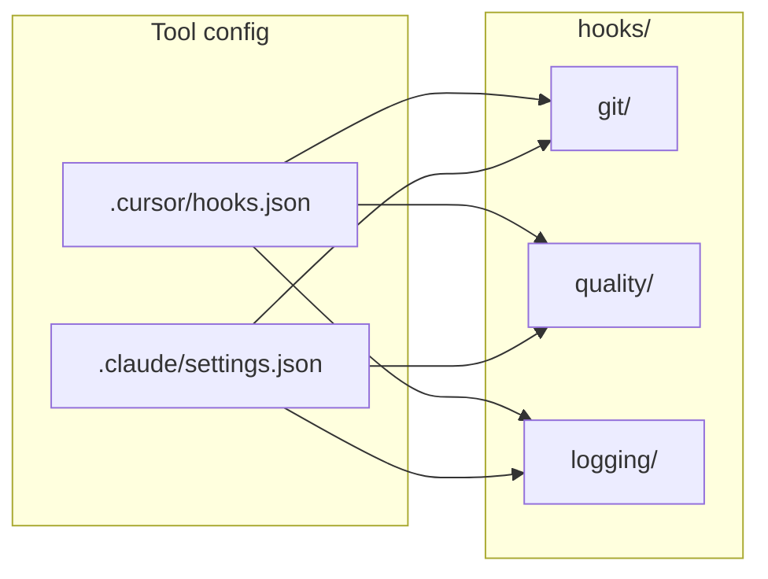

# Agent Hooks Instructions

## Overview

The `hooks/` directory holds **shared agent hook scripts** for Cursor and Claude Code. Hooks observe or control the agent loop: block unsafe git commands, format/lint after edits, and log debug events. Scripts are tool-agnostic; wiring lives in [`.cursor/hooks.json`](../.cursor/hooks.json) and [`.claude/settings.json`](../.claude/settings.json).

Guardrails enforced here mirror [`.cursor/rules/core/guardrails.mdc`](../.cursor/rules/core/guardrails.mdc) and [`.claude/rules/core/guardrails.md`](../.claude/rules/core/guardrails.md).

## Structure

```
hooks/
├── git/                    # Shell command guards (beforeShellExecution / PreToolUse)
│   ├── guard-destructive-git.sh
│   └── guard-secret-commit.sh
├── quality/                # Post-edit format + lint (afterFileEdit / PostToolUse)
│   ├── check-changed.sh         # Sequential entry point
│   ├── format-changed.sh
│   └── lint-changed.sh
├── logging/                # Debug logs (fire-and-forget)
│   ├── session-start.sh        # Cursor sessionStart
│   └── instructions-loaded.sh  # Claude InstructionsLoaded
└── logs/                   # Git-ignored runtime output
```

## Where to Change Things

| Task | Location |
|------|----------|
| Block a new git pattern | `git/guard-destructive-git.sh` or `git/guard-secret-commit.sh` |
| Change format/lint behaviour | `quality/format-changed.sh` or `quality/lint-changed.sh` |
| Add Cursor hook wiring | [`.cursor/hooks.json`](../.cursor/hooks.json) |
| Add Claude hook wiring | [`.claude/settings.json`](../.claude/settings.json) → `hooks` |
| Session / instruction logs | `logging/*.sh` → `hooks/logs/` |
| Human overview | [README.md](README.md) |

## Wiring



Paths in config files are **relative to the repo root** (e.g. `hooks/git/guard-secret-commit.sh`).

## Authoring Conventions

- **Shebang**: `#!/usr/bin/env sh` - POSIX shell; `jq` optional with `sed` fallback.
- **Project root**: `ROOT="${CURSOR_PROJECT_DIR:-${CLAUDE_PROJECT_DIR:-.}}"`
- **JSON input**: read stdin; support both `.tool_input.command` (Claude) and `.command` (Cursor `beforeShellExecution`).
- **Cursor allow/deny**: git guards always print `{"permission":"allow"}` or `{"permission":"deny",...}` on stdout so `failClosed: true` never sees empty output.
- **Blocking**: exit `2` to deny (Claude + Cursor exit-code path); Cursor also honors the JSON `permission` field.
- **Post-tool feedback**: exit `2` reports lint problems but cannot undo an edit that already succeeded.
- **Security failures**: Cursor git guards set `failClosed: true` on `beforeShellExecution`; Claude Code retains permission denies via exit 2.
- **Quality/logging failures**: fail open so unavailable developer tooling does not wedge normal workflows.
- **Filenames**: kebab-case under category folders.

## Hook Behavior Summary

| Script | Trigger | Exit 2 when |
|--------|---------|-------------|
| `git/guard-secret-commit.sh` | Cursor `beforeShellExecution`; Claude PreToolUse Bash | Secret path named or in staged set |
| `git/guard-destructive-git.sh` | Cursor `beforeShellExecution`; Claude PreToolUse Bash | reset --hard, push --force, checkout --, etc. |
| `quality/check-changed.sh` | Cursor `afterFileEdit`; Claude PostToolUse Edit\|Write | delegates sequentially to format, then lint |
| `quality/format-changed.sh` | called by `check-changed.sh` | never (always 0) |
| `quality/lint-changed.sh` | called by `check-changed.sh` | oxlint reports problems on `.ts`/`.tsx` |
| `logging/session-start.sh` | Cursor sessionStart | never |
| `logging/instructions-loaded.sh` | Claude InstructionsLoaded | never |

## Debugging

| Log | Command |
|-----|---------|
| Cursor sessions | `tail -f hooks/logs/session-start.log` |
| Claude instruction load | `tail -f hooks/logs/instructions-loaded.log` |
| Cursor hook errors | Customize → Hooks output channel |

## Contribution

- Edit scripts only under `hooks/` - do not duplicate under `.cursor/hooks/` or `.claude/hooks/`.
- When adding a hook, update [`.cursor/hooks.json`](../.cursor/hooks.json), [`.claude/settings.json`](../.claude/settings.json) (if applicable), [README.md](README.md), and this file.
- Align new guards with [guardrails](../.cursor/rules/core/guardrails.mdc); never weaken secret or destructive-git protection without explicit user approval.
- `chmod +x` new scripts before committing.
- Follow conventions in the root [AGENTS.md](../AGENTS.md).
