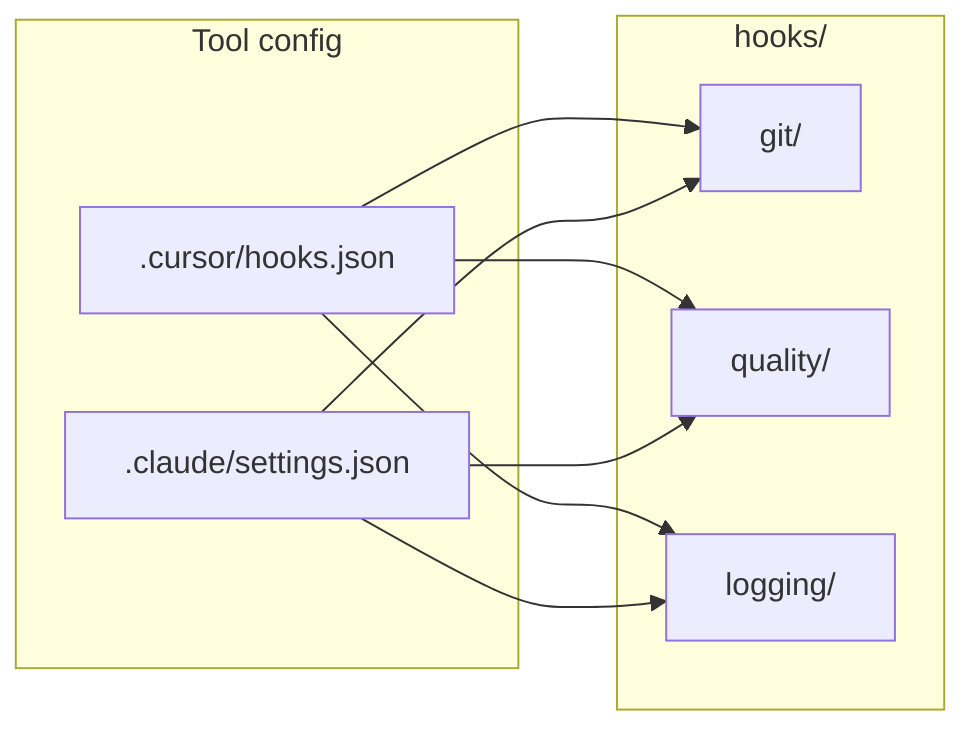

# Agent Hooks Instructions

## Overview

The `hooks/` directory holds **shared agent hook scripts** for Cursor and Claude Code. Hooks observe or control the agent loop: block unsafe git commands, format/lint after edits, and log debug events. Scripts are tool-agnostic; wiring lives in [`.cursor/hooks.json`](../.cursor/hooks.json) and [`.claude/settings.json`](../.claude/settings.json).

Guardrails enforced here mirror [`.cursor/rules/core/guardrails.mdc`](../.cursor/rules/core/guardrails.mdc) and [`.claude/rules/core/guardrails.md`](../.claude/rules/core/guardrails.md).

## Structure

```
hooks/
├── git/                    # Shell command guards (beforeShellExecution / PreToolUse)
│   ├── lib/
│   │   └── parse-command.sh     # Quote-aware parser; sourced, never executed
│   ├── guard-destructive-git.sh
│   └── guard-secret-commit.sh
├── security/               # Content guards (PreToolUse Edit|Write, Claude only)
│   └── guard-secret-content.sh
├── quality/                # Post-edit format + lint (afterFileEdit / PostToolUse)
│   ├── check-changed.sh         # Sequential entry point
│   ├── format-changed.sh
│   ├── lint-changed.sh
├── logging/                # Debug logs (fire-and-forget)
│   ├── session-start.sh        # Cursor sessionStart
│   └── instructions-loaded.sh  # Claude InstructionsLoaded
└── logs/                   # Git-ignored runtime output, size-capped
```

## Where to Change Things

| Task | Location |
|------|----------|
| Block a new git pattern | `git/guard-destructive-git.sh` or `git/guard-secret-commit.sh` |
| Change how a command is parsed | `git/lib/parse-command.sh` |
| Add a credential pattern for written content | `security/guard-secret-content.sh` |
| Change format/lint behaviour | `quality/format-changed.sh` or `quality/lint-changed.sh` |
| Add Cursor hook wiring | [`.cursor/hooks.json`](../.cursor/hooks.json) |
| Add Claude hook wiring | [`.claude/settings.json`](../.claude/settings.json) → `hooks` |
| Session / instruction logs | `logging/*.sh` → `hooks/logs/` |
| Human overview | [README.md](README.md) |

## Wiring


```mermaid
flowchart LR
  subgraph config [Tool config]
    Cursor[".cursor/hooks.json"]
    Claude[".claude/settings.json"]
  end
  subgraph scripts [hooks/]
    Git["git/"]
    Quality["quality/"]
    Logging["logging/"]
  end
  Cursor --> Git
  Cursor --> Quality
  Cursor --> Logging
  Claude --> Git
  Claude --> Quality
  Claude --> Logging
```

Paths in config files are **relative to the repo root** (e.g. `hooks/git/guard-secret-commit.sh`).

## Authoring Conventions

- **Shebang**: `#!/usr/bin/env sh` - POSIX shell. `jq` is **required** (the old `sed` fallback was removed: it left JSON escapes intact, so `-m \"note about .env.local\"` re-split into words and produced false denials).
- **Project root**: `ROOT="${CURSOR_PROJECT_DIR:-${CLAUDE_PROJECT_DIR:-.}}"`
- **JSON input**: read stdin; support both `.tool_input.command` (Claude) and `.command` (Cursor `beforeShellExecution`).
- **Blocking**: exit `2`. **Never exit `1`** - a non-zero code other than 2 is a *non-blocking* error in Claude Code, so the action proceeds. Every failure path must reach exit 2.
- **Post-tool feedback**: exit `2` reports lint problems but cannot undo an edit that already succeeded.
- **Quality/logging failures**: fail open so unavailable developer tooling does not wedge normal workflows.
- **Filenames**: kebab-case under category folders. `lib/` holds sourced helpers, which are not executable and are never wired to an event.
- **No apostrophes in comments inside `$( ... )`**: macOS `/bin/sh` is bash 3.2 and treats one as an opening quote. For the same reason, keep `case` statements out of command substitutions - put classification in a top-level function.

### Output contract

The git guards serve two harnesses with incompatible expectations, so the JSON is gated on which harness invoked them:

| | Claude Code | Cursor |
|---|---|---|
| Signal | exit `2`, reason on **stderr** | exit `2` **and** a JSON verdict on **stdout** |
| stdout | **silent** | `{"permission":"allow"}` / `{"permission":"deny",...}` |
| Detected via | `CLAUDE_PROJECT_DIR` | `CURSOR_PROJECT_DIR` (never set by Claude Code) |

Claude Code **ignores stdout entirely on exit 2** and does not inject it on `PreToolUse`. Emitting the Cursor JSON unconditionally would make the block depend on Claude Code tolerating unknown JSON keys - behaviour that is not documented, and that on builds before v2.1.214 turned an exit-2-plus-invalid-JSON hook into a *non-blocking* error that let the command run. Gating the JSON removes that dependency instead of relying on it.

### Failure semantics: guards fail CLOSED

A guard that cannot evaluate must not wave a command through. Missing `jq`/`awk`, an unreadable `lib/parse-command.sh`, a crash or a signal all deny with a `guard fault:` reason. Two consequences to respect when editing:

- The `trap` is installed **before** the library is sourced, and the fault path uses only shell builtins (`printf`, `${0##*/}`) so a broken `PATH` still yields exit 2 rather than exit 1.
- A syntax error in a guard or in the library **denies every Bash command** until it is fixed. Run the manual test in [README.md](README.md#manual-test-before-wiring) after any edit.

Empty or absent stdin still **allows**: no payload is not evidence of wrongdoing.

### Matching discipline

Command classification is **parsed, never substring-matched**. `lib/parse-command.sh` splits on unquoted separators, identifies the segment's command word, extracts the git subcommand, and yields only pathspec operands. Secret paths are matched on the **basename** with anchored patterns.

This is not stylistic. The previous implementation used `case $CMD in *git*add*|*git*commit*)` plus a scan of every whitespace token, which denied `git commit -m "document .env.local setup"`, `git add config.env.ts`, and any command that merely *named* `guard-secret-commit.sh` - that path contains `git` followed by `commit`. When adding a rule, extend the parser or the anchored pattern list; do not add a substring test.

Known limits, by design: the guards do not see through `eval`, `sh -c`, heredocs, command substitution, base64-decoded pipelines, shell aliases, `xargs` reading stdin, or `--pathspec-from-file`. Separators inside quotes are correctly ignored; a newline inside a quoted argument is folded to a space. `permissions.deny` and the sandbox are the layers that do not depend on parsing.

## Hook Behavior Summary

| Script | Trigger | Exit 2 when |
|--------|---------|-------------|
| `git/guard-secret-commit.sh` | Cursor `beforeShellExecution`; Claude PreToolUse Bash | Secret path named or in staged set |
| `git/guard-destructive-git.sh` | Cursor `beforeShellExecution`; Claude PreToolUse Bash | reset --hard, push --force, checkout --, etc. |
| `quality/check-changed.sh` | Cursor `afterFileEdit`; Claude PostToolUse Edit\|Write | delegates sequentially to format, then lint |
| `quality/format-changed.sh` | called by `check-changed.sh` | never (always 0) |
| `quality/lint-changed.sh` | called by `check-changed.sh` | oxlint reports problems on `.ts`/`.tsx`/`.js`/`.jsx`/`.mjs`/`.cjs` (never `.d.ts`) |
| `security/guard-secret-content.sh` | Claude PreToolUse Edit\|Write | written content matches a high-signal credential pattern |
| `git/lib/parse-command.sh` | sourced by the git guards | n/a - defines functions, never exits |
| `logging/session-start.sh` | Cursor sessionStart | never |
| `logging/instructions-loaded.sh` | Claude InstructionsLoaded (async) | never - this event ignores the exit code |

### OXC invariants for `quality/` hooks

Both quality hooks keep the same extension set, and `lint-changed.sh` holds two
constraints that must not be relaxed:

- **Runs oxlint from the repo root** on a root-relative path. `.oxlintrc.json`
  resolves `settings.better-tailwindcss.entryPoint` against the process CWD, so
  linting from anywhere else changes the diagnostics and diverges from `make ci`.
- **Passes `--format=agent`** so output is one line per diagnostic
  (`file:line:col: severity plugin(rule): message help: …`) instead of the
  TTY-dependent code frames the `default` format renders.
- **Passes `--no-error-on-unmatched-pattern`.** Without it, editing a file that
  `ignorePatterns` or `.gitignore` excludes (`*.gen.ts`, `worker-configuration.d.ts`)
  makes oxlint exit 1 with "No files found to lint", which the hook would report
  to the agent as a lint failure that does not exist.

`check-changed.sh` discards the **format** exit status and lets the **lint** exit
status become its own, so a formatter hiccup can never pre-empt the diagnostics
the agent needs. It deliberately does not use `set -e`.

## Debugging

| Log | Command |
|-----|---------|
| Cursor sessions | `tail -f hooks/logs/session-start.log` |
| Claude instruction load | `tail -f hooks/logs/instructions-loaded.log` |
| Cursor hook errors | Customize → Hooks output channel |

Both logs rotate once past 256 KB (`*.log.1`), so `hooks/logs/` stays bounded.
The `InstructionsLoaded` handler is `"async": true` - it is debug telemetry that
enforces nothing, and this event ignores hook exit codes, so it must not sit on
the critical path.

## Contribution

- Edit scripts only under `hooks/` - do not duplicate under `.cursor/hooks/` or `.claude/hooks/`.
- When adding a hook, update [`.cursor/hooks.json`](../.cursor/hooks.json), [`.claude/settings.json`](../.claude/settings.json) (if applicable), [README.md](README.md), and this file.
- Align new guards with [guardrails](../.cursor/rules/core/guardrails.mdc); never weaken secret or destructive-git protection without explicit user approval.
- `chmod +x` new scripts before committing. Files under `lib/` are sourced, not executed, and stay non-executable.
- Re-run the manual test in [README.md](README.md#manual-test-before-wiring) after touching a guard: a syntax error there denies **every** Bash command, because the guards fail closed.
- Follow conventions in the root [AGENTS.md](../AGENTS.md).
