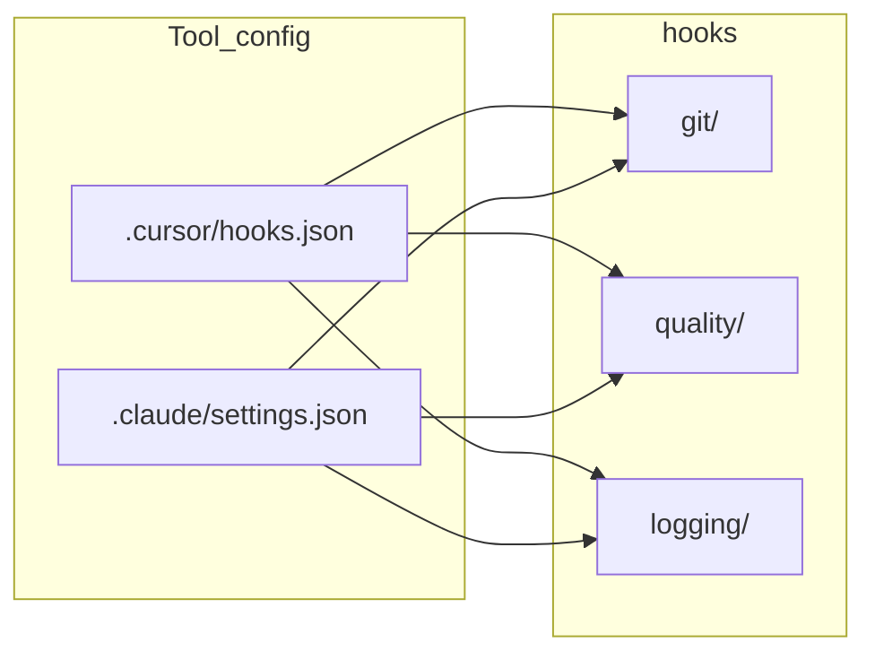

# Agent Hooks

Shared shell hooks for **Cursor** and **Claude Code**. Scripts live here; wiring stays in tool-specific config files.

These hooks run in the **AI agent loop** only. They do **not** run on a normal human `git commit` - that is [Husky](../README.md#git-hooks) (`.husky/pre-commit`). See the root README diagram that contrasts both systems.

## Layout

```
hooks/
├── git/
│   ├── guard-destructive-git.sh   # Block reset --hard, push --force, etc.
│   └── guard-secret-commit.sh     # Block staging/committing secret files
├── quality/
│   ├── check-changed.sh           # Sequential format-then-lint entry point
│   ├── format-changed.sh          # oxfmt after file edits (non-blocking)
│   └── lint-changed.sh            # oxlint after TS edits (exit 2 on errors)
├── logging/
│   ├── session-start.sh           # Cursor sessionStart
│   └── instructions-loaded.sh     # Claude Code InstructionsLoaded
├── logs/                          # Debug output (git-ignored)
├── AGENTS.md                      # Agent guide (Cursor + nested AGENTS.md)
├── CLAUDE.md                      # Claude Code entry
└── README.md                      # This file
```

## Wiring

| Tool | Config file | Runs from |
|------|-------------|-----------|
| Cursor | [`.cursor/hooks.json`](../.cursor/hooks.json) | Project root |
| Claude Code | [`.claude/settings.json`](../.claude/settings.json) | Project root |



Both read JSON on **stdin** and support Claude (`tool_input.*`) and Cursor (flat `command` / `file_path`) shapes. Git guards always emit Cursor permission JSON on stdout.

## When hooks run

| Hook event | Script | Behavior |
|------------|--------|-----------|
| **beforeShellExecution** (Cursor) / PreToolUse Bash (Claude) | `git/guard-secret-commit.sh` | Exit 2 + deny JSON if secrets would be staged |
| **beforeShellExecution** (Cursor) / PreToolUse Bash (Claude) | `git/guard-destructive-git.sh` | Exit 2 + deny JSON on destructive git |
| **afterFileEdit** (Cursor) / PostToolUse Edit\|Write (Claude) | `quality/check-changed.sh` | Format, then lint edited JS/TS sequentially |
| **sessionStart** (Cursor only) | `logging/session-start.sh` | Append to `logs/session-start.log` |
| **InstructionsLoaded** (Claude only) | `logging/instructions-loaded.sh` | Append to `logs/instructions-loaded.log` |

Exit code **2** blocks a pre-shell action. On a post-edit event it only feeds the error back to the agent; it cannot roll back the completed edit. Cursor security guards set `failClosed: true` so crashes, timeouts, and invalid output do not bypass them - scripts therefore always print `{"permission":"allow"}` on the allow path.

## Manual test (before wiring)

```bash
# Should deny (exit 2) and print permission JSON
echo '{"command":"git push --force"}' | hooks/git/guard-destructive-git.sh

# Should allow
echo '{"command":"git status"}' | hooks/git/guard-destructive-git.sh
```

## Debugging

```bash
# Cursor session events
tail -f hooks/logs/session-start.log

# Claude instruction loading
tail -f hooks/logs/instructions-loaded.log

# Cursor hook output channel
# Customize → Hooks
```

## Adding a hook

1. Add the script under the right subfolder (`git/`, `quality/`, `logging/`).
2. `chmod +x hooks/<category>/<script>.sh`
3. Register in **both** [`.cursor/hooks.json`](../.cursor/hooks.json) and [`.claude/settings.json`](../.claude/settings.json) when the hook applies to both tools.
4. Update [AGENTS.md](AGENTS.md) and this README.

See [AGENTS.md](AGENTS.md) for authoring conventions and guardrail alignment.
