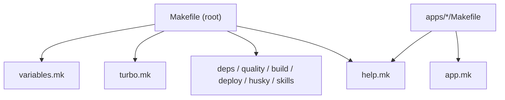

# Make Commands

Shared Makefile fragments for the monorepo. The root [Makefile](../Makefile) and per-package `Makefile` files include these modules so developers and CI use one consistent entrypoint over **pnpm workspaces** and **Turborepo**.

## Purpose

- **Single interface** — `make dev`, `make ci`, `make build` instead of remembering turbo filter syntax.
- **Separation of concern** — each fragment owns one area (deps, quality, build, deploy, …).
- **pnpm / turbo leverage** — scope to one package (`SCOPE=`) or only changed packages (`AFFECTED=1`).
- **Scalable per-package UX** — new apps get a ~4-line `Makefile` via [`app.mk`](app.mk).

## Layout

```
make/
├── variables.mk    # Project name, version, terminal colors
├── turbo.mk        # SCOPE / FILTER / AFFECTED → turbo flags
├── help.mk         # `make help` (awk over ## comments)
├── deps.mk         # install, install-frozen, update
├── quality.mk      # check, lint, format, check-types, ci
├── build.mk        # build, dev, preview, types
├── deploy.mk       # login, deploy
├── husky.mk        # prepare, husky-status
├── skills.mk       # skills-update
├── app.mk          # Reusable per-package targets (auto --filter)
└── README.md       # This file
```

## Wiring

| Entry point | Includes | Runs from |
|-------------|----------|-----------|
| Root [Makefile](../Makefile) | `variables.mk`, `turbo.mk`, all concern fragments | Repo root |
| `apps/*/Makefile`, `packages/*/Makefile` | `../../make/variables.mk`, `app.mk`, `help.mk` | Package directory |



## Root commands

Run from the repo root:

```bash
make help              # List all targets
make install           # pnpm install
make dev               # Start all dev servers (turbo)
make ci                # lint + format + check-types (all packages)
make build             # Build all packages and apps
make types             # Generate worker-configuration.d.ts in apps
make deploy            # Deploy via turbo
```

### Common Commands

| Command | Description |
|---------|-------------|
| `make install` | Install and link workspace packages |
| `make install-frozen` | CI install with `--frozen-lockfile` |
| `make update` | Update all deps to latest (`--latest`; rewrites catalog in `pnpm-workspace.yaml`) |
| `make dev` | Start all dev servers |
| `make ci` | Lint + format + check-types |
| `make check-types` | TypeScript across all packages |
| `make types` | Generate `worker-configuration.d.ts` in apps |
| `make build` / `make deploy` | Build or deploy via Turborepo |
| `make format` / `make lint` | Fix formatting / lint issues |
| `make prepare` | Install Husky git hooks |
| `make skills-update` | Refresh locked agent skills |

## Scoping (pnpm / Turborepo)

Optional variables apply to any **turbo-backed** root target (`dev`, `build`, `ci`, `lint`, …). Defined in [`turbo.mk`](turbo.mk).

| Variable | Effect | Example |
|----------|--------|---------|
| `SCOPE` | `--filter=<package>` | `make dev SCOPE=worker-api` |
| `FILTER` | Raw turbo filter expression | `make build FILTER=...front-app...` |
| `AFFECTED` | `--affected` (changed vs base branch) | `make ci AFFECTED=1` |

```bash
make dev SCOPE=worker-api           # Only worker-api dev server
make ci SCOPE=@repo/dtos-common     # CI checks for one package
make build AFFECTED=1               # Build only changed packages (CI)
make lint FILTER=...front-app...   # Advanced turbo filter syntax
```

`install`, `update`, `login`, and `prepare` are **not** turbo-scoped — they operate at the workspace or tool level.

## Per-package commands

Each app or package has a minimal `Makefile` that includes [`app.mk`](app.mk). The workspace name is read from `package.json` (`name`), so `@repo/*` packages resolve correctly (directory name ≠ package name).

```make
include ../../make/variables.mk
include ../../make/app.mk
include ../../make/help.mk

.DEFAULT_GOAL := help
```

```bash
cd apps/worker-api && make dev       # turbo run dev --filter=worker-api
cd apps/front-app && make build      # turbo run build --filter=front-app
cd packages/dtos-common && make ci   # turbo run lint format check-types --filter=@repo/dtos-common
```

Turbo skips tasks when a package has no matching script (e.g. `build` on a types-only package), so one `app.mk` works for apps and libraries.

## CI

[`.github/workflows/ci.yml`](../.github/workflows/ci.yml) uses make as the single entrypoint:

```yaml
make install-frozen
make ci AFFECTED=1
make build AFFECTED=1
```

## Fragment reference

| Fragment | Targets | Backed by |
|----------|---------|-----------|
| `deps.mk` | `install`, `install-frozen`, `update` | pnpm |
| `quality.mk` | `check`, `lint`, `format`, `check-types`, `ci` | turbo (+ OXC via package scripts) |
| `build.mk` | `build`, `dev`, `preview`, `types` | turbo |
| `deploy.mk` | `login`, `deploy` | wrangler / turbo |
| `husky.mk` | `prepare`, `husky-status` | pnpm / shell |
| `skills.mk` | `skills-update` | bash script |
| `turbo.mk` | (no targets — shared `TURBO_FILTER`) | — |
| `app.mk` | All turbo targets, scoped to `PKG` | turbo `--filter=$(PKG)` |

## Adding a new app or package

1. Scaffold the workspace under `apps/` or `packages/` with a `package.json` `name`.
2. Add a `Makefile` next to it:

   ```make
   include ../../make/variables.mk
   include ../../make/app.mk
   include ../../make/help.mk

   .DEFAULT_GOAL := help
   ```

3. Ensure the package defines the scripts you need in `package.json` (e.g. `dev`, `build`, `check-types`).
4. Run `make help` from that directory to confirm targets appear.

To add a **new root target**, put it in the matching concern fragment (or create a new `.mk` and include it from the root `Makefile`). Add a `## Description` comment so `make help` picks it up.

## Debugging

```bash
make help                                    # All root targets
make -n dev SCOPE=worker-api                 # Dry-run: print commands without executing
cd apps/worker-api && make help              # Per-package targets
```

## Best Practices

1. **Prefer make over raw turbo** for day-to-day and CI — keeps filter syntax in one place.
2. **Use `SCOPE=`** for single-package work; use **`AFFECTED=1`** in CI or before pushing.
3. **Do not duplicate targets** in per-package Makefiles — extend [`app.mk`](app.mk) instead.
4. **Keep fragments concern-separated** — deps stay in `deps.mk`, quality in `quality.mk`, etc.

See [AGENTS.md](../AGENTS.md) for agent-oriented conventions and the full monorepo decision checklist.
