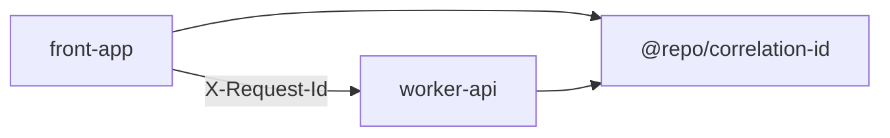
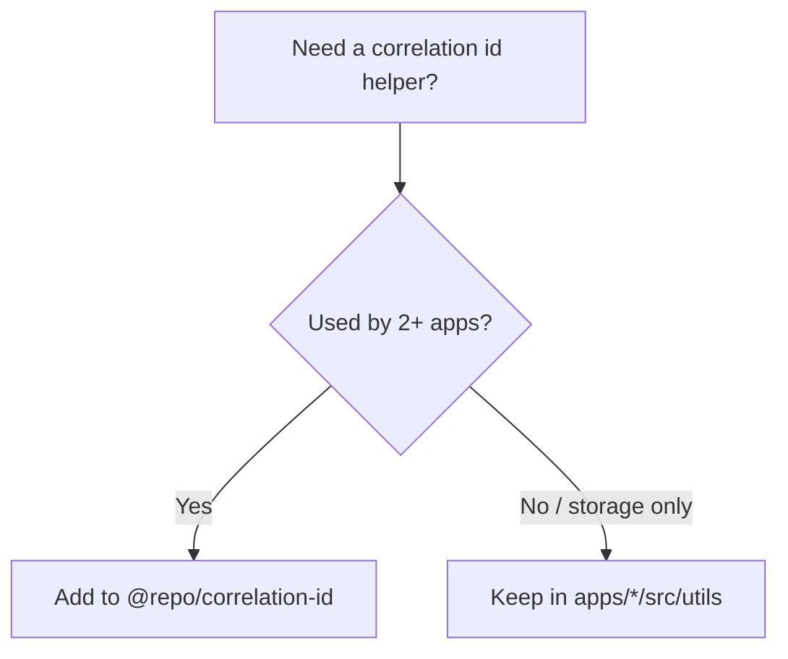

# @repo/correlation-id

[](https://oxc.rs/)
[](https://www.typescriptlang.org/)

Shared **opaque UUID v4** helpers for correlating SPA and gateway logs. Values travel on the wire as the `X-Request-Id` HTTP header and must never carry client or matter identifiers.

## Purpose

Provide one predicate and mint/accept helper so `worker-api` and `front-app` cannot drift on what counts as a safe correlation id.

## Features

- **Opaque UUID v4 only** - rejects privileged-looking strings (e.g. matter ids)
- **Runtime-neutral** - works in Cloudflare Workers, browsers, and Node 19+
- **Stable wire header** - keep `X-Request-Id`; do not rename the header when using this package

## Tech Stack

- **Language:** TypeScript 7.x (strict, via `@repo/typescript-config/library.json`)
- **Formatting/Linting:** OXC (oxfmt / oxlint)
- **Package Manager:** pnpm

## Installation

```json
{
  "dependencies": {
    "@repo/correlation-id": "workspace:*"
  }
}
```

```bash
pnpm install
```

## Usage

### Gateway (`worker-api`)

Accept a client-supplied opaque id or mint a new one:

```typescript
import { resolveCorrelationId } from "@repo/correlation-id";

const requestId = resolveCorrelationId(c.req.header("X-Request-Id"));
```

### Frontend (`front-app`)

Validate and mint with the shared helpers; keep **sessionStorage** persistence in the app:

```typescript
import {
  isOpaqueCorrelationId,
  resolveCorrelationId,
} from "@repo/correlation-id";

// App-local: getOrCreateCorrelationId() wraps sessionStorage around these.
```



## When to add helpers here

- Shared across **multiple apps** (gateway + SPA today).
- Enforces the **opaque UUID** rule for privileged-legal-data correlation.

Keep **browser session storage** and UI wiring in `apps/front-app/src/utils/correlation-id.ts`.



## Commands

| Command | Description |
|---------|-------------|
| `pnpm format:fix` / `pnpm lint:fix` / `pnpm check` | OXC |
| `pnpm check-types` | TypeScript (`tsc --noEmit`) |
| `pnpm run ci` | Lint + format + check-types |

## Project structure

```
packages/correlation-id/
├── src/
│   ├── correlation-id.ts    # isOpaqueCorrelationId, resolveCorrelationId
│   └── index.ts     # Named barrel re-exports
├── package.json
├── turbo.json       # tags: ["lib"]
├── README.md
├── AGENTS.md
└── CLAUDE.md
```

## Best practices

1. **Never put privileged content** in a correlation id - UUID v4 only.
2. **Keep the wire header** as `X-Request-Id` unless you deliberately version the HTTP contract.
3. **Named barrel re-exports** in `src/index.ts` - prefer explicit `export { … } from "./feature"` over `export *`.
4. **No business logic** - predicates and minting only.

Agent-focused notes: [AGENTS.md](AGENTS.md).
