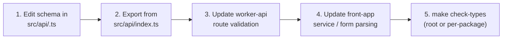

# @repo/dtos-common Agent Instructions

## Project Overview

`@repo/dtos-common` is the **single source of truth** for all HTTP request/response shapes in the monorepo. It contains **Zod schemas** and inferred TypeScript types consumed by:

- **`apps/worker-api`** — validation at the route boundary via `@hono/zod-validator`
- **`apps/front-app`** — response parsing via `fetchJsonWithSchema`

Schema changes here are **API contract changes** and propagate to all consumers. Treat every edit accordingly.

## Project Structure

```
packages/dtos-common/
├── src/
│   ├── api/
│   │   ├── health.ts        # Health endpoint schemas
│   │   └── index.ts         # Re-exports all HTTP DTOs
│   │   └── other-example.ts # Shared other example schemas
│   └── index.ts             # Package entry — re-exports from src/api/
├── tsconfig.json            # Extends @repo/typescript-config/workers-lib.json
├── biome.json               # Biome overrides (inherits root)
├── Makefile
└── package.json
```

### Where to Change Things

| Task | Location |
|------|---------|
| Add schemas for a new endpoint | `src/api/<feature>.ts` |
| Export new schemas to consumers | `src/api/index.ts` (named export) |
| Expose from the package root | `src/index.ts` (re-export from `src/api/`) |

### Zod Schema Naming

| Suffix | Use for |
|--------|---------|
| `Schema` | General data structures (e.g. `ExampleSchema`) |
| `RequestSchema` | Inbound request payloads (e.g. `ExampleRequestSchema`) |
| `ResponseSchema` | Outbound response payloads (e.g. `ExampleResponseSchema`) |

### Inferred Type Naming

- Name = schema name **without** the `Schema` suffix.
- **Never** use a `Type` suffix (`ExampleRequestType` is forbidden).
- Always use `z.infer<typeof ...Schema>`.
- Declare **all inferred types at the bottom of the file**, after all schema definitions — never interleaved.

```typescript
// ✅ Correct — schemas first, types grouped at the bottom
export const ExampleRequestSchema = z.object({
  verbose: z.boolean().optional(),
});

export const ExampleResponseSchema = z.object({
  status: z.string(),
  timestamp: z.string(),
});

export type ExampleRequest = z.infer<typeof ExampleRequestSchema>;
export type ExampleResponse = z.infer<typeof ExampleResponseSchema>;

// ❌ Incorrect
export const ExampleRequest = z.object({ ... });           // missing Schema suffix
export type ExampleRequestType = z.infer<typeof ...>;     // forbidden Type suffix
export type ExampleRes = z.infer<typeof ExampleResponseSchema>; // name doesn't match
```

### File Naming

Files under `src/api/` must be `kebab-case` (enforced by Biome). Name by resource or feature:
- `health.ts`, `example.ts`, `other-example.ts`

## Consumer Expectations

| Consumer | How it uses schemas |
|----------|-------------------|
| `worker-api` | `zValidator("json" \| "param" \| "query", SomeRequestSchema)` at the route boundary |
| `front-app` | `fetchJsonWithSchema(url, SomeResponseSchema)` or `.safeParse()` for forms |

**Never** redefine these shapes in apps. If a shape is needed in both `worker-api` and `front-app`, it belongs here.

## Zod Patterns

- **Schemas are the single source of truth.** Export inferred types with `z.infer<typeof ...Schema>` — avoid parallel hand-written interfaces for the same wire shape.
- **Unknown keys**: agree project-wide on whether to use `.strict()`. If a schema uses `.strict()`, all schemas in that file/feature should follow the same policy.
- **At boundaries**: prefer `.safeParse()` when you need structured failures (e.g. in `front-app` form validation); use `.parse()` when failure should throw in a controlled context (e.g. inside `fetchJsonWithSchema`).
- **Cross-field validation**: use `.refine()` or `.superRefine()`. Keep error messages suitable for API clients (no internal details).
- **Shared enum values**: use `z.nativeEnum(SomeEnum)` referencing `@repo/enums-common` — never duplicate string literals in schemas.

### Example Schema File

```typescript
// src/api/example.ts
import { z } from "zod";

export const ExampleRequestSchema = z.object({
  example: z.string().min(1).max(253),
});

export const ExampleResponseSchema = z.object({
  id: z.string(),
  example: z.string(),
  createdAt: z.string().datetime(),
});

export type ExampleRequest = z.infer<typeof ExampleRequestSchema>;
export type ExampleResponse = z.infer<typeof ExampleResponseSchema>;
```

## Contract Change Workflow

A schema change is an **API contract change**. Always update all consumers in the same PR.



1. Add or modify schemas in `src/api/<feature>.ts`.
2. Export from `src/api/index.ts`.
3. Update `worker-api` to validate the new shapes.
4. Update `front-app` to parse/validate the new shapes.
5. Run `make check-types` to confirm no type regressions across the monorepo.

### Compatibility Rules

- **Additive changes** (new optional fields, new endpoints) are safe and preferred.
- **Breaking changes** (removing fields, changing types, renaming) require:
  - A new route version in `worker-api` (e.g. `/api/v2/...`)
  - A deliberate migration in `front-app`
  - Documenting the change in the PR description

## Common Commands

From `packages/dtos-common`:

| Command | Description |
|---------|-------------|
| `make format` | Format with Biome |
| `make lint` | Lint with Biome |
| `make check` | Full Biome check |
| `make check-types` | TypeScript typecheck |

## Best Practices

- **Single source of truth**: one Zod schema per wire shape. Never define the same shape in two places.
- **Consistent strictness**: decide per-project whether schemas use `.strict()` and apply it consistently.
- **Document breaking changes** in PR descriptions. Bump all consumers in the same change when possible.
- **No business logic**: this package holds shapes and validation only — no HTTP calls, no side effects.
- **Zod version alignment**: keep the same Zod version across all packages and apps (`pnpm update` from root).

## Contribution

- Follow the naming rules in the root [`AGENTS.md`](../../AGENTS.md).
- Any change that affects a wire format must be **coordinated** with `worker-api` and `front-app` in the same PR.
- Run `make check-types` before merging to confirm no regressions.
- When adding new schema design conventions, keep them aligned with [Zod](https://zod.dev).
