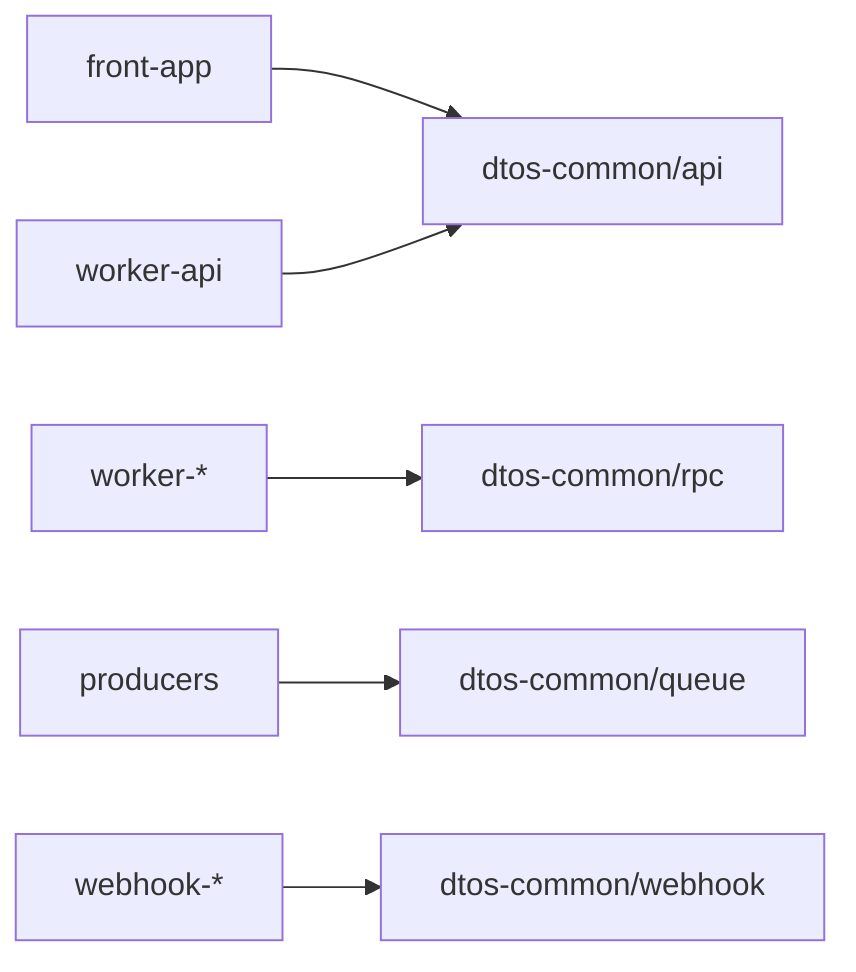

# @repo/dtos-common

[](https://oxc.rs/)
[](https://www.typescriptlang.org/)
[](https://github.com/colinhacks/zod)

Shared Zod wire contracts for **HTTP, RPC, queue, and webhook** boundaries across the monorepo.

This package is the single source of truth for validated payload shapes. Schema changes are **contract changes** - update every producer and consumer in the same PR.

## Purpose

Provide type-safe DTO schemas so apps validate the same wire shape at each boundary:

| Layer | Subpath | Boundary |
|-------|---------|----------|
| HTTP REST | `@repo/dtos-common/api` | `front-app` ↔ `worker-api` |
| RPC | `@repo/dtos-common/rpc` | Worker-to-Worker service bindings |
| Queue | `@repo/dtos-common/queue` | Queue producer / consumer messages |
| Webhook | `@repo/dtos-common/webhook` | Inbound payloads on `webhook-*` |



Do **not** mix layers in one file. Prefer additive changes (new optional fields, new endpoints) over breaking edits.

## Tech Stack

- **Language:** TypeScript (strict mode, ESNext)
- **Validation:** Zod
- **Formatting/Linting:** OXC (oxfmt / oxlint)
- **Package Manager:** pnpm

## Installation

```json
{
  "dependencies": {
    "@repo/dtos-common": "workspace:*"
  }
}
```

```bash
pnpm install
```

## Usage

### HTTP (`/api`) - frontend

```typescript
import { HealthResponseSchema } from "@repo/dtos-common/api";

const parsed = HealthResponseSchema.safeParse(rawPayload);
if (!parsed.success) {
  // parsed.error contains Zod issues
}
```

### HTTP (`/api`) - worker-api (Hono)

```typescript
import { zValidator } from "@hono/zod-validator";
import { SomeRequestSchema } from "@repo/dtos-common/api";

app.post("/some-endpoint", zValidator("json", SomeRequestSchema), async (c) => {
  const data = c.req.valid("json");
  return c.json({ ok: true, received: data });
});
```

### RPC / queue / webhook

Subpaths are exported and ready. Barrels under `src/rpc/`, `src/queue/`, and `src/webhook/` are empty stubs until you add the first schema:

```typescript
import { /* YourRpcSchema */ } from "@repo/dtos-common/rpc";
import { /* YourQueueMessageSchema */ } from "@repo/dtos-common/queue";
import { /* YourWebhookPayloadSchema */ } from "@repo/dtos-common/webhook";
```

1. Add `src/<layer>/<feature>.ts` with Zod schemas.
2. Re-export from `src/<layer>/index.ts`.
3. Update producers and consumers in the same PR.
4. Run `make check-types`.

The package root (`@repo/dtos-common`) re-exports `api/` only until other layers grow.

## Contract change workflow

1. Edit the schema in `src/<layer>/<feature>.ts`.
2. Export from `src/<layer>/index.ts`.
3. Update every producer and consumer of that layer in the **same PR** (`api/` → `worker-api` + `front-app`).
4. Prefer additive changes; breaking changes need a deliberate versioned path or migration.

## Common Commands

| Command | Description |
|---------|-------------|
| `make format` / `make lint` / `make check` | OXC |
| `make check-types` | TypeScript |
| `make ci` | Lint + format + check-types |

## Project Structure

```
packages/dtos-common/
├── src/
│   ├── api/
│   │   ├── health.ts     # Health check response schema
│   │   └── index.ts
│   ├── rpc/
│   │   └── index.ts      # Stub barrel (add schemas here)
│   ├── queue/
│   │   └── index.ts      # Stub barrel
│   ├── webhook/
│   │   └── index.ts      # Stub barrel
│   └── index.ts          # Re-exports api/ for now
├── Makefile
└── package.json
```

## Best Practices

1. **Use DTOs from this package** instead of re-implementing Zod schemas in apps.
2. **Treat Zod schemas as source of truth** - infer types with `z.infer<typeof Schema>`; do not hand-write parallel interfaces.
3. **Reference shared wire values** from `@repo/enums-common` via `z.enum(ValueSet)` - never duplicate string literals.
4. **One feature file per concern** within a layer (kebab-case filenames).
