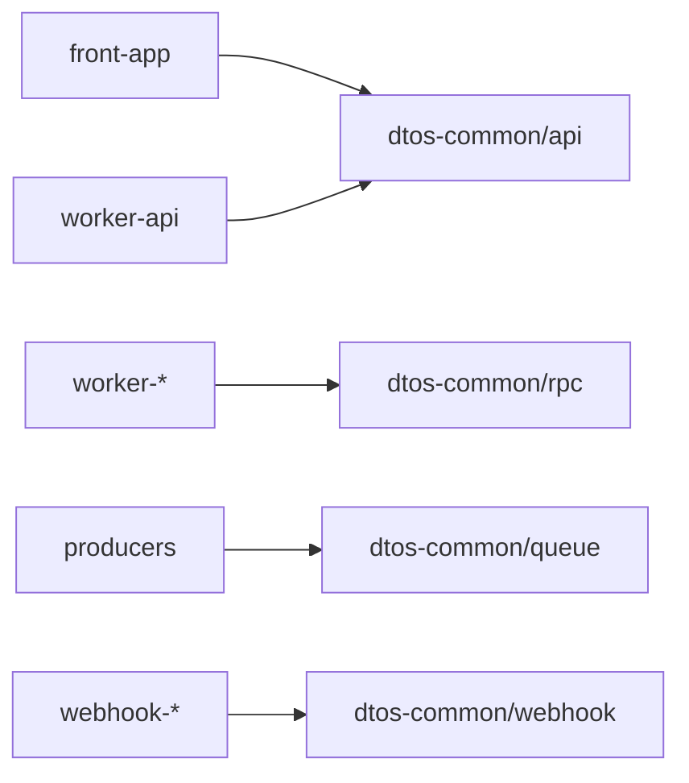

# @repo/dtos-common

[](https://oxc.rs/)
[](https://www.typescriptlang.org/)
[](https://github.com/colinhacks/zod)

Shared Zod wire contracts for **HTTP, RPC, queue, and webhook** boundaries across the monorepo.

This package is the single source of truth for validated payload shapes. Schema changes are **contract changes** - update every producer and consumer in the same PR.

## Purpose

Provide type-safe DTO schemas so apps validate the same wire shape at each boundary:

| Layer | Subpath | Boundary | Public export |
|-------|---------|----------|---------------|
| HTTP REST | `@repo/dtos-common/api` | `front-app` to `worker-api` | Yes |
| RPC | `@repo/dtos-common/rpc` | Worker-to-Worker service bindings | Add with first schema |
| Queue | `@repo/dtos-common/queue` | Queue producer / consumer messages | Add with first schema |
| Webhook | `@repo/dtos-common/webhook` | Inbound payloads on `webhook-*` | Add with first schema |


```mermaid
flowchart LR
  Front["front-app"] --> Api["dtos-common/api"]
  Gateway["worker-api"] --> Api
  Workers["worker-*"] --> Rpc["dtos-common/rpc"]
  Producers["producers"] --> Queue["dtos-common/queue"]
  Webhooks["webhook-*"] --> Webhook["dtos-common/webhook"]
```

Do **not** mix layers in one file. Prefer additive changes (new optional fields, new endpoints) over breaking edits.

## Tech Stack

- **Language:** TypeScript (strict mode, ESNext)
- **Validation:** Zod Mini (`zod/mini`) for tree-shakable Workers / SPA bundles
- **Formatting/Linting:** OXC (oxfmt / oxlint)
- **Package Manager:** pnpm

## Installation

```json
{
  "dependencies": {
    "@repo/dtos-common": "workspace:*"
  }
}
```

```bash
pnpm install
```

## Usage

### HTTP (`/api`) - frontend

```typescript
import * as z from "zod/mini";

// packages/dtos-common/src/api/<feature>.ts
export const ExampleSchema = z.object({
  id: z.string(),
});
```

```typescript
import { HealthResponseSchema } from "@repo/dtos-common/api";

const parsed = HealthResponseSchema.safeParse(rawPayload);
if (!parsed.success) {
  // parsed.error contains Zod issues
}
```

### HTTP - worker-api Hono

Use zValidator with schemas from @repo/dtos-common/api on route inputs.

### RPC / queue / webhook

Scaffold directories exist under src/rpc/, src/queue/, and src/webhook/, but those subpaths are not in package.json exports until the first schema lands:

1. Add src/<layer>/<feature>.ts with Zod schemas.
2. Named-export from src/<layer>/index.ts.
3. Add "./<layer>" to package.json exports.
4. Update producers and consumers in the same PR.
5. Run pnpm check-types.

Prefer subpath imports. The package root @repo/dtos-common re-exports api/ only until other layers grow.

## Contract change workflow

1. Edit the schema in src/<layer>/<feature>.ts.
2. Named-export from src/<layer>/index.ts and add package.json exports if this is the first schema in that layer.
3. Update every producer and consumer of that layer in the same PR: api/ to worker-api + front-app.
4. Prefer additive changes; breaking changes need a deliberate versioned path or migration.

## Common Commands

| Command | Description |
|---------|-------------|
| pnpm format:fix / pnpm lint:fix / pnpm check | OXC |
| pnpm check-types | TypeScript |
| pnpm run ci | Lint + format + check-types |

## Project Structure

```
packages/dtos-common/
├── src/
│   ├── api/
│   │   ├── health.ts     # Health check response schema
│   │   └── index.ts      # Named re-exports
│   ├── rpc/              # Scaffold; export in package.json with first schema
│   ├── queue/
│   ├── webhook/
│   └── index.ts          # Named re-exports of api/ for now
└── package.json
```

## Best Practices

1. Use DTOs from this package instead of re-implementing Zod schemas in apps.
2. Treat Zod schemas as source of truth - infer types with z.infer; do not hand-write parallel interfaces.
3. Reference shared wire values from @repo/enums-common via z.enum - never duplicate string literals.
4. One feature file per concern within a layer - kebab-case filenames.
5. Named barrel re-exports - prefer explicit named exports from each feature file over export star.
