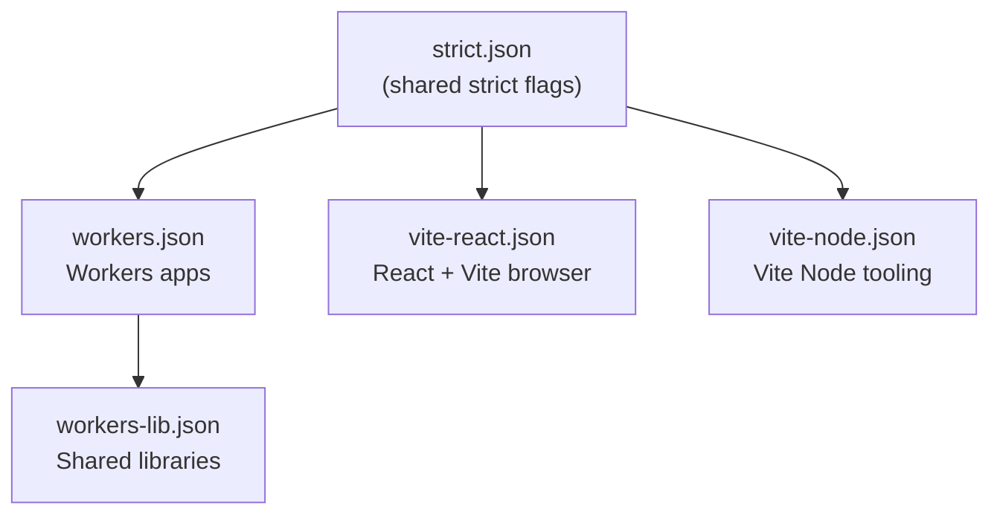

# @repo/typescript-config Agent Instructions

## Project Overview

`@repo/typescript-config` provides **shared TypeScript configuration presets** for the entire monorepo. All Workers apps, React/Vite apps, and shared libraries extend one of these presets to maintain consistent compiler options (strictness, module resolution, JSX, etc.) without copy-pasting.

## Project Structure

```
packages/typescript-config/
├── strict.json        # Shared strict flags - do not use directly in apps
├── workers.json       # Cloudflare Workers apps and services
├── workers-lib.json   # Shared libraries targeting the Workers runtime
├── vite-react.json    # React + Vite applications
├── vite-node.json     # Node-oriented Vite projects
├── package.json
└── README.md
```

## Preset Selection Guide

### Which preset should I extend?

| I am writing… | Extend |
|--------------|--------|
| A Cloudflare Worker (e.g. `worker-api`, `orm-*`, `webhook-*`) | `workers.json` |
| A shared library used by Workers (e.g. `dtos-common`, `enums-common`) | `workers-lib.json` |
| A React + Vite frontend (e.g. `front-app`) | `vite-react.json` |
| A Node-oriented Vite project | `vite-node.json` |
| A new runtime preset | `strict.json` |

**Never** extend `strict.json` directly in an app or library - use a runtime preset.

### How to Extend

```jsonc
// apps/worker-api/tsconfig.json
{
  "$schema": "https://json.schemastore.org/tsconfig",
  "extends": "@repo/typescript-config/workers.json",
  "compilerOptions": {
    "types": ["./worker-configuration.d.ts"]
  },
  "include": ["worker-configuration.d.ts", "src/**/*.ts"]
}
```

Run `make types` (or `wrangler types`) after changing `wrangler.jsonc` to regenerate `worker-configuration.d.ts`. That file provides the `Env` interface and Workers runtime types - do not hand-edit it. Prefer this over `@cloudflare/workers-types` for Worker apps.

If the Worker uses `nodejs_compat`, add `"node"` to `compilerOptions.types` and install `@types/node` as a devDependency.

```jsonc
// apps/front-app/tsconfig.json - solution root
{
  "files": [],
  "references": [
    { "path": "./tsconfig.app.json" },
    { "path": "./tsconfig.node.json" }
  ]
}

// apps/front-app/tsconfig.app.json - browser source
{
  "extends": "@repo/typescript-config/vite-react.json",
  "include": ["src/**/*.ts", "src/**/*.tsx"],
  "compilerOptions": {
    "types": ["vite/client"],
    "paths": { "@/*": ["./src/*"] }
  },
  "references": [
    { "path": "../../packages/dtos-common" },
    { "path": "../../packages/enums-common" }
  ]
}

// apps/front-app/tsconfig.node.json - Vite config (Node)
{
  "extends": "@repo/typescript-config/vite-node.json",
  "include": ["vite.config.ts"]
}
```

```jsonc
// packages/dtos-common/tsconfig.json - shared library without wrangler.jsonc
{
  "extends": "@repo/typescript-config/workers-lib.json",
  "include": ["src/**/*.ts"],
  "compilerOptions": {
    "lib": ["es2023", "webworker"]
  },
  "references": [{ "path": "../enums-common" }]
}
```

## Preset Inheritance



## Key Compiler Options Per Preset

### `strict.json` (shared strict core)

| Option | Value | Why |
|--------|-------|-----|
| `strict` | `true` | Full type safety |
| `exactOptionalPropertyTypes` | `true` | Optional props may be absent, not explicitly `undefined` |
| `noUncheckedIndexedAccess` | `true` | Safer array/object access |
| `noPropertyAccessFromIndexSignature` | `true` | Bracket notation for index-signature keys |
| `noUnusedLocals` / `noUnusedParameters` | `true` | Clean code |
| `noFallthroughCasesInSwitch` | `true` | Prevent switch bugs |
| `noImplicitReturns` | `true` | Explicit function returns |
| `noImplicitOverride` | `true` | Subclasses must mark intentional overrides |
| `verbatimModuleSyntax` | `true` | Correct import type erasure |
| `moduleDetection` | `force` | Treat all files as modules |
| `noUncheckedSideEffectImports` | `true` | Catch invalid side-effect imports |
| `erasableSyntaxOnly` | `true` | No runtime TS constructs (`enum`, namespaces, etc.) |
| `noErrorTruncation` | `true` | Full type text in diagnostics (IDE + CI) |

### `workers.json` (Cloudflare Workers)

Extends `strict.json` with:
- `module: "preserve"`, `moduleResolution: "bundler"` - bundler-oriented module model (TS 5.4+); Wrangler bundles ESM
- `composite: true`, `incremental: true`, `declaration: true`, `emitDeclarationOnly: true` - supports `tsc -b` project references (Wrangler/Vite handle JS emit)
- `lib: ["es2023"]` - no DOM; Workers do not have browser APIs
- **No preset-level `types`** - each Worker app sets `compilerOptions.types` to `["./worker-configuration.d.ts"]` (+ `"node"` when using `nodejs_compat`)

### `workers-lib.json` (shared libraries for Workers)

Extends `workers.json` with:
- `declarationMap: true` - go-to-definition across package boundaries
- `tsBuildInfoFile` under `node_modules/.tmp/` - keeps incremental cache out of git

Set `include`/`exclude` in each library's own `tsconfig.json` (not in the preset).

**`isolatedDeclarations` is intentionally off** - shared DTOs in `@repo/dtos-common` use schema-first inference (`z.infer<typeof Schema>`). Enabling it would require duplicate hand-written types on every exported Zod schema, conflicting with [type-inference rules](../../.cursor/rules/type-inference.mdc).

### `vite-react.json` (React + Vite)

Extends `strict.json` with:
- `jsx: "react-jsx"` - React 17+ automatic JSX transform
- `lib: ["ES2023", "DOM", "DOM.Iterable"]` - browser APIs only
- `module: "preserve"`, `moduleResolution: "bundler"` - Vite handles bundling
- `types: ["vite/client"]` - Vite env types (no Node globals in browser code)
- `allowImportingTsExtensions: true` - Vite supports `.ts` imports
- `composite: true`, `incremental: true`, `declaration: true`, `emitDeclarationOnly: true`

For React frontends, use a **split layout** (`tsconfig.json` + `tsconfig.app.json` + `tsconfig.node.json`) so browser `src/**` does not inherit Node globals from `vite.config.ts`.

### `vite-node.json` (optional - Vite Node tooling only)

Extends `strict.json` for apps that split browser vs. build config into separate tsconfigs. Use when you want Node globals isolated from `src/**`:

- `lib: ["ES2023"]`, `types: ["node"]` - no DOM / Vite client types
- `composite: true`, `emitDeclarationOnly: true`

## Root solution tsconfig

The repo root [`tsconfig.json`](../../tsconfig.json) is a **solution config** with `references` to all packages - for IDE navigation and `pnpm check-types:solution` (`tsc -b`). Each referenced package sets `composite: true` (via presets) and declares `references` to workspace dependencies.

**Reference graph:**

```
enums-common (leaf)
  ↑
dtos-common
  ↑
worker-api, front-app/tsconfig.app.json
```

Run `make types` before `pnpm check-types:solution` so Worker apps have `worker-configuration.d.ts`. Day-to-day CI uses `make check-types` (Turborepo parallel typecheck).

## Rules for Editing Presets

Changing a shared preset is a **monorepo-wide breaking change**. Follow these rules:

1. **Extend, don't fork**: apps must always `"extends": "@repo/typescript-config/..."`. Never copy-paste compiler options from a preset into an app.
2. **Only override what you must** in an app's own `tsconfig.json`: typically `compilerOptions.types`, `compilerOptions.paths`, and `include`.
3. **Keep presets path-agnostic**: use `${configDir}` for relative paths; never hardcode paths in shared presets.
4. **React-specific options** (`jsx`, DOM lib) belong in `vite-react.json`, not in `workers.json`.
5. **Workers runtime types** come from `wrangler types` output in each Worker app's `compilerOptions.types` - not from the shared preset. Only add `@cloudflare/workers-types` for shared libraries that lack a `wrangler.jsonc`.
6. After changing a preset, run `make check-types` from the **repo root** to verify all apps still type-check.

## Common Mistakes

| Mistake | Correct approach |
|---------|-----------------|
| Copy-pasting `compilerOptions` from a preset into an app | Use `"extends"` and only add overrides |
| Enabling `dom` lib in a Workers preset | Workers don't have browser APIs; use `es2022` only |
| Adding `@types/node` to `workers.json` preset | Set per-app `types` via `worker-configuration.d.ts`; add `"node"` only with `nodejs_compat` |
| Putting `worker-configuration.d.ts` only in `include` | Also add to `compilerOptions.types` per Cloudflare docs |
| Changing `strict: false` in a preset | Keep strict on; fix type errors instead |
| Adding `paths` to a shared preset | Keep presets path-agnostic; add paths in the app |

## Path Aliases

If an app uses `@/*` → `src/*` path aliases, configure them in the **app's own `tsconfig.json`**, not in a shared preset. TypeScript 5.0+ resolves `paths` relative to the tsconfig file; `baseUrl` is optional:

```jsonc
// apps/front-app/tsconfig.json
{
  "extends": "@repo/typescript-config/vite-react.json",
  "compilerOptions": {
    "paths": {
      "@/*": ["./src/*"]
    }
  }
}
```

Also configure the alias in `vite.config.ts` for Vite to resolve it at build time.

## Common Commands

This package is configuration-only (JSON files). Consumers run `make check-types` from their own directory or from the repo root.

| Command (from root or per-app) | Description |
|-------------------------------|-------------|
| `make check-types` | Run TypeScript typecheck across all apps (Turborepo) |
| `pnpm check-types:solution` | Solution build via `tsc -b` (IDE graph validation) |
| `pnpm turbo check-types` | Run typecheck via Turborepo pipeline |

## Best Practices

- **One extend, minimal overrides**: each app should extend exactly one preset and override as little as possible.
- **Test after every preset change**: run `make check-types` from the repo root and confirm all apps pass.
- **Declare `typescript` locally**: every package that runs `check-types` should list `"typescript": "catalog:"` in devDependencies.
- **Document notable changes in the PR description**: agents and developers need to know when to re-run typecheck across the monorepo.
- **Align with toolchain versions**: when upgrading TypeScript, Vite, or Wrangler, review affected presets for compatibility.

## Official Documentation

- [TSConfig reference](https://www.typescriptlang.org/tsconfig)
- [What is a tsconfig.json](https://www.typescriptlang.org/docs/handbook/tsconfig-json.html)
- [Cloudflare Workers - TypeScript](https://developers.cloudflare.com/workers/languages/typescript/)
- [Vite - TypeScript](https://vitejs.dev/guide/features#typescript)

## Contribution

- Changing a preset requires spot-checking **all representative apps** (`worker-api`, `front-app`, shared packages) with `make check-types`.
- Cross-check unfamiliar options against the [TSConfig reference](https://www.typescriptlang.org/tsconfig) before merging.
- Document notable compiler changes in the PR description.
- Follow the root [`AGENTS.md`](../../AGENTS.md) conventions.
