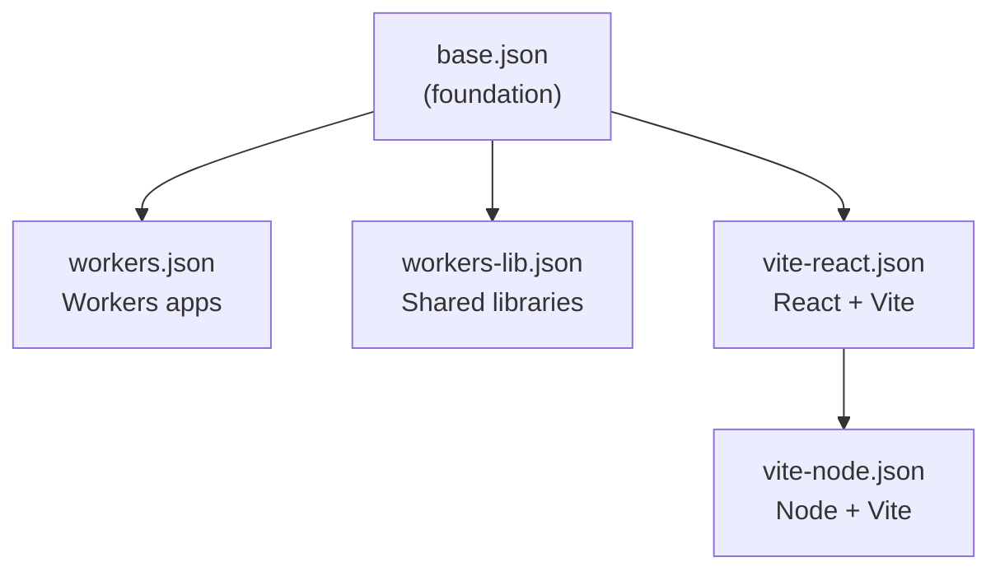

# @repo/typescript-config Agent Instructions

## Project Overview

`@repo/typescript-config` provides **shared TypeScript configuration presets** for the entire monorepo. All Workers apps, React/Vite apps, and shared libraries extend one of these presets to maintain consistent compiler options (strictness, module resolution, JSX, etc.) without copy-pasting.

## Project Structure

```
packages/typescript-config/
├── base.json          # Foundation — do not use directly in apps
├── workers.json       # Cloudflare Workers apps and services
├── workers-lib.json   # Shared libraries targeting the Workers runtime
├── vite-react.json    # React + Vite applications
├── vite-node.json     # Node-oriented Vite projects
├── package.json
└── README.md
```

## Preset Selection Guide

### Which preset should I extend?

| I am writing… | Extend |
|--------------|--------|
| A Cloudflare Worker (e.g. `worker-api`, `orm-*`, `webhook-*`) | `workers.json` |
| A shared library used by Workers (e.g. `dtos-common`, `enums-common`) | `workers-lib.json` |
| A React + Vite frontend (e.g. `front-app`) | `vite-react.json` |
| A Node-oriented Vite project | `vite-node.json` |
| A new preset (extending an existing one) | `base.json` |

**Never** extend `base.json` directly in an app or library — it is a foundation for other presets.

### How to Extend

```jsonc
// apps/worker-api/tsconfig.json
{
  "$schema": "https://json.schemastore.org/tsconfig",
  "extends": "@repo/typescript-config/workers.json",
  "compilerOptions": {
    // Only add what you must override (e.g. paths, include)
    "types": ["@cloudflare/workers-types"]
  },
  "include": ["src"]
}

// apps/front-app/tsconfig.json
{
  "extends": "@repo/typescript-config/vite-react.json",
  "compilerOptions": {
    "paths": { "@/*": ["./src/*"] }
  }
}

// packages/dtos-common/tsconfig.json
{
  "extends": "@repo/typescript-config/workers-lib.json"
}
```

## Preset Inheritance



## Key Compiler Options Per Preset

### `base.json` (shared foundation)

| Option | Value | Why |
|--------|-------|-----|
| `strict` | `true` | Full type safety |
| `noUnusedLocals` | `true` | Clean code |
| `noUnusedParameters` | `true` | Clean code |
| `noUncheckedIndexedAccess` | `true` | Safer array/object access |
| `noFallthroughCasesInSwitch` | `true` | Prevent switch bugs |
| `noImplicitReturns` | `true` | Explicit function returns |
| `isolatedModules` | `true` | Compatible with single-file transpilers |
| `moduleResolution` | `NodeNext` | Standard Node resolution |
| `target` | `ES2022` | Modern JS output |

### `workers.json` (Cloudflare Workers)

Overrides from `base.json`:
- `module: "es2022"`, `moduleResolution: "bundler"` — Wrangler bundles ESM
- `verbatimModuleSyntax: true` — import type erasure
- `noEmit: true` — Wrangler handles emit
- `lib: ["es2022"]` — no DOM; Workers do not have browser APIs

> Workers apps that use `@cloudflare/workers-types` should add it to `compilerOptions.types` in their own `tsconfig.json`.

### `workers-lib.json` (shared libraries for Workers)

Extends `workers.json` with slightly relaxed include/exclude patterns suitable for library packages.

### `vite-react.json` (React + Vite)

Key additions over `base.json`:
- `jsx: "react-jsx"` — React 17+ automatic JSX transform
- `lib: ["ES2022", "DOM", "DOM.Iterable"]` — includes browser APIs
- `module: "ESNext"`, `moduleResolution: "bundler"` — Vite handles bundling
- `types: ["vite/client", "node"]` — Vite env types
- `allowImportingTsExtensions: true` — Vite supports `.ts` imports
- `noEmit: true` — Vite handles emit

## Rules for Editing Presets

Changing a shared preset is a **monorepo-wide breaking change**. Follow these rules:

1. **Extend, don't fork**: apps must always `"extends": "@repo/typescript-config/..."`. Never copy-paste compiler options from a preset into an app.
2. **Only override what you must** in an app's own `tsconfig.json`: typically `compilerOptions.types`, `compilerOptions.paths`, and `include`.
3. **Keep presets path-agnostic**: use `${configDir}` for relative paths; never hardcode paths in shared presets.
4. **React-specific options** (`jsx`, DOM lib) belong in `vite-react.json`, not in `workers.json`.
5. **Workers-specific options** (`@cloudflare/workers-types`) belong in the app's `tsconfig.json`, not in the shared preset.
6. After changing a preset, run `make check-types` from the **repo root** to verify all apps still type-check.

## Common Mistakes

| Mistake | Correct approach |
|---------|-----------------|
| Copy-pasting `compilerOptions` from a preset into an app | Use `"extends"` and only add overrides |
| Enabling `dom` lib in a Workers preset | Workers don't have browser APIs; use `es2022` only |
| Adding `@cloudflare/workers-types` to `workers.json` | Add it in each Worker app's own `tsconfig.json` |
| Changing `strict: false` in a preset | Keep strict on; fix type errors instead |
| Adding `paths` to a shared preset | Keep presets path-agnostic; add paths in the app |

## Path Aliases

If an app uses `@/*` → `src/*` path aliases, configure them in the **app's own `tsconfig.json`**, not in a shared preset:

```jsonc
// apps/front-app/tsconfig.json
{
  "extends": "@repo/typescript-config/vite-react.json",
  "compilerOptions": {
    "baseUrl": ".",
    "paths": {
      "@/*": ["./src/*"]
    }
  }
}
```

Also configure the alias in `vite.config.ts` for Vite to resolve it at build time.

## Common Commands

This package is configuration-only (JSON files). Consumers run `make check-types` from their own directory or from the repo root.

| Command (from root or per-app) | Description |
|-------------------------------|-------------|
| `make check-types` | Run TypeScript typecheck across all apps |
| `pnpm turbo check-types` | Run typecheck via Turborepo pipeline |

## Best Practices

- **One extend, minimal overrides**: each app should extend exactly one preset and override as little as possible.
- **Test after every preset change**: run `make check-types` from the repo root and confirm all apps pass.
- **Document notable changes in the PR description**: agents and developers need to know when to re-run typecheck across the monorepo.
- **Align with toolchain versions**: when upgrading TypeScript, Vite, or Wrangler, review affected presets for compatibility.

## Official Documentation

- [TSConfig reference](https://www.typescriptlang.org/tsconfig)
- [What is a tsconfig.json](https://www.typescriptlang.org/docs/handbook/tsconfig-json.html)
- [Cloudflare Workers — TypeScript](https://developers.cloudflare.com/workers/languages/typescript/)
- [Vite — TypeScript](https://vitejs.dev/guide/features#typescript)

## Contribution

- Changing a preset requires spot-checking **all representative apps** (`worker-api`, `front-app`, shared packages) with `make check-types`.
- Cross-check unfamiliar options against the [TSConfig reference](https://www.typescriptlang.org/tsconfig) before merging.
- Document notable compiler changes in the PR description.
- Follow the root [`AGENTS.md`](../../AGENTS.md) conventions.
