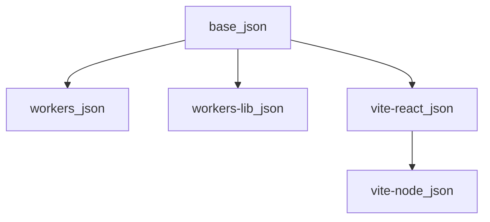

# TypeScript Config

[](https://biomejs.dev/)
[](https://www.typescriptlang.org/)

Shared TypeScript configuration presets for the monorepo, providing consistent TypeScript settings across all applications and workers. This package ensures type safety, modern ES features, and optimal compiler settings for Cloudflare Workers, Astro applications, and library packages.

## Purpose

The typescript-config package provides standardized TypeScript configurations that can be extended by projects throughout the monorepo. It eliminates configuration duplication and ensures consistent type checking, compilation settings, and language features across all TypeScript projects.

## Features

- **Base Configuration** - Foundation config with strict mode and modern ES features
- **Cloudflare Workers Support** - Optimized settings for Cloudflare Workers runtime
- **Worker Libraries** - Configuration for shared worker libraries
- **React Vite Support** - TypeScript config optimized for React projects built with Vite
- **Strict Type Checking** - Comprehensive type safety with strict mode enabled
- **Modern ES Features** - ES2022+ target with latest language features
- **Consistent Settings** - Unified compiler options across all projects

## Tech Stack

- **Language:** TypeScript
- **Formatting/Linting:** Biome (spaces, double quotes, recommended rules)
- **Package Manager:** pnpm

## Installation

This package is part of the monorepo and is automatically available to other packages. To use it in a package:

```json
{
  "devDependencies": {
    "@repo/typescript-config": "workspace:*"
  }
}
```

Then install dependencies:

```bash
pnpm install
```

## Quick usage

Extend the preset that matches your project type.

### Cloudflare Worker (Hono / Workers runtime)

```json
// tsconfig.json
{
  "extends": "@repo/typescript-config/workers.json",
  "compilerOptions": {
    "types": ["@cloudflare/workers-types"]
  }
}
```

### React app (Vite)

```json
// tsconfig.json
{
  "extends": "@repo/typescript-config/vite-react.json"
}
```

## Project Structure

```
packages/typescript-config/
├── base.json           # Base TypeScript configuration
├── workers.json        # Cloudflare Workers configuration
├── workers-lib.json    # Worker libraries configuration
├── vite-react.json     # React projects configuration built with Vite
├── vite-node.json      # Node projects configuration built with Vite
├── package.json        # Package configuration
└── README.md           # This file
```

## Configuration Inheritance

The configurations follow an inheritance pattern:

```
base.json (foundation)
    ↓
vite-react.json (extends base, React projects built with Vite)
    ↓
vite-node.json (extends vite-react, Node projects built with Vite)
```

Same relationships in Mermaid (for docs renderers that support it):



Agent-focused notes: [AGENTS.md](AGENTS.md).

## Best Practices

1. **Extend, Don't Override**: Extend the base configs and only override what's necessary
2. **Use Appropriate Config**: Choose the config that matches your project type
3. **Maintain Consistency**: Keep compiler options consistent across similar projects
4. **Path Aliases**: Use path aliases for cleaner imports (`@/*` for `src/*`)
5. **Incremental Builds**: Enable incremental compilation for faster builds

## Type Safety Features

All configurations include:

- **Strict Mode**: Comprehensive type checking enabled
- **No Unchecked Indexed Access**: Prevents unsafe array/object access
- **No Unused Locals/Parameters**: Catches unused code
- **No Implicit Returns**: Ensures all code paths return values
- **No Fallthrough Cases**: Prevents switch statement bugs
- **Exact Optional Properties**: Strict handling of optional properties (React projects built with Vite)
