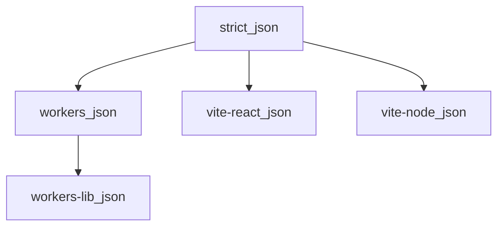

# TypeScript Config

[](https://oxc.rs/)
[](https://www.typescriptlang.org/)

Shared TypeScript configuration presets for the monorepo, providing consistent TypeScript settings across all applications and workers. This package ensures type safety, modern ES features, and optimal compiler settings for Cloudflare Workers, React (Vite) frontends, and library packages.

## Purpose

The typescript-config package provides standardized TypeScript configurations that can be extended by projects throughout the monorepo. It eliminates configuration duplication and ensures consistent type checking, compilation settings, and language features across all TypeScript projects.

## Features

- **Strict core** — Shared strict flags in `strict.json`
- **Cloudflare Workers Support** — Optimized settings for Cloudflare Workers runtime
- **Worker Libraries** — Configuration for shared worker libraries
- **React Vite Support** — TypeScript config optimized for React projects built with Vite
- **Strict Type Checking** — Comprehensive type safety with strict mode enabled
- **Modern ES Features** — ES2023+ target with latest language features
- **Consistent Settings** — Unified compiler options across all projects

## Tech Stack

- **Language:** TypeScript 7.x (pnpm catalog)
- **Formatting/Linting:** OXC (oxfmt / oxlint)
- **Package Manager:** pnpm

## Installation

This package is part of the monorepo and is automatically available to other packages. To use it in a package:

```json
{
  "devDependencies": {
    "@repo/typescript-config": "workspace:*",
    "typescript": "catalog:"
  }
}
```

Then install dependencies:

```bash
pnpm install
```

## Quick usage

Extend the preset that matches your project type.

### Cloudflare Worker (Hono / Workers runtime)

Generate types from your Wrangler config, then wire them in `tsconfig.json`:

```bash
# In the Worker app directory (or: make types from repo root)
wrangler types -c ./wrangler.jsonc
```

```json
// tsconfig.json
{
  "extends": "@repo/typescript-config/workers.json",
  "compilerOptions": {
    "types": ["./worker-configuration.d.ts"]
  },
  "include": ["worker-configuration.d.ts", "src/**/*.ts"]
}
```

`worker-configuration.d.ts` is gitignored and regenerated by `wrangler types`. It provides the `Env` interface (bindings/vars) and runtime API types matched to your `compatibility_date`. Re-run `make types` after editing `wrangler.jsonc`.

If the Worker uses `nodejs_compat`, add `"node"` to `compilerOptions.types` and install `@types/node`.

For shared libraries without a `wrangler.jsonc`, extend `workers-lib.json` and optionally add `"lib": ["es2022", "webworker"]` in `compilerOptions`.

### React app (Vite)

```json
// tsconfig.json — solution root
{
  "files": [],
  "references": [
    { "path": "./tsconfig.app.json" },
    { "path": "./tsconfig.node.json" }
  ]
}

// tsconfig.app.json — browser source
{
  "extends": "@repo/typescript-config/vite-react.json",
  "include": ["src/**/*.ts", "src/**/*.tsx"],
  "compilerOptions": {
    "types": ["vite/client"],
    "paths": { "@/*": ["./src/*"] }
  }
}

// tsconfig.node.json — Vite config (Node)
{
  "extends": "@repo/typescript-config/vite-node.json",
  "include": ["vite.config.ts"]
}
```

Run `tsc -b` when using project references; `build` should be `tsc -b && vite build`.

## Project Structure

```
packages/typescript-config/
├── strict.json         # Shared strict flags (canonical)
├── workers.json        # Cloudflare Workers configuration
├── workers-lib.json    # Worker libraries configuration
├── vite-react.json     # React projects configuration built with Vite
├── vite-node.json      # Node projects configuration built with Vite
├── package.json        # Package configuration
└── README.md           # This file
```

## Configuration Inheritance



Agent-focused notes: [AGENTS.md](AGENTS.md).

## Root solution tsconfig

The repo root `tsconfig.json` references all packages for IDE navigation. Use `make check-types` for CI (Turborepo) or `make types && pnpm check-types:solution` for `tsc -b` (requires `composite: true` on referenced projects).

## Best Practices

1. **Extend, don't fork**: Extend a runtime preset and only override what's necessary
2. **Use the right preset**: Workers → `workers.json`; shared libs → `workers-lib.json`; React → `vite-react.json`
3. **Worker types in `compilerOptions.types`**: Not only in `include`
4. **Path aliases**: Configure in the app tsconfig (TS 5.0+ resolves `paths` relative to the tsconfig; `baseUrl` is optional) + `vite.config.ts`
5. **Verify after changes**: Run `make check-types` from the repo root
6. **Schema-first DTOs**: `@repo/dtos-common` uses `z.infer<typeof Schema>` — `workers-lib.json` keeps `isolatedDeclarations` off so exported Zod schemas do not need duplicate hand-written types

## Type Safety Features

All presets inherit from `strict.json`:

- **Strict Mode** — Full type checking
- **No Unchecked Indexed Access** — Safer array/object access
- **No Unused Locals/Parameters** — Catches unused code
- **No Implicit Returns** — All code paths must return
- **No Implicit Override** — Subclass methods must use `override` when overriding
- **No Fallthrough Cases** — Prevents switch bugs
- **Verbatim Module Syntax** — Correct ESM type imports
- **No Unchecked Side Effect Imports** — Validates side-effect imports
- **Erasable Syntax Only** — No runtime TS constructs (`enum`, namespaces, etc.)

- **Exact Optional Property Types** — Optional props may be absent, not explicitly `undefined`
- **No Property Access From Index Signature** — Bracket notation for index-signature keys
- **No Error Truncation** — Full type text in diagnostics
