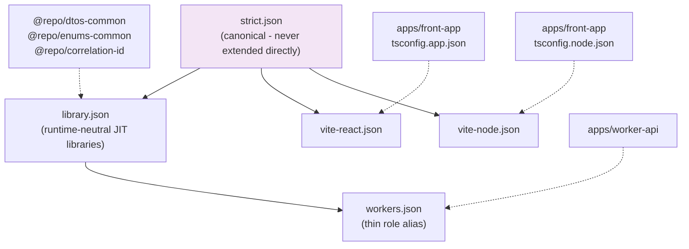

# TypeScript Config

[](https://oxc.rs/)
[](https://www.typescriptlang.org/)

Shared TypeScript configuration presets for the monorepo, providing consistent TypeScript settings across all applications and workers. This package ensures type safety, modern ES features, and optimal compiler settings for Cloudflare Workers, React (Vite) frontends, and library packages.

## Purpose

The typescript-config package provides standardized TypeScript configurations that can be extended by projects throughout the monorepo. It eliminates configuration duplication and ensures consistent type checking, compilation settings, and language features across all TypeScript projects.

## Features

- **Strict core** - Shared strict flags in `strict.json`
- **Runtime-neutral libraries** - ES-only settings for contracts shared by browsers and Workers
- **Cloudflare Workers Support** - `workers.json` as a thin role alias of `library.json`
- **React Vite Support** - TypeScript config optimized for React projects built with Vite
- **Strict Type Checking** - Comprehensive type safety with strict mode enabled
- **Modern ES Features** - ES2023+ target with latest language features
- **Consistent Settings** - Unified compiler options across all projects

## Tech Stack

- **Language:** TypeScript 7.x (pnpm catalog)
- **Formatting/Linting:** OXC (oxfmt / oxlint)
- **Package Manager:** pnpm

## Installation

This package is part of the monorepo and is automatically available to other packages. To use it in a package:

```json
{
  "devDependencies": {
    "@repo/typescript-config": "workspace:*",
    "typescript": "catalog:"
  }
}
```

Then install dependencies:

```bash
pnpm install
```

## Quick usage

Extend the preset that matches your project type.

### Cloudflare Worker (Hono / Workers runtime)

Generate types from your Wrangler config, then wire them in `tsconfig.json`:

```bash
# In the Worker app directory (or: pnpm types from repo root)
wrangler types -c ./wrangler.jsonc
```

When the Worker has **service bindings** or **Durable Object** bindings, pass each bound Worker's `wrangler.jsonc` so RPC method stubs are typed on `Env`:

```bash
# Caller with bindings to worker-foo and worker-bar
wrangler types -c ./wrangler.jsonc -c ../worker-foo/wrangler.jsonc -c ../worker-bar/wrangler.jsonc
```

Wire the same `-c` flags in the app's `package.json` `"types"` script. Generated `Env` will include entries like `Service<import("../worker-foo/src/index").default>`. See [Workers RPC - TypeScript](https://developers.cloudflare.com/workers/runtime-apis/rpc/typescript/).

```json
// tsconfig.json
{
  "extends": "@repo/typescript-config/workers.json",
  "compilerOptions": {
    "types": ["./worker-configuration.d.ts"]
  },
  "include": ["worker-configuration.d.ts", "src/**/*.ts"]
}
```

`worker-configuration.d.ts` is generated by `wrangler types` and **committed** (per Cloudflare's recommendation), so a fresh clone type-checks with no generate step. It provides the `Env` interface (bindings/vars) and runtime API types matched to your `compatibility_date`. Re-run `pnpm types` after editing `wrangler.jsonc` and commit the result; `pnpm run ci` verifies freshness via `pnpm types:check`.

If the Worker uses `nodejs_compat`, add `"node"` to `compilerOptions.types` and install `@types/node`.

For libraries consumed by both browser and Worker apps, extend `library.json`. If a Worker-only shared library later needs real Worker globals, add a dedicated preset then.

### React app (Vite)

```json
// tsconfig.json - IDE default (extends app config)
{
  "extends": "./tsconfig.app.json"
}

// tsconfig.app.json - browser source
{
  "extends": "@repo/typescript-config/vite-react.json",
  "include": ["src/**/*.ts", "src/**/*.tsx"],
  "compilerOptions": {
    "types": ["vite/client"]
  }
}

// package.json - in-app absolute imports (not tsconfig paths)
{
  "imports": {
    "#/*": ["./src/*", "./src/*.ts", "./src/*.tsx", "./src/*/index.ts", "./src/*/index.tsx"]
  }
}

// tsconfig.node.json - Vite config (Node)
{
  "extends": "@repo/typescript-config/vite-node.json",
  "include": ["vite.config.ts"]
}
```

Typecheck with `tsc --noEmit` against each project (see the app's `check-types` script). Do not use TypeScript Project References - Turborepo's transit node owns cross-package invalidation. App `build` is the bundler only (`vite build`); `turbo` gates it on `check-types`.

## Project Structure

```
packages/typescript-config/
├── strict.json         # Shared strict flags (canonical)
├── library.json        # Runtime-neutral JIT libraries
├── workers.json        # Thin role alias of library.json (Worker apps)
├── vite-react.json     # React projects configuration built with Vite
├── vite-node.json      # Node projects configuration built with Vite
├── package.json        # Package configuration
└── README.md           # This file
```

## Configuration Inheritance

Solid edges: preset inheritance. Dashed edges: today's consumers.


```mermaid
flowchart TD
  Strict["strict.json<br/>(canonical - never extended directly)"]

  Strict --> Library["library.json<br/>(runtime-neutral JIT libraries)"]
  Library --> Workers["workers.json<br/>(thin role alias)"]
  Strict --> ViteReact["vite-react.json"]
  Strict --> ViteNode["vite-node.json"]

  Libs["@repo/dtos-common<br/>@repo/enums-common<br/>@repo/correlation-id"] -.-> Library
  GatewayApp["apps/worker-api"] -.-> Workers
  FrontApp["apps/front-app<br/>tsconfig.app.json"] -.-> ViteReact
  FrontNode["apps/front-app<br/>tsconfig.node.json"] -.-> ViteNode

  style Strict fill:#f3e5f5
```

Agent-focused notes: [AGENTS.md](AGENTS.md).

## Typecheck (Turborepo)

There is no root solution `tsconfig.json`. Each package typechecks itself with `tsc --noEmit`; `turbo run check-types` uses a transit node for parallel runs with correct dependency invalidation. Internal libraries export source `.ts` (Just-in-Time packages).

| Command | Description |
|---------|-------------|
| `pnpm check-types` | TypeScript across packages (Turborepo) |
| `pnpm run ci` | Full gate: boundaries, lint, format, typecheck, Worker types, build |

## Best Practices

1. **Extend, don't fork**: Extend a runtime preset and only override what's necessary
2. **Use the right preset**: Workers → `workers.json` (role alias of `library.json`); runtime-neutral shared libs → `library.json`; React → `vite-react.json`. If a Worker-only lib needs different options later, add a dedicated preset then.
3. **Worker types in `compilerOptions.types`**: Not only in `include`
4. **In-app absolute imports**: Prefer package.json `"imports"` (`#/*` → `./src/*`) over `compilerOptions.paths`; Vite resolves `"imports"` natively
5. **Verify after changes**: Run `pnpm check-types` from the repo root
6. **Schema-first DTOs**: `@repo/dtos-common` uses `z.infer<typeof Schema>` - `library.json` keeps `isolatedDeclarations` off so exported Zod schemas do not need duplicate hand-written types

## Type Safety Features

All presets inherit from `strict.json`:

- **Strict Mode** - Full type checking
- **No Unchecked Indexed Access** - Safer array/object access
- **No Unused Locals/Parameters** - Catches unused code
- **No Implicit Returns** - All code paths must return
- **No Implicit Override** - Subclass methods must use `override` when overriding
- **No Fallthrough Cases** - Prevents switch bugs
- **Verbatim Module Syntax** - Correct ESM type imports
- **No Unchecked Side Effect Imports** - Validates side-effect imports
- **Erasable Syntax Only** - No runtime TS constructs (`enum`, namespaces, etc.)
- **Exact Optional Property Types** - Optional props may be absent, not explicitly `undefined`
- **No Property Access From Index Signature** - Bracket notation for index-signature keys
- **No Error Truncation** - Full type text in diagnostics
