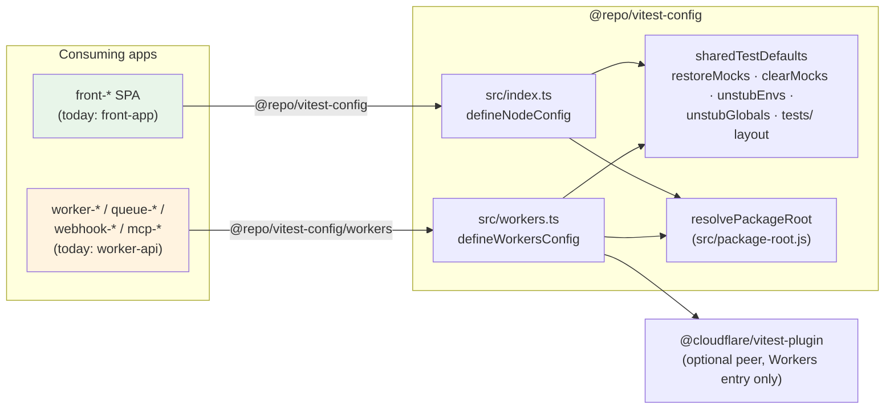
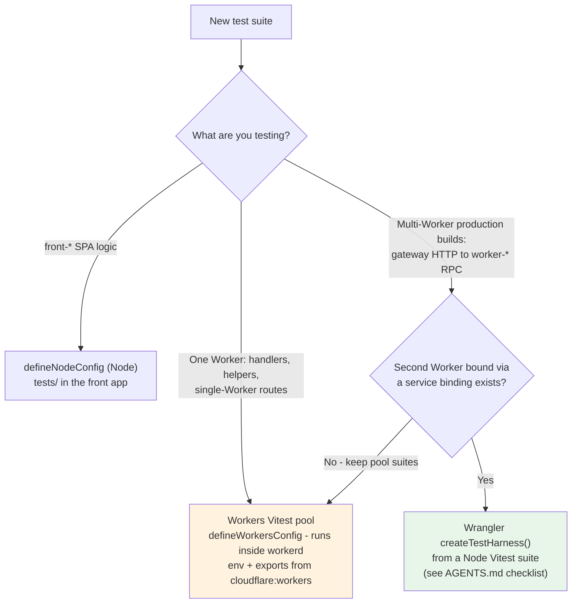

# Vitest Config

[](https://oxc.rs/)
[](https://vitest.dev/)
[](https://www.typescriptlang.org/)

Shared Vitest configuration factories for the monorepo. Apps call these helpers instead of duplicating pool, isolation, mock-hygiene, and include defaults across `front-*` and Worker-family apps.

## Purpose

`@repo/vitest-config` standardizes Vitest setup so every app gets the same mock cleanup and `tests/` layout, while keeping **Node** and **Cloudflare Workers** entry points separate. Front apps never resolve `@cloudflare/vitest-plugin`; Worker apps never inherit Node `pool` / `isolate: false`.



## Features

- **Dual entry points** - `@repo/vitest-config` (Node) and `@repo/vitest-config/workers` (Cloudflare pool)
- **Mock hygiene** - `restoreMocks`, `clearMocks`, `unstubEnvs`, `unstubGlobals` on every suite
- **Consistent includes** - `tests/**/*.test.{ts,tsx}` (Node) / `tests/**/*.test.ts` (Workers), `passWithNoTests: true` by default; packages with suites override it to `false`
- **Node performance defaults** - `pool: "threads"`, `isolate: false`, `experimental.fsModuleCache`
- **Workers pool wrapper** - `defineWorkersConfig` wraps `cloudflareTest({ wrangler })`
- **Agent / CI reporters untouched** - no custom `reporters` (Vitest 4.1 auto `agent` + GitHub Actions summary)

## Tech Stack

- **Test runner:** Vitest 4.x (pnpm catalog)
- **Workers pool:** `@cloudflare/vitest-plugin` (optional peer; Workers entry only)
- **Formatting/Linting:** OXC (oxfmt / oxlint)
- **Package Manager:** pnpm

## Installation

This package is part of the monorepo and is automatically available to other packages. To use it in an app:

```json
{
  "devDependencies": {
    "@repo/vitest-config": "workspace:*",
    "vitest": "catalog:"
  }
}
```

Worker-family apps also need the pool peer:

```json
{
  "devDependencies": {
    "@cloudflare/vitest-plugin": "catalog:",
    "@repo/vitest-config": "workspace:*",
    "vitest": "catalog:"
  }
}
```

Then install dependencies:

```bash
pnpm install
```

## Quick usage

### Front / Node (`front-*`)

```ts
// vitest.config.ts
import {
  defineNodeConfig,
  resolvePackageRoot,
} from "@repo/vitest-config";

const root = resolvePackageRoot(import.meta.dirname);

export default defineNodeConfig({
  root,
  test: { dir: root },
});
```

```json
// package.json
{
  "scripts": {
    "test": "vitest run",
    "test:watch": "vitest"
  }
}
```

### Workers (`worker-*`, `queue-*`, `webhook-*`, `mcp-*`)

```ts
// vitest.config.mts
import path from "node:path";
import {
  defineWorkersConfig,
  resolvePackageRoot,
} from "@repo/vitest-config/workers";

const root = resolvePackageRoot(import.meta.dirname);

export default defineWorkersConfig(
  { wrangler: { configPath: path.join(root, "wrangler.jsonc") } },
  { root, test: { dir: root } },
);
```

Prefer `import { env, exports } from "cloudflare:workers"` in integration suites. Keep `tests/tsconfig.json` on `@cloudflare/vitest-plugin/types` and include it in the app's `check-types` script.

**Vitest VS Code explorer:** Pin `root` and `test.dir` with `resolvePackageRoot(import.meta.dirname)` in every app config. The explorer caches the workspace folder via `realpathSync`; a non-realpathed path can miss that cache (notably on macOS with symlinks) and throw `Fatal Error: Attempted to get parent of root folder "/"`.

## Project Structure

```
packages/vitest-config/
├── src/
│   ├── index.ts         # defineNodeConfig + sharedTestDefaults + resolvePackageRoot (front-*)
│   ├── workers.ts       # defineWorkersConfig + resolvePackageRoot (Worker-family apps)
│   └── package-root.js  # resolvePackageRoot (realpathSync helper; plain JS for Node ESM)
├── package.json
├── turbo.json        # tags: ["config"]
├── README.md
├── AGENTS.md
└── CLAUDE.md
```

`src/index.ts` and `src/workers.ts` are separate package exports so Node apps never resolve the Cloudflare pool. `resolvePackageRoot` lives in `package-root.js` and is re-exported from both entries. Shared mock-hygiene defaults are intentionally **duplicated** in both files (no relative ESM hop between entries).

Agent-focused notes: [AGENTS.md](AGENTS.md).

## Factory selection

| I am writing… | Import |
|---------------|--------|
| A `front-*` SPA | `@repo/vitest-config` → `defineNodeConfig` |
| A `worker-*` / `queue-*` / `webhook-*` / `mcp-*` app | `@repo/vitest-config/workers` → `defineWorkersConfig` |

This package has no `check-types` script (same model as `@repo/typescript-config`); consuming apps typecheck their Vitest configs.

## Testing (Turborepo)

Apps own Vitest; Turbo caches `test` (`vitest run`) and runs `test:watch` as persistent/uncached for humans.

| Command | Description |
|---------|-------------|
| `pnpm test` | Vitest via `turbo run test` |
| `pnpm test:watch` | Vitest watch via `turbo run test:watch` |
| `pnpm turbo run test --filter=front-app` | Scoped Node suite |
| `pnpm turbo run test --filter=worker-api` | Scoped Workers pool suite |
| `pnpm run ci` | Full gate including `test` |

## Unit vs integration

Cloudflare recommends the Workers Vitest pool for **unit** tests (this package) and Wrangler `createTestHarness()` for **multi-Worker integration** tests against production builds. Do not replace pool suites with the harness for single-Worker routes. Harness scaffolding notes live in [AGENTS.md](AGENTS.md).



## Best Practices

1. **Import the right entry** - Node never imports `/workers`; Workers never use `defineNodeConfig`
2. **Do not set `reporters` in shared defaults** - breaks Vitest 4.1 agent / GHA auto detection
3. **Never set `isolate: false` or a Node `pool` in Workers config** - Cloudflare keeps per-file storage isolation
4. **Keep suites under `tests/`** - mirror source layout; `*.test.ts`, plus `*.test.tsx` on the Node entry
5. **Use `vitest run` for CI / Turbo cache** - `test:watch` is for humans only
6. **Spot-check consumers after factory changes** - `pnpm turbo run test --filter=front-app --filter=worker-api`
7. **Do not add createTestHarness until a second Worker + service binding exists** - keep pool suites; follow AGENTS.md checklist when wiring the harness
